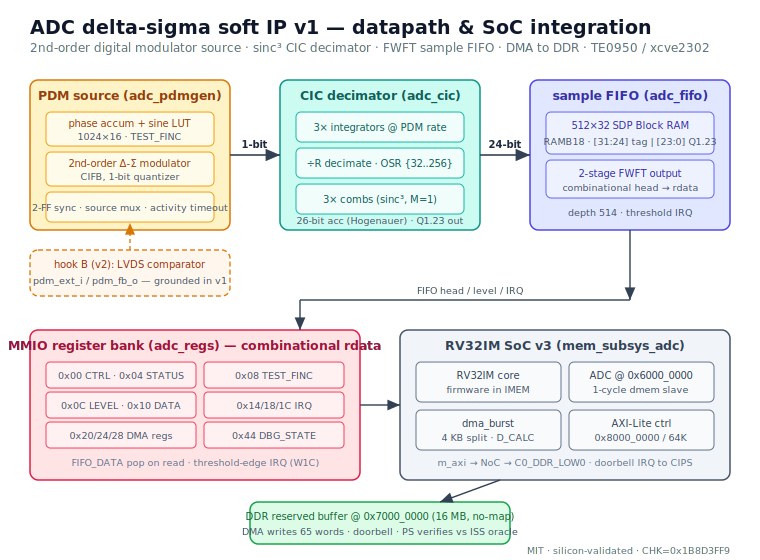

# ADC delta-sigma soft IP core (v1)

A fully soft, protocol-complete delta-sigma analog-to-digital datapath for a
custom RV32IM SoC, silicon-validated on the Trenz TE0950 (AMD Versal
`xcve2302-sfva784-1LP-e-S`). MIT-licensed, tutorial-quality VHDL-2008.

The core is the complete **digital** signal chain of a delta-sigma ADC: a
2nd-order digital modulator as an on-chip test source, a sinc³ CIC decimator,
a sample FIFO in Block RAM, an MMIO register bank, and DMA of the decimated
samples to reserved DDR. It is validated end-to-end by an RV32 program whose
result is bit-identical to a Python instruction-set-simulator oracle and to the
five simulation layers — signature `CHK=0x1B8D3FF9`.



## Table of contents

1. What is this and why would you use it
2. Feature set
3. How it fits in the SoC
4. Register map
5. How to use it — software
6. The delta-sigma datapath
7. Verification strategy
8. Build & run — simulation
9. Build & run — Vivado
10. Build & run — PetaLinux & SD card
11. Problems faced during the project
12. Known limitations and roadmap
13. File map

## 1. What is this and why would you use it

A delta-sigma ADC is not a single block: it is a 1-bit modulator running at a
high oversampling rate followed by a digital decimation filter that turns the
1-bit stream into high-resolution samples at a low rate. The analog part (the
modulator's integrator and comparator) needs real analog silicon; the digital
part — the decimator, the control, the data movement — is what this core
provides, and it is where the signal-processing resolution actually comes from.

Because the TE0950 has no analog front-end wired for this, v1 ships a **2nd-order
digital delta-sigma modulator** as an on-chip PDM source: a phase accumulator
drives a sine LUT, and the modulator turns that into a 1-bit stream, exactly as
an analog modulator would. The decimator then recovers the samples. This makes
the whole chain deterministic and self-checking on silicon with no external
hardware — consistent with the rest of the family (soft, loopback-validated).

The path to a *real* analog input is already wired: `pdm_ext_i`/`pdm_fb_o` (hook
B) expose the 1-bit input and the feedback bit for a v2 LVDS-comparator +
RC-DAC front-end. In v1 those ports exist and are grounded.

The ADC is presented to the core as a **1-cycle `dmem` slave at `0x6000_0000`**,
the same read/write contract as the simpler peripherals in the family — not
through an AXI-Lite wrapper — keeping `rdata` purely combinational.

## 2. Feature set

- 2nd-order digital delta-sigma modulator (CIFB) as an on-chip PDM test source,
  programmable frequency via `TEST_FINC`.
- Sine LUT 1024×16, amplitude 0.6 FS (2nd-order stability); embedded as a
  constant table so the simulation signature is bit-identical across machines.
- sinc³ CIC decimator, OSR configurable {32, 64, 128, 256}, 26-bit accumulators
  (Hogenauer growth for ±1 input), barrel-shift normalization to Q1.23.
- Effective resolution > 16 bits: at OSR ≥ 128 the 2nd-order modulator + sinc³
  yields ≈ 16.4 bits ENOB (OSR 128) to ≈ 18.9 bits (OSR 256).
- Sample FIFO 512×32 in a single SDP Block RAM (`RAMB18`) + 2-stage FWFT output
  so `FIFO_DATA` reads combinationally; total depth 514.
- DMA of samples to reserved DDR at `0x7000_0000` via the SoC `dma_burst`
  (4 KB-boundary split), doorbell IRQ to the CIPS.
- Threshold-edge FIFO interrupt and DMA-done interrupt, write-1-to-clear.
- Source mux + 2-FF synchronizer + external-activity timeout (`pdm_ext_i`),
  which doubles as the Phase-0 anti-common-mode check.
- Hook B (`pdm_ext_i`/`pdm_fb_o`) reserved for a v2 real analog front-end.
- FIFO infers Block RAM; the sine LUT maps to distributed logic (constant ROM);
  design closes timing at 100 MHz with WNS = +2.444 ns on the `xcve2302`.

## 3. How it fits in the SoC

The datapath (`adc_pdmgen` → `adc_core` → `adc_cic` → `adc_fifo`) is wrapped by
`adc_mmio` (register bank + FIFO) and `adc_soc` (the dmem-slave face). That
slave is dropped into `mem_subsys_adc` at `0x6000_0000`, alongside the local RAM
and the DMA registers, exactly like the TSN switch. The RV32 core runs firmware
from IMEM; the sample stream is drained by MMIO to local RAM and moved to DDR by
the shared `dma_burst`. The A72 (Linux) loads the firmware over `/dev/mem`,
releases the core, waits for the doorbell, and checks the DDR buffer.

The single soft `m_axi` master is wired by scripted Tcl to
`axi_noc_0/S06_AXI/C0_DDR_LOW0` (the NoC slave interface with a real DDR route);
the AXI-Lite control slave is mapped at `0x8000_0000 [64K]` on
`versal_cips_0/M_AXI_LPD`.

## 4. Register map

Byte offsets from `0x6000_0000` (internal dmem) / `0x8000_0000` (PS view).
`rdata` is combinational.

| Offset | Name       | Access | Function |
|-------:|------------|--------|----------|
| 0x00   | CTRL       | rw     | b0 enable, b1 src_sel, [3:2] osr_sel |
| 0x04   | STATUS     | ro     | b0 ext_timeout, b1 fifo_empty, b2 fifo_full, b3 dma_busy |
| 0x08   | TEST_FINC  | rw     | phase increment of the PDM generator (reset 0x00193000) |
| 0x0C   | FIFO_LEVEL | ro     | [9:0] fill level (0..514) |
| 0x10   | FIFO_DATA  | ro     | pop on read; [31:24] tag/channel, [23:0] Q1.23 sample |
| 0x14   | IRQ_EN     | rw     | b0 FIFO threshold, b1 dma_done |
| 0x18   | IRQ_STAT   | w1c    | b0 threshold event (edge), b1 dma_done |
| 0x1C   | IRQ_THRESH | rw     | [9:0] threshold (0 = disabled) |
| 0x20   | DMA_ADDR   | rw     | standalone DMA hook (unused in SoC path) |
| 0x24   | DMA_LEN    | rw     | standalone DMA hook |
| 0x28   | DMA_CTRL   | w      | b0 doorbell pulse; read: b0 dma_busy |
| 0x44   | DBG_STATE  | ro     | [31:24]=0xAD, b16=ext_timeout |

## 5. How to use it — software

Configure the generator, wait for the FIFO to fill, drain samples, DMA to DDR,
doorbell. Access the peripheral through a `volatile` pointer.

```c
#define ADC 0x60000000u          // internal dmem view
wr(ADC + 0x08, 0x00193000);      // TEST_FINC
wr(ADC + 0x00, 0xD);             // enable=1, src=internal, osr_sel=11 (OSR 256)
while ((rd(ADC + 0x0C) & 0x3FF) < 64) ;   // wait level >= 64
for (int i = 0; i < 64; i++) local[i] = rd(ADC + 0x10);  // pop FIFO_DATA
```

Note: on the Linux (PS) side, do **not** use `memset`/`memcpy` on the DDR buffer
mapped through `/dev/mem` — see section 11. Clear it with a `volatile`
word-by-word loop instead.

## 6. The delta-sigma datapath

The PDM source is a 2nd-order CIFB modulator: a 32-bit phase accumulator indexes
a 1024×16 sine LUT (amplitude 0.6 FS for stability), and two 24-bit integrators
with ±FS feedback drive a 1-bit quantizer. This is the digital equivalent of an
analog 2nd-order modulator and is what lets the chain exceed 16 effective bits.

The CIC decimator is the classic Hogenauer sinc³: three cascaded integrators at
the PDM rate, decimate by R (the OSR), three comb stages at the decimated rate.
Accumulators are 26 bits — `Bmax = 3·log2(256) + 2` for a ±1 signed input; the
`+2` (versus a naïve `+1`) is exactly what keeps the full-scale-DC case from
wrapping. Output is normalized to Q1.23 by a barrel shift (never a divide) with
symmetric saturation.

A hot OSR change re-initializes the datapath cleanly. The source mux selects the
internal generator or the synchronized external input; an activity monitor
raises `ext_timeout` if the external input is inert, which is also the Phase-0
anti-common-mode test (a partner-off input must time out, not interoperate).

## 7. Verification strategy

Five simulation layers, each with a deterministic, bit-identical end-signature
as its pass criterion, and 4–5 mutations per layer that must all fail:

- **1a** PDM generator RTL vs an independent Python event-driven model of the
  2nd-order modulator; 65536 bits + LFSR-32 checksum `0x90C8821F`.
- **1b** CIC decimator RTL vs a bit-bang model with injected corruptions
  (valid gaps, full-scale DC ±, hot OSR change, idle tone); 164 samples,
  `0x148B6E65`.
- **1c** full chain RTL→RTL vs a composed cycle-exact model, including the
  Phase-0 anti-common-mode check; 233 samples, `0x7CEE740E`.
- **2** MMIO register bank + FIFO vs a `dmem` BFM sampling `rdata` at 1 ns
  (a registered `rdata` fails immediately); 567 directed checks.
- **4** full SoC with real RV32 firmware (assembled by `asm.py`) + a Python ISS
  oracle written before integration; DMA doorbell to DDR; 65 words,
  `0x1B8D3FF9`.

Silicon (layer 5) reproduces the layer-4 signature exactly: `CHK=0x1B8D3FF9`.

## 8. Build & run — simulation

Each step is a single self-contained bash script with one expected output line.
GHDL 4.1.0, `--std=08`.

```
bash adc_paso1_pdmgen.sh   # ADC PASO1 PDMGEN: PASS CHK=0x90C8821F MUT=4/4 @ 655595000000 fs
bash adc_paso2_cic.sh      # ADC PASO2 CIC:    PASS N=164 CHK=0x148B6E65 MUT=5/5 @ 344565000000 fs
bash adc_paso3_core.sh     # ADC PASO3 CORE:   PASS N=233 CHK=0x7CEE740E MUT=5/5 @ 343685000000 fs
bash adc_paso4_mmio.sh     # ADC PASO4 MMIO:   PASS NCHK=567 MUT=5/5 @ 17775000000 fs
bash adc_paso5_soc.sh      # ADC PASO5 SOC:    PASS N=65 CHK=0x1B8D3FF9 MUT=5/5 @ 178716000000 fs
bash adc_paso6_prep.sh     # ADC PASO6 PREP:   PASS ... selftest CHK=0x1B8D3FF9 aarch64=OK repo=OK
```

Layer 5 needs the canonical repo at `~/vhdl_repo` (RV32i sources + `asm.py`).

## 9. Build & run — Vivado

Run `vivado/adc_soc_steps.tcl` **one command at a time** in the Tcl console,
reading each response (a pasted block can fail silently). Key points, all
lessons from the family:

```
# ~ is NOT expanded in the Tcl console: use $env(HOME) or absolute paths.
# clone the TSN project (audited CIPS + NoC + SmartConnect + reset), then:
#   set_property INCREMENTAL_CHECKPOINT "" [get_runs synth_1]   (Versal-correct form)
#   sweep remote artifacts: foreach f [get_files -all *] { ... *TSN/vivado_tsn* ... }
#   purge the parent .dcp (e.g. tsn_inject.dcp) and any *_pins.xdc from other IPs
# swap the core cell u_soc_tsn -> u_soc_adc, rewire clk/reset/s_axi/m_axi/irq by
# source pin (delete orphan nets first, e.g. the reused u_soc_tsn_irq_out), then:
#   m_axi -> axi_noc_0/S06_AXI/C0_DDR_LOW0   (segment name is C0_DDR_LOW0 even on DDR4)
#   s_axi <- versal_cips_0/M_AXI_LPD @ 0x80000000 [64K]
# validate_bd_design -force re-runs the NoC compiler and rewrites nocattrs.dat locally.
# -> synth 0 errors, WNS = +2.444 ns @ 100 MHz, XSA written to adc_soc.xsa
```

After synthesis, confirm the FIFO infers Block RAM: on Versal the primitive is
`RAMB18E5_INT`, so filter `REF_NAME =~ RAMB18*` (not `BMEM`/`RAMB*`). The sine
LUT maps to distributed logic — a constant ROM — which is fine (function is
identical, cost is small).

## 10. Build & run — PetaLinux & SD card

```
petalinux-create -t project --template versal -n plnx_te0950_adc  # fresh, not cp -a
cp -r ~/plnx_te0950_tsn/project-spec/meta-user/* .../meta-user/    # inherit reservedmem
# add an adc-bringup recipe; register CONFIG_adc-bringup in user-rootfsconfig
# and enable it in `petalinux-config -c rootfs` (registering alone does not enable it)
petalinux-config --get-hw-description=.../adc_soc.xsa              # keep reserved-mem
petalinux-build
petalinux-package --boot --u-boot --force                         # repackage BOOT.BIN
```

Copy `BOOT.BIN`, `image.ub`, `boot.scr` and the app to the SD boot partition.
Versal PLM rejects hot-loaded PDIs (`0x03024001`), so `BOOT.BIN` must be
repackaged, not just the PDI copied. On the target:

```
adc-bringup
# PASS: ADC delta-sigma validado en silicio.
#   sentinela 0xADC0FEED OK, CHK=0x1B8D3FF9 (ISS: iss_adc.py)
```

## 11. Problems faced during the project

- **CIC accumulator width.** A naïve `3·log2(256)+1 = 25` bits wraps the
  full-scale-DC case and inverts the sign. The correct Hogenauer bound for a ±1
  signed input is `+2`, i.e. **26 bits**. Layer 1b's DC-full-scale phase is the
  test that catches this.

- **FWFT over Block RAM.** The combinational-`rdata` contract needs `FIFO_DATA`
  available with no latency, but Block RAM reads synchronously. The fix is the
  canonical SDP mold (one sync write port, one sync read-with-enable port) plus
  a 2-register FWFT output stage that keeps the head visible. Real depth is
  512 + 2 = 514.

- **Versal BRAM primitive name.** The inferred Block RAM is `RAMB18E5_INT`, not
  `RAMB36`/`BMEM`; a naïve utilization filter reports zero BRAMs and looks like a
  failure when the mold actually worked.

- **Contaminated XDC from sibling IPs.** The cloned project dragged
  `m1553_pins.xdc` and `eth_pins.xdc`, whose ports do not exist here and throw
  critical warnings. Remove them from `constrs_1` before implementation.

- **`memset`/`memcpy` on `/dev/mem` (new family lesson).** glibc's optimized
  aarch64 `memset`/`memcpy` use `DC ZVA` (cache-zero) and 128-bit `stp`
  instructions that fault on memory mapped as device/non-cacheable — a `no-map`
  reserved DDR region through `/dev/mem` is exactly that. The PS bring-up
  crashed with SIGBUS at the buffer-clear. Fix: clear with a `volatile`
  word-by-word loop; every other access already uses `volatile` pointers.

- **TE0950 boots from initramfs (new family lesson).** The active rootfs is the
  `image.ub` initramfs in RAM, not the SD ext4 partition, which auto-mounts at
  `/run/media/mmcblk1p2`. `/usr/bin/adc-bringup` runs from the initramfs; files
  dropped on the SD ext4 live under `/run/media/...`, not `/`.

## 12. Known limitations and roadmap

- v1 is single-channel; multi-channel is deferred (the FIFO word already
  reserves a tag byte).
- The sinc³ droop-compensation FIR is deferred to v2.
- Hook B (real analog front-end: LVDS comparator + RC DAC) is wired in the
  entity but grounded in v1; a first-order external modulator gives ≈ 12
  effective bits, documented so as not to oversell it.
- v2 roadmap: activate hook B on TE0950 pins, droop-compensation FIR,
  multi-channel sequencer, MASH modulator.

## 13. File map

| File | Role |
|------|------|
| `adc_sin_lut_pkg.vhd` | sine LUT 1024×16 as a constant table |
| `adc_pdmgen.vhd`      | phase accumulator + LUT + 2nd-order modulator |
| `adc_cic.vhd`         | sinc³ CIC decimator |
| `adc_core.vhd`        | pdmgen + sync + source mux + activity monitor + cic |
| `adc_fifo.vhd`        | 512×32 SDP Block RAM + FWFT output |
| `adc_regs.vhd`        | MMIO register bank (combinational rdata) |
| `adc_mmio.vhd`        | regs + FIFO subsystem |
| `adc_soc.vhd`         | 1-cycle dmem-slave face |
| `mem_subsys_adc.vhd`  | memory subsystem with the ADC at 0x6000_0000 |
| `soc_top_master.vhd`  | SoC top (local copy) |
| `modelo_pdm.py` / `modelo_cic.py` / `modelo_core.py` | simulation oracles |
| `iss_adc.py`          | layer-4 ISS oracle |
| `adc_bringup.s`       | RV32 firmware |
| `adc-bringup.c`       | PS (A72) bring-up + validator |
| `tb_*.vhd`            | testbenches, layers 1a/1b/1c/2/4 |
| `vivado/adc_soc_steps.tcl` | Vivado transplant sequence |
| `adc_architecture.svg` | architecture diagram |

---

MIT License. Part of a publicly released family of VHDL-2008 IP cores for a
custom RV32IM SoC on the AMD Versal `xcve2302` (Trenz TE0950).
