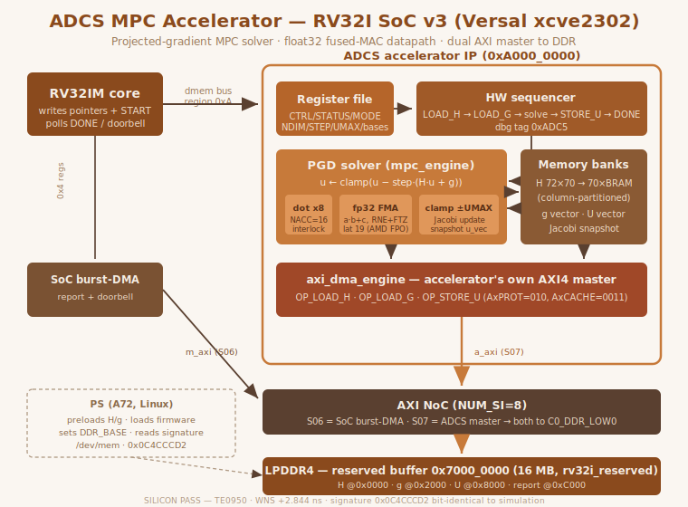

# ADCS MPC Accelerator IP Core — RV32I SoC v3 (TE0950 / AMD Versal)

A hardware accelerator for the **model-predictive control (MPC) inner loop of a
spacecraft Attitude Determination and Control System (ADCS)**, written from
scratch in **VHDL-2008**, governed by the family's **RV32IM** soft core, and
taken all the way to **working silicon** on a Trenz TE0950 (AMD Versal
`xcve2302`) with a **bit-identical signature between simulation and silicon**.

The core solves a box-constrained quadratic program by **projected gradient
descent (PGD)**: a dense `70×70` Jacobi-style GEMV with per-element clamping,
iterated to convergence, all in **single-precision IEEE-754 float** computed by
a **fused multiply-add datapath** that is bit-exact against the AMD
Floating-Point Operator on the actual FPGA.



---

## 1. What this core is for

Spacecraft attitude control increasingly uses **MPC** instead of classical PID:
at each control step you solve a small optimization problem that respects
actuator saturation (reaction-wheel torque limits, magnetorquer bounds). The
expensive, repetitive kernel of that solve is a **matrix–vector product plus a
projection**, run for a fixed number of iterations under a hard real-time
deadline.

This IP offloads that kernel from the processor. The RV32 core just writes a
few pointers and a `START` bit; the accelerator then:

1. **loads** the Hessian matrix `H` (`70×70` float32) from DDR,
2. **loads** the gradient vector `g` from DDR,
3. **solves** `u ← clamp(u − step · (H·u + g))` for `MAXITER` iterations
   (Jacobi PGD, all lanes updated from the same snapshot), and
4. **stores** the result `U` back to DDR,

then raises `DONE`. The whole sequence is orchestrated **in hardware** by an
on-chip sequencer — the processor is free during the solve and only polls a
status bit (or takes the doorbell interrupt).

It is the **compute plane** of an ADCS: the deterministic number-cruncher that
sits under the control law, the same way the PTP core is the time plane and the
SpaceWire core is the network plane of the wider system.

This is a **VHDL port and re-verification** of a SystemVerilog accelerator
originally governed by an A72; here it is homogeneous with the RV32 IP family,
MIT-licensed, and verified layer-by-layer with deterministic signatures.

---

## 2. Requirements

**Simulation (no board needed):**

- **GHDL 4.1.0** or newer (`--std=08`) — the whole 5-layer regression runs here.
- **Python 3** — independent oracles (FMA, dot-product, PGD solver) and the
  RV32 assembler `asm.py`. No non-standard packages.
- A stock **Ubuntu 24.04** machine. No proprietary simulator, no license server.

**Silicon flow (to reproduce the board result):**

- **Vivado 2025.2.1** — synthesis, implementation, `write_hw_platform`.
- **PetaLinux 2025.2** — Linux image + the bring-up rootfs app.
- **`aarch64-linux-gnu-gcc`** — cross-compiles the `/dev/mem` verifier (also
  built inside the PetaLinux recipe).
- A **Trenz TE0950** board (Versal `xcve2302-sfva784-1LP-e-S`), a microSD, and a
  serial console (picocom, 115200 8N1).

The RV32IM core sources (`~/rv32i/`) and the canonical FWFT FIFO are **shared
from their origin**, never duplicated — see the [RV32i core](../RV32i/).

---

## 3. Feature summary

- **Complete MPC/PGD solver**, not just a GEMV: `H·u` GEMV + gradient + step +
  **element-wise clamp** to `±UMAX`, iterated `MAXITER` times, Jacobi update
  (all lanes read the same `u` snapshot per iteration).
- **Single-precision IEEE-754 float** throughout, computed by a **single fused
  multiply-add primitive**. Even additions are `fma(a, 1.0, b)` — one FMA core
  covers the whole datapath, which guarantees the result is **bit-exact to
  silicon** (the AMD FPO's fused MAC is correctly rounded, RNE + flush-to-zero).
- **8-lane parallel dot-product** (`mpc_dot_x8`) with a **read-modify-write
  interlock** sized against the FMA latency — the fix for a sim-OK/silicon-FAIL
  hazard class (see Problems faced).
- **Hardware sequencer**: the core writes pointers + `START`; the IP performs
  `LOAD_H → LOAD_G → solve → STORE_U → DONE` autonomously.
- **Two AXI4 masters to DDR through the NoC**: the SoC's burst-DMA (report /
  doorbell) and the accelerator's **own dedicated master** for `H`/`g`/`U`.
- **Family MMIO control plane** (combinational `rdata` on the RV32 dmem bus,
  region `0xA000_0000`), the "A2" pattern.
- Problem dimensions: `NX=23`, `NU=7`, `NP=10`, working dimension `D=70`
  (`DP=72` stride). Fixed accumulation order `NACC=16` is part of the signature
  contract.
- **BRAM-inferred** matrix bank (column-partitioned `H`), **~13% LUTs, 22% BRAM,
  ~40 DSP** on the `xcve2302`, timing closed at **WNS +2.844 ns**.

---

## 4. SoC memory map

The accelerator lives on the RV32's **internal dmem bus** (control) and on the
**NoC** (data). As seen by RV32 firmware:

| Region (RV32 view) | What |
|---|---|
| `0x0000_0000` | local RAM (instruction/data, doorbell scratch) |
| `0x4000_0000` | SoC burst-DMA registers (report to DDR) |
| `0xA000_0000` | **ADCS control registers** (this IP, decoded on `addr[31:28]`) |
| `0x7000_0000` | reserved DDR buffer (`rv32i_reserved`, 16 MB, `no-map`) — where `H`, `g`, `U` and the report live |

As seen by the PS (A72, over AXI4-Lite):

| Address | What |
|---|---|
| `0x8000_0000` (64K) | SoC control slave: halt/release, IMEM window, `DDR_BASE` |
| `0x7000_0000` (16 MB) | the same reserved DDR buffer, read directly via `/dev/mem` |

The accelerator's own AXI master and the SoC's burst-DMA are **two separate NoC
slave ports** (`S06`, `S07`) that both map to the same physical DDR
(`C0_DDR_LOW0`, offset 0). That is why firmware can read with the burst-DMA what
the accelerator wrote with its own master.

---

## 5. ADCS register map (RV32 base `0xA000_0000`)

| Offset | Name | Access | Meaning |
|---|---|---|---|
| `0x00` | `CTRL` | R/W | bit0 `START` (self-clearing pulse), bit1 `SRESET`, bit2 `IRQEN` |
| `0x04` | `STATUS` | R | bit0 `DONE` (sticky), bit1 `BUSY`, bit2 `ERR` |
| `0x08` | `MODE` | R/W | `0` = MPC_PGD, `2` = LOAD_H, (`1` reserved SR-UKF/QR, phase 2) |
| `0x0C` | `NDIM` | R/W | active dimension `n` (≤ `D`) |
| `0x10` | `MAXITER` | R/W | PGD iteration count |
| `0x14` | `STEP` | R/W | PGD step size (float32 bits) |
| `0x18` | `UMAX` | R/W | clamp bound (float32 bits) |
| `0x1C` | `HBASE` | R/W | DDR address of `H` (absolute, seen by the IP master) |
| `0x20` | `GBASE` | R/W | DDR address of `g` |
| `0x24` | `UBASE` | R/W | DDR address of `U` |
| `0x28` | `ITERCNT` | R | iterations completed (read-only) |
| `0x2C` | `VERSION` | R | `0x0200_0001` |
| `0x44` | `DEBUG` | R | registered: `0xADC5` tag · DMA beat · DMA state · sequencer state |
| `0x48` | `DBGTAG` | R | `0xADC5_0101` presence tag |

**Important addressing note:** `HBASE`/`GBASE`/`UBASE` are **absolute** DDR
addresses (`0x7000_0000 + offset`) because the accelerator's AXI master emits
them verbatim to the NoC. The SoC burst-DMA, by contrast, adds `DDR_BASE`
internally, so its `SRC`/`DST` stay as offsets. This asymmetry is the one thing
to get right when writing firmware.

---

## 6. How to use it (software)

Firmware sequence (see `fw/adcs_bringup.s` for the full listing):

```
# base pointers
li  x5, 0xA0000000          # ADCS register base
li  x6, 0x40000000          # SoC burst-DMA base

# program the problem (pointers are ABSOLUTE DDR addresses)
li x7, 0x70000000 ; sw x7, 0x1C(x5)   # HBASE
li x7, 0x70002000 ; sw x7, 0x20(x5)   # GBASE
li x7, 0x70008000 ; sw x7, 0x24(x5)   # UBASE
li x7, 8          ; sw x7, 0x0C(x5)   # NDIM
li x7, 2          ; sw x7, 0x10(x5)   # MAXITER
li x7, 0x3F61984A ; sw x7, 0x14(x5)   # STEP = 0.881230f
li x7, 0x3D4CCCCD ; sw x7, 0x18(x5)   # UMAX = 0.05f

# 1) load H:  MODE=LOAD_H, START, poll DONE
li x7, 2 ; sw x7, 0x08(x5)
li x7, 1 ; sw x7, 0x00(x5)
wait_h: lw x8, 0x04(x5) ; andi x8, x8, 1 ; beq x8, x0, wait_h

# 2) solve:   MODE=MPC_PGD, START, poll DONE
li x7, 0 ; sw x7, 0x08(x5)
li x7, 1 ; sw x7, 0x00(x5)
wait_m: lw x8, 0x04(x5) ; andi x8, x8, 1 ; beq x8, x0, wait_m

# U is now in DDR at UBASE; report it via the SoC DMA + doorbell.
```

The PS (Linux) side pre-loads `H` and `g` into the reserved DDR buffer, loads
this firmware over the IMEM window, sets `DDR_BASE = 0x7000_0000`, releases the
core, and reads the signature back from DDR — see `bringup/adcs_verify.c`.

---

## 7. Verification — the layers

Run the full regression (GHDL 4.1.0, `--std=08`):

```bash
cd IP_Cores/ADCS/sim
./run_regression.sh
# -> REGRESION ADCS: TODAS LAS CAPAS PASS
```

Every layer compares the RTL against an **independent Python oracle** and ends
with a deterministic 32-bit signature; each layer is also armed with **RTL
mutations that must fail**. Signatures are **bit-identical** on the author's
machine and in a clean container.

| Layer | What it checks | Signature |
|---|---|---|
| **1a** | `fp32_fma` — FMA bit-exact vs a 480-bit exact-accumulate + single-round model | `0x873BA7B4` |
| **1b** | `mpc_dot_row` — interleaved `NACC=16` accumulation + RMW interlock (verified to `LAT=20`) | `0x133858AB` |
| **1c** | `mpc_engine` + banks — full PGD solver | `0xB3960AC4` |
| **2** | `adcs_regfile` — dmem contract (combinational `rdata`) | `0x0454398C` |
| **2** | `axi_dma_engine` — AXI4 master vs BFM with backpressure | — |
| **3** | `adcs_accel_top` — integrated IP end-to-end via a DDR BFM | `0xDFA4E8CD` |
| **4** | full SoC: **real RV32IM core runs assembled firmware**, result in DDR vs oracle | `0x0C4CCCD2` |
| **5** | **silicon** on the TE0950 | `0x0C4CCCD2` |

Individual runners: `run_l1a_fma.sh`, `run_l1b_dot.sh`, `run_l1c_engine.sh`,
`run_l2_regfile.sh`, `run_l2_dma.sh`, `run_l3_top.sh`, `run_l4_soc.sh`.

---

## 8. Layer 5 — silicon flow

The exact commands that produced the board result.

### 8.1 Vivado (2025.2.1)

The BD is transplanted from the SpaceWire project (which already carries the
CIPS, the NoC, the SmartConnect and an audited address map). The ADCS
difference: **two PL masters**, so the NoC grows to `NUM_SI=8`. Run **one
command at a time** in the Vivado TCL console (family lesson: pasted blocks hide
silent failures) — full script in `vivado/bd_adcs_steps.tcl`, step-by-step in
`vivado/CHECKLIST_TRANSPLANTE.md`.

```tcl
# clone, clean inherited runs and remote references
open_project $env(HOME)/spw_ip/vivado_spw/spw_soc.xpr
save_project_as adcs_soc $env(HOME)/adcs_ip/vivado_adcs -force
set_property source_mgmt_mode All [current_project]
reset_run synth_1 ; reset_run impl_1
set_property INCREMENTAL_CHECKPOINT "" [get_runs synth_1]
set_property INCREMENTAL_CHECKPOINT "" [get_runs impl_1]

# generate the Floating-Point Operator (FMA, Single, Full_Usage, NonBlocking)
source $env(HOME)/vhdl_repo/IP_Cores/ADCS/vivado/package_fpo.tcl

# swap the module reference SPW -> ADCS (use fp32_fma_xil, NOT the behav model)
open_bd_design [get_files bd_soc_usart.bd]
delete_bd_objs [get_bd_cells u_soc_spw]
create_bd_cell -type module -reference soc_top_master_adcs_wrap u_soc_adcs

# grow the NoC to 8 SIs: S06 = DMA master, S07 = ADCS master
set_property -dict [list CONFIG.NUM_SI {8} CONFIG.NUM_CLKS {8}] [get_bd_cells axi_noc_0]
set_property -dict [list CONFIG.CONNECTIONS {MC_0 {read_bw {500} write_bw {500}}}] \
    [get_bd_intf_pins axi_noc_0/S07_AXI]

# wire both masters to DDR, slave to 0x8000_0000; then audit before spending synth
connect_bd_intf_net [get_bd_intf_pins u_soc_adcs/m_axi] [get_bd_intf_pins axi_noc_0/S06_AXI]
connect_bd_intf_net [get_bd_intf_pins u_soc_adcs/a_axi] [get_bd_intf_pins axi_noc_0/S07_AXI]
assign_bd_address -target_address_space /u_soc_adcs/m_axi \
    [get_bd_addr_segs axi_noc_0/S06_AXI/C0_DDR_LOW0] -force
assign_bd_address -target_address_space /u_soc_adcs/a_axi \
    [get_bd_addr_segs axi_noc_0/S07_AXI/C0_DDR_LOW0] -force
assign_bd_address -target_address_space /versal_cips_0/M_AXI_LPD \
    [get_bd_addr_segs u_soc_adcs/s_axi/reg0] -offset 0x80000000 -range 64K -force
validate_bd_design
source $env(HOME)/vhdl_repo/IP_Cores/USART/bd_review.tcl   # -> bd_report.txt
set_property top bd_soc_usart_wrapper [current_fileset]
save_bd_design
```

Then synthesis and implementation (the runners guard against the behavioural
FMA and stray FIFOs; if the project is already open in the GUI, run their body
directly — see `vivado/run_synth_adcs.tcl`, `vivado/run_impl_adcs.tcl`):

```tcl
reset_run synth_1 ; launch_runs synth_1 -jobs 30 ; wait_on_run synth_1
reset_run impl_1  ; launch_runs impl_1 -to_step write_device_image -jobs 30 ; wait_on_run impl_1
open_run impl_1
puts "WNS = [get_property SLACK [get_timing_paths -max_paths 1 -nworst 1 -setup]]"
write_hw_platform -fixed -include_bit -force $env(HOME)/adcs_ip/adcs_soc.xsa
```

Result: **synthesis clean, WNS = +2.844 ns**, `write_device_image Complete!`,
`adcs_soc.xsa` exported.

### 8.2 PetaLinux (2025.2) and SD

```bash
source ~/Petalinux/settings.sh
cd ~ && petalinux-create project -n plnx_te0950_adcs --template versal
cd ~/plnx_te0950_adcs
petalinux-config --get-hw-description=$HOME/adcs_ip/adcs_soc.xsa --silentconfig

# inherit the reserved-memory device tree (0x7000_0000, 16 MB) unchanged
cp ~/plnx_te0950_spw/project-spec/meta-user/recipes-bsp/device-tree/files/system-user.dtsi \
   ~/plnx_te0950_adcs/project-spec/meta-user/recipes-bsp/device-tree/files/system-user.dtsi

# the bring-up app (adcs-verify + firmware + data + signature) lives in
# project-spec/meta-user/recipes-apps/adcs-bringup/ and is enabled via
# user-rootfsconfig (CONFIG_adcs-bringup)

petalinux-build
petalinux-package boot --u-boot --force      # full BOOT.BIN with the ADCS PDI
cp images/linux/BOOT.BIN images/linux/image.ub /media/adrian/BOOT/ ; sync
```

Versal note: the PLM rejects hot-loading a full PDI over an already-configured
PL — the boot image must be **repackaged entirely** (which is what
`petalinux-package boot` does here).

### 8.3 Bring-up on the target

Boot the TE0950, log in as `root`, run the verifier:

```bash
adcs-verify /usr/share/adcs/adcs_bringup.mem \
            /usr/share/adcs/adcs_ddr_init.mem \
            /usr/share/adcs/adcs_signature.txt
```

Expected output:

```
ddr_init: 16384 palabras precargadas (H@0x0 g@0x2000)
firmware: 100 instrucciones cargadas
doorbell OK en DDR (0x0000D0ED) - firmware termino
  sig[0] STATUS    = 0x00000001  (esperado 0x00000001) OK
  sig[1] FIRMA     = 0x0C4CCCD2  (esperado 0x0C4CCCD2) OK
  sig[2] SENTINELA = 0x0000D1A6  (esperado 0x0000D1A6) OK
  sig[3] RSVD      = 0x00000000  (esperado 0x00000000) OK
  sig[4] DOORBELL  = 0x0000D0ED  (esperado 0x0000D0ED) OK

ADCS SILICON PASS
```

`sig[1] = 0x0C4CCCD2` is **bit-for-bit the layer-4 simulation signature** — the
silicon computed exactly what GHDL did.

---

## 9. Problems faced during the project

Honestly logged, because each one is a lesson that saves the next person a day.

**1. `mpc_engine` snapshot-initial race.** `S_INIT_U` and the tick coincided, so
`u_vec[n-1]` was captured stale. Fix: a dedicated `S_INIT_TICK` state. *(Also
present in the original thesis RTL — flagged as a respin bugfix.)*

**2. Early row-0 capture.** `S_SNAP`/`S_ADVANCE` reached the capture one cycle
early. Fix: route through `S_LOAD_REQ`. *(Also in the thesis RTL.)*

**3. Interlock hazard class (the sim-OK / silicon-FAIL bug).** Without the
read-modify-write interlock, an accumulation with FMA latency > `NACC` corrupts
results — but it **passes at `LAT=8` in simulation** and only fails on silicon.
This is exactly the trap that motivated the `LAT=20` genuine run in layer 1b:
the interlock is the fix, and the mutation is verified to fail at `LAT=20`.

**4. Sticky-`DONE` race (only caught at layer 4, with the real core running
firmware).** The firmware fired the MPC and polled `STATUS`, but saw the sticky
`DONE` left over from `LOAD_H` — it thought the solve was already finished and
reported zeros. The registered `start_pulse` cleared `DONE` one cycle too late.
Fix: the register file clears `DONE`/`ERR` **in the same cycle as the `START`
write** (with priority over `done_set`). Invisible in layers 1–3 because the
testbench drove the bus with perfect timing; only a real CPU exposed it.

**5. FPO latency is 19, not 8.** In `NonBlocking` + `Full_Usage`, Vivado
**disables** `C_Latency` and forces the maximum-latency pipeline (19) for best
Fmax. The interlock tolerates it with zero RTL change (verified to `LAT=20`).
The design is correct at whatever latency the core reports; the value is logged
in the silicon debug tag.

**6. The entity vanished when excluding the behavioural model.** The synthesis
architecture `fp32_fma_xil` lived in a separate file from the entity; excluding
`fp32_fma.vhd` (whose 480-bit accumulator is not synthesizable) removed the
**entity declaration** too, and synthesis failed with *no design unit
`fp32_fma`*. Fix: make `fp32_fma_xil.vhd` **self-contained** (entity + `xil`
architecture). Simulation still uses `fp32_fma.vhd` (`behav`); they never
compile together.

**7. Matrix bank fell to LUTRAM (51% LUTs).** The `h_bank` read a full 70-word
row in one cycle (70 read ports), which cannot infer BRAM, so Vivado dropped
~20 KB into distributed RAM. Fix: **partition `H` into `D=70` single-column
memories** (`ram_style = "block"`); the parallel row read now hits 70 physical
BRAMs. LUTs `51% → 13%`, BRAM `0 → 70×RAMB18`, signatures unchanged.

**8. Absolute vs offset DDR addresses.** The accelerator's AXI master emits
`HBASE`/`GBASE`/`UBASE` verbatim, while the SoC burst-DMA adds `DDR_BASE`. In
simulation `DDR_BASE=0` hid the difference; on the board the IP pointers must be
**absolute** (`0x7000_0000 + offset`). Fix: a board firmware (`adcs_bringup.s`)
with absolute pointers, kept separate from the offset-based sim firmware so the
layer-4 signature stays valid.

**Toolchain lessons reused from the family:** run Vivado BD commands one at a
time; after `save_project_as`, reset the inherited runs and clear the
incremental checkpoint; sweep `get_files -all *` for remote references (stale
`.dcp`, `nocattrs.dat`) after cloning; never use Connection Automation for PL
masters (it routes them to `S_AXI_LPD` with zero DDR); `~` is not expanded in
TCL — use `$env(HOME)`.

---

## 10. Known limitations and roadmap

- **Phase 2 — SR-UKF / QR engine.** `MODE_SRUKF_QR` (register `0x08 = 1`) and
  registers `0x30`–`0x40` are **reserved** in v1 (RAZ/WI). The square-root UKF
  QR engine (Cholesky-update datapath, `fp_sqrt`/`fp_div` cores) is the next
  addition; the datapath and interlock already accommodate it.
- **Single-beat DMA.** The accelerator's master uses single-beat AXI (`arlen=0`),
  so it never crosses a 4 KB boundary. A burst-optimized version must split at
  page boundaries (family lesson: the NoC rejects a 4 KB-crossing burst with a
  PMC EAM error).
- **One IRQ in v1.** The doorbell uses `pl_ps_irq0`; `pl_ps_irq1` is tied off
  (cosmetic critical warning, documented).
- **`n ≤ D = 70`.** Larger problems need a re-parameterised bank depth.

---

## 11. File map

| File | Role |
|---|---|
| `rtl/fp32_pkg.vhd`, `rtl/adcs_pkg.vhd` | float32 helpers; global constants (`D`, `DP`, `NACC`, register map) |
| `rtl/fp32_fma.vhd` | FMA behavioural model (entity + `behav`, 480-bit exact accumulate — **simulation only**) |
| `rtl/fp32_fma_xil.vhd` | **synthesis** architecture: instantiates the AMD Floating-Point Operator (self-contained entity + `xil`) |
| `rtl/mpc_dot_row.vhd`, `rtl/mpc_dot_x8.vhd` | interleaved `NACC=16` dot-product with RMW interlock; 8-lane wrapper |
| `rtl/adcs_mem_banks.vhd` | `H` bank (column-partitioned for BRAM), `g` bank, `U` bank with Jacobi snapshot |
| `rtl/mpc_engine.vhd` | the PGD solver FSM |
| `rtl/adcs_regfile.vhd` | MMIO register bank (dmem contract, same-cycle `DONE` clear) |
| `rtl/axi_dma_engine.vhd` | the accelerator's own AXI4 master (LOAD_H/LOAD_G/STORE_U) |
| `rtl/adcs_accel_top.vhd` | IP top: regfile + banks + engine + DMA + hardware sequencer |
| `rtl/mem_subsys_dma_adcs.vhd` | dmem subsystem variant: decodes region `0xA`, exposes the second master |
| `rtl/soc_top_master_adcs.vhd`, `rtl/soc_top_master_adcs_wrap.v` | SoC top with dual AXI master + Verilog BD wrapper |
| `sim/run_regression.sh`, `sim/tb_*.vhd`, `sim/ddr_sim_2p.vhd` | the 5-layer regression, testbenches, dual-port DDR model |
| `model/*.py` | independent oracles: FMA, dot-product, PGD solver |
| `fw/adcs_test.s` (sim), `fw/adcs_bringup.s` (board), `fw/asm.py` | layer-4 and bring-up RV32 firmware |
| `bringup/adcs_verify.c`, `bringup/adcs_signature.txt`, `bringup/*.mem` | silicon bring-up over `/dev/mem` + expected signature |
| `vivado/bd_adcs_steps.tcl`, `vivado/package_fpo.tcl`, `vivado/run_*_adcs.tcl`, `vivado/CHECKLIST_TRANSPLANTE.md`, `vivado/NOTAS_SINTESIS.md` | the complete silicon flow |
| `architecture.svg` | block diagram (embedded above) |

---

## 12. Results record

| Stage | Result |
|---|---|
| Regression | 5/5 layers PASS (GHDL 4.1.0, `--std=08`), signatures bit-identical on two machines |
| FMA bit-exactness | `fp32_fma` == 480-bit exact-accumulate single-round model (`0x873BA7B4`) |
| Solver | PGD result == Python oracle (`0xB3960AC4`) |
| Full SoC (layer 4) | real RV32IM runs firmware, DDR result == oracle (`0x0C4CCCD2`) |
| Utilization | ~13.4% LUTs (20157), 22.6% BRAM (70×RAMB18), ~40 DSP on `xcve2302` |
| Timing | WNS = **+2.844 ns** |
| Silicon | **`ADCS SILICON PASS`** — TE0950, signature `0x0C4CCCD2` bit-identical to simulation |

---

## License

Released under the **MIT License** — free to use, copy, modify, merge, publish,
distribute, sublicense and sell, for any purpose. See the repository `LICENSE`
file for the full text.

Bit-exact floating point verified against AMD *Floating-Point Operator*
(PG060): the fused MAC is correctly rounded (round-to-nearest-even,
flush-to-zero), which is why the simulation signature holds on silicon.
