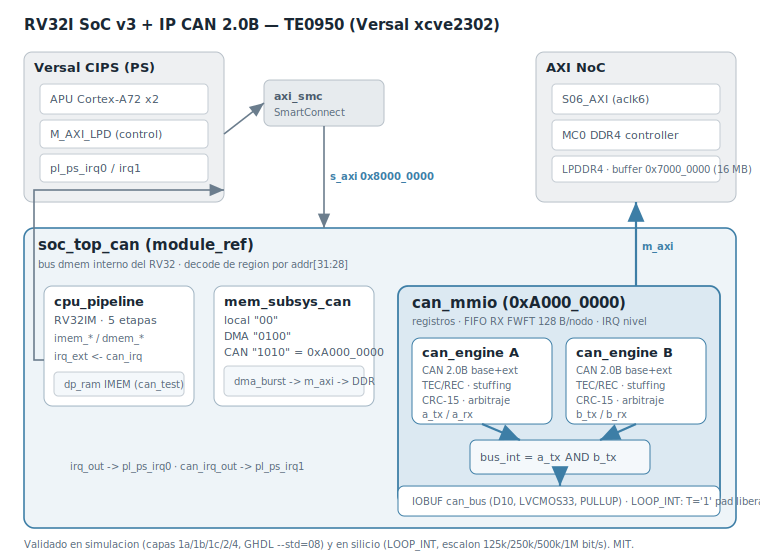

# CAN 2.0B IP Core for the RV32I SoC (v3)

A self-contained **CAN 2.0B** controller IP core written in VHDL-2008,
integrated into the RV32I SoC v3 and validated all the way from unit
simulation to silicon on a **Trenz TE0950** (AMD Versal `xcve2302`). It follows
the same five-layer verification methodology used by the USART, SPI, IIC and
I3C cores in this repository.

The core implements the complete CAN 2.0B protocol — standard (11-bit) and
extended (29-bit) identifiers, data and remote frames, bit stuffing, CRC-15,
arbitration, and the full fault-confinement machine (error-active /
error-passive / bus-off with automatic recovery). It ships with **two identical
engines (A and B)** wired together internally so the whole datapath can be
exercised on-chip with no external transceiver (`LOOP_INT` self-test).



---

## 1. What the IP core is for

CAN (Controller Area Network) is the robust, multi-master, differential serial
bus that dominates automotive and industrial control. This core lets a soft
RV32I CPU (or the Versal PS through the AXI window) originate and receive CAN
frames, arbitrate for the bus, and track the error state of each node — all in
programmable-logic fabric, with a simple memory-mapped register interface.

Typical uses:

- A deterministic, low-pin-count control bus between an FPGA and microcontrollers,
  sensors, or actuators.
- A soft-CPU peripheral for teaching / prototyping the CAN protocol end to end.
- A drop-in fabric CAN node when the hard CAN controllers of a device are already
  spoken for.

**Scope (frozen for v1):** full CAN 2.0B, **no CAN-FD** (roadmap for v2). The
error machine is complete, including bus-off recovery after 128×11 recessive
bits. A documented, **non-ISO-compliant** self-ack mode (`SELFACK`) exists purely
for single-node bring-up; it must not be used on a real bus.

---

## 2. Architecture

The core is three VHDL layers plus a thin Verilog wrapper:

- **`can_engine.vhd`** — the protocol engine. One clocked process with a
  programmable bit-time generator (quantum = `(brp+1)` clocks, bit =
  `1 + (tseg1+1) + (tseg2+1)` quanta, sample at the end of TSEG1), hard sync in
  IDLE/SUSPEND, and SJW-limited resynchronization. It handles TX with automatic
  retry, RX with left-aligned data, bit stuffing / destuffing, CRC-15
  (`0x4599`), ACK, EOF, interframe, overload and error frames, and the TEC/REC
  counters that drive the error-active / passive / bus-off state.
- **`can_mmio.vhd`** — the register bank. It wraps **two** `can_engine`
  instances (nodes A and B) and a **128-byte FWFT receive FIFO per node**. Each
  received frame is packed into a fixed 13-byte record
  (flags+ID, DLC, 8 data bytes) and pushed to the FIFO; reads pop one byte at a
  time with a `VALID` flag. Sticky status bits, level-triggered IRQ, watermarks
  and the `LOOP_INT` internal bus all live here.
- **`mem_subsys_can.vhd`** — the SoC memory subsystem. It decodes the CAN region
  at **`0xA000_0000`** (`addr[31:28] = "1010"`) on the RV32 internal dmem bus and
  owns the `dma_burst` master that reports results to DDR.
- **`soc_top_can.vhd` / `soc_top_can_wrap.v`** — the SoC top and its BD wrapper.
  The wrapper holds a **single IOBUF** (`can_bus`) with a dynamic `T`: in
  `LOOP_INT` the pad is released (`T='1'`) and the two engines talk over an
  internal wired-AND bus (`bus_int = a_tx AND b_tx`), dominant = `0`.

### Register map (`0xA000_0000`, byte offsets)

| Offset | Name       | Notes |
|-------:|------------|-------|
| `0x00` | `CTRL`     | b0 `EN_A`, b1 `EN_B`, b7 `LOOP_INT`, b8 `SELFACK_A`, b9 `SELFACK_B` |
| `0x04` | `STAT`     | live b0..; sticky b16.. (write clears stickies; same-cycle sets win) |
| `0x08` | `BTR`      | b7:0 BRP, b11:8 TSEG1, b14:12 TSEG2, b17:16 SJW (default `0x00015C09`) |
| `0x10` | `TXID_A`   | b28:0 ID, b29 RTR, b30 IDE |
| `0x14` | `TXDLC_A`  | b3:0 DLC |
| `0x18` | `TXDH_A`   | data bytes 0–3 (`tx_data[63:32]`) |
| `0x1C` | `TXDL_A`   | data bytes 4–7 (`tx_data[31:0]`) |
| `0x20` | `CMD_A`    | b0 GO (pulses `tx_req`), b1 ABORT |
| `0x24` | `RXFIFO_A` | pop-on-read: b7:0 byte, b8 `VALID` |
| `0x28` | `CNT_A`    | b8:0 TEC, b23:16 REC |
| `0x30`–`0x48` | `*_B` | node B mirror of `0x10`–`0x28` |
| `0x50` | `LVL`      | b7:0 level A, b15:8 level B |
| `0x54` | `IRQ_EN`   | interrupt enables |
| `0x58` | `IRQ_STAT` | level-triggered status (`irq = OR(IRQ_EN and IRQ_STAT)`) |
| `0x5C` | `WM`       | b7:0 watermark A, b15:8 watermark B |

Bit timing on a 100 MHz `aclk` with 20 tq/bit (TSEG1=12, TSEG2=5, +sync):
`rate = 100 MHz / ((BRP+1) × 20)` → BRP 39/19/9/4 = 125k/250k/500k/1M bit/s.

---

## 3. Prerequisites

**Simulation**
- GHDL 4.x with `--std=08` (the whole set is VHDL-2008).
- The RV32I core sources (this repo, `IP_Cores/RV32i/`) for the SoC layer:
  `riscv_pkg`, `alu`, `regfile`, `immgen`, `control`, `csr`, `muldiv`,
  `dp_ram`, `cpu_pipeline`, `axi4_master`, `dma_burst`, `axi_ddr_sim`,
  `axil_soc`.
- Python 3 for the assembler `asm.py` (assembles `can_test.s` → `can_test.mem`).

**Silicon**
- AMD Vivado 2025.2.x and PetaLinux 2025.2 (versions must match).
- A Trenz TE0950 (Versal `xcve2302-sfva784-1LP-e-S`) and an SD card.
- `aarch64-linux-gnu-gcc` for the user-space bring-up (ships with Vitis).

---

## 4. File manifest

| File | Role |
|------|------|
| `can_engine.vhd`      | CAN 2.0B protocol engine |
| `can_mmio.vhd`        | Two-node register bank + RX FIFOs + IRQ |
| `byte_fifo.vhd`       | FWFT byte FIFO (local fallback, from the SPI core) |
| `mem_subsys_can.vhd`  | dmem decode (CAN @ `0xA000_0000`) + DMA master |
| `soc_top_can.vhd`     | SoC top (CPU + mem subsystem + CAN) |
| `soc_top_can_wrap.v`  | BD wrapper (single IOBUF, ASSOCIATED_BUSIF) |
| `tb_can_engine.vhd`   | Layer 1a: engine TX vs event-driven receiver model |
| `tb_can_engine_rx.vhd`| Layer 1b: engine RX vs bit-banged transmitter model |
| `tb_can_bus.vhd`      | Layer 1c: RTL-vs-RTL on a resolved bus |
| `tb_can_mmio.vhd`     | Layer 2: register bank vs dmem BFM |
| `tb_can_soc.vhd`      | Layer 4: full SoC integration |
| `can_test.s` / `.mem` | RV32 program driving the IP over MMIO |
| `can_bringup.c`       | `/dev/mem` silicon bring-up (quad bit-rate step) |
| `can_pins.xdc`        | Pin constraints (`can_bus` on D10) |
| `bd_can_steps.tcl`    | Block-design transplant recipe (one command at a time) |
| `run_*.sh`            | Runners for each layer + cross-compile |

---

## 5. Verification: the five layers

Every layer is a hard, bit-identical **end-of-sim signature** — a change in
behaviour changes the finish time. All five pass.

| Layer | Testbench | What it proves | Signature |
|------:|-----------|----------------|-----------|
| 1a | `tb_can_engine`    | engine (TX) vs independent event-driven receiver model, with error injection | `8923067 ns` |
| 1b | `tb_can_engine_rx` | engine (RX) vs bit-banged transmitter model, with corruptions | `10507958 ns` |
| 1c | `tb_can_bus`       | two RTL engines on a wired-AND bus (real cross-ACK, arbitration) | `1763886 ns` |
| 2  | `tb_can_mmio`      | register bank vs a dmem BFM enforcing the RV32 contract | `313946 ns` |
| 4  | `tb_can_soc`       | full SoC: RV32 drives the IP, reports to DDR via DMA doorbell | `586058 ns` |

Run them:

```bash
cd ~/can_ip
chmod +x *.sh
./run_engine.sh      # layer 1a  -> simulation finished @8923067ns
./run_engine_rx.sh   # layer 1b  -> @10507958ns
./run_bus.sh         # layer 1c  -> @1763886ns
./run_mmio.sh        # layer 2   -> @313946ns
./run_soc.sh         # layer 4   -> TEST PASSED @586058ns
```

`run_soc.sh` reassembles `can_test.s` with `asm.py` and needs the RV32I core;
edit the `RV=` line if your core lives elsewhere:

```bash
sed -i 's#/path/to/vhdl_repo#'"$HOME"'/vhdl_repo#g' run_soc.sh
```

The quad bit-rate step (125k/250k/500k/1M) was also emulated in simulation by
patching BRP into the assembled program: all four rates give `TEST PASSED`, with
finish times scaling exactly (`2336058 / 1169058 / 586058 / 294058 ns`).

---

## 6. How to use it (software)

The CPU (or PS) drives the core through the register map. A minimal A→B
self-test in `LOOP_INT`:

```
# 1. configure bit timing, then enable both nodes in loop-back
sw  BTR   <- 0x00015C09        # 500 kbit/s @ 100 MHz
sw  CTRL  <- 0x00000083        # EN_A | EN_B | LOOP_INT

# 2. load a base frame id=0x123 dlc=8 and fire node A
sw  TXID_A <- 0x00000123
sw  TXDLC_A<- 0x00000008
sw  TXDH_A <- 0x01234567
sw  TXDL_A <- 0x89ABCDEF
sw  CMD_A  <- 0x00000001        # GO

# 3. poll STAT until TXDONE_A (b16) and RXV_B (b25); clear stickies
# 4. read node B's FIFO: 13 pops (RXFIFO_B), each with VALID in b8
```

`can_test.s` in this directory is the full worked example (base A→B, extended
remote B→A, simultaneous arbitration, then a DMA report of the results to DDR).
The BRP field lives in its own `addi` so the bring-up can patch the bit rate
without touching the rest of `BTR`.

---

## 7. Silicon flow (TE0950)

The Vivado project is **cloned from the I3C project** (which inherits the
audited `bd_soc_usart` block design: CIPS, NoC `NUM_SI=7`, smartconnect, reset,
address map). The I3C cell is swapped for the CAN cell; the one external
difference is the single CAN pad instead of two I²C lines.

### 7.1 Block-design transplant (Vivado Tcl — one command at a time)

> Run these in the Vivado Tcl console and **read every `get_bd_*` response
> before connecting** — a `connect_bd_net` can fail silently inside a pasted
> block (USART lesson #4).

```tcl
# clone the I3C project
open_project $env(HOME)/i3c_ip/vivado_i3c/i3c_soc.xpr
save_project_as can_soc $env(HOME)/can_ip/vivado_can -force
set_property source_mgmt_mode All [current_project]
reset_run synth_1
reset_run impl_1

# open the BD, discover, then remove the I3C cell
open_bd_design [get_files bd_soc_usart.bd]
get_bd_cells
get_bd_intf_pins u_soc_i3c/*
delete_bd_objs [get_bd_cells u_soc_i3c]

# swap sources I3C -> CAN
remove_files [get_files -quiet {*i3c_controller.vhd *i3c_target.vhd *i3c_mmio.vhd *mem_subsys_i3c.vhd *soc_top_i3c.vhd *soc_top_i3c_wrap.v}]
remove_files -fileset constrs_1 [get_files -quiet *i3c_pins.xdc]
add_files -norecurse [list \
  $env(HOME)/can_ip/byte_fifo.vhd $env(HOME)/can_ip/can_engine.vhd \
  $env(HOME)/can_ip/can_mmio.vhd  $env(HOME)/can_ip/mem_subsys_can.vhd \
  $env(HOME)/can_ip/soc_top_can.vhd $env(HOME)/can_ip/soc_top_can_wrap.v]
set_property file_type {VHDL 2008} [get_files $env(HOME)/can_ip/*.vhd]
add_files -fileset constrs_1 -norecurse $env(HOME)/can_ip/can_pins.xdc
update_compile_order -fileset sources_1

# new module reference
create_bd_cell -type module -reference soc_top_can_wrap u_soc_can

# reconnect (by source pin, checking each net first)
connect_bd_net [get_bd_pins versal_cips_0/pl0_ref_clk] [get_bd_pins u_soc_can/aclk]
connect_bd_net [get_bd_pins rst_versal_cips_0_240M/peripheral_aresetn] [get_bd_pins u_soc_can/aresetn]
delete_bd_objs [get_bd_intf_nets axi_smc_M00_AXI]
connect_bd_intf_net [get_bd_intf_pins axi_smc/M00_AXI] [get_bd_intf_pins u_soc_can/s_axi]
connect_bd_intf_net [get_bd_intf_pins u_soc_can/m_axi] [get_bd_intf_pins axi_noc_0/S06_AXI]
connect_bd_net [get_bd_pins u_soc_can/irq_out]     [get_bd_pins versal_cips_0/pl_ps_irq0]
connect_bd_net [get_bd_pins u_soc_can/can_irq_out] [get_bd_pins versal_cips_0/pl_ps_irq1]

# single CAN pad: reuse scl -> can_bus, drop sda
delete_bd_objs [get_bd_ports sda]
set_property name can_bus [get_bd_ports scl]
connect_bd_net [get_bd_pins u_soc_can/can_bus] [get_bd_ports can_bus]

# explicit address map
assign_bd_address -target_address_space /u_soc_can/m_axi [get_bd_addr_segs axi_noc_0/S06_AXI/C0_DDR_LOW0] -force
assign_bd_address -target_address_space /versal_cips_0/M_AXI_LPD [get_bd_addr_segs u_soc_can/s_axi/reg0] -offset 0x80000000 -range 64K -force

validate_bd_design
```

> If `save_project_as` produced a project whose BD is still a **remote
> reference** to the USART tree (see §9), export the edited BD with
> `write_bd_tcl` and rebuild it *inside* the CAN project instead of editing the
> USART BD in place.

### 7.2 Synthesis, implementation, XSA (batch)

```bash
# synth (byte_fifo dedup + disable inherited incremental checkpoint)
cat > ~/can_ip/run_synth_can.tcl <<'EOF'
open_project /home/adrian/can_ip/vivado_can/can_soc.xpr
if {[llength [get_files -quiet /home/adrian/spi_ip/byte_fifo.vhd]]} {
  remove_files [get_files /home/adrian/spi_ip/byte_fifo.vhd]
}
set_property INCREMENTAL_CHECKPOINT "" [get_runs synth_1]
update_compile_order -fileset sources_1
reset_run synth_1
launch_runs synth_1 -jobs 30
wait_on_run synth_1
puts "SYNTH = [get_property STATUS [get_runs synth_1]]"
EOF
vivado -mode batch -source ~/can_ip/run_synth_can.tcl

# impl + device image + XSA
cat > ~/can_ip/run_impl_can.tcl <<'EOF'
open_project /home/adrian/can_ip/vivado_can/can_soc.xpr
set_property INCREMENTAL_CHECKPOINT "" [get_runs impl_1]
reset_run impl_1
launch_runs impl_1 -to_step write_device_image -jobs 30
wait_on_run impl_1
open_run impl_1
puts "WNS = [get_property SLACK [get_timing_paths -max_paths 1 -nworst 1 -setup]]"
write_hw_platform -fixed -include_bit -force /home/adrian/can_ip/can_soc.xsa
EOF
vivado -mode batch -source ~/can_ip/run_impl_can.tcl
```

Result: `write_device_image Complete!`, **WNS = +0.603 ns**, XSA of ~3 MB with
the PDI embedded.

### 7.3 PetaLinux + SD

```bash
# clone the I3C PetaLinux project and re-point it at the CAN hardware
cp -a ~/plnx_te0950_i3c ~/plnx_te0950_can
cd ~/plnx_te0950_can
petalinux-config --get-hw-description=/home/adrian/can_ip/can_soc.xsa --silentconfig

# a cp -a clone carries absolute paths in build/tmp — remove them
rm -rf build/tmp build/cache

petalinux-build
petalinux-package --boot --u-boot --force
# -> images/linux/{BOOT.BIN, image.ub, boot.scr}
```

The `reserved-memory` node (16 MB at `0x7000_0000`, the DMA report buffer) is
inherited unchanged from the I3C device tree — the IP is driven from user space
over `/dev/mem`, so no kernel driver node is added.

Copy to the SD boot partition (clean, no leftover files):

```bash
rm -f  /media/$USER/BOOT/{BOOT.BIN,image.ub,boot.scr}
cp     ~/plnx_te0950_can/images/linux/{BOOT.BIN,image.ub,boot.scr} /media/$USER/BOOT/
cp     ~/can_ip/can_bringup /media/$USER/BOOT/
sync
```

### 7.4 Bring-up on target

```bash
# on the TE0950, after boot (BOOT partition auto-mounts under /run/media/…)
cp /run/media/BOOT-mmcblk1p1/can_bringup /root/
chmod +x /root/can_bringup
/root/can_bringup            # quad step 125k -> 250k -> 500k -> 1M, all LOOP_INT
```

Expected: four `== escalon brp=N (…kbit/s, LOOP_INT) ==` blocks, each with a
doorbell and 13 `DDR[..] = 0x.. OK` lines, ending in
`== CAN SILICON PASS (loop_int, escalonado) ==`.

---

## 8. Silicon results

- Timing closed: **WNS = +0.603 ns**.
- All four bit rates (125k / 250k / 500k / 1M) pass on hardware, each with the
  full A→B / B→A / arbitration sequence verified against DDR.
- 0 errors, 0 critical warnings in implementation.

---

## 9. Difficulties we hit (and how we solved them)

- **The clone edited the USART BD in place.** `save_project_as` cloned the
  `.xpr` but the block design remained a *remote reference* to the USART project
  tree, so every BD edit (delete I3C, add CAN, reconnect, address map) was
  written onto the shared USART BD. Fix: `write_bd_tcl` to capture the edits,
  remove the remote `.bd` from the project, then **rebuild the BD inside the CAN
  project** by sourcing that script. The USART project regenerates from its own
  `.tcl` in the repo.
- **Remote references, one by one.** The same remote-reference pattern hid in
  several artifacts that all pointed back at `~/usart_ip` / `~/i3c_ip`: the BD
  wrapper `.v`, a synthesis `.dcp` (`USED_IN synthesis implementation` — this
  one would have loaded USART logic instead of synthesizing CAN), and a NoC
  `nocattrs.dat` (`USED_IN simulation`, harmless). Each was found with a
  `foreach f [get_files -all *] {…}` sweep and removed.
- **Inherited incremental checkpoint.** The cloned `synth_1`/`impl_1` runs
  carried an `INCREMENTAL_CHECKPOINT` pointing at a `.dcp` we had deleted, which
  aborted synthesis before it started. Fix:
  `set_property INCREMENTAL_CHECKPOINT "" [get_runs synth_1]` (the
  `STEPS.SYNTH_DESIGN.ARGS.INCREMENTAL_CHECKPOINT` property does not exist on
  Versal 2025.2).
- **Duplicate `byte_fifo`.** Both `~/can_ip/byte_fifo.vhd` and the original
  `~/spi_ip/byte_fifo.vhd` resolved into `xil_defaultlib`; Vivado picked the SPI
  one. Removed the SPI copy from the CAN project for deterministic synthesis.
- **`cp -a` PetaLinux clone.** bitbake stores absolute paths in `build/tmp`, so
  the CAN build failed with *"TMPDIR has changed location"* pointing at the I3C
  tree. Fix: `rm -rf build/tmp build/cache` and rebuild.
- **BRP patchability.** The first program built the whole `BTR` with a
  `lui`+`addi` pair, so the bring-up could not change only the bit rate. The
  program was restructured so BRP lands in its own `addi` (patched by index),
  OR-ed with the fixed TSEG/SJW field.
- **Bit-mask off-by-12.** In `can_test.s`, sticky-bit masks were built with
  `lui 0x20000` (bit 29) instead of `lui 0x20` (bit 17): `lui` already shifts
  left by 12, so the TXDONE_B / ARB_B / combined masks were all 12 bits too high.
- **Testbench deadlocks & races.** Layer 1a's event model deadlocked waiting for
  a long idle gap after an injected error (the flag→retry gap is ~22 µs but an
  idle-wait was 26 µs); it now returns immediately after the event. Layer 1b's
  transmitter model had to *hold* the offending bit until the end of the bit
  before releasing it, because the engine samples ~30 ns later through its 2-FF
  input synchronizer.

---

## 10. Open question — external bus vs LOOP_INT

Silicon bring-up runs entirely in **`LOOP_INT`**: a single pad (`can_bus`, D10,
LVCMOS33, PULLUP) held released, the two engines talking over the internal
wired-AND bus. That is the self-test that validates the silicon.

A **real external CAN bus** needs a transceiver (the FPGA cannot drive the
differential `CAN_H`/`CAN_L` pair). The candidate is the **SN65HVD230** (3.3 V,
1 Mbit/s). In that topology `can_bus` goes to the transceiver's TXD and a
*second* pin (e.g. C10) carries RXD back, so the single IOBUF splits into
`OBUF` (D10→TXD) + `IBUF` (C10←RXD). The commented lines in `can_pins.xdc`
sketch this. It is deliberately left for a v1.1 once the transceiver can be
tested on the board — publishing an unverified pinout is exactly the kind of
thing that bites later.

---

## 11. Roadmap

- **v1.1** — external transceiver support (SN65HVD230, D10/C10, split IOBUF).
- **v2** — CAN-FD (flexible data rate, up to 64-byte payloads).
- Optional kernel driver with a device-tree node and SocketCAN integration
  (today the core is driven from user space over `/dev/mem`).

---

## 12. License

MIT. See `LICENSE` at the repository root.
