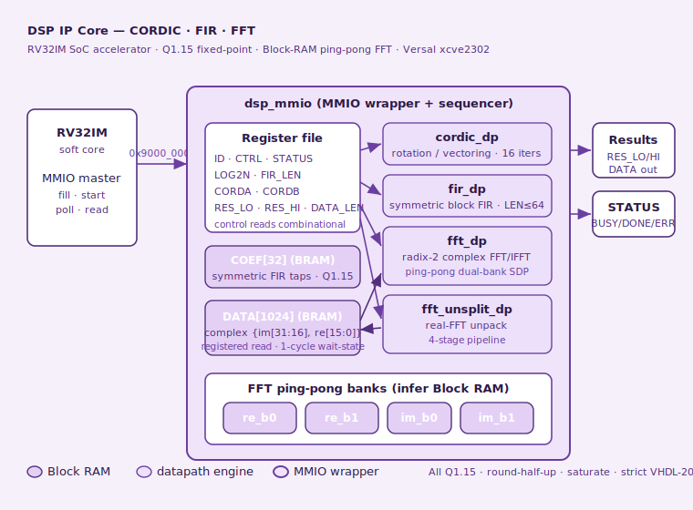

# DSP IP Core — CORDIC · FIR · FFT (complex & real-packed)

A synthesizable, silicon-validated DSP accelerator for a custom RV32IM SoC on
the AMD Versal adaptive SoC. The core bundles four fixed-point signal-processing
engines behind a single memory-mapped register interface: a CORDIC rotator /
vectorer, a symmetric linear-phase FIR filter, a radix-2 complex FFT/IFFT, and a
real-input FFT via the complex engine plus an unpacking stage. Every engine is
bit-exact against a NumPy reference model, verified across five layers ending in
hardware on a Trenz TE0950 board (Versal `xcve2302-sfva784-1LP-e-S`).

This core is part of a larger family of open VHDL-2008 IP cores (USART, SPI, IIC,
I3C, CAN, SpaceWire, MIL-STD-1553B, Ethernet MAC, PTP/802.1AS, and this DSP core),
all built with the same five-layer verification methodology and released under
the MIT license.



---

## 1. Table of contents

1. [What the core is for](#2-what-the-core-is-for)
2. [Features](#3-features)
3. [Requirements](#4-requirements)
4. [How the core works](#5-how-the-core-works)
5. [Register / address map](#6-register--address-map)
6. [Programming model](#7-programming-model)
7. [Repository layout](#8-repository-layout)
8. [Verification methodology](#9-verification-methodology)
9. [Build from scratch — Linux & Tcl commands](#10-build-from-scratch--linux--tcl-commands)
10. [Silicon bring-up](#11-silicon-bring-up)
11. [Engineering diary — what we fought](#12-engineering-diary--what-we-fought)
12. [Results](#13-results)
13. [Next steps](#14-next-steps)
14. [License](#15-license)

---

## 2. What the core is for

The DSP core offloads common signal-processing primitives from the soft RV32IM
processor so that firmware can request a transform, poll for completion, and read
the result, instead of computing it instruction-by-instruction. It targets
embedded and space-oriented workloads — attitude determination, sensor fusion,
spectral analysis, digital filtering — where a small, deterministic, fixed-point
accelerator is preferable to a floating-point unit or a vendor DSP block.

Concretely, the core computes:

- **CORDIC rotation** — angle → `(cos, sin)`, i.e. polar-to-rectangular.
- **CORDIC vectoring** — `(x, y)` → `(magnitude, phase)`, i.e. rectangular-to-polar.
- **FIR filtering** — symmetric (linear-phase) block FIR, programmable length ≤ 64.
- **Complex FFT / IFFT** — radix-2, decimation-in-time, up to N = 1024.
- **Real-input FFT** — packs 2N real samples into an N-point complex FFT and
  unpacks the spectrum, roughly halving the work for real signals.

All arithmetic is fixed-point Q1.15 with round-half-up and saturation, chosen so
that the hardware is bit-identical to a reference model that can be run and
audited independently.

---

## 3. Features

- Four engines behind one 64 KB MMIO window; one `FUNC` field selects the operation.
- Fixed-point Q1.15 throughout, round-half-up, saturating — no surprises, no
  floating point, fully deterministic.
- Radix-2 DIT FFT with per-stage scaling (1/N total), IFFT by twiddle conjugation.
- FFT implemented as a **ping-pong dual-bank simple-dual-port** design so all
  large buffers infer Block RAM (not LUTs).
- 1024-word complex DATA buffer in Block RAM, with a one-cycle read wait-state
  transparently absorbed by the bus handshake.
- Symmetric FIR stores only `ceil(L/2)` coefficients; 40-bit accumulator headroom.
- Strict **VHDL-2008** — no `-frelaxed`, no shared variables, no vendor
  primitives; portable and clean for publication.
- Silicon-validated at 100 MHz on Versal with zero timing / DRC violations,
  occupying **~5.6 % of the device LUTs**.

---

## 4. Requirements

### Toolchain

| Tool | Version used | Purpose |
|---|---|---|
| GHDL | 4.1.0 (`--std=08`) | RTL simulation, five-layer verification |
| AMD Vivado | 2025.2.1 | Synthesis, implementation, device image |
| AMD PetaLinux | 2025.2.1 | Linux image, BOOT.BIN packaging |
| Python | 3.x + NumPy | Reference oracle, instruction-set simulator |
| `aarch64-linux-gnu-gcc` | — | Cross-compile the PS-side verifier (`-O2 -static`) |
| picocom | — | Serial console, 115200 8N1 |

### Hardware

- Trenz **TE0950** carrier with AMD Versal **`xcve2302-sfva784-1LP-e-S`**
  (150 272 LUTs, 155 Block-RAM tiles).
- microSD card (FAT boot partition) for image transfer — no inbound SSH assumed.
- USB-UART for the serial console.

### Host RTL dependencies

The core reuses shared sources from the SoC, referenced from their origin (never
duplicated):

- `~/rv32i/` — the RV32IM processor core, AXI-Lite bridge, DMA engine, NoC glue.
- `~/spi_ip/byte_fifo.vhd` — canonical first-word-fall-through FIFO (used by the
  FIR/stream paths where applicable).

---

## 5. How the core works

### 5.1 Top-level structure

A single wrapper, `dsp_mmio.vhd`, decodes the memory-mapped register file and
sequences the four datapaths. Firmware writes operands and configuration
registers, sets the `START` bit with a `FUNC` selector, then polls `STATUS.DONE`.
Results are read back from result registers (CORDIC/FIR scalar outputs) or from
the DATA window (FFT spectra).

```
            ┌──────────────────────── dsp_mmio ────────────────────────┐
   MMIO ───►│  register file  ─┬─► cordic_dp   (rotation / vectoring)   │
  (0x9000_  │  (ID/CTRL/STATUS │ ─► fir_dp      (symmetric block FIR)    │
   0000)    │   LOG2N/FIR_LEN  │ ─► fft_dp      (radix-2 complex FFT)    │──► results
            │   CORDA/B/RES..) │ ─► fft_unsplit_dp (real-FFT unpack)     │
            │  COEF[32] (BRAM) │                                         │
            │  DATA[1024] BRAM ◄─────────── shared complex buffer ───────┤
            └──────────────────────────────────────────────────────────┘
```

### 5.2 CORDIC (`cordic_dp.vhd`)

Sixteen iterations of the shared-hardware CORDIC. Samples `x, y` are Q1.15;
the angle is Q2.14 (±π ↔ ±2¹⁵). The gain term `1/K = 0x4DBA` (Q1.15) is
preloaded in rotation mode and applied at the end in vectoring mode. The arctan
table is Q2.14, matching the oracle exactly.

### 5.3 FIR (`fir_dp.vhd`)

Linear-phase symmetric FIR, programmable length `LEN ≤ 64`. Only `ceil(L/2)`
coefficients are stored (symmetry). Samples and coefficients are Q1.15; the
accumulator is Q2.30 carried in 40 bits for headroom. The delay line and the
coefficient RAM are arrays with a registered index so they infer Block RAM.

### 5.4 Complex FFT (`fft_dp.vhd`) — the ping-pong architecture

The FFT is radix-2 decimation-in-time with a shift of 1 per stage (1/N total
scale); the IFFT conjugates the twiddles. The defining implementation choice is
**ping-pong dual-bank memory**:

- Two banks per part (`re_b0/re_b1`, `im_b0/im_b1`), each a signal array with
  `ram_style="block"`, a single write port per process, and a registered read.
- Each butterfly reads its two operands from the *source* bank and writes its two
  results to the *destination* bank; the banks swap roles every stage.
- Because a bank is only ever read (as source) or only ever written (as
  destination) in a given stage, no bank is read and written in the same cycle —
  the pattern that a Block RAM can actually implement.
- The butterfly is serialized across sub-states (`RD_K → RD_L → LAT → CALC → MUL
  → WR_L`) so each memory port sees one access per cycle. BRAM read latency is
  two cycles (registered address + registered output), which the state machine
  accounts for.

Twiddle ROMs are `rom_style="block"`; their address is `j << log2(stride)`
(a shift, not a multiply — see the diary) so the addressing logic stays short.

### 5.5 Real-input FFT (`fft_unsplit_dp.vhd`)

Real FFT packs 2N real samples into an N-point complex FFT, then the unsplit
stage recovers the 2N-point real spectrum using the complex conjugate symmetry
`X[N-k]* `. The unpack datapath is pipelined across four registered stages
(mix → ROM → complex multiply → write) so no single combinational chain violates
timing; index arithmetic uses shift/mask because `N` and the stride are powers of two.

### 5.6 The DATA buffer and the read wait-state

The 1024-word complex DATA buffer (`{im[31:16], re[15:0]}`) lives in Block RAM.
Control registers stay combinational (the MMIO read contract), but the DATA
window is a registered BRAM read, so a read of the DATA region asserts one wait
cycle on the bus. The RV32IM load simply stalls one cycle via the standard
`dmem_ready` handshake — transparent to firmware, which always follows the
**fill → operate → wait DONE → read** pattern and never reads a DATA word in the
same cycle it was written.

---

## 6. Register / address map

The core occupies region `0x9000_0000` (address bits `[31:28] = "1001"`) as seen
by the RV32IM core. All registers are 32-bit, byte-addressed.

| Offset | Name | Access | Description |
|---|---|---|---|
| `0x000` | `ID` | RO | Identifier, reads `0xD5B10100` |
| `0x004` | `CTRL` | RW | `bit0`=START (auto-clear), `bits[3:1]`=FUNC, `bit4`=REAL_PACK, `bit5`=FLUSH |
| `0x008` | `STATUS` | RO / W1C | `bit0`=BUSY, `bit1`=DONE (sticky, write-1-clear), `bit2`=ERR |
| `0x00C` | `LOG2N` | RW | FFT size exponent, 3..10 (N = 8..1024) |
| `0x010` | `FIR_LEN` | RW | FIR length, 1..64 |
| `0x014` | `CORDA` | RW | CORDIC operand A (angle in rotation; x in vectoring) |
| `0x018` | `CORDB` | RW | CORDIC operand B (y in vectoring) |
| `0x01C` | `RES_LO` | RO | Result low (CORDIC cos / magnitude; FIR/other low word) |
| `0x020` | `RES_HI` | RO | Result high (CORDIC sin / phase) |
| `0x024` | `DATA_LEN` | RW | Sample count (FIR) / 2N reals (real-pack FFT) |
| `0x080`–`0x0FF` | `COEF[32]` | RW | 32 symmetric FIR coefficients, Q1.15 in `[15:0]` |
| `0x1000`–`0x1FFF` | `DATA[1024]` | RW | Complex buffer, `{im[31:16], re[15:0]}` |

### FUNC codes (`CTRL[3:1]`)

| FUNC | Operation |
|---|---|
| `000` | FFT forward |
| `001` | FFT inverse |
| `010` | FIR (block) |
| `011` | CORDIC rotation |
| `100` | CORDIC vectoring |

### SoC-level addresses (from the PS side)

| Address | Meaning |
|---|---|
| `0x8000_0000` | AXI-Lite control window (`axil_soc`): CONTROL/STATUS/IMEM/DMEM/DDR_BASE |
| `0x0000_0201_0000_0000` | SoC slave (64 KB) via SmartConnect → `FPD_CCI_NOC_0` |
| `0x7000_0000` | Reserved DDR buffer, 16 MB, `no-map`, label `rv32i_reserved` |
| `0x4000_0000` | DMA register block (from the core): SRC/DST/LEN/CTRL/STATUS |
| `0x9000_0000` | DSP MMIO (from the core) |

---

## 7. Programming model

A typical sequence, from the RV32IM firmware's point of view:

1. (optional) Read `ID` and confirm `0xD5B10100`.
2. Write operands / configuration:
   - CORDIC: `CORDA` (and `CORDB` for vectoring).
   - FIR: `COEF[..]`, `FIR_LEN`, `DATA_LEN`, then samples into `DATA[..]`.
   - FFT: `LOG2N`, then complex samples into `DATA[..]`.
3. Write `CTRL` with `START | (FUNC<<1) | (REAL_PACK<<4)`.
4. Poll `STATUS` until `bit1` (DONE) is set.
5. Read results:
   - CORDIC/FIR scalar results from `RES_LO`/`RES_HI`.
   - FFT spectra from `DATA[..]`.
6. Clear DONE by writing `STATUS = 0x2` (W1C) before the next operation.

**Timing contract:** always *fill → operate → wait DONE → read*. A DATA write has
one settling cycle and a DATA read has one wait cycle; firmware that never
read-immediately-after-write on the same word (the natural pattern) is unaffected,
because the bus handshake absorbs both.

---

## 8. Repository layout

```
IP_Cores/DSP/
├── rtl/
│   ├── cordic_dp.vhd        # CORDIC rotation / vectoring datapath
│   ├── fir_dp.vhd           # symmetric block FIR datapath
│   ├── fft_dp.vhd           # radix-2 complex FFT (ping-pong SDP)
│   ├── fft_unsplit_dp.vhd   # real-FFT unpack stage (pipelined)
│   └── dsp_mmio.vhd         # MMIO wrapper + DATA/COEF Block RAM
├── sim/
│   ├── dsp_oracle.py        # NumPy golden model (bit-exact reference)
│   ├── iss_dsp.py           # instruction-set-style stimulus generator (Layer 4)
│   ├── tb_*.vhd             # testbenches for layers 1a, 2, 2b, 2c, 4
│   └── run_*.sh             # per-layer runners (golden + mutation tests)
├── fw/
│   ├── dsp_id_hw.s          # bring-up Phase A: read ID
│   ├── dsp_cordic_hw.s      # bring-up Phase B: CORDIC rotation
│   ├── dsp_fft8_hw.s        # bring-up Phase C: FFT N=8
│   └── dsp_verify.c         # PS-side verifier (aarch64), DMA-doorbell reader
├── docs/
│   └── dsp_architecture.svg # architecture diagram (760×560)
└── README.md
```

Canonical copies live in `~/vhdl_repo/IP_Cores/DSP/`. The GitLab repository is the
primary; the GitHub repository is a mirror (`git push origin` pushes to both).

---

## 9. Verification methodology

Every engine is verified bit-exact against `dsp_oracle.py` (a NumPy reference)
across five layers. Each layer requires mutations that must fail — a passing
golden run plus surviving mutants would mean the test is blind.

- **Layer 1a** — each datapath (CORDIC, FIR, FFT, unsplit) versus the oracle,
  with deterministic end-of-simulation signatures as the pass criterion.
- **Layer 2** — the MMIO register bank contract (combinational control reads,
  DATA read wait-state, W1C status).
- **Layer 2b** — full FFT through the MMIO wrapper.
- **Layer 2c** — FIR block and real-packed FFT through the MMIO wrapper.
- **Layer 4** — full SoC with the RV32IM core running assembled firmware, an
  ISS Python oracle producing the expected read stream, compared bit-identically.
- **Layer 5** — silicon on the TE0950.

The pass criterion across machines is a **bit-identical simulation signature**:
the developer's host and the CI container must produce the same value. FNV-1a
(32-bit) is used for the golden signatures; the global reference signature is
`0x41AAEDAF`.

---

## 10. Build from scratch — Linux & Tcl commands

The following reproduces the project end-to-end. Adjust paths to your layout.

### 10.1 Simulation & verification (GHDL)

```bash
cd ~/vhdl_repo/IP_Cores/DSP/sim
chmod +x run_*.sh

# per-layer: golden must print OK, every mutant must print "MUTANTE VIVO"
./run_cordic_l1a.sh
./run_fir_l1a.sh
./run_fft_l1a.sh
./run_unsplit_l1a.sh
./run_mmio_l2.sh
./run_mmio_fft_l2b.sh
./run_mmio_l2c.sh
./run_dsp_soc_l4.sh
```

To regenerate the oracle vectors / signatures:

```bash
python3 dsp_oracle.py            # prints per-vector and global signatures
python3 dsp_oracle.py --dump     # writes .mem vectors for the testbenches
```

### 10.2 Synthesis & implementation (Vivado, Tcl — one command at a time)

Open the project and update the module reference after any RTL change:

```tcl
open_project ~/dsp_ip/vivado_dsp/dsp_soc.xpr
update_module_reference bd_soc_usart_u_soc_dsp_0
```

Force a clean re-synthesis and implementation (reset both runs so Vivado does not
reuse a stale netlist):

```tcl
reset_run synth_1
reset_run impl_1
launch_runs synth_1 -jobs 8
wait_on_run synth_1
launch_runs impl_1 -to_step write_device_image -jobs 8
wait_on_run impl_1
```

Check utilization and timing (`~` is not expanded in Vivado — use `$env(HOME)`):

```tcl
open_run synth_1
report_utilization       -file $env(HOME)/dsp_ip/util.rpt
open_run impl_1
report_timing_summary    -file $env(HOME)/dsp_ip/timing.rpt
```

```bash
grep -A2 "CLB LUTs\|Block RAM Tile\|RAMB" $HOME/dsp_ip/util.rpt
grep -iE "Timing constraints are (met|not met)" $HOME/dsp_ip/timing.rpt
```

Export the hardware handoff (with the device image embedded):

```tcl
write_hw_platform -fixed -include_bit -force $env(HOME)/dsp_ip/dsp_soc.xsa
```

### 10.3 PetaLinux (Linux image + BOOT.BIN)

```bash
cd ~
source ~/Petalinux/settings.sh

petalinux-create -t project --template versal -n plnx_te0950_dsp
cd ~/plnx_te0950_dsp
petalinux-config --get-hw-description=$HOME/dsp_ip/dsp_soc.xsa --silentconfig

# inherit the reserved-memory node (16 MB @ 0x7000_0000, label rv32i_reserved)
cp ~/plnx_te0950_ptp/project-spec/meta-user/recipes-bsp/device-tree/files/system-user.dtsi \
   ~/plnx_te0950_dsp/project-spec/meta-user/recipes-bsp/device-tree/files/system-user.dtsi

petalinux-build
petalinux-package --boot --u-boot --force
```

Copy the three boot artifacts to the microSD (FAT partition) and sync:

```bash
cp images/linux/BOOT.BIN images/linux/image.ub images/linux/boot.scr \
   /media/$USER/BOOT/
sync
```

---

## 11. Silicon bring-up

Bring-up uses a two-piece pattern: a small RV32IM firmware that drives the DSP and
DMAs a signature to DDR, and a PS-side aarch64 verifier that loads the firmware,
runs the core, and reads the result back from DDR through a doorbell.

### 11.1 The firmware / verifier flow

The verifier (`dsp_verify.c`) does, over `/dev/mem`:

1. Halt the core (`CONTROL.bit0 = 1`).
2. Load the assembled firmware into the IMEM window (`0x8000_0000 + 0x1000`).
3. Set `DDR_BASE` (`0x10/0x14`) to `0x7000_0000`.
4. Release the core (`CONTROL.bit0 = 0`).
5. Poll the DDR sentinel / IRQ doorbell.
6. Read the signature words from DDR and compare.

The firmware follows the DMA register map at `0x4000_0000`
(`0x00`=SRC, `0x04`=DST, `0x08`=LEN, `0x0C`=CTRL `bit0`=start/`bit1`=dir,
`0x10`=STATUS busy), writes a sentinel + results to local RAM, DMAs local→DDR
(CTRL = 3), and rings the doorbell (word 127 of local RAM → PL→PS IRQ).

### 11.2 Assemble, cross-compile, transfer, run

```bash
# assemble firmware (asm.py emits one hex word per line)
python3 ~/vhdl_repo/IP_Cores/RV32i/asm.py dsp_fft8_hw.s dsp_fft8_hw.bin

# cross-compile the verifier (static aarch64)
aarch64-linux-gnu-gcc -O2 -static dsp_verify.c -o dsp_verify

# copy to SD, boot the board, then on the target:
cp /run/media/BOOT-mmcblk1p1/dsp_verify /tmp/ && chmod +x /tmp/dsp_verify
cp /run/media/BOOT-mmcblk1p1/dsp_fft8_hw.bin /tmp/
cd /tmp && ./dsp_verify dsp_fft8_hw.bin 9      # dump 9 words (sentinel + 8 results)
```

Three bring-up phases are provided, from trivial to full:

- **Phase A** (`dsp_id_hw.s`) — read the DSP `ID` (`0xD5B10100`). Validates the
  whole chain (IMEM load → core run → NoC access → DMA → doorbell → PS read).
- **Phase B** (`dsp_cordic_hw.s`) — CORDIC rotation of `0x2000`; expect
  cos `0x5A81`, sin `0x5A84`.
- **Phase C** (`dsp_fft8_hw.s`) — FFT N=8 of a known real vector; the eight
  complex outputs match the oracle bit-for-bit, exercising the ping-pong BRAM,
  the DATA buffer, and the twiddle ROM in silicon.

---

## 12. Engineering diary — what we fought

This core's difficulty was not the arithmetic (that was settled in simulation
early) but making the design **physically realizable** — fit in the device and
close timing — without giving up bit-exactness. The battles, in order:

**1. In-place FFT is not Block-RAM-implementable.** The first FFT wrote two
arbitrary positions per cycle into one array (classic in-place radix-2). Vivado
refused to infer BRAM: with `ram_style="block"` on a signal array it raised
`WARNING 8-4767` ("multiple writes per process") and dissolved the buffers into
LUTs (**466 k LUTs, 3× the device**); with a shared-variable array it raised
`ERROR 8-2914` ("Unsupported RAM template") plus `8-5743`. The lesson: writing two
arbitrary positions per cycle to one memory is not an inferable BRAM pattern.
The fix is the **ping-pong dual-bank** architecture — the canonical hardware FFT
memory organization — where read and write live in separate banks.

**2. BRAM read latency is two cycles, and phase errors look like noise.** After
the ping-pong rewrite, the first results were garbage — not a clean shift, but
noise. The cause was capturing the butterfly operands one cycle too early: a
registered address plus a registered output is **two** cycles of latency, not
one. We localized it with a known-value N=8 mini-testbench that traced the CALC
inputs against a step-by-step model. When a result is "noise" rather than a clean
offset, suspect a read-phase misalignment.

**3. The `rdata` combinational contract is incompatible with BRAM.** The MMIO
read contract (inherited from earlier cores) requires combinational `rdata`, but
a 1024×32 DATA buffer only infers BRAM with a registered read. The `data_r` array
was dissolving into **32 768 registers** (`WARNING 8-4767` / `8-13159`), which by
itself kept the design at **269 k LUTs (179 %)**. The resolution: keep the few
control registers combinational, move the DATA window to a registered BRAM read,
and add a **one-cycle wait-state** signaled through `ready`. That wait-state has
to be honored up the hierarchy — the memory subsystem had `dmem_ready <= '1'`
hard-wired and had to be changed to propagate the DSP's `ready` in the DATA
region. The wait-state itself is best driven by an **address-match**
(`dr_raddr_q = widx`), which is more robust than a toggle or counter.

**4. BRAM writes have a settling cycle.** Routing all writes through a single
registered write port means a DATA word is visible one cycle after the write.
Testbenches that write-then-read-immediately need an extra cycle; real firmware
does not, because it fills, operates, then reads.

**5. Variable arithmetic is a timing killer.** Once the design fit, timing failed
badly: **WNS −8.5 ns**, 363 failing endpoints. The critical paths were
combinational chains through variable multipliers, dividers, and modulo:
`k * stride`, `NMAX / m`, `k mod n` — each synthesized as a carry chain of dozens
of `LOOKAHEAD8`/`LUTCY` levels. Two fixes, applied path by path:
   - **Pipeline** long chains (the unsplit stage had a direction multiplier +
     twiddle lookup + two complex multiplies in one cycle — 63 logic levels;
     split into four registered stages).
   - **Shift/mask instead of variable mul/div/mod** where the operand is a power
     of two: `k * (2^s) → k << s`, `k mod (2^n) → k and (2^n − 1)`, `k / (2^s) →
     k >> s`, with the exponent/mask kept in a register updated once per run.
   The WNS improved in clear steps — **−8.5 → −2.5 → −2.4 → +0.867 ns** — and the
   revealing metric was the *failing-endpoint count* (363 → 114 → 18 → 0), which
   shows each cut removing a family of paths, not just the single worst one.

**6. Vivado will silently reuse a stale netlist.** A WNS identical byte-for-byte
between iterations is the tell-tale sign that synthesis did not actually re-run.
The cure is `reset_run` on **both** `synth_1` and `impl_1`, and verifying by the
`.dcp` timestamp that synthesis really re-ran.

**7. Bring-up scars.** The PS-side verifier first loaded the assembler's
hex-*text* output as if it were raw binary (IMEM came up as ASCII `"0009"`); the
verifier was taught to parse the one-word-per-line hex format. The DMA control
word needed `bit0`=start **and** `bit1`=dir for local→DDR (value 3, not 1). And
`addi` immediates for negative 16-bit constants exceeded the ±2047 range — they
must be built as `lui 0x10` + `addi -N` so the sign-extension lands correctly.

Every one of these was invisible to simulation and only surfaced in synthesis,
implementation, or silicon — which is exactly why Layer 5 is irreplaceable: it
validates physical realizability, not just logical correctness.

---

## 13. Results

- **Utilization:** 8 366 CLB LUTs (**5.57 %** of 150 272), 3.5 Block-RAM tiles
  (1× RAMB36 for DATA, 5× RAMB18 for the FFT banks + twiddle ROMs).
- **Timing:** WNS **+0.867 ns** at 100 MHz, 0 failing endpoints, DRC clean.
- **Verification:** bit-exact across all five layers; global signature `0x41AAEDAF`.
- **Silicon:** CORDIC and FFT confirmed bit-exact on the TE0950; the eight
  N=8 FFT outputs matched the oracle word-for-word.
- **RTL:** strict VHDL-2008, no `-frelaxed`, no shared variables, no vendor
  primitives.

---

## 14. Next steps

- Extend hardware validation to the remaining engines: FIR (block, with
  coefficients), FFT inverse, and real-packed FFT via `fft_unsplit_dp`.
- Run the full N=1024 FFT in silicon (fill the 1024 positions with a firmware
  loop instead of unrolled stores) and check the global FNV-1a signature against
  the oracle (`0x41AAEDAF`).
- Add a firmware driver library (C on the RV32IM side) wrapping the
  fill/operate/poll/read sequence per operation.
- Optional throughput work: overlap DATA load with computation, and evaluate a
  wider FFT datapath if a use case needs it.
- Documentation polish and a short application note for the ADCS use case.

---

## 15. License

MIT License. Copyright (c) Adrián Hernández Coss.

Permission is hereby granted, free of charge, to any person obtaining a copy of
this software and associated documentation files (the "Software"), to deal in the
Software without restriction, including without limitation the rights to use,
copy, modify, merge, publish, distribute, sublicense, and/or sell copies of the
Software, and to permit persons to whom the Software is furnished to do so,
subject to the following conditions:

The above copyright notice and this permission notice shall be included in all
copies or substantial portions of the Software.

THE SOFTWARE IS PROVIDED "AS IS", WITHOUT WARRANTY OF ANY KIND, EXPRESS OR
IMPLIED, INCLUDING BUT NOT LIMITED TO THE WARRANTIES OF MERCHANTABILITY, FITNESS
FOR A PARTICULAR PURPOSE AND NONINFRINGEMENT. IN NO EVENT SHALL THE AUTHORS OR
COPYRIGHT HOLDERS BE LIABLE FOR ANY CLAIM, DAMAGES OR OTHER LIABILITY, WHETHER IN
AN ACTION OF CONTRACT, TORT OR OTHERWISE, ARISING FROM, OUT OF OR IN CONNECTION
WITH THE SOFTWARE OR THE USE OR OTHER DEALINGS IN THE SOFTWARE.
