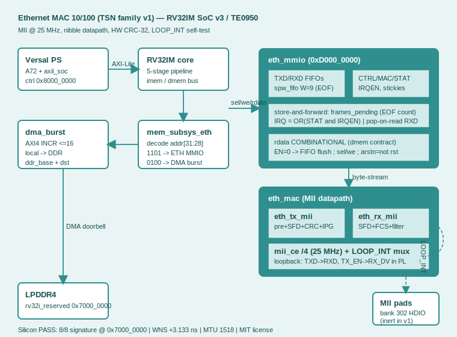

# Ethernet MAC 10/100 — TSN family IP core (v1)

A synthesizable **VHDL-2008 Media Access Controller** for 100 Mbit/s Ethernet
over MII, packaged as an IP core for a custom RV32IM SoC (SoC v3) on the Trenz
**TE0950** board (AMD Versal `xcve2302-sfva784-1LP-e-S`).

It is the foundation of a Time-Sensitive Networking (TSN) family: the base MAC
onto which PTP/802.1AS, the Time-Aware Shaper (802.1Qbv), Frame Preemption and
other TSN layers will be added. **No TSN features are implemented in v1** — this
release is a clean, fully verified Ethernet MAC.

> **Silicon-validated on the TE0950**: 8/8 signature match, timing closed at
> **WNS +3.133 ns**. Verified across five layers from unit sim to hardware.



---

## Table of contents

1. [What is this and why would you use it](#1-what-is-this-and-why-would-you-use-it)
2. [Feature set](#2-feature-set)
3. [How it fits in the SoC](#3-how-it-fits-in-the-soc)
4. [Register map](#4-register-map)
5. [How to use it — software](#5-how-to-use-it--software)
6. [Frame format & CRC](#6-frame-format--crc)
7. [Internal loopback (LOOP_INT)](#7-internal-loopback-loop_int)
8. [Verification strategy](#8-verification-strategy)
9. [Build & run — simulation](#9-build--run--simulation)
10. [Build & run — Vivado](#10-build--run--vivado)
11. [Build & run — PetaLinux & SD card](#11-build--run--petalinux--sd-card)
12. [Silicon bring-up](#12-silicon-bring-up)
13. [Problems we hit and how we solved them](#13-problems-we-hit-and-how-we-solved-them)
14. [File layout](#14-file-layout)
15. [Roadmap](#15-roadmap)
16. [License](#16-license)

---

## 1. What is this and why would you use it

This core lets a soft RV32 CPU (or any AXI/MMIO master) **send and receive
Ethernet frames** on an FPGA without an external MAC chip. You write frame bytes
into a register, the core adds the preamble, SFD, padding and CRC, and shifts
them out on the MII bus at 100 Mbit/s. Incoming frames are checked for CRC
validity, filtered by destination MAC address, and handed back to you byte by
byte.

Typical uses:

- **Embedded control networks** where an FPGA node needs raw L2 Ethernet
  (industrial, aerospace, instrumentation) without a hard MAC.
- **A TSN development base**: the MII datapath exposes exactly the hooks a PTP
  timestamp unit or a time-aware shaper needs.
- **A teaching / reference MAC**: the whole thing is flat VHDL-2008, ~1500 lines,
  with a five-layer verification suite you can read and re-run.

What it is **not**: it is not a full TCP/IP stack (it is layer 2 only), it has no
PHY or auto-negotiation in v1 (MII pads are inert; loopback is internal), and it
is not gigabit.

The design deliberately uses **MII at 25 MHz** (one nibble per cycle, SDR)
instead of RGMII. This avoids DDR sub-nanosecond skew and is why timing closes
with over 3 ns of slack — leaving headroom for the TSN logic to come.

## 2. Feature set

| Area | v1 |
|------|-----|
| Line rate | 100 Mbit/s, MII @ 25 MHz, nibble datapath (SDR) |
| TX | preamble + SFD, dst/src/type, payload, **HW CRC-32**, padding to 60 B, 96 bit-time IPG |
| RX | preamble/SFD detect, deserialize, **FCS check** (bad frames dropped), **MAC filtering** (unicast + broadcast + promiscuous) |
| Delivery | byte-stream FIFOs with EOF marker, frames up to MTU |
| MTU | 1518 bytes (14 + 1500 + 4) |
| Self-test | LOOP_INT internal loopback, deterministic signature |
| Bus | MMIO, combinational `rdata`, pop-on-read RXD, level IRQ |

Not in v1 (see [roadmap](#15-roadmap)): external RGMII PHY, MDIO, auto-neg,
1 Gbit/s, and all TSN features.

## 3. How it fits in the SoC

```
Versal PS (A72) ──AXI-Lite──► axil_soc ──► RV32 core ──dmem bus──► mem_subsys_eth
                                                                        │ decode addr[31:28]
                                    ┌───────────────────────────────────┤
                                    │ "1101" → eth_mmio (0xD000_0000)    │ "0100" → dma_burst
                                    ▼                                    ▼
                          eth_mac (TX+RX+mii_ce/4+LOOP_INT)      AXI4 → LPDDR4 (0x7000_0000)
                                    ▼
                          MII pads (bank 302, inert in v1)
```

- The IP is a slave on the RV32 `dmem` bus, decoded at **`0xD000_0000`**
  (`addr[31:28] = "1101"`).
- Frame signatures / results are moved to DDR by the SoC's `dma_burst` master.
- The PS controls the core and loads firmware over an AXI-Lite slave at
  `0x8000_0000`.

## 4. Register map

MMIO base `0xD000_0000`, word offsets:

| Offset | Name  | Access | Fields |
|-------:|-------|--------|--------|
| `0x00` | CTRL  | RW  | b0 `EN`, b1 `LOOP_INT`, b2 `PROMISC` |
| `0x04` | MACLO | RW  | `MAC[31:0]` (byte 0 in b7:0) |
| `0x08` | MACHI | RW  | `MAC[47:32]` |
| `0x0C` | CMD   | W1P | b0 `TX_FLUSH`, b1 `RX_FLUSH` |
| `0x10` | STAT  | R   | b0 `TX_BUSY`, b4 `TXF_EMPTY`, b5 `TXF_FULL`, b6 `RXF_EMPTY`, b7 `RXF_FULL`, b14:8 `rxf_level`; **stickies** b16 `RX_OK`, b17 `RX_CRC`, b18 `RX_RUNT`, b19 `RX_DROP`, b20 `TX_UNDERRUN`, b21 `TXF_OVF`, b22 `RXF_OVF` |
| `0x14` | TXD   | W   | b7:0 data, **b8 EOF** (last byte of frame). R: b12:0 `txf_level`, b13 `txf_full` |
| `0x18` | RXD   | R   | **pop-on-read** b7:0 data, b8 EOF, **b31 VALID** |
| `0x1C` | IRQEN | RW  | mask over STAT; `irq = OR(STAT & IRQEN)` |

**Sticky semantics**: any write to STAT clears the sticky bits; sets happening in
the same cycle win. **`rdata` is combinational** in the same cycle as `sel` — a
registered `rdata` passes MMIO tests but fails at SoC level (every `lw` returns
the previous read).

## 5. How to use it — software

### Send a frame (C, via MMIO pointer)

```c
#define ETH 0xD0000000u
#define CTRL  0x00
#define MACLO 0x04
#define MACHI 0x08
#define STAT  0x10
#define TXD   0x14
#define RXD   0x18
#define reg(o) (*(volatile uint32_t*)(ETH + (o)))

// own MAC 02:AA:BB:CC:DD:EE  (byte0 in b7:0)
reg(MACLO) = 0xCCBBAA02;
reg(MACHI) = 0x0000EEDD;
reg(CTRL)  = 0x1;                 // EN (add 0x2 for LOOP_INT)

// write frame bytes; set bit8 (EOF) on the last one
for (int i = 0; i < len; i++)
    reg(TXD) = frame[i] | (i == len-1 ? 0x100 : 0);
// store-and-forward: the MAC starts transmitting once the whole frame is in
```

### Receive a frame

```c
while (!(reg(STAT) & (1<<16)))    // wait RX_OK sticky
    ;
uint32_t w;
do {
    w = reg(RXD);                 // pop-on-read
    if (!(w & (1u<<31))) break;   // VALID=0 → FIFO empty
    put_byte(w & 0xFF);
} while (!(w & 0x100));            // stop at EOF
reg(STAT) = 0xFFFFFFFF;           // clear stickies
```

### Enable interrupts instead of polling

```c
reg(IRQEN) = (1<<16);             // IRQ on RX_OK; irq = OR(STAT & IRQEN)
```

### Minimal RV32 assembly (asm.py subset)

```asm
    lui  x1, 0xD0000        # base MMIO
    li   x16, 0xCCBBAA02
    sw   x16, 4(x1)         # MACLO
    li   x16, 0x0000EEDD
    sw   x16, 8(x1)         # MACHI
    addi x16, x0, 3
    sw   x16, 0(x1)         # CTRL = EN | LOOP_INT
    # ... write bytes to TXD (offset 0x14) with bit8=EOF on the last ...
```

## 6. Frame format & CRC

```
7×preamble(0x55) │ SFD(0xD5) │ dst[6] │ src[6] │ type/len[2] │ payload[46..1500] │ FCS[4]
```

Frames are at least 64 bytes on the wire; payloads under 46 bytes are
zero-padded to 60 data bytes. IPG is 96 bit-times (24 idle nibbles).

**CRC-32**: polynomial 0x04C11DB7, reflected form 0xEDB88320, init 0xFFFFFFFF,
final complement, processed **per nibble (LSB first)** to match the MII datapath.
On RX, running the reflected CRC over the whole frame including the FCS yields
the canonical residue **0xDEBB20E3** for a valid frame — that is the accept
test. The convention is anchored to zlib (`crc32("123456789") = 0xCBF43926`).

## 7. Internal loopback (LOOP_INT)

Set `CTRL.LOOP_INT`. An internal mux feeds `TXD→RXD` and `TX_EN→RX_DV` inside
the PL, sharing the divided 25 MHz clock-enable. The MII pads go inert. A frame
you transmit travels TX → loopback → RX and, if it passes FCS and MAC filtering,
reappears in the RX FIFO. This is the silicon self-test path — no PHY needed.

## 8. Verification strategy

Five layers, each **bit-exact** against an independent model, each carrying
mutations that **must** fail (so the test proves it can detect bugs):

| Layer | What | Result |
|-------|------|--------|
| 1a | TX engine vs independent event-driven MII receiver (own byte-wise CRC) | PASS `@62065ns` + 4 mutations |
| 1b | RX engine vs bit-bang transmitter with injected corruptions | PASS `@214845ns` + 4 mutations |
| 1c | Full MAC in LOOP_INT, full-duplex, **phase-0 anti-common-mode** + independent cable watcher | PASS `@60305ns` + 4 mutations |
| 2  | MMIO bank vs dmem BFM; 114-byte frame round-trip, stickies, IRQ | PASS `@16325ns` + 4 mutations |
| 4  | Full SoC + real DMA + Python ISS oracle; signature DMA'd to DDR | PASS `@260265ns` |
| 5  | Silicon on TE0950 | **8/8 signature** |

The pass criterion is **bit-identical simulation end-timestamps**. The layer-1c
phase-0 test guards the common-mode blind spot: with a silent partner, the RX
must produce nothing (if TX and RX shared a protocol defect they would
interoperate silently).

## 9. Build & run — simulation

Requires GHDL 4.1.0. Each layer has a self-contained runner:

```bash
cd ~/eth_ip
bash sim/run_l1a.sh      # TX engine  → "L1A COMPLETA: PASS + 4 mutaciones detectadas"
bash sim/run_l1b.sh      # RX engine  → "L1B COMPLETA ..."
bash sim/run_l1c.sh      # full MAC   → "L1C COMPLETA ..."
bash sim/run_l2.sh       # MMIO bank  → "L2 COMPLETA ..."
bash sim/run_l4.sh       # full SoC (needs ~/rv32i sources) → "ETH CAPA 4 PASS"
```

The layer-4 runner first generates the ISS reference:

```bash
python3 sim/iss_eth.py   # writes iss_signature.txt
```

`spw_fifo.vhd` is referenced from `~/spw_ip/` (never duplicated); the runners
fall back to a local copy if not found.

## 10. Build & run — Vivado

Vivado 2025.2.1. The block design is cloned from the previous IP and the module
reference swapped. **Run the BD steps one command at a time** in the Tcl console
— a pasted block can fail silently.

```bash
source ~/Xilinx/2025.2.1/Vivado/settings64.sh
vivado -mode tcl
```

```tcl
# clone + clean (see vivado/bd_eth_steps.tcl for the full sequence)
open_project $env(HOME)/m1553_ip/vivado_m1553/m1553_soc.xpr
save_project_as eth_soc $env(HOME)/eth_ip/vivado_eth -force
set_property source_mgmt_mode All [current_project]
reset_run synth_1 ; reset_run impl_1
set_property INCREMENTAL_CHECKPOINT "" [get_runs synth_1]
set_property INCREMENTAL_CHECKPOINT "" [get_runs impl_1]
# remove stale nocattrs.dat inherited from parent projects (they live in sim_1):
remove_files -fileset sim_1 [get_files -all -of_objects [get_filesets sim_1] */nocattrs.dat]
# swap the IP cell, rewire clock/reset/AXI/IRQ/MII by source pin (verify each net),
# then address map:
assign_bd_address -target_address_space /u_soc_eth/m_axi [get_bd_addr_segs axi_noc_0/S06_AXI/C0_DDR_LOW0] -force
assign_bd_address -target_address_space /versal_cips_0/M_AXI_LPD [get_bd_addr_segs u_soc_eth/s_axi/reg0] -offset 0x80000000 -range 64K -force
validate_bd_design
set_property top bd_soc_usart_wrapper [current_fileset]
save_bd_design
```

Verify MII pin availability **before** synthesis:

```tcl
synth_design -rtl -name rtl_1
get_package_pins -filter {BANK == 302 && IS_BONDED}
close_design
```

Then run synthesis and implementation from the shell:

```bash
cd ~/eth_ip
vivado -mode batch -source vivado/run_synth_eth.tcl 2>&1 | tee synth_eth.log
vivado -mode batch -source vivado/run_impl_eth.tcl  2>&1 | tee impl_eth.log
# → SYNTH PROGRESS = 100%, WNS = 3.133, XSA written to ~/eth_ip/eth_soc.xsa
```

Key Versal rules baked into the scripts: never use Connection Automation for PL
masters (it routes to `S_AXI_LPD` without DDR); the PL master goes to a dedicated
NoC slave `S06_AXI` with its own `aclk6`; MII pins on **bank 302 HDIO**
(LVCMOS33). The MAC uses E11/E12/D11/D12/C12/C13/C14/D14/E13/E14.

## 11. Build & run — PetaLinux & SD card

PetaLinux 2025.2.1. Clone the previous project, re-point to the new XSA, reuse
the reserved-memory node.

```bash
source ~/Petalinux/settings.sh
cp -r ~/plnx_te0950_m1553 ~/plnx_te0950_eth
cd ~/plnx_te0950_eth
rm -rf build/tmp build/cache                     # cp -r drags absolute paths
petalinux-config --get-hw-description=$HOME/eth_ip/eth_soc.xsa --silentconfig
petalinux-build
# repackage BOOT.BIN fully — Versal PLM rejects a hot-loaded PDI (0x03024001):
petalinux-package --boot --plm --psmfw --u-boot --dtb --force
```

The `reserved-memory` node at `0x7000_0000` (16 MB, `rv32i_reserved`) is
inherited in `system-user.dtsi` — reused, not edited.

Flash the SD **cleanly** (FAT corruption has bitten before):

```bash
sudo umount /media/adrian/BOOT 2>/dev/null
sudo mkfs.vfat -F 32 -n BOOT /dev/sda1
sudo fsck.vfat -v /dev/sda1
sudo mount /dev/sda1 /mnt/sdboot
sudo cp ~/plnx_te0950_eth/images/linux/{BOOT.BIN,image.ub,boot.scr} /mnt/sdboot/
sudo cp ~/eth_ip/bringup/{eth_verify,eth_bringup.mem,iss_signature.txt} /mnt/sdboot/
sync ; sudo umount /mnt/sdboot ; sudo fsck.vfat -v /dev/sda1 ; sudo eject /dev/sda
```

## 12. Silicon bring-up

Build the reference, assemble the firmware, cross-compile the verifier:

```bash
python3 sim/iss_eth.py                                    # iss_signature.txt
python3 ~/rv32i/asm.py bringup/eth_bringup.s bringup/eth_bringup.mem
aarch64-linux-gnu-gcc -O2 -static bringup/eth_verify.c -o bringup/eth_verify
```

On the board (serial `picocom -b 115200 /dev/ttyUSB1`, prompt
`root@plnxte0950usart`):

```bash
cd /run/media/BOOT-mmcblk1p1
./eth_verify eth_bringup.mem iss_signature.txt
```

Expected:

```
firmware: 199 instrucciones cargadas
centinela OK en DDR (0x00C0FFEE)
  sig[0] = 0x00001A26  (esperado 0x00001A26) OK
  ...
  sig[7] = 0x000005EA  (esperado 0x000005EA) OK

ETH SILICON PASS
```

The verifier loads the firmware through the IMEM window, sets `DDR_BASE`,
releases the core, then reads the signature from **physical DDR** — see the next
section for why.

## 13. Problems we hit and how we solved them

Real issues from bring-up, kept here so the next IP doesn't repeat them.

- **The PS could not read the core's RAM while it ran.** `axil_soc` ties
  `axi_owns_mem = CONTROL.bit0`, so the PS only sees the local RAM when the core
  is **halted**. Our first verifier read the DMEM window with the core running
  and got all zeros. **Fix**: the firmware DMA-volumes the signature to physical
  DDR (`0x7000_0000`) and the PS reads it there — the same flow the other IPs
  use. `dma_burst` computes `awaddr = ddr_base + dst`, so `dst=0` + `ddr_base`
  lands the data at `0x7000_0000`.

- **A sticky-bit race dropped one signature word.** The firmware read
  `STAT.RX_DROP` immediately after sending the "alien MAC" frame, but the MAC
  needs hundreds of cycles (TX over MII → loopback → RX → FCS → filter) before
  the sticky sets. It read 0. **Fix**: wait for the sticky to rise (with a guard)
  before reading it — exactly like the accepted-frame path already waits for
  `RX_OK`.

- **TX underrun at SoC speed.** With `tx_valid = not txf_empty`, the engine
  started on the first byte and drained faster than firmware could write (each
  store is two cycles). **Fix**: store-and-forward — a `frames_pending` counter
  of written EOFs; the engine starts only when a full frame is buffered.

- **FIFO too small for the MTU.** A 64-byte FIFO deadlocked on a 114-byte frame
  (FIFO full, TX never starting). **Fix**: `LOG2_DEPTH=11` (2048 bytes) to hold
  a full MTU frame.

- **`asm.py` limitations.** The assembler has no `la`, `lbu` or `.byte`, and
  `jalr` must be `jalr rd, N(rs1)` (not three args). MAC/src address bytes are
  built with `li` + arithmetic selection instead of memory tables. We validated
  the assembled `.mem` against the ISS with a small RV32IM interpreter
  (`iss_rv32.py`) **before** touching the board — separating SW bugs from HW.

- **Vivado clone carried remote references two generations deep.** The cloned
  project had stale `nocattrs.dat` from both the 1553 **and** the i2c parent.
  **Fix**: sweep `get_files -all */nocattrs.dat` and remove from `sim_1`; run BD
  commands one at a time and verify every net with `get_bd_nets`.

- **The SVG didn't render in the README.** Inline `<svg>` in Markdown shows as
  raw markup on GitLab/GitHub. **Fix**: reference it as a file
  (``).

## 14. File layout

```
eth_ip/
├── rtl/
│   ├── eth_pkg.vhd           CRC-32 nibble function (shared by RTL and banks)
│   ├── eth_tx_mii.vhd        TX engine: preamble/SFD/pad/CRC/IPG
│   ├── eth_rx_mii.vhd        RX engine: SFD detect/deserialize/FCS/filter
│   ├── eth_mac.vhd           TX+RX+mii_ce(/4)+LOOP_INT mux
│   ├── eth_mmio.vhd          register bank, FIFOs, store-and-forward, IRQ
│   ├── mem_subsys_eth.vhd    dmem decode (addr[31:28]="1101") + DMA
│   ├── soc_top_eth.vhd       SoC top: RV32 core + mem + IP + axil_soc
│   └── soc_top_eth_wrap.v    Verilog wrapper for the block design
├── tb/                       tb_eth_tx_l1a, _rx_l1b, _mac_l1c, _mmio_l2, _l4
├── sim/                      run_l1a..l4.sh, iss_eth.py
├── vivado/                   bd_eth_steps.tcl, run_synth_eth.tcl, run_impl_eth.tcl
├── bringup/                  eth_bringup.s/.mem, eth_verify.c, eth_diag.c, iss_rv32.py
├── docs/                     eth_arch.svg
├── eth_pins.xdc              MII pins, bank 302 HDIO
└── README.md
```

Shared sources (`spw_fifo.vhd`, the RV32 core, `asm.py`) are referenced from
their origin, never duplicated.

## 15. Roadmap

- **v1.1** — external RGMII PHY + MDIO management + auto-negotiation.
- **TSN** — PTP/IEEE 802.1AS (HW timestamp at the SFD), then the Time-Aware
  Shaper (802.1Qbv), Frame Preemption (802.1Qbu), CBS and FRER. The MII datapath
  already exposes the SFD timing hooks these need.
- 1 Gbit/s.

## 16. License

MIT.
