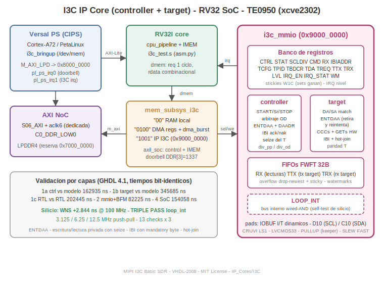

# I3C — Memory-Mapped MIPI I3C (SDR) Controller + Target IP Core for the RV32I SoC v3

Silicon-validated MIPI I3C Basic (SDR) **controller and target** IP core in
VHDL-2008, mapped at `0x9000_0000` on the internal dmem bus of the RV32I SoC
v3 family. Byte-level command interface (PIO + level IRQ), three FWFT byte
FIFOs, hardware ENTDAA on both sides, in-frame CCC handling in the target,
IBI with mandatory byte, hot-join, and a built-in full-cycle self-test
(`LOOP_INT`) that wires the real controller and the real target together
through an internal wired-AND before the IOBUF.

**Silicon result (TE0950, xcve2302, Vivado/PetaLinux 2025.2.1):**
WNS **+2.844 ns @ 100 MHz**, triple silicon pass in `LOOP_INT` at
**3.125 / 6.25 / 12.5 MHz push-pull** (12.5 MHz is the SDR maximum), 13
end-to-end checks per rung — ENTDAA, private write, controller-terminated
read (T-bit seize), and IBI with mandatory byte — verified by an RV32
program reporting through the SoC DMA to reserved DDR.



---

## 1. What this IP core is for

I3C is the MIPI successor to I2C for sensor buses: same two wires, but with
push-pull data phases up to 12.5 MHz (SDR), in-band interrupts (no extra IRQ
pin per sensor), dynamic address assignment (ENTDAA), and standardized
common commands (CCCs). Typical uses of this core:

- **Sensor hub in the PL**: the controller engine talks to modern IMUs,
  magnetometers and barometers that expose I3C, offloading the PS.
- **I3C peripheral emulation**: the target engine turns the FPGA into an
  I3C device (own PID/BCR/DCR, dynamic address, IBIs), useful to prototype
  a sensor or to test third-party controllers.
- **Protocol bring-up and teaching**: the `LOOP_INT` self-test exercises a
  complete, observable I3C conversation with zero external hardware.
- **Drop-in block for the RV32I SoC v3 family**: same dmem contract,
  register style, IRQ semantics and build flow as the sibling USART, SPI
  and IIC cores in this repository.

## 2. Requirements

Hardware:
- Trenz TE0950 (Versal xcve2302-sfva784-1LP-e-S) for the silicon flow, with
  microSD boot and a serial console (picocom, 115200 8N1). Any Versal or
  7-series part works for the RTL itself; only the XDC pins are
  board-specific.
- For an external bus: the CRUVI LS1 adapter (CR00025); the internal PULLUP
  serves as high-keeper for loopback and light external validation.

Software:
- **GHDL >= 4.1** with `--std=08` (simulation; `apt-get install ghdl`).
- **Python 3** (the `asm.py` RV32 assembler).
- **Vivado 2025.2.1** and **PetaLinux 2025.2.1** for the silicon flow.
- `aarch64-linux-gnu-gcc` (or the target's native gcc) for the bring-up.

Shared sources (referenced from their origin, local fallbacks provided
where noted):
- `~/rv32i/` — RV32I SoC v3: `riscv_pkg alu regfile muldiv immgen control
  csr dp_ram cpu_pipeline dma_burst axi_ddr_sim axil_soc` + `asm.py`.
- `~/spi_ip/byte_fifo.vhd` — FWFT byte FIFO (local fallback
  `byte_fifo.vhd` included).

## 3. Features

**Controller (SDR):** START/Sr/STOP; open-drain arbitrable header after
START and push-pull headers after Sr; write data with hardware odd-parity T
bit; reads with both terminations (controller seize during T-high -> Sr/P,
and target T=0); ENTDAA rounds with streamed 64-bit payload and DA+parity
transmit; IBI service via bus-free detection, lost arbitration, or hot-join
(0x02/W); independent `DIV_PP`/`DIV_OD` dividers.

**Target (full):** header match on 0x7E / dynamic address / static address
(under SETDASA); ENTDAA participation with bit-level withdrawal and
automatic retry; hardware CCCs (broadcast ENEC/DISEC/RSTDAA/ENTDAA/
SETMWL/SETMRL; directed ENEC/DISEC/SETDASA/SETMWL/SETMRL/GETMWL/GETMRL/
GETPID/GETBCR/GETDCR/GETSTATUS) with directed GETs answered in-frame;
private writes with parity checking and frame discard on error; private
reads from a FWFT FIFO with NACK-on-empty; IBI with mandatory byte and
hot-join origination.

**MMIO:** register bank + both engines + three 32-byte FIFOs; sticky/live
STAT with same-cycle-set-wins clearing; level IRQ; watermarks; drop-newest
overflow; `LOOP_INT` self-test.

Out of scope for v1 (documented, v2 roadmap): HDR-DDR, secondary
controller/handoff, timing control, MWL/MRL enforcement.

## 4. Architecture and timing

See the diagram above. Each bit is four quarters of `div+1` clk cycles
(clk = 100 MHz): SCL low in q0-q1, high in q2-q3; SDA placed at the q0->q1
tick and sampled via 2FF at the end of q3 (read T bit: end of q2, so the
controller can seize in q3). The three critical handoffs — header->ACK
release on the SCL fall, T=1 release on the SCL rise with keeper hold, and
payload->DA release after ENTDAA bit 63 — are validated at every layer and
in silicon; at `div_pp=1` the T-bit release and the controller seize
resolve on the same clock edge.

## 5. Address map

**Inside the RV32 (dmem bus regions):**

| Region | Decode | Contents |
|--------|--------|----------|
| `0x0000_0000` | bits 31:30 = "00" | local RAM (1-cycle) |
| `0x4000_0000` | bits 31:28 = "0100" | SoC DMA registers (SRC 0x00, DST 0x04, LEN 0x08, CTRL 0x0C, STATUS 0x10) |
| `0x9000_0000` | bits 31:28 = "1001" | **this IP** (`i3c_mmio`, addr[7:0] below) |

**I3C registers (offset from `0x9000_0000`):** `0x00 CTRL` (b0 EN, b1 TEN,
b7 LOOP_INT) · `0x04 STAT` (live b0 BUSY b1 XOPEN b2 IBI_REQ b3 ACK_IN
b4 T_BIT b5 TIN_FRAME b6 TDA_VALID b7 TIBI_PEND b8 THJ_PEND b9 TIBI_EN
b10 THJ_EN; sticky, any-write-clears with same-cycle sets winning: b16 DONE
b17 ARB_LOST b18 IBI_AVALID b19 T_EVDA b20 T_RSTDAA b21 T_RXPERR
b22 T_IBIDONE b23 T_IBINAKD b24 T_HJDONE b25 RX_OVF b26 TTX_OVF
b27 TRX_OVF) · `0x08 SCLDIV` (b15:0 DIV_PP, b31:16 DIV_OD; clk per quarter
minus 1) · `0x0C CMD` (b7:0 WDATA, b8 START, b9 STOP, b10 READ, b11 RLAST,
b12 NOBYTE, b13 DAA, b14 DAADR, b15 IBIACK, b16 IBINAK) · `0x10 RX`
(pop-on-read, b8 VALID) · `0x14 IBIADDR` · `0x18 TCFG` (b6:0 SA) ·
`0x1C TPIDL` · `0x20 TPIDH` · `0x24 TBDCR` (b7:0 BCR, b15:8 DCR, b23:16
MDB) · `0x28 TSTATW` · `0x2C TDA` (b6:0 DA, b8 DA_VALID, b9 IBI_EN, b10
HJ_EN) · `0x30 TLEN` (b15:0 MWL, b31:16 MRL, RO) · `0x34 TREQ` (b0 IBI_GO,
b1 HJ_GO) · `0x38 TTX` (push) · `0x3C TRX` (pop-on-read) · `0x40 LVL`
(RX/TTX/TRX levels) · `0x44 IRQ_EN` / `0x48 IRQ_STAT` (b0 DONE
b1 ARB_LOST b2 IBI_REQ-level b3 IBI_AVALID b4 RX>=WM b5 TRX>=WM
b6 T_RXPERR b7 T_IBIDONE b8 T_IBINAKD b9 T_HJDONE b10 T_EVDA b11 T_RSTDAA
b12-14 overflows; **level IRQ, no ack**) · `0x4C WM`.

**Seen from the PS (physical addresses):**

| Address | Contents |
|---------|----------|
| `0x8000_0000` (64K, M_AXI_LPD) | `axil_soc`: 0x00 CONTROL (b0 halt, boots =1), 0x04 STATUS, 0x08 DBG_PC, 0x0C IRQ doorbell (1337), 0x10/0x14 DDR_BASE L/H, 0x1000 IMEM window, 0x2000 DMEM window |
| `0x7000_0000` (16 MB) | reserved no-map DDR (device tree) — bring-up report buffer. **Unrelated** to the RV32-internal `0x9000_0000` region. |

Contract reminders: `dmem_req` is one cycle, `rdata` is combinational and
captured at the request edge; pop-on-read consumes on that edge. Firmware
rule: if IBI_REQ appears instead of DONE after a CMD with START, the
command lost against an incoming IBI — service the IBI, then retry.

## 6. How to call / use this IP

**a) Instantiate the MMIO block in your own design (VHDL):**

```vhdl
u_i3c : entity work.i3c_mmio
  port map (
    clk => clk, rst => rst,
    sel   => i3c_region_and_req,   -- 1-cycle request qualified to the region
    we    => write_strobe,          -- '1' on writes (wstrb collapsed)
    addr  => dmem_addr(7 downto 0),
    wdata => dmem_wdata,
    rdata => i3c_rdata,             -- COMBINATIONAL: capture at the req edge
    irq   => i3c_irq,
    scl_o => scl_o, scl_t => scl_t, scl_i => scl_i,
    sda_o => sda_o, sda_t => sda_t, sda_i => sda_i);
```

The engines (`i3c_controller`, `i3c_target`) are also instantiable on
their own — see their file headers for the pulse/level port contracts.
Pads need IOBUFs with **dynamic I and T** (pattern in
`soc_top_i3c_wrap.v`): open-drain phases drive I=0 with T as data,
push-pull phases drive T=0 with the value on I; T='1' always releases.

**b) From RV32 assembly** (full script: `i3c_test.s`):

```asm
lui  x1, 0x90000        # base of the I3C registers
addi x5, x0, 508        # 0x1FC = START | 0x7E/W
sw   x5, 12(x1)         # CMD
wd:  lw   x6, 4(x1)     # poll STAT for DONE (bit16)...
     and  x7, x6, x20
     beq  x7, x0, wd
     sw   x0, 4(x1)     # ...any STAT write clears the stickies
```

**c) From Linux on the PS (`/dev/mem`):** map `0x8000_0000`, halt the core
(CONTROL=1), set DDR_BASE, write the assembled program through the IMEM
window (patching the separate `addi` immediates: prog[5] = DIV_PP,
prog[20] = CTRL), release the core (CONTROL=0), poll the doorbell
(reserved DDR word 3 == 1337) and read the results — exactly what
`i3c_bringup.c` does; use it as the reference user-space driver.

**d) Register recipes:**
- **ENTDAA:** CMD `0x1FC`; `0x007`; `0x2000` (then pop 8 payload bytes from
  RX); `0x4060` (assign DA 0x30); repeat `0x2000` until STAT b3 (ACK_IN)
  reads 1 (NACK = no unassigned targets left); `0x1200` (STOP).
- **Private write to DA 0x30:** `0x1FC`; `0x160`; one CMD per data byte;
  OR the last one with `0x200` (STOP).
- **Private read:** `0x1FC`; `0x161`; `0x400` per byte (pop RX after each
  DONE); terminate with `0xE00` (READ|RLAST|STOP) or stop on T_BIT=0 +
  `0x1200`.
- **IBI service:** TREQ`=1` (or wait for a real target); poll STAT b2;
  read IBIADDR; CMD `0x8000` (ack); `0x400` (mandatory byte lands in RX,
  T_BIT=0); `0x1200`.

## 7. How to build — complete command walkthrough

**7.1 Simulation (all five layers, bash):**

```bash
cd ~/i3c_ip
./run_controller.sh   # layer 1a: ends 162935 ns, T1..T10 + PASS
./run_target.sh       # layer 1b: ends 345685 ns, U1..U12 + PASS
./run_engine.sh       # layer 1c: ends 202445 ns, V1..V9  + PASS
./run_mmio.sh         # layer 2 : ends  82225 ns, W1..W6  + PASS
./run_soc.sh          # layer 4 : ends 154058 ns, doorbell + 13 OK + TEST PASSED
```

`run_soc.sh` assembles `i3c_test.s` with `~/rv32i/asm.py` and compiles the
shared SoC sources; the FIFO comes from `~/spi_ip` with local fallback.

**7.2 Vivado project (Tcl console; run the commands ONE BY ONE reading
each answer — annotated master copy in `bd_i3c_steps.tcl`):**

```tcl
open_project $env(HOME)/i2c_ip/vivado_i2c/i2c_soc.xpr
save_project_as i3c_soc $env(HOME)/i3c_ip/vivado_i3c -force
set_property source_mgmt_mode All [current_project]
open_bd_design [get_files bd_soc_usart.bd]
delete_bd_objs [get_bd_cells u_soc_i2c]
remove_files [get_files -quiet {*i2c_master.vhd *i2c_slave.vhd *i2c_mmio.vhd \
  *mem_subsys_i2c.vhd *soc_top_i2c.vhd *soc_top_i2c_wrap.v}]
remove_files -fileset constrs_1 [get_files -quiet *i2c_pins.xdc]
add_files -norecurse [list $env(HOME)/i3c_ip/i3c_controller.vhd \
  $env(HOME)/i3c_ip/i3c_target.vhd $env(HOME)/i3c_ip/i3c_mmio.vhd \
  $env(HOME)/i3c_ip/mem_subsys_i3c.vhd $env(HOME)/i3c_ip/soc_top_i3c.vhd \
  $env(HOME)/i3c_ip/soc_top_i3c_wrap.v]
set_property file_type {VHDL 2008} [get_files *i3c_*.vhd]
add_files -fileset constrs_1 -norecurse $env(HOME)/i3c_ip/i3c_pins.xdc
update_compile_order -fileset sources_1
create_bd_cell -type module -reference soc_top_i3c_wrap u_soc_i3c
connect_bd_net [get_bd_pins versal_cips_0/pl0_ref_clk] [get_bd_pins u_soc_i3c/aclk]
connect_bd_net [get_bd_pins rst_versal_cips_0_240M/peripheral_aresetn] \
  [get_bd_pins u_soc_i3c/aresetn]
connect_bd_intf_net [get_bd_intf_pins axi_smc/M00_AXI] [get_bd_intf_pins u_soc_i3c/s_axi]
connect_bd_intf_net [get_bd_intf_pins u_soc_i3c/m_axi] [get_bd_intf_pins axi_noc_0/S06_AXI]
connect_bd_net [get_bd_pins u_soc_i3c/irq_out]     [get_bd_pins versal_cips_0/pl_ps_irq0]
connect_bd_net [get_bd_pins u_soc_i3c/i3c_irq_out] [get_bd_pins versal_cips_0/pl_ps_irq1]
connect_bd_net [get_bd_ports scl] [get_bd_pins u_soc_i3c/scl]
connect_bd_net [get_bd_ports sda] [get_bd_pins u_soc_i3c/sda]
assign_bd_address -target_address_space /u_soc_i3c/m_axi \
  [get_bd_addr_segs axi_noc_0/S06_AXI/C0_DDR_LOW0] -force
assign_bd_address -target_address_space /versal_cips_0/M_AXI_LPD \
  [get_bd_addr_segs u_soc_i3c/s_axi/reg0] -offset 0x80000000 -range 64K -force
validate_bd_design
source $env(HOME)/vhdl_repo/IP_Cores/USART/bd_review.tcl   ;# audit BEFORE synthesis
save_bd_design
set_property incremental_checkpoint {} [get_runs synth_1]  ;# cloned-run hygiene
reset_run synth_1
launch_runs synth_1 -jobs 8
wait_on_run synth_1
reset_run impl_1
launch_runs impl_1 -to_step write_device_image -jobs 8
wait_on_run impl_1
open_run impl_1
report_timing_summary -delay_type min_max -file $env(HOME)/i3c_ip/timing_i3c.txt
write_hw_platform -fixed -include_bit -force $env(HOME)/i3c_ip/i3c_soc.xsa
```

The PDI lands at `vivado_i3c/i3c_soc.runs/impl_1/bd_soc_usart_wrapper.pdi`.
Audit gate: `validate_bd_design` reports OK even on validly-wrong designs —
the `bd_review.tcl` report (NoC SI/clock associations, address segments) is
the real gate before spending synthesis.

**7.3 PetaLinux (bash):**

```bash
cp -r ~/plnx_te0950_i2c ~/plnx_te0950_i3c        # clone a known-good project
cd ~/plnx_te0950_i3c
rm -rf build/tmp                                  # tmp does not survive clones
source ~/Petalinux/settings.sh
petalinux-config --get-hw-description ~/i3c_ip/i3c_soc.xsa --silentconfig
petalinux-build
petalinux-package --boot --u-boot --force
```

**7.4 SD card (bash, with honest verification):**

```bash
DEV=$(lsblk -rpno NAME,FSTYPE,RM | awk '$2=="vfat" && $3=="1" {print $1; exit}')
sudo mkdir -p /mnt/sd && sudo mount $DEV /mnt/sd
sudo rm -f /mnt/sd/Image /mnt/sd/uEnv.txt        # stale fallbacks cause silent bad boots
sudo cp ~/plnx_te0950_i3c/images/linux/{BOOT.BIN,boot.scr,image.ub} /mnt/sd/
sudo cp ~/i3c_ip/i3c_bringup /mnt/sd/
sync
sudo sh -c 'echo 3 > /proc/sys/vm/drop_caches'   # md5 must read the CARD, not the cache
md5sum /mnt/sd/BOOT.BIN /mnt/sd/image.ub
sudo umount /mnt/sd
```

**7.5 Bring-up (target serial console, `root@` prompt):**

```bash
mount /dev/mmcblk0p1 /mnt || mount /dev/mmcblk1p1 /mnt
cp /mnt/i3c_bringup ~/ && chmod +x ~/i3c_bringup
~/i3c_bringup            # triple rung 3.125/6.25/12.5 MHz; or single: ~/i3c_bringup 1
```

Expected: three `== escalon div_pp=... ==` blocks, 13 OK each, ending in
`== I3C SILICON PASS (loop_int, escalonado) ==`.

## 8. Verification methodology (5 layers)

Every layer validated in GHDL 4.1 (`--std=08`) with **bit-identical
end-of-simulation times** on two independent machines before advancing:

| Layer | Bench | Content | End of sim |
|------:|-------|---------|-----------:|
| 1a | `tb_i3c_controller` | controller vs an **independent event-driven target model** (ENTDAA, arbitration loss, IBI, hot-join, min dividers) | 162935 ns |
| 1b | `tb_i3c_target` | target vs an **independent bit-bang controller model** (forced ENTDAA loss + retry, parity errors, all GETs, min quarters) | 345685 ns |
| 1c | `tb_i3c_engine` | controller RTL <-> target RTL on a resolved bus, no models (real 2FF latencies both ends; divider sweep to 12.5 MHz) — passed on the first run | 202445 ns |
| 2 | `tb_i3c_mmio` | register bank vs a dmem BFM enforcing the combinational-rdata contract | 82225 ns |
| 4 | `tb_i3c_soc` | RV32I + subsystem + IP running `i3c_test.s`, 13 DDR-reported checks | 154058 ns |

## 9. Difficulties encountered (and what they taught)

The honest log of everything that bit us, kept so the next core doesn't
repeat it:

1. **ACK handoff collision** — the controller must release SDA on the very
   edge SCL falls after header bit 0; one quarter later collides with the
   target's ACK when RnW=1 was driven push-pull. Caught in layer-1a design.
2. **Last arbitration bit** — the loss check is on `myhdr(0)` (RnW), not
   `myhdr(7)`. Caught reviewing before layer 1b ever ran.
3. **`daa_arm` lifetime** — ENTDAA is armed per frame; it dies at STOP,
   not at reset.
4. **VHDL slice ranges** — a function returning `pid(47 downto 40)` keeps
   that range; indexing it `(7)` explodes at runtime. Normalize through a
   local `(7 downto 0)` variable.
5. **Cross-domain sticky lag** — target events trail the controller's DONE
   by the target's 2FF (2-3 clk): poll without clearing, settle, then
   check. Same race class fixed twice (T_EVDA in the mmio TB; the
   arb_lost monitor in layer 1a).
6. **`lui` packs bits 31:12** — packing 0x0018 into bits 31:16 needs
   `lui 0x180`, not `lui 0x18`; the wrong one silently produced a 131 us
   bit time that looked like a total hang.
7. **Doorbell inside the DMA burst** — the report's word 3 becomes visible
   mid-burst; checks racing the burst tail read zeros. Settle after the
   doorbell. The published IIC `tb_i2c_soc.vhd` carries the same latent
   race — patch it there too.
8. **`save_project_as` clones dirty runs** — cloned runs keep the ORIGINAL
   project's launch directory and completed states; `reset_run` both runs
   and clear inherited incremental checkpoints before the first launch.
9. **u-boot's silent fallback** — with `image.ub` unreadable, boot.scr
   loads a bare `Image` + `system.dtb` (no ramdisk) if such files exist on
   the card: a stale `Image` converts a read error into a confusing rootfs
   kernel panic. Keep the FAT clean of stale boot artifacts.
10. **The oversized-FAT trap** — a FAT filesystem formatted larger than its
    partition reads old files fine and corrupts new large ones
    (`attempt to access beyond end of device`); the page cache made the
    md5 verification lie right after writing. Reformat the FAT to the real
    partition size and always verify after
    `echo 3 > /proc/sys/vm/drop_caches`.

## 10. v1 limitations and v2 roadmap

Single target address pair (one static/dynamic); MWL/MRL are captured by
CCCs and readable but not enforced by the engines; GETSTATUS content is a
firmware-supplied register word. Planned for v2: HDR-DDR (doubles the bit
engine), secondary controller / controller handoff, timing control, IBI
payloads beyond the mandatory byte.

## 11. File manifest

RTL: `i3c_controller.vhd`, `i3c_target.vhd`, `i3c_mmio.vhd`,
`mem_subsys_i3c.vhd`, `soc_top_i3c.vhd`, `soc_top_i3c_wrap.v`,
`byte_fifo.vhd` (local fallback; original in the SPI core).
Benches/runners: `tb_i3c_{controller,target,engine,mmio,soc}.vhd`,
`run_{controller,target,engine,mmio,soc}.sh` (GHDL `--std=08`).
Firmware/silicon: `i3c_test.s` (asm.py), `i3c_pins.xdc`,
`bd_i3c_steps.tcl`, `i3c_bringup.c`. Docs: `README.md`,
`architecture.svg`.

## 12. License

MIT. MIPI and I3C are trademarks of the MIPI Alliance; this is an
independent implementation of the publicly documented SDR protocol subset
and has not been certified by MIPI.
