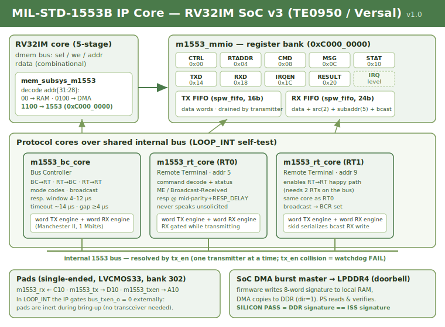

# MIL-STD-1553B IP Core (VHDL-2008)

A synthesizable **MIL-STD-1553B** terminal for a custom RV32IM System-on-Chip,
targeting the Trenz **TE0950** board (AMD Versal `xcve2302-sfva784-1LP-e-S`).
The core bundles a **Bus Controller (BC)** and two **Remote Terminals (RT0, RT1)**
over a shared internal bus, exposes a memory-mapped register interface to the
RV32 core at `0xC000_0000`, and self-tests entirely on-chip in an internal
loopback mode (`LOOP_INT`).

This is the seventh IP in the family (USART, SPI, IIC, I3C, CAN, SpaceWire,
**1553**), developed end-to-end through the same five-layer verification flow
and silicon bring-up methodology.

**Status:** verified through all five simulation layers with bit-identical
signatures, implemented on the TE0950 with **WNS +3.110 ns**, and confirmed on
silicon: **`M1553 SILICON PASS`**.



---

## 1. What this core is for

MIL-STD-1553B is a dual-redundant, transformer-coupled, 1 Mbit/s command/response
serial data bus standardized for military avionics and widely reused in space
systems (launchers, satellites, ADCS units). One **Bus Controller** orchestrates
all traffic; **Remote Terminals** only speak when addressed. Data is carried in
20-bit-time words using Manchester II bi-phase encoding with a distinctive
3-bit-time sync pulse and odd parity.

This IP provides a compact, register-driven implementation suitable for:

- **On-board data handling** where an RV32 soft-core needs to act as BC or RT on
  a 1553 bus without a dedicated ASIC (e.g. HI-6130/6131 class parts).
- **Bench and HIL testing** of 1553 equipment, using the BC to script message
  sequences and the RTs to emulate responders.
- **Educational / research** use: a fully open, readable VHDL implementation of
  the physical, word, message, and system layers of 1553, wired to a real SoC.
- **ADCS / thesis work**: as a communication front-end for a matrix/GEMV
  accelerator SoC, or as a reusable bus block in a larger avionics-style design.

The v1 core runs at the standard **1 Mbit/s** on a **single logical bus** and
implements the message formats needed for a functional terminal (see §4).

---

## 2. How to use it

### 2.1 As an SoC peripheral (register-driven)

The RV32 core talks to the IP through nine word-aligned registers at base
`0xC000_0000` (§5). A typical BC transaction:

1. Configure `RTADDR` (RT0/RT1 addresses) and `CTRL = EN | LOOP_INT`.
2. Pre-load data words into `TXD` (they land in the shared TX FIFO).
3. Write the message descriptor into `MSG` (rt/tr/sa/wc and, for RT→RT, the
   second terminal's rt/sa).
4. Pulse `GO` via `CMD`.
5. Poll `STAT.DONE` (bit 16), then read `RESULT` for the captured status
   word(s), and drain received data words from `RXD` (pop-on-read).
6. Write any value to `STAT` to clear the sticky bits before the next message.

The reference firmware `fw_m1553.s` (assembled with the project's `asm.py`)
walks all five formats plus a timeout case and then DMA-doorbells an 8-word
signature to DDR — this is exactly what the silicon bring-up verifies.

### 2.2 Interrupt vs polling

`IRQEN` is a bitmask over `STAT`; `irq = OR(STAT AND IRQEN)` (level, no ack).
The IP's IRQ is wired to `pl_ps_irq1` so the PS can also take interrupts. The
bring-up path uses polling of a sentinel word for determinism; interrupts are
available if the firmware enables the mask.

### 2.3 On real hardware (roadmap)

For an **external** 1553 bus you need a transceiver + isolation transformer
(e.g. Holt HI-1573 or equivalent). Wire `m1553_tx`/`m1553_txen` to the driver
side and `m1553_rx` to the receiver side. For the v1 **silicon PASS** none of
this is required: `LOOP_INT` keeps all traffic internal and the IP gates
`bus_txen_o` to `0` externally, so the pads are inert.

---

## 3. Physical and word layer

| Property | Value |
|---|---|
| Bit rate | 1 Mbit/s (fixed) |
| Encoding | Manchester II bi-phase (`1` = high→low, `0` = low→high) |
| Clock | 100 MHz → 100 cycles/bit, 50 cycles/half-bit (`CYCLES_PER_HALFBIT = 50`) |
| Word length | 20 bit-times = 3 sync + 16 data (MSB first) + 1 parity |
| Sync | 3 bit-times, invalid-Manchester: command/status = 1.5 high + 1.5 low, data = inverse |
| Parity | Odd, over the 16 data bits |
| Input path | 2-flop synchronizer on `rx_data` |

The **TX engine** (`m1553_word_tx`) emits sync + 16 bits + parity, and chains
words gaplessly via a 1-deep `pend` register (a `start` pulse during the current
word queues the next one so BC command+data and RT status+data go out
contiguously). A `loaded` pulse tells the message cores when each word is taken.

The **RX engine** (`m1553_word_rx`) is a run-length sync hunter: within
Manchester data no level run exceeds 100 cycles, but a sync half lasts 150, so a
run of `RUN_MIN..RUN_MAX` (125..375) ending in an edge marks the sync centre and
its pre-edge level gives the word type. It then verifies the second sync half,
samples 17 cells at quarter-points (`s0`/`s1` must differ or it flags a
Manchester error), and checks odd parity. Isolated data words are rejected
structurally (their sync fuses with idle), exactly as the standard requires.

---

## 4. Message layer (v1 scope)

Implemented formats (all exercised in Layer 1c and Layer 4/5):

- **BC → RT** — controller sends N data words, terminal responds with status.
- **RT → BC** — terminal responds with status + N data words (contiguous).
- **RT → RT** — command-receive + command-transmit issued back-to-back; the
  transmitting RT sends status + data, the receiving RT captures it and
  responds. *This is why the IP instantiates two RTs: RT→RT needs two terminals
  on the bus for a happy path.*
- **Mode codes** — Transmit Status Word (`00010`), Synchronize without data
  (`00001`), Synchronize with data (`10001`). Unsupported mode codes raise
  Message Error.
- **Broadcast** (RT31) — both RTs receive, none responds, Broadcast-Received
  (BCR) bit is set in each.

Timing: RT response at mid-parity → mid-sync = `RESP_DELAY + 175` cycles
(`RESP_DELAY = 425` → ~6 µs, inside the 4–12 µs window); BC status timeout
~14 µs; inter-message gap ≥ 4 µs. The testbenches verify the **window**, not a
magic value.

Error handling: parity, invalid sync, Manchester error, wrong word count and
out-of-window response are all detected. An RT ignores an invalid message and
sets Message Error; the BC times out. ME and BCR follow the standard's
lifecycle: Transmit Status Word preserves them, a fresh valid command clears
them.

**Out of v1 scope (roadmap, §11):** dedicated Bus Monitor, message tables with
their own DMA, dual A/B bus.

---

## 5. Register map (base `0xC000_0000`, decode `addr[31:28] = "1100"`)

Offsets are word offsets, decoded from `addr(7:2)`.

| Off | Name | Acc | Fields |
|-----|------|-----|--------|
| 0x00 | `CTRL`   | RW  | b0 `EN` (sync reset of cores/FIFOs while 0), b1 `LOOP_INT` |
| 0x04 | `RTADDR` | RW  | b4:0 RT0 addr, b12:8 RT1 addr |
| 0x08 | `CMD`    | W1P | b0 `TX_FLUSH`, b1 `RX_FLUSH`, b2 `GO` |
| 0x0C | `MSG`    | RW  | b0 `RTRT`, b1 `F_TR`, b6:2 `F_RT`, b11:7 `F_SA`, b16:12 `F_WC`, b21:17 `F2_RT`, b26:22 `F2_SA` |
| 0x10 | `STAT`   | R   | live + sticky (below); **W clears stickies, same-cycle sets win** |
| 0x14 | `TXD`    | W   | b15:0 data word → TX FIFO; **R** b6:0 level, b8 full |
| 0x18 | `RXD`    | R   | pop-on-read: b15:0 data, b17:16 source (00 BC, 01 RT0, 10 RT1), b22:18 subaddr, b23 bcast, b31 `VALID` |
| 0x1C | `IRQEN`  | RW  | bitmask over `STAT` |
| 0x20 | `RESULT` | R   | b15:0 `stat1`, b31:16 `stat2` |

**`STAT` layout.** Live: b0 `BC_BUSY`, b4 `TXF_EMPTY`, b5 `TXF_FULL`,
b6 `RXF_EMPTY`, b7 `RXF_FULL`, b14:8 `rxf_level`. Sticky (set-wins on the same
cycle as a clearing write): b16 `DONE`, b17 `OK`, b18 `TOUT`, b19 `SERR`,
b20 `MSG_ME`, b21 `RT0_CMD`, b22 `RT1_CMD`, b23 `RT0_ERR`, b24 `RT1_ERR`,
b25 `RXF_OVF`, b26 `RT0_BCR`, b27 `RT1_BCR`.

**dmem contract.** `rdata` is **combinational** in the same cycle as `sel`; the
core captures it on the request clock edge. A registered `rdata` passes Layer 2
polling but fails Layer 4 (`RXD` pop-on-read double-pops or lags). The interface
family pattern is `sel`/`we`/`rdata` with `rst` synchronous active-high.

---

## 6. Block-level architecture

The IP wraps one BC and two RTs on an internal bus resolved by `tx_en` (only one
transmitter drives the bus at a time; two simultaneous `tx_en` = watchdog
failure). A shared 16-bit TX data FIFO feeds whichever core is transmitting; a
24-bit RX FIFO tags each captured word with source / subaddress / broadcast.

```
RV32 dmem ──▶ mem_subsys_m1553 ──(0xC000_0000)──▶ m1553_mmio
                                                    ├── TX FIFO (spw_fifo, W=16)
                                                    ├── RX FIFO (spw_fifo, W=24)
                                                    ├── m1553_bc_core  ─┐
                                                    ├── m1553_rt_core 0 ─┤ internal
                                                    └── m1553_rt_core 1 ─┘ 1553 bus
                                                            (each: word TX + word RX)
```

The three cores share the internal bus signal via a `tx_en`-priority mux inside
`m1553_mmio`. In `LOOP_INT`, `bus_txen_o` to the pads is forced to 0. Each core
gates its own RX input while it is transmitting, so it never hears itself.

---

## 7. File inventory

RTL (`rtl/`):

| File | Role |
|---|---|
| `m1553_word_tx.vhd` | Manchester word transmit engine (sync + 16b + parity, gapless chaining, `loaded` pulse) |
| `m1553_word_rx.vhd` | Manchester word receive engine (run-length sync hunter, quarter-point sampling, error flags) |
| `m1553_rt_core.vhd` | Remote Terminal: command decode, response timing, ME/BCR lifecycle |
| `m1553_bc_core.vhd` | Bus Controller: all message formats, response window, gap enforcement |
| `m1553_mmio.vhd` | Register bank, TX/RX FIFOs, level IRQ, LOOP_INT, dmem contract, broadcast RX skid |
| `mem_subsys_m1553.vhd` | Memory subsystem clone with the `0xC000_0000` region decode |
| `soc_top_m1553.vhd` | SoC top: RV32 core + mem_subsys + IP + AXI-Lite + DMA |
| `soc_top_m1553_wrap.v` | Verilog wrapper for the block-design module reference |

Shared source: `spw_fifo.vhd` (canonical parameterizable FWFT FIFO, reused at
W=16 and W=24 — referenced from its origin, never duplicated).

Testbenches (`tb/`) and reference model (`sim/`):

| File | Layer |
|---|---|
| `tb_m1553_1a.vhd` | 1a — TX engine vs independent event-driven receiver model |
| `tb_m1553_1b.vhd` | 1b — RX engine vs procedural bit-bang transmitter with corruptions |
| `tb_m1553_1c.vhd` | 1c — BC + 2 RTs RTL-vs-RTL, phase 0, cable watchdog |
| `tb_m1553_l2.vhd` | 2 — MMIO register bank vs dmem bus BFM |
| `tb_m1553_l4.vhd` + `soc_stubs_l4.vhd` | 4 — full SoC vs ISS signature |
| `iss_m1553.py` | ISS functional oracle (Layer 4 reference) |

Silicon (`.` / `docs/`):

| File | Role |
|---|---|
| `bd_m1553_steps.tcl` | Block-design transplant, step by step |
| `run_synth_m1553.tcl`, `run_impl_m1553.tcl` | Synthesis / implementation |
| `m1553_pins.xdc` | Pin constraints (bank 302 HDIO) |
| `fw_m1553.s`, `fw_m1553.mem` | Bring-up firmware (RV32) |
| `m1553_bringup.c` | PS-side silicon verifier (aarch64) |
| `BRINGUP_1553.md` | PetaLinux + SD + board runbook |
| `docs/architecture.svg` | This diagram |

---

## 8. Verification — the five-layer flow

Each layer is a self-checking GHDL testbench (`--std=08`). The pass criterion is
a **bit-identical simulation end-timestamp** (signature); any divergence is a
bug. Every layer also ships mutation tests that must *fail* — a testbench that
never fails has no teeth.

| Layer | What it checks | Signature |
|---|---|---|
| **1a** | TX engine vs independent receiver model (absolute-time sampling), + cable watchdog. 5 RTL mutations. | `400485ns` |
| **1b** | RX engine vs bit-bang transmitter with parity/sync/Manchester/truncation/rate corruptions. 5 RX mutations. | `462205ns` |
| **1c** | BC + RT0 + RT1 RTL-vs-RTL: phase-0 anti-common-mode, independent cable watchdog, all five formats, ME/BCR lifecycle, timeout. 5 core mutations. | `1679825ns` |
| **2**  | MMIO vs dmem BFM: combinational `rdata`, pop-on-read, sticky set-wins, level IRQ. 6 MMIO mutations. | `615665ns` |
| **4**  | Full SoC (real `mem_subsys` + `m1553_mmio`) driven by a behavioral master running the exact firmware program, DMA-doorbelling an 8-word signature checked against the Python ISS. 2 mutations. | `552845ns` |
| **firmware** | Assembled `fw_m1553.mem` run through a small RV32IM interpreter against the MMIO model — signature must equal the ISS. | matches ISS |

Reproduce any layer:

```bash
cd ~/m1553_ip
./run_1a.sh                                   # expect 400485ns
./run_1b.sh                                   # expect 462205ns
./run_1c.sh                                   # expect 1679825ns
FIFO=~/spw_ip/spw_fifo.vhd ./run_l2.sh        # expect 615665ns
RISCV_PKG=~/rv32i/riscv_pkg.vhd \
  FIFO=~/spw_ip/spw_fifo.vhd ./run_l4.sh      # RTL vs ISS, 552845ns
```

### Why two RTs, and the Layer 1c common-mode blind spot

Layer 1c is RTL-vs-RTL, which has a blind spot: if both instances share a
protocol defect they interoperate silently. Mitigations baked into the bench:

- **Phase 0** — with the partner powered off, an RT alone must never transmit;
  the BC alone must time out cleanly.
- An **independent cable watchdog** decodes every word off the bus by absolute
  sampling (valid sync, Manchester, odd parity), enforces the 500 ns grid,
  word-multiple burst lengths, ≥ 2 µs bus gaps, and flags any `tx_en` collision.

RT→RT needs a happy path, which needs a *second* RT — hence BC + RT0 + RT1 in
the IP itself, not just in the bench.

---

## 9. Silicon bring-up

### 9.1 Vivado (block-design transplant)

The project is cloned from the SpaceWire Vivado project (which inherits the
audited `bd_soc_usart` block design: CIPS, NoC `NUM_SI=7`, smartconnect, reset).
The SPW module reference `u_soc_spw` is replaced by `u_soc_m1553`. Run the steps
**one at a time** in the Vivado Tcl console, reading each response (a pasted
block once hid a silent `connect_bd_net` failure).

Real connections confirmed during this session:

| `u_soc_m1553` port | connects to |
|---|---|
| `aclk` | `versal_cips_0/pl0_ref_clk` |
| `aresetn` | `rst_versal_cips_0_240M/peripheral_aresetn` |
| `s_axi` | `axi_smc/M00_AXI` |
| `m_axi` | `axi_noc_0/S06_AXI` (dedicated SI, own `aclk6`) |
| `irq_out` | `versal_cips_0/pl_ps_irq0` |
| `m1553_irq_out` | `versal_cips_0/pl_ps_irq1` |
| `m1553_rx/tx/txen` | external ports (see XDC) |

Address map (explicit, never automatic):

- `u_soc_m1553/m_axi` → `axi_noc_0/S06_AXI/C0_DDR_LOW0` at `0x0` (master sees DDR).
- `versal_cips_0/M_AXI_LPD` → `u_soc_m1553/s_axi/reg0` at **`0x8000_0000`**, 64K
  (PS sees the core control window — this is what `m1553_bringup.c` maps).

Then synthesize and implement:

```tcl
# in the Vivado Tcl console, after saving the BD:
source run_synth_m1553.tcl      # synth_1 → Complete!
source run_impl_m1553.tcl        # impl_1 → write_device_image, reports WNS, writes XSA
```

**Result: 0 errors, 0 critical warnings, WNS = +3.110 ns.**

### 9.2 Pins (TE0950, bank 302 HDIO, LVCMOS33)

| Signal | Pin |
|---|---|
| `m1553_rx` | C10 (in) |
| `m1553_tx` | D10 (out) |
| `m1553_txen` | A10 (out) |

C10/D10 are inherited from the CAN header; A10 was chosen from the free pins of
bank 302 (`get_package_pins -filter {BANK == 302}`). In `LOOP_INT` these pads
are inert.

### 9.3 Linux, SD and silicon validation

The full procedure lives in `BRINGUP_1553.md`. Summary of the exact commands run
this session (workstation prompt `adrian@adrian`, target `root@...`):

```bash
# --- PetaLinux (clone the SPW project, re-point to the new XSA) ---
cp -r ~/plnx_te0950_spw ~/plnx_te0950_m1553
cd ~/plnx_te0950_m1553
rm -rf build/tmp build/cache                  # clone carries absolute paths
source ~/Petalinux/settings.sh
petalinux-config --get-hw-description=/home/adrian/m1553_ip/m1553_soc.xsa --silentconfig
petalinux-build
petalinux-package --boot --plm --psmfw --u-boot --dtb --force   # → BOOT.BIN

# --- reserved-memory: reuse the SPW's 0x7000_0000 region ---
# system-user.dtsi already reserves buffer@70000000 (16 MB), so the verifier
# targets 0x7000_0000 (DDR_BUF in m1553_bringup.c) — no device-tree edit needed.

# --- cross-compile the PS verifier ---
aarch64-linux-gnu-gcc -O2 -static -Wall -o ~/m1553_ip/m1553_bringup ~/m1553_ip/m1553_bringup.c

# --- clean SD (device /dev/sda1 on this workstation; verify with lsblk!) ---
sudo umount /dev/sda1
sudo mkfs.vfat -F 32 -n BOOT /dev/sda1
sudo fsck.vfat -v /dev/sda1                    # verify FAT integrity
sudo mount /dev/sda1 /mnt
sudo cp ~/plnx_te0950_m1553/images/linux/{BOOT.BIN,image.ub,boot.scr} /mnt/
sudo cp ~/m1553_ip/m1553_bringup ~/m1553_ip/fw_m1553.mem /mnt/
sudo sync && sudo umount /mnt

# --- on the board (SD boot, picocom 115200 8N1) ---
cd /run/media/BOOT-mmcblk1p1
chmod +x m1553_bringup
./m1553_bringup fw_m1553.mem
```

Observed output on silicon:

```
[bringup] firmware: 176 instrucciones
[bringup] IMEM cargada y verificada
[bringup] DBG_PC final = 0x000002A0
[bringup] firma en DDR vs ISS:
   sig[0] = 0x00002800  esperado 0x00002800  OK
   sig[1] = 0x0000C406  esperado 0x0000C406  OK
   sig[2] = 0x00002800  esperado 0x00002800  OK
   sig[3] = 0x0000E203  esperado 0x0000E203  OK
   sig[4] = 0x28004800  esperado 0x28004800  OK
   sig[5] = 0x0000F300  esperado 0x0000F300  OK
   sig[6] = 0x00000003  esperado 0x00000003  OK
   sig[7] = 0x0000DEAD  esperado 0x0000DEAD  OK
M1553 SILICON PASS
```

The silicon signature equals the ISS, Layer-4 RTL and RV32IM-interpreter
signatures — zero divergence from the Manchester word engine up to the board.

---

## 10. Problems we hit (and how they were resolved)

Design / verification:

- **Status timeouts counted clock time, not bus silence.** The BC expired at
  ~13.5 µs while a 20 µs status word was still on the wire. Caught by Layer 1c,
  fixed by freezing the timeout counter while `wrx_busy` is high (BC in
  WST1/WST2, RT in the RT→RT status wait). This is exactly the kind of defect
  1a/1b cannot see and justifies 1c.
- **Broadcast RX write collision.** In broadcast, RT0 and RT1 decode the same
  word in the same cycle and both assert `rx_we`, but the RX FIFO accepts one
  write per cycle — one copy was lost. Caught by Layer 2, fixed with a 1-deep
  skid that serializes RT1's copy to the next cycle.
- **dmem read contract.** A registered `rdata` passes Layer-2 polling but the
  behavioral master's two-cycle `req` double-popped `RXD` in Layer 4. The real
  RV32 asserts `req` for one cycle; the fix (single-cycle pulse) confirms the
  combinational pop-on-read is correct and that any core holding `req` would
  break.
- **RESULT layout convention.** `RESULT` packs `stat2 << 16 | stat1`; the ISS
  had it reversed. Fixed in the ISS (the RTL was right).

Vivado (new lessons this IP):

- **Module-reference residue when cloning.** Deleting the SPW cell leaves
  `bd_soc_usart_u_soc_spw_0.xci` in `sources_1`. `remove_files` refuses it
  (*"must be removed via the sub-design parent"*). It is cleaned by
  `generate_target all [get_files bd_soc_usart.bd]` after the cell is deleted.
- **Remote references live in `sim_1`/`utils_1`.** The parent project's
  `nocattrs.dat` and `bd_soc_usart_wrapper.dcp` need explicit
  `remove_files -fileset sim_1 …` / `-fileset utils_1 …`.
- **Invented pin.** `E10` does not exist on the `sfva784` package — a
  `CRITICAL WARNING` at implementation. Always validate `PACKAGE_PIN` against
  `get_package_pins -filter {BANK == N}` before synthesis.
- **Tcl one command at a time, no `puts`/`;`.** Compound commands pasted into the
  console get truncated or concatenated (we lost a leading `c` and several
  verification outputs). Simple single-line commands are bullet-proof.

PetaLinux / SD:

- **Reuse the inherited reserved-memory.** The SPW device tree already reserves
  `0x7000_0000`; targeting that in the verifier avoided editing the device tree.
- Clone with `rm -rf build/tmp build/cache` (absolute paths); reformat and
  `fsck.vfat` the SD to avoid u-boot's silent fallback and FAT corruption.
- Never hot-load the implementation PDI over a configured PL (PLM rejects it,
  `0x03024001`); always repackage `BOOT.BIN` via PetaLinux.

---

## 11. Future work / roadmap

- **External bus (v1.1).** Add a HI-1573-class transceiver + isolation
  transformer; split the pads into driver (`m1553_tx`, `m1553_txen`) and receiver
  (`m1553_rx`) against a real coupled bus; validate at the standard's electrical
  levels.
- **Dual A/B bus.** Add the second (redundant) bus channel and channel-selection
  logic; extend the cable watchdog to both.
- **Bus Monitor.** A dedicated passive monitor terminal capturing all traffic to
  a ring buffer, independent of the BC/RT paths.
- **Message tables + DMA.** BC message scheduling from a descriptor table in
  memory with its own DMA, for autonomous frame execution without per-message
  firmware polling.
- **More mode codes.** Extend beyond the v1 trio (Transmit Status, Synchronize
  ±data) to the full mandatory set.
- **RT sub-address memory map.** Per-subaddress buffers so the RT can serve
  distinct data pools without firmware intervention.

---

## 12. Tooling

- **Simulation:** GHDL 4.1.0 (`--std=08`).
- **Synthesis / implementation:** Vivado 2025.2.1.
- **Embedded Linux:** PetaLinux 2025.2.1.
- **Assembler:** the project's Python `asm.py` (RV32IM subset).
- **Cross-compilation:** `aarch64-linux-gnu-gcc -O2 -static`.
- **Serial console:** picocom, 115200 8N1.

---

## 13. License

MIT. Published to GitLab (`gitlab.com/AdrianHerCoss/vhdl.git`) and GitHub
(`github.com/AdrianGreenboy/VHDL.git`); `git push origin` updates both.
