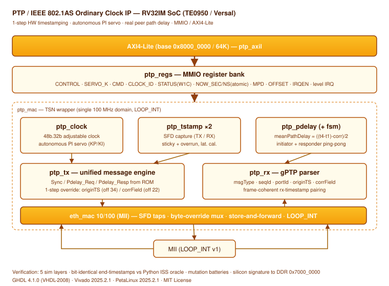

# HERCOSSNUX Core 18 — MIPI CSI-2 RX

A silicon-validated, tutorial-quality **MIPI CSI-2 RX** receiver written in
VHDL-2008, integrated into a custom RV32IMA soft-core SoC and validated on the
Trenz **TE0950** (AMD Versal `xcve2302-sfva784-1LP-e-S`).

The core receives a 4-lane RAW12 CSI-2 stream, corrects/detects packet-header
errors (Hamming ECC), validates long-packet payloads (CRC-16), demultiplexes two
virtual channels into two framebuffers, and de-packs RAW12 into memory. A PL-side
synthetic frame generator drives the whole pipeline so the design self-tests with
**zero external hardware**.

**Status: silicon-validated.** Every verification layer — Python oracle, five GHDL
simulation layers, a full SoC integration run with the real RV32 core, and the
final on-chip run — converges on the same bit-identical FNV-1a signature
`0xE6898DC5`.



---

## 1. Feature set (frozen scope)

- CSI-2 packet layer: Packet Header + **ECC Hamming** (corrects 1-bit, detects 2-bit).
- Short Packets (Frame Start/End, Line Start/End) and Long Packets (payload + **CRC-16**).
- **Virtual Channels**: real demux of VC0 and VC1 into two independent framebuffers.
- **RAW12** de-packing (two 12-bit pixels ↔ three bytes).
- 4 data lanes + 1 clock lane, **D-PHY modeled at byte-clock level** (PHY-less, like
  the Ethernet `LOOP_INT` and PCIe `PIPE` approaches — the TE0950 has no hard D-PHY).
- On-chip **self-test**: a synthetic frame generator in the PL produces VC0 (gradient)
  and VC1 (vertical bars) at 128×96 RAW12, so the pipeline is exercised end-to-end
  with no camera attached.

---

## 2. Repository layout

```
MIPI/
├── rtl/                     synthesizable RTL (VHDL-2008) + Verilog BD wrapper
│   ├── csi2_pkg.vhd         shared types/constants
│   ├── csi2_ecc.vhd         packet-header Hamming ECC (correct 1 / detect 2)
│   ├── csi2_crc16.vhd       CSI-2 CRC-16 (reflected poly 0x8408, init 0xFFFF)
│   ├── csi2_packet_rx.vhd   PH parse, SP/LP handling, VC routing
│   ├── raw12_unpack.vhd     RAW12 byte-stream → 12-bit pixels
│   ├── framebuffer.vhd      SDP BRAM framebuffer (block RAM)
│   ├── csi2_dual_rx.vhd     dual-VC demux → 2 framebuffers + FNV
│   ├── frame_gen.vhd        synthetic VC0 gradient / VC1 bars generator
│   ├── dphy_model.vhd       byte-clock-level D-PHY model
│   ├── byte_fifo.vhd        elastic FIFO with back-pressure
│   ├── csi2_selftest.vhd    self-test hardware FSM
│   ├── csi2_mmio.vhd        MMIO register file + FBDATA streaming read
│   ├── mipi_dma_burst.vhd   MIPI AXI master (framebuffers → DDR)
│   ├── mipi_soc_top.vhd     MIPI subsystem top
│   ├── soc_top_mipi.vhd     full SoC: RV32 core + MIPI + axil_soc
│   └── soc_top_mipi_wrap.v  Verilog wrapper (BD module reference top)
├── fw/                      firmware
│   ├── fw_rv32.c            RV32 firmware (self-test orchestration, FNV, doorbell)
│   ├── fw_ps.c              PS-side verifier (loads IMEM, waits IRQ, checks DDR)
│   ├── build_fw_rv32.sh     RV32 build (GCC → .bin + .mem)
│   └── bin2mem.py           flat .bin → GHDL .mem converter
├── verif/                   verification
│   ├── csi2_oracle.py       golden model (single source of truth)
│   ├── selfcheck.py         oracle self-checks + mutation checks
│   ├── gen_vectors.py       regenerate all test vectors from the oracle
│   ├── run_all_sims.sh      run all 5 layers in GHDL
│   ├── csi2_frame_rx.vhd    single-VC study entity (L3 only)
│   ├── tb_l1..tb_l5*.vhd    layer testbenches
│   └── tb_soc_mipi.vhd      SoC integration TB (real RV32 runs the firmware)
├── scripts/                 Vivado / PetaLinux flow
│   ├── create_project.tcl   create the Vivado project, load RTL
│   ├── build_bd_mipi.tcl    Block Design (adapted from the PQC silicon BD)
│   ├── synth_impl.tcl       synthesis, implementation, PDI, XSA export
│   └── build_petalinux.sh   PetaLinux reference flow
├── doc/
│   └── arch.svg             architecture diagram
├── BD_GUIDE.md              step-by-step Block Design guide
└── RUNBOOK.md               end-to-end silicon bring-up runbook
```

---

## 3. Verification methodology

The core follows the HERCOSSNUX five-layer methodology. Each layer's **sole PASS
criterion is a bit-identical FNV/hash signature** against the Python oracle; there
is no "looks right" — either the signature matches or the layer fails.

| Layer | What it proves | Signature |
|-------|----------------|-----------|
| L1 | RAW12 unpack | `0xEC935F45` |
| L2a | ECC Hamming decoder (35/35 vectors) | ECC ALL PASS |
| L2b | packet layer + ECC + CRC | `0xADBF2613` |
| L3 | single-VC frame + framebuffer | `0x0C4F29C5` (FB) / `0xD6488FC5` (px) |
| L4 | dual-VC demux (full frame) | `0xE6898DC5` |
| L5a | frame_gen byte-identical to oracle | 38032 bytes match |
| L5b | self-test loopback (full chain) | `0xE6898DC5` |
| **SoC** | **real RV32 executes firmware vs MIPI** | **`0xE6898DC5`** |
| **Silicon** | **on-chip run on TE0950** | **`0xE6898DC5`** |

Reference vector: the CSI-2 spec CRC-16 example returns `0x00F0`.

**Mutation testing.** Each layer ships 4–5 deliberate mutants that must *all* fail:
nibble-swap, pixel-order, P0/P1-truncate, ECC-no-correct, ECC-2bit-no-detect,
CRC-stub, CRC-init, CRC-byte-order, VC-misclassify, commit-noop, fb-we, fb-wdata,
demux-vc-cross, and more. All mutants are killed.

### Running the simulations

```bash
cd verif
bash run_all_sims.sh        # regenerates vectors from the oracle, runs L1–L5
```

Every reported line must say PASS. Requires GHDL 4.1.0 (`--std=08`, mcode).

### SoC integration run

`tb_soc_mipi.vhd` instantiates the **real RV32 core** with the MIPI subsystem and
two `axi_ddr_sim` models (one per AXI master), loads the compiled firmware into
IMEM through the AXI-Lite window, releases the core, waits for the doorbell IRQ,
and reads the signature back from DDR. This closes the firmware↔hardware loop
before spending any time in synthesis.

---

## 4. Architecture

The MIPI subsystem hangs off the RV32 **dmem** bus (decoded at `0xD0000000`). The
RV32 core drives the self-test and reads framebuffers over MMIO; two independent
AXI masters move data to DDR:

- **Core DMA** (`mem_subsys_dma`, `0x40000000`) writes the FNV signature to DDR.
- **MIPI DMA** (`mipi_dma_burst`) writes the two framebuffers to DDR.

The PS controls the core through `axil_soc` at `0xA4000000` (CONTROL/STATUS/IRQ,
DDR_BASE, IMEM window). The doorbell is a write to the local-RAM `DONE_WORD`, which
raises `irq_out` to the PS.

### Self-test dataflow

```
frame_gen (VC0 gradient + VC1 bars)
   → dphy_model (byte-clock D-PHY)
   → byte_fifo (elastic, back-pressure)
   → csi2_packet_rx (PH parse + ECC + CRC, VC routing)
   → raw12_unpack (2 px → 3 bytes)
   → csi2_dual_rx (VC demux → framebuf 0 / framebuf 1, FNV fold)
   → csi2_mmio (FBDATA streaming) → RV32 firmware computes FNV
   → mipi_dma_burst (framebuffers → DDR)   ┐
   → core DMA (signature → DDR)            ┘→ PS reads & verifies
```

---

## 5. Register map (MMIO, base `0xD0000000`)

| Offset | Name | Dir | Description |
|--------|------|-----|-------------|
| 0x00 | CTRL | W | bit0 start_selftest, bit1 start_dma |
| 0x04 | STATUS | R | bit0 selftest_done, bit1 dma_done, bit2 hdr_2bit |
| 0x08 | FB0_COUNT | R | FB0 byte count |
| 0x0C | FB1_COUNT | R | FB1 byte count |
| 0x10 | DMA_SRC | W | bit0 selects FB |
| 0x14 | DMA_DST | W | DDR destination offset |
| 0x18 | DMA_LEN | W | bytes |
| 0x1C | FBSEL | W | bit0 selects FB, resets stream pointer |
| 0x20 | FBDATA | R | current stream byte, auto-increments |

### axil_soc (PS side, base `0xA4000000`)

| Offset | Name | Description |
|--------|------|-------------|
| 0x0000 | CONTROL | bit0 = halt (core held in reset) |
| 0x0004 | STATUS | bit0 = core running |
| 0x0008 | DBG_PC | debug PC |
| 0x000C | IRQ | sticky doorbell; write 1 to clear |
| 0x0010 | DDR_BASE_LO | physical DDR base low |
| 0x0014 | DDR_BASE_HI | physical DDR base high |
| 0x1000 | IMEM window | one word per address |
| 0x2000 | DMEM window | local-RAM read-back (unused in this SoC rev) |

---

## 6. DDR layout

Result first (small offset that fits the simulation DDR model), framebuffers
after. In silicon both masters share the same DDR, so the offsets are disjoint by
construction.

| Region | Offset | Size |
|--------|--------|------|
| signature + status | `0x00000040` | 8 bytes |
| FB0 image | `0x00001000` | 18432 bytes |
| FB1 image | `0x00009000` | 18432 bytes |

The physical DDR base (`0x70000000`, 16 MB, `no-map`) is programmed by the PS into
`axil_soc` DDR_BASE; the NoC exposes DDR from `0x0`, and `0x70000000` falls within
the master's DDR aperture.

---

## 7. Building the RV32 firmware

```bash
export PATH=$PATH:$HOME/Xilinx/2025.2.1/Vitis/gnu/riscv/lin/bin
cd fw
bash build_fw_rv32.sh
```

Produces `fw_rv32.bin` (≤ 1 KB, 256-word IMEM) for silicon and `fw_rv32.mem`
(padded to 256 words) for GHDL simulation. Uses the Xilinx GCC RV32
(`riscv64-unknown-elf-gcc`, rv32im/ilp32), a Harvard linker script (code → IMEM,
stack + result slots → local RAM), and a `/DISCARD/` of ELF notes so the flat
binary starts at `_start`.

---

## 8. Vivado flow

```bash
cd MIPI
vivado -mode batch -source scripts/create_project.tcl        # project + RTL
# then build the Block Design (see BD_GUIDE.md), and:
vivado -mode batch -source scripts/synth_impl.tcl            # synth + impl + XSA
```

The Block Design is adapted from the silicon-validated **PQC (Core 17)** BD via
`write_bd_tcl`: same CIPS (TE0950 board part `trenz.biz:te0950_23_1lse:part0:1.2`),
NoC, SmartConnect and Processor System Reset, with the core swapped to
`soc_top_mipi_wrap` and a **second NoC slave interface (S07)** added for the MIPI
DMA master. The AXI-Lite slave is placed at `0xA4000000`; both PL masters see DDR
via dedicated NoC NSU. Framebuffers map to Versal `RAMB18E5_INT`/`RAMB36E5_INT`.

Timing closes with large margin at 100 MHz PL clock: **WNS = +16.76 ns**.

---

## 9. PetaLinux + BOOT.BIN

The PetaLinux project is cloned from the PQC project (which already boots on the
TE0950); only `project-spec/` and `.petalinux` are copied (never the ~22 GB
`build/`). The XSA is imported with `petalinux-config --get-hw-description`. The
device tree reserves the 16 MB DDR buffer at `0x70000000` (`no-map`), and the
`mipi-selftest` app (compiles `fw_ps.c`, packages `fw_rv32.bin`) is enabled in the
rootfs.

The BOOT.BIN is **repackaged** (never hot-loaded — the Versal PLM rejects a
hot-loaded full-implementation PDI with `0x03024001`). It contains PLM, PSM
firmware, ARM Trusted Firmware, the PL configuration image (our MIPI design), and
u-boot.

---

## 10. Silicon bring-up

1. Copy `BOOT.BIN` + `image.ub` to the SD boot (FAT) partition.
2. Insert SD in the TE0950, set boot mode to SD, connect serial
   (`picocom -b 115200 /dev/ttyUSB0`, 8N1), power on.
3. Log in as root and run:

```
mipi-selftest /usr/bin/fw_rv32.bin
```

Expected output:

```
loaded 110 firmware words
doorbell  : fired (29800 spins)
signature : 0xE6898DC5 (golden 0xE6898DC5)
hdr_2bit  : 0
L5 SILICON PASS
```

---

## 11. PS/firmware notes

- The AXI-Lite aperture and the DDR buffer are device memory: access word-by-word
  with `volatile` (never `memcpy`/`memset` — glibc's aarch64 optimized routines use
  `DC ZVA` / 128-bit `stp` and fault with SIGBUS on `no-map` DDR via `/dev/mem`).
- Result path: the RV32 stages the signature in local RAM and uses the **core DMA**
  (local→DDR) to publish it to DDR, since the DMEM read-back window is not wired in
  this SoC revision. The PS then reads the signature from DDR after the doorbell.
- Ordering is critical: signature and framebuffers are written to DDR **before**
  `DONE_WORD` (the doorbell), so the PS never observes a stale result.

---

## 12. Problems we hit (and how we fixed them)

- **ECC syndrome bit-order.** The header column P0 must be the LSB, not the MSB.
  Concatenating the mask bits in the natural order produced a bit-reversed
  syndrome that passed clean vectors but failed high-bit corrections.
- **CRC-16 is reflected.** CSI-2 uses reflected poly `0x8408`, init `0xFFFF` — not
  KERMIT. We validated against the CSI-2 spec example (`0x00F0`), not a generic
  vector.
- **Coverage vs equivalence.** An all-clean test stream never exercises the
  error-detection path, so the "ECC-2bit-no-detect" mutant survived until we
  injected a genuine 2-bit header error (which also desyncs the stream — the WC
  goes to garbage — a useful reminder of why detection matters).
- **Elastic buffering.** A continuous byte stream against a parser with dead
  decode/check states dropped bytes; an elastic `byte_fifo` with back-pressure
  (frame_gen stalls near almost-full) fixed it.
- **Incomplete sensitivity list.** Missing `fb_sel`/`fb_stream_ptr` froze the
  framebuffer read address at 0 (always read `ram[0]`); `process(all)` fixed it.
- **BRAM read-ahead.** A synchronous BRAM read into a 1-cycle combinational MMIO
  bus produces a 1-cycle read-ahead; the firmware discards one priming read.
- **ELF notes corrupt the flat binary.** `objcopy -O binary` placed
  `.note.gnu.build-id` (the "GNU" string) before `.text`, so the core executed
  garbage at reset. Fixed with a linker `/DISCARD/` of `.note*/.comment*/.eh_frame`
  plus `KEEP(.text._start)` first and `-Wl,--build-id=none`.
- **Harvard memory map.** Code lives in IMEM, stack and result slots in the
  separate local RAM; both are based at 0x0 but in different access spaces, so the
  linker script only places `.text`/`.rodata`.
- **Simulation DDR bounds.** `axi_ddr_sim` indexes `a[HI:2]` with
  `HI = 1 + ceil(log2(DEPTH))`; the MIPI framebuffer model needed a larger DEPTH,
  and the result was moved to a small offset that fits the model.
- **NoC clock/interface mismatch.** Adding the second master raised the NoC
  `NUM_SI` to 8 but left `NUM_CLKS` at 7, so `aclk7` did not exist and the
  `ASSOCIATED_BUSIF` property had no object. Raising `NUM_CLKS` to 8 fixed it.
- **Board part not set.** The cloned project referenced the TE0950 board repo but
  left the board part empty; the CIPS then rejected `ps_pmc_fixed_io`. Setting
  `board_part trenz.biz:te0950_23_1lse:part0:1.2` (and the repo path) resolved it.
- **AXI-Lite offset not assigned.** After the BD rebuild the AXI-Lite segment had
  an empty offset; an explicit `assign_bd_address -offset 0xA4000000` fixed it.
- **App available vs enabled.** Listing the app in `user-rootfsconfig` only makes
  it available in the menu; it must also be enabled (`CONFIG_mipi-selftest=y`) in
  `rootfs_config` to land in the image.
- **PetaLinux 2025.2 CLI change.** `petalinux-package --boot` is deprecated;
  the subcommand is `petalinux-package boot` with `--plm/--psmfw/--tfa/-u/--dtb`.

---

## 13. Platform lessons (Versal / TE0950)

- PL AXI masters go to dedicated NoC slave interfaces of the same MC as the CIPS,
  wired by scripted Tcl — never Connection Automation (which routes PL masters to
  `S_AXI_LPD`, with no DDR).
- On Versal the AXI-Lite slave sits at `0xA4000000` (a valid M_AXI_FPD aperture);
  `0x80000000` is not.
- `pl0_resetn` is asynchronous → synchronize with a Processor System Reset;
  `dcm_locked` tied to an `xlconstant` '1'.
- A VHDL-2008 top needs a Verilog wrapper to be a BD module reference.
- Versal BRAM primitive is `RAMB18E5_INT`/`RAMB36E5_INT` (filter reports by
  `REF_NAME`).
- Build the BD one command at a time, reading each response — Versal BD commands
  fail silently when pasted in bulk.
- Never hot-load a full-implementation PDI over a configured PL (PLM `0x03024001`);
  always repackage BOOT.BIN.

---

## 14. Toolchain

- GHDL 4.1.0 (`--std=08`, mcode backend).
- Vivado / PetaLinux 2025.2.1.
- Xilinx GCC RV32 (`riscv64-unknown-elf-gcc` 13.4.0), `-march=rv32im -mabi=ilp32`.
- `aarch64` PetaLinux SDK toolchain for `fw_ps.c`.
- picocom 115200 8N1 for the serial console.
- Python 3 for the oracle and vector generation.

---

## 15. Reproducing from scratch

See `RUNBOOK.md` for the full end-to-end sequence (simulation → Vivado → PetaLinux
→ silicon) and `BD_GUIDE.md` for the Block Design walkthrough. In short:

```bash
# 1. simulate
cd verif && bash run_all_sims.sh

# 2. build firmware
cd ../fw && bash build_fw_rv32.sh

# 3. Vivado
cd .. && vivado -mode batch -source scripts/create_project.tcl
#    build the BD (BD_GUIDE.md), then synth/impl/XSA

# 4. PetaLinux + BOOT.BIN, copy to SD, boot, run mipi-selftest
```

---

## 16. License

MIT. See the repository root for the full license text.

---

*HERCOSSNUX — a family of tutorial-quality, silicon-validated VHDL-2008 IP cores
for a custom RV32IMA soft core on the AMD Versal TE0950.*
