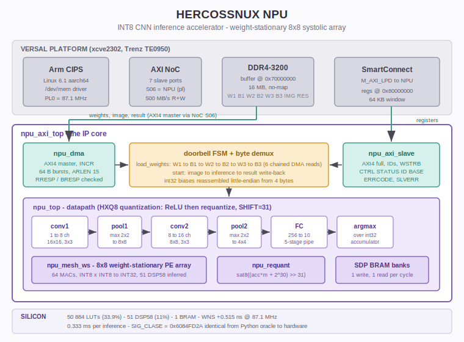

# NPU — INT8 CNN Inference Accelerator

A synthesizable convolutional neural network accelerator written in VHDL-2008,
built around an 8x8 weight-stationary systolic array. It runs a full LeNet-style
inference — two convolution layers, two pooling layers, one fully connected
layer and argmax — entirely in the programmable logic of an AMD Versal device,
with weights and images fetched from DDR over AXI4.

The whole chain is closed with one bit-identical signature: the Python oracle,
every RTL layer, the AXI integration and the silicon all produce
`SIG_CLASE = 0x6084FD2A`.



---

## 1. What this is

Most FPGA CNN accelerators are demonstrated in simulation, or on a board with
the host feeding data through a debug link. This one runs standalone: the Arm
processing system writes weights and an image into a reserved DDR region, rings
a doorbell through an AXI4 register bank, and reads back the predicted class.
The accelerator owns its DMA engine and pulls everything it needs by itself.

```
root@te0950:~# ./npu_run pesos.bin imgs.bin 8
ID leido: 0x4E505531 (esperado 0x4E505531)
Pesos escritos en DDR.
Pesos cargados por DMA.
  imagen 0 -> clase 3
  imagen 1 -> clase 2
  imagen 2 -> clase 8
  imagen 3 -> clase 8
  imagen 4 -> clase 7
  imagen 5 -> clase 5
  imagen 6 -> clase 2
  imagen 7 -> clase 2
Imagenes    : 8
Tiempo total: 2.66 ms  (0.333 ms por imagen)
SIG_CLASE   : 0x6084FD2A
NPU SILICIO OK SIG_CLASE=0x6084FD2A
```

The core lives on a Trenz TE0950 board (xcve2302-sfva784-1LP-e-S). It occupies
a third of the device and leaves the DSP columns and 154 of 155 BRAMs free.

---

## 2. Feature summary

| Item | Value |
|------|-------|
| Network | conv1 (1 to 8 ch) - pool - conv2 (8 to 16 ch) - pool - FC (256 to 10) - argmax |
| Input | 16x16 INT8 grayscale image |
| Compute core | 8x8 weight-stationary systolic array, 64 INT8 MACs |
| Quantization | HXQ8: INT32 accumulator, ReLU before requantize, `sat8((acc*m + 2^30) >> 31)` |
| Weight storage | 3784 bytes on-chip, loaded once per model |
| Host interface | AXI4 full slave (registers) + AXI4 master (DMA to DDR) |
| DMA | INCR bursts, 64 B per burst, ARLEN <= 15, RRESP and BRESP checked |
| Clock | 87.1 MHz on Versal (see section 10) |
| Latency | 0.333 ms per inference, measured in silicon |
| Throughput | ~3000 inferences/s |
| Resources | 50 884 LUTs (33.9%), 42 466 registers (14.1%), 51 DSP58 (11%), 1 BRAM |
| Timing | WNS +0.515 ns, WHS +0.017 ns, TNS 0 |
| License | MIT |

---

## 3. Repository layout

```
rtl/
  npu_pkg.vhd            types, constants, FNV signature function
  npu_mac.vhd            single INT8 x INT8 to INT32 multiply-accumulate
  npu_pe_ws.vhd          processing element, weight-stationary
  npu_mesh_ws.vhd        8x8 PE array with weight preload
  npu_requant.vhd        ReLU then requantize with saturation
  npu_pool.vhd           2x2 max pooling
  npu_array.vhd          array wrapper with tiling control
  npu_seq_conv1.vhd      conv1 sequencer
  npu_seq_full.vhd       conv2, FC and argmax sequencer
  npu_top.vhd            datapath top: memories + sequencers + array
  npu_axi_pkg.vhd        frozen memory and register map
  npu_dma.vhd            AXI4 master, read and write engines
  npu_axi_slave.vhd      AXI4 full slave, control and status registers
  npu_axi_top.vhd        doorbell FSM, byte demux, full integration
  npu_axi_wrap.vhd       VHDL-93 wrapper (Vivado rejects VHDL-2008 in a BD)

tb/
  tb_npu_mac.vhd         L1: MAC unit
  tb_npu_requant.vhd     L1: requantize
  tb_npu_pool.vhd        L1: pooling
  tb_npu_mesh_ws.vhd     L2: systolic array
  tb_npu_array.vhd       L2: array with tiling
  tb_l3_sonda.vhd        L3: tiling probes
  tb_npu_seq_conv1.vhd   L3: conv1 sequencer
  tb_npu_seq_full.vhd    L3: conv2, FC, argmax
  tb_npu_top.vhd         L3: full datapath, 32 images
  tb_axi_sondas.vhd      L5: AXI master protocol probes
  tb_axi_slave.vhd       L5: AXI slave protocol probes
  tb_npu_axi.vhd         L5: end-to-end integration over AXI
  axi_ddr_model.vhd      DDR model with backpressure and error injection

oracle/
  oracle_npu.py          Python reference model (the oracle)

silicio/
  npu_run.c              bring-up binary for the board
  gen_bin.py             generates weight and image binaries

syn/                     out-of-context synthesis scripts
impl/                    full platform implementation scripts
```

---

## 4. Memory map

Everything below is frozen in `npu_axi_pkg.vhd` and must match the block design.

**DDR buffer** — base `0x70000000`, 16 MB, `no-map`:

| Offset | Size | Contents |
|--------|------|----------|
| `+0x00000` | 72 B | W1, conv1 weights |
| `+0x00100` | 32 B | B1, conv1 biases (8 x int32) |
| `+0x01000` | 1152 B | W2, conv2 weights |
| `+0x01800` | 64 B | B2, conv2 biases (16 x int32) |
| `+0x02000` | 2560 B | W3, FC weights |
| `+0x02C00` | 40 B | B3, FC biases (10 x int32) |
| `+0x10000` | 256 B | input image, 16x16 |
| `+0x20000` | 16 B | result: class in byte 0, logits in 1..10 |

**Register bank** — base `0x80000000`, 64 KB window:

| Offset | Access | Contents |
|--------|--------|----------|
| `0x00` | W | CTRL: bit0 `start`, bit1 `load_weights`, both auto-clearing |
| `0x04` | R | STATUS: bit0 busy, bit1 done, bit2 error, bits 7:4 predicted class |
| `0x08` | R | ID: `0x4E505531` |
| `0x0C` | RW | BASE: DDR buffer base, defaults to `0x70000000` |
| `0x10` | R | ERRCODE: last non-OKAY RRESP or BRESP |

---

## 5. Verification methodology

Five layers, each with a bit-identical end-of-simulation signature as the pass
criterion, and 4 to 5 mutations per layer that must all fail. No layer is
considered done until every mutation is confirmed to break the signature.

| Layer | Scope | Signature | Mutations |
|-------|-------|-----------|-----------|
| L4 | Python oracle, self-consistency | `0xB080DFF1` | 5/5 |
| L1 | MAC, requantize, pool | `0x9828674A` / `0xC7043D4E` / `0x113F38C2` | 11/11 |
| L2 | 8x8 systolic array | `0xBDAC6166` | 4/4 |
| L3 | tiling probes | `0x5B3BE24F` | — |
| L3 | conv1 + pool1 | `0xE4C64381` | 5/5 |
| L3 | conv2 + pool2 + FC + argmax | `0xA87E298C` / `0xF7FF3389` / `0x6084FD2A` | 5/5 |
| L3 | full datapath, 32 images | `0xF4922DAD` / `0x3595EB4A` | 2/2 |
| L5 | AXI master protocol | 4/4 probes | — |
| L5 | AXI slave protocol | 5/5 probes | — |
| L5 | AXI integration, 8 images | `0x6084FD2A` | — |
| L5 | **silicon** | **`0x6084FD2A`** | — |

The oracle is written before any RTL exists. The signature is an FNV-1a hash
(`init 0x811C9DC5`, `prime 0x01000193`) folded over the low byte of each
result, so a single wrong pixel anywhere in the pipeline changes it.

The AXI protocol probes deserve a note: the master and the slave are each
verified in isolation *before* being wired to the datapath. Without that, a
handshake bug would surface as a wrong signature at the end of the chain, with
nothing to distinguish it from an arithmetic error.

---

## 6. Bugs worth documenting

### 6.1 Using a signal in the cycle it is assigned

This one cost seven attempts on the DMA write channel and is worth stating
plainly: in VHDL, a signal assigned with `<=` keeps its old value for the rest
of the current process execution. Code that assigns a counter and then uses it
in the same clock edge reads the *previous* count.

The DMA read engine had this shape:

```vhdl
if rvalid_r = '0' or rready = '1' then
  a := r_addr + 4*r_cnt;        -- uses the CURRENT r_cnt
  rdata_r <= mem(a);
end if;
if rvalid_r = '1' and rready = '1' then
  r_cnt <= r_cnt + 1;           -- updates r_cnt
end if;
```

Both blocks run on the same edge, so when a word was accepted the address was
computed with the old count and the first word went out twice.

**What made this expensive:** five of the seven attempts modified the *write*
channel, which was correct all along. The debugging was aimed at the wrong
module because the symptom (wrong data at the end of a transfer) was visible
in the write path.

**What broke the loop:** instrumenting the AXI bus itself — printing `rdata`
and `rresp` on every handshake — instead of internal registers. When two
modules interact, the evidence is at the interface, not inside one of them.

The lesson generalized: the AXI slave was written afterwards with this pattern
explicitly avoided by construction (computing addresses into local variables
before use), and all five of its probes passed on the first run.

### 6.2 Two processes driving one signal

The error reporting path had `err_r` and `errcode_r` assigned from both the
read process and the write process. In VHDL that is two drivers on one signal,
and the resolution function returns `'X'`. The error probe never saw a failure
because the flag was neither `'0'` nor `'1'`.

The fix is structural, not cosmetic: one signal per process
(`err_rd` / `err_wr`), combined outside with `err_out <= err_rd or err_wr`.

This was invisible until the bus trace showed `err_out='X'` next to a perfectly
correct `rresp=2`. The DDR model was reporting SLVERR properly; the consumer
was the broken half.

### 6.3 Memories with many simultaneous reads dissolve into LUTs

The first version of the conv2 sequencer read 64 weights per cycle from
`w2_ram`. Yosys reported 20 166 cells against 5622 for the same design with a
single read port — a 3.6x blowup, all of it in LUT-based distributed RAM,
because no BRAM primitive has 64 read ports.

The restructuring: preload the 64 weights for a given tile into registers once
per `(tile, kstep)`, reorder the loops so `kstep` is outside and pixel is
inside, and keep external accumulators. Same arithmetic, same signature, one
read port.

The canonical shape that maps cleanly to a Versal BRAM is 512x32 bits, one
synchronous write, one synchronous read. Anything with multiple simultaneous
writes plus asynchronous reads becomes flip-flops.

### 6.4 GHDL caches stale entities

A failed analysis leaves the previous entity in `work-obj08.cf`. A test runner
that pipes output through `grep` will hide the message
`file has changed and must be reanalysed` and happily run the old design.

This produced one false PASS that was only caught because the numbers looked
too good. Every runner in this repository now analyzes everything in a single
command with a freshly deleted cache directory.

---

## 7. Versal-specific notes

These cost the most wall-clock time in the whole project and are poorly
documented elsewhere.

### 7.1 Vivado rejects VHDL-2008 as a module reference top

```
ERROR: [filemgmt 56-195] Reference 'npu_axi_top' contains top file
'npu_axi_top.vhd' of type VHDL 2008. This type is not allowed as the top
file in the reference.
```

The fix is `npu_axi_wrap.vhd`: a pure VHDL-93 entity that instantiates the
VHDL-2008 design. Only the outer shell needs to be 93.

The wrapper also carries 56 `X_INTERFACE_INFO` attributes so Vivado groups the
flat port list into AXI interfaces instead of 56 loose pins. Two details:

- The attributes must be declared **in the entity**, not the architecture.
  GHDL rejects the latter with `attribute for port must be specified in the
  entity`.
- Vivado names the inferred interfaces after the port prefix, not after the
  name in the attribute. Ports named `m_*` and `s_*` produce interfaces called
  `m` and `s`, not `M_AXI` and `S_AXI`.

Verified equivalent: the integration testbench through the wrapper produces the
same signature as without it.

### 7.2 CIPS automation asks for undocumented keys

`apply_bd_automation -rule xilinx.com:bd_rule:cips` fails with
`key "<name>" not known in dictionary`, one key at a time:
`mc_type`, then `debug_config`, then `design_flow`, then `pl_clocks`. There is
no way to enumerate the required set — `get_bd_automation_options` does not
exist in this version.

The working approach is to skip the automation entirely: extract
`CONFIG.PS_PMC_CONFIG` from a project that already boots on the same board and
apply it verbatim. It is a single 3581-character string.

### 7.3 The DDR pin assignment property

Implementation failed repeatedly with:

```
ERROR: [Mig 66-441] Port(s) (ddr4_bank0_adr[0], ... 115 pins ...)
is/are not placed. Assign all ports to valid sites.
```

`MC_BOARD_INTRF_EN = true` is necessary but not sufficient. The property that
actually binds the logical port to the board definition lives on the NoC cell,
prefixed with the channel name:

```tcl
set_property CONFIG.CH0_DDR4_0_BOARD_INTERFACE {ddr4_bank0} [get_bd_cells axi_noc_0]
set_property CONFIG.SYS_CLK0_BOARD_INTERFACE {ddr4_bank0_sys_clk} [get_bd_cells axi_noc_0]
```

The port names matter: they must match what the board part expects
(`ddr4_bank0`, not `ddr4_0`).

**The methodological error that made this take six attempts:** comparing
`get_property` output between the working project and the new one. Tcl property
queries return *derived* values — a NoC in board-interface mode reports memory
parameters resolved from the preset, whether or not the project sets them. The
working project's `.bd` file did not contain those parameters at all.

Comparing the `.bd` files directly with `grep` found the answer in one attempt.
Compare the source of truth, not the runtime view.

### 7.4 Other Versal gotchas confirmed here

- `~` is never expanded in Vivado Tcl. Use `$env(HOME)`.
- Connection Automation routes a PL master to `S_AXI_LPD`, which has no DDR
  access. Wire NoC connections explicitly.
- Every NoC slave port needs `CONFIG.CONNECTIONS` declaring its destination and
  bandwidth, or no address segments are generated and the port is dead.
- An unused NoC port still needs a clock, or `validate_bd_design` fails with
  `clock pins are not connected to a valid clock source`. Better to reduce
  `NUM_SI` than to feed a clock to nothing.
- A failed Tcl block that never reaches `save_bd_design` loses everything.
  One command per block, read the response, save after each.
- `reset_run impl_1` is required before relaunching after a failed
  implementation, not just `reset_run synth_1`.
- The BD wrapper is generated as Verilog (`.v`) by default even in a
  VHDL project.

---

## 8. Building

### Simulation

Every verification step is a self-contained script that installs its files and
runs its own checks:

```bash
bash paso12_npu_axi_sondas.sh     # AXI master probes
bash paso13_npu_axi_slave.sh      # AXI slave probes
bash paso14_npu_axi_int.sh        # end-to-end integration
```

Each prints exactly one expected line on success, for example:

```
NPU PASO14 OK INTEGRACION AXI SIG_CLASE=0x6084FD2A
```

Requires GHDL 4.1.0 with `--std=08`.

### Synthesis

```bash
bash syn/run_synth_axi.sh         # out-of-context, core only
```

### Platform implementation

```bash
bash impl/run_impl.sh             # synthesis, place and route, PDI
```

Takes 30 to 60 minutes. If timing fails it lists the violating setup and hold
paths directly, which saves opening the checkpoint afterwards (note that
`open_checkpoint` does not load constraints — `create_clock` has to be added
by hand).

### PetaLinux

Clone an existing project by copying only `project-spec/` and `.petalinux`.
Copying `build/` carries absolute paths and produces a TMPDIR error.

```bash
petalinux-config --get-hw-description=npu_soc.xsa --silentconfig
petalinux-build
petalinux-package --boot --u-boot --force
```

The XSA must be exported *after* the final implementation. Exporting it earlier
silently packages a stale PDI.

---

## 9. Running

Copy `BOOT.BIN`, `image.ub` and `boot.scr` to the FAT partition, and the
bring-up files to the ext4 partition:

```bash
cp images/linux/{BOOT.BIN,image.ub,boot.scr} /media/$USER/BOOT/
sudo cp silicio/{npu_run,pesos.bin,imgs.bin} /media/$USER/rootfs/home/root/
```

Then on the board, over a 115200 8N1 serial console:

```bash
cd /run/media/rootfs-mmcblk1p2/home/root
./npu_run pesos.bin imgs.bin 8
```

Never load the PDI hot — the Versal PLM rejects it with error `0x03024001`.
Always repackage BOOT.BIN.

### The `no-map` trap

The DDR buffer is declared `no-map` so the kernel does not touch it. glibc's
aarch64 `memset` and `memcpy` use `DC ZVA` and 128-bit `stp`, which fault with
SIGBUS on such regions.

Every access in `npu_run.c` is a byte-at-a-time loop over `volatile` pointers.
Do not introduce `memcpy` or `memset` into those paths, however tempting.

---

## 10. Known limitations

**Clock at 87.1 MHz, not 100.** Out-of-context synthesis reported WNS +1.640 ns
at 100 MHz, which suggested comfortable margin. After place and route with the
NoC and CIPS in the design, the same target closed with **+0.0055 ns** — five
picoseconds, which is noise rather than margin. Lowering the request to 90 MHz
(the PLL resolves to 87.1) gives +0.515 ns.

The OOC estimate was optimistic by three orders of magnitude. Treat
out-of-context timing as a feasibility check, not a prediction.

**The critical path** is inside the conv2 requantize stage:

```
u_core/u_s2/rq_val_reg[2][12]/C  ->  u_core/u_s2/c2_ram_reg[172][4]/D
32 logic levels, 9.578 ns (logic 5.605, routing 3.973)
```

It runs through a full DSP58 (preadd, multiplier, ALU, output) and then 9
`LOOKAHEAD8` plus 8 `LUTCY` primitives — the carry chain of the saturation
comparison after the requantize multiply.

**Hold margin is 17 ps.** Vivado reports it as met and hold failures do not
depend on clock period, but it is thin enough to note.

**Fixed network topology.** The layer dimensions are compile-time constants.
Running a different network means regenerating the weights and re-running the
verification chain, not reconfiguring at runtime.

**Single image at a time.** There is no batching. The DMA fetches one 256-byte
image, runs inference, writes 16 bytes back, and stops.

---

## 11. Future work

### Recovering 100 MHz

Three approaches, in increasing order of effort:

1. **Register between the DSP and the saturation logic.** Split the critical
   path immediately after the requantize multiply, leaving saturation in the
   following cycle. Adds one pipeline stage; expected to recover 3 to 4 ns.

2. **Narrow the accumulator.** `ACC_W` is 32 bits, but the measured
   accumulator range across the whole test set is `[-34324, 52999]` — it fits
   in 17 bits. Cutting it to 18 would shorten exactly the carry chain that
   dominates the critical path.

3. **Retime the FC pipeline.** The 5-stage structure (multipliers, pair sums,
   4-sums, 2-sums, final) was tuned for the OOC estimate. With real routing
   delays a different split may balance better.

Any of these must reproduce `0x6084FD2A` in simulation before returning to
hardware. The signature makes optimization safe: a change that alters behaviour
is caught immediately.

### Other directions

- **Batching.** Fetching several images per doorbell would amortize the DMA
  setup and improve throughput beyond the current ~3000 inferences/s.
- **Interrupt instead of polling.** `npu_run` currently spins on STATUS.done.
  The CIPS has `pl_ps_irq0` available.
- **Larger networks.** The array is 8x8 and the tiling logic is general; a
  wider network is a matter of memory sizing rather than datapath redesign.
- **Integration alongside other cores.** The M1553 project has all seven NoC
  ports occupied; combining both IPs requires widening the NoC and
  reimplementing.

---

## 12. Acknowledgements

The verification methodology — signature-based golden checks with mandatory
mutation testing, and a reference model written before the RTL — is the same
one used across the HERCOSSNUX core family. It is slow to set up and it repays
that cost every single time a subtle bug turns out to be caught by a mutation
that was written weeks earlier.

The `mini-rv32ima` C reference model, used to cross-validate the ISS in the
RV32IMA project, indirectly informed the oracle-first approach taken here.

---

## 13. License

MIT. See `LICENSE` at the repository root.
