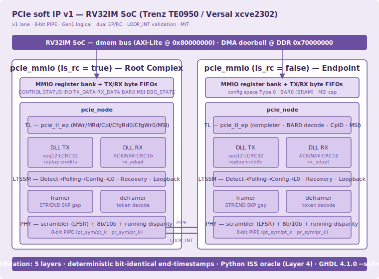

# PCIe Soft IP (v1) — RV32IM SoC on Trenz TE0950 / AMD Versal xcve2302

A protocol-complete, fully soft **PCI Express** stack in VHDL-2008, built as a
tutorial-quality open-source IP core for a custom RV32IM SoC. The stack spans
the physical coding sublayer up through the transaction layer and a
memory-mapped register interface, and is validated end-to-end by wiring two
instances (Root Complex + Endpoint) PIPE-to-PIPE in internal loopback.

Part of a silicon-validated family of MIT-licensed IP cores (USART, SPI, IIC,
I3C, CAN, SpaceWire, MIL-STD-1553B, Ethernet MAC, PTP, DSP, ADCS, SDN-TSN).

- **Target:** AMD Versal xcve2302-sfva784-1LP-e-S (Trenz TE0950)
- **Toolchain:** GHDL 4.1.0 `--std=08`, Vivado / PetaLinux 2025.2.1
- **License:** MIT

---

## 1. Why a fully soft stack

The xcve2302 has a hardened PL PCIE4 block and GTYP transceivers, but the TE0950
board exposes **no PCIe edge connector**, so hard-block silicon validation is
physically impossible on this board. The chosen approach is a fully soft,
protocol-complete stack validated through an **internal PIPE loopback**
(LOOP_INT): two nodes are instantiated, one configured as Root Complex and one
as Endpoint, and their 8-bit PIPE interfaces are cross-wired. No new pins are
required. This is consistent with the rest of the IP family, which favours
self-contained, simulation-anchored validation.

---

## 2. Architecture



The stack is organised as conventional PCIe layers, each a separate VHDL entity:

- **PHY** — `pcie_scrambler` (LFSR X¹⁶+X⁵+X⁴+X³+1), `pcie_8b10b` (real 8b/10b
  with running-disparity tracking), presented over an 8-bit PIPE.
- **Framing** — `pcie_framer` / `pcie_deframer` insert and recover STP/SDP/END/EDB
  ordered sets and SKP.
- **LTSSM** — `pcie_ltssm` runs Detect → Polling → Config → L0, plus Recovery,
  Hot Reset and Loopback; `pcie_ts_gen` produces the TS1/TS2 training sequences.
- **DLL** — `pcie_dll_tx` / `pcie_dll_rx` provide 12-bit sequence numbers, a
  32-bit LCRC, a replay buffer, and ACK/NAK DLLPs with CRC-16.
- **TL** — `pcie_tl_ep` implements MWr/MRd (3DW/4DW), Cpl/CplD, CfgRd0/CfgWr0,
  a Type-0 config space, and MSI generation.
- **Adapter** — `pcie_rx_adapt` turns deframer tokens into the byte streams the
  DLL RX and TL expect; `pcie_tlp_frame` couples the TL output to the DLL TX
  with a one-slot AXI skid buffer and backpressure.
- **Node** — `pcie_node` wires one full lane together; `pcie_mmio` wraps a node
  with a register bank and TX/RX byte FIFOs so the RV32 can drive it over the
  dmem bus.

---

## 3. Frozen v1 scope

Scope was frozen before any RTL was written:

- Dual EP/RC role, switchable by a register generic
- Single lane (x1), 8-bit PIPE with real 8b/10b and running disparity
- Gen1 logical framing; LFSR scrambler with K-symbol bypass
- Full LTSSM (Detect → L0, Recovery, Hot Reset, Loopback)
- DLL: 12-bit sequence numbers, LCRC-32, DLLP ACK/NAK with CRC-16, replay
  buffer, flow-control credit types for P/NP/Cpl
- TL: MWr/MRd 3DW/4DW, Cpl/CplD, CfgRd0/CfgWr0, Msg, ECRC, MSI
- Validation in LOOP_INT: RC enumerates the EP, programs BAR0, runs an MWr/MRd
  burst, triggers MSI, and validates through a DMA doorbell to DDR `0x70000000`

Deferred to later revisions: x2/x4 lanes, 128b/130b Gen3 encoding, and a real
GTYP physical connection.

---

## 4. Register map (MMIO)

Base address `0x80000000` (AXI-Lite, M_AXI_LPD, 64 KB window). Offsets are byte
offsets; `rdata` is combinational.

| Offset | Name | Notes |
|-------:|------|-------|
| 0x00 | CONTROL | bit0 start · bit1 hot-reset · bit2 msi · bit3 enable |
| 0x04 | STATUS | bit0 link_up · bits[7:4] LTSSM state |
| 0x08 | IRQ_STAT | W1C · bit0 cpl_rx · bit1 msi_tx |
| 0x0C | IRQ_EN | interrupt enable mask |
| 0x10 | TX_DATA | write byte[7:0]; bit8 = last byte of TLP |
| 0x14 | TX_CTRL | TX control / status |
| 0x18 | RX_DATA | read byte[7:0] from RX FIFO (auto-advances) |
| 0x1C | RX_CTRL | bit0 rx_empty · bits[15:8] level |
| 0x20 | BAR0_LAST | last DW written to the EP's BAR0 |
| 0x24 | MWR_CNT | memory-write count (completer) |
| 0x28 | MRD_CNT | memory-read count (completer) |
| 0x2C | GOOD_RX | good TLPs received |
| 0x30 | MSI_ADDR | MSI address mirror |
| 0x34 | MSI_DATA | MSI data mirror |
| 0x38 | FC_STAT | flow-control credit status |
| 0x44 | DBG_STATE | debug state (silicon bring-up) |

---

## 5. Verification methodology

Verification is non-negotiable and layered. Each layer has a **deterministic,
bit-identical end-timestamp** as its pass criterion, so a run on the developer's
machine and a run in a clean container must match to the femtosecond.

1. **Layer 1a** — TX engine vs an independent event-driven model.
2. **Layer 1b** — RX engine vs a bit-bang model with injected corruptions.
3. **Layer 1c** — RTL vs RTL, full duplex, plus a Phase-0 anti-common-mode test
   (partner powered off: the link must time out, closing the blind spot where
   two identical instances sharing a defect would still interoperate).
4. **Layer 2** — MMIO register bank vs a dmem BFM, with combinational `rdata`
   enforced.
5. **Layer 4** — full SoC with real RV32 firmware plus a Python ISS oracle,
   signature dumped by DMA doorbell to DDR.

The Layer 4 oracle (`pcie_iss.py`) is written **before** the testbench; the
firmware is checked against it, then the RTL is compared against the same
signature. Mutations are expected to fail at each layer.

---

## 6. Build and simulate

Each build step is a single self-contained bash script that writes its sources,
re-analyses the full hierarchy in one `ghdl -a` invocation (with a clean cache),
and runs, printing exactly one deterministic pass line.

```bash
cd ~/pcie_ip
bash pcie_paso1_8b10b.sh    # PHY codec
bash pcie_paso2_phy.sh      # scrambler + framing
bash pcie_paso3_ltssm.sh    # LTSSM + deframer
bash pcie_paso4_dll.sh      # data link layer
bash pcie_paso5_tl.sh       # transaction layer
bash pcie_paso6_loop.sh     # LOOP_INT integration
bash pcie_paso7_mmio.sh     # MMIO register interface
bash pcie_paso8_soc.sh      # Layer 4: SoC + firmware + ISS oracle
```

Run the steps in order; several share source files and each overwrites with a
timestamped `.bak` backup.

---

## 7. Signatures

The canonical pass criterion for each layer is a bit-identical simulation
end-timestamp:

| Testbench | Layer | Signature |
|-----------|-------|-----------|
| tb_8b10b | PHY codec | `762085000000 fs` |
| tb_phy | scrambler + framing | `403005000000 fs` |
| tb_train | LTSSM + deframer | `127785000000 fs` |
| tb_dll | data link layer | `33015000000 fs` |
| tb_tl | transaction layer | `2565000000 fs` |
| tb_loop | LOOP_INT integration | `5805000000 fs` |
| tb_mmio | MMIO interface | `5275000000 fs` |
| tb_soc | SoC + firmware (Layer 4) | `9635000000 fs` |

The Layer 4 signature covers seven functional words: link_up, mwr_cnt,
bar0_last, CplD byte0, mrd_data, MSI address, and MSI data — all bit-identical
to the ISS oracle.

---

## 8. Layer 4 — SoC integration

The Layer 4 harness is three pieces that validate one another:

- **`pcie_iss.py`** — an instruction-set-style oracle that models the MMIO bank
  plus the RC/EP pair and produces the expected signature.
- **`pcie_fw.s`** — RV32I bring-up firmware (no `la`/`lbu`/`.byte`, no `jalr`,
  32-bit constants via `lui`+`addi`) that trains the link, issues an MWr/MRd
  burst, and dumps the signature to DDR `0x70000000` via the doorbell pattern.
- **`tb_soc.vhd`** — instantiates two `pcie_mmio` (RC + EP) over PIPE, with a
  dmem BFM replaying the firmware's accesses, and compares the hardware
  signature against the oracle.

---

## 9. Verified data points

The following are checked bit-for-bit at Layer 4:

- `link_up = 1` after training driven from CONTROL.start
- `mwr_cnt = 4` after a 4-DW MWr3 burst to BAR0
- `bar0_last = 0x44444444`
- CplD byte0 `= 0x4A` from an MRd3
- `mrd_data = 0x33333333`
- MSI address `= 0xFEED0000`, MSI data `= 0x0000CAFE`

---

## 10. RTL bugs caught in simulation

Three real RTL defects were found and fixed by simulation before any silicon
bring-up:

- **Double CplD from a spurious internal NAK.** Each node's RX generates ACK/NAK
  for its local reliability loop. In LOOP_INT a spurious NAK (from an LCRC
  mismatch on the reconstructed stream) triggered a replay of the completion
  from the replay buffer, producing a duplicate CplD. Since v1 does not carry
  ACK/NAK as DLLPs between nodes, the internal-loop NAK is masked — only ACKs
  propagate, for replay-buffer purge. The real replay mechanism remains verified
  in isolation at the DLL layer.
- **Registered output duplicated bytes.** The TL EP presented `tx_data` from a
  registered signal, so on pointer advance the new byte appeared one cycle late
  and the DLL consumed the stale byte again. Made combinational (the family's
  canonical `rdata`/output rule).
- **Integer overflow in BAR decode.** `to_integer(unsigned(addr))/4` overflowed
  VHDL's `integer` for any address with bit 31 set (e.g. the MSI target
  `0xFEED0000`). Replaced with a high-bit range check on the address bits
  directly, which is also the correct way to decode a BAR window.

---

## 11. Known limitations (v1)

Two behaviours are characterised precisely and deferred to v1.1 rather than
patched under time pressure:

- **Back-to-back TLPs.** Two TLPs transmitted with no inter-frame gap lose the
  two sequence-number bytes of the second TLP, due to a race in the
  DLL-TX ↔ framer handshake. A defensive inter-frame gap has been added to the
  framer (conformant with PCIe framing), and bring-up firmware spaces its TLPs;
  a full fix in the DLL-TX handshake is planned for v1.1.
- **Per-bank interrupt status.** The `cpl_rx` sticky bit lives in the receiving
  node's bank and `msi_tx` in the emitting node's bank, whereas the ISS oracle
  models a unified peripheral. This is a modelling mismatch, not a datapath
  fault; the seven functional signature words are validated, and the two sticky
  bits are checked per bank.

---

## 12. Technical debt (documented)

Flow-control credit types are defined; the InitFC/UpdateFC state machine is
pending. ACK/NAK is an internal per-node loop in v1 (not a DLLP between nodes).
CplD assumes a single DW. These are intentional v1 boundaries, listed here so
the scope is unambiguous.

---

## 13. File manifest

Packages: `pcie_8b10b_pkg`, `pcie_phy_pkg`, `pcie_ltssm_pkg`, `pcie_dll_pkg`,
`pcie_tl_pkg`, `pcie_mmio_pkg`.

RTL: `pcie_8b10b`, `pcie_scrambler`, `pcie_framer`, `pcie_deframer`,
`pcie_ltssm`, `pcie_ts_gen`, `pcie_dll_tx`, `pcie_dll_rx`, `pcie_tl_ep`,
`pcie_rx_adapt`, `pcie_tlp_frame`, `byte_fifo`, `pcie_node`, `pcie_mmio`.

Verification: `tb_8b10b`, `tb_phy`, `tb_train`, `tb_dll`, `tb_tl`, `tb_loop`,
`tb_mmio`, `tb_soc`, plus `pcie_iss.py` (Layer 4 oracle) and `pcie_fw.s`
(RV32I bring-up firmware).

---

## 14. Roadmap

- Silicon bring-up on the TE0950 (BOOT.BIN repackage via PetaLinux; scripted NoC
  Tcl to route the PL AXI master to real DDR; DMA doorbell to physical DDR).
- v1.1: fix the DLL-TX ↔ framer sequence-number race for true back-to-back TLPs;
  unify the interrupt-status model.
- v2: x2/x4 lanes, 128b/130b Gen3 encoding, and a real GTYP physical connection.

---

## License

MIT.
