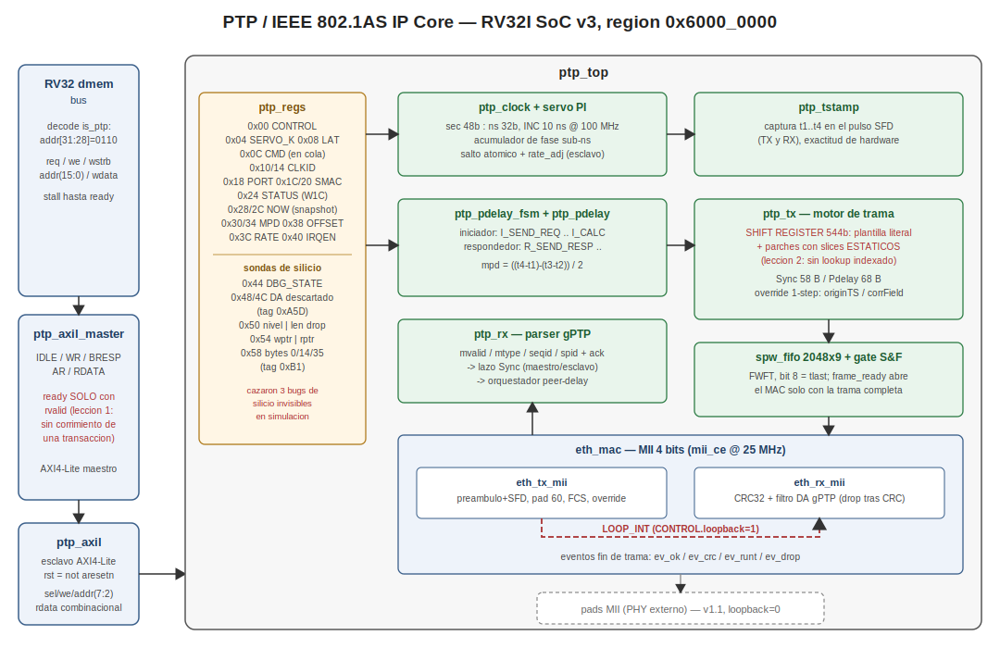

# PCIe Soft IP (v1) — RV32IM SoC on Trenz TE0950 / AMD Versal xcve2302

A protocol-complete, fully **soft** PCI Express stack in VHDL-2008, built as a
tutorial-quality open-source IP core for a custom RV32IM SoC. The stack spans
the physical coding sublayer up through the transaction layer and a
memory-mapped register interface, and is validated **end-to-end in silicon** by
wiring two instances (Root Complex + Endpoint) PIPE-to-PIPE in internal loopback
on real hardware.

> **Status: silicon-validated (PASS) on Trenz TE0950 / AMD Versal xcve2302.**
> The link trains to **L0** and the stack executes real TLP transactions
> (MWr, MRd, CplD) between an on-chip Root Complex and Endpoint.

Part of a silicon-validated family of MIT-licensed IP cores (USART, SPI, IIC,
I3C, CAN, SpaceWire, MIL-STD-1553B, Ethernet MAC, PTP, DSP, ADCS, SDN-TSN).



---

## 1. Prerequisites

**Hardware**

- Trenz **TE0950** board with an AMD **Versal xcve2302-sfva784-1LP-e-S**.
- A microSD card (the only file-transfer path to the board; no inbound SSH).
- A USB-serial console (picocom @ `115200 8N1`).

**Software / toolchain**

- **GHDL 4.1.0** with `--std=08` (all simulation).
- **Vivado / PetaLinux 2025.2.1** (`settings64.sh` / `settings.sh` sourced).
- An `aarch64-linux-gnu-gcc` cross-compiler (for the PS-side verifier).
- The RV32IM SoC sources and the mini-assembler `asm.py` from this repository.

**Knowledge**

- Basic PCIe layering (PHY / DLL / TL) and the LTSSM state flow.
- Familiarity with the RV32IM SoC bring-up flow used by the rest of the family
  (dmem-mapped peripherals, DMA doorbell to DDR, BOOT.BIN packaging).

---

## 2. What this core is for

This IP core provides a **complete, synthesizable PCIe protocol stack** that runs
entirely in FPGA fabric — no hard PCIE block, no transceivers, no board edge
connector. It is useful when you need to:

- **Study or teach** the PCIe stack end-to-end with readable VHDL: every layer
  (scrambler, 8b/10b, framing, LTSSM, DLL with LCRC/replay, TL with TLPs) is a
  separate, self-contained entity.
- **Prototype PCIe logic** (enumeration, BAR programming, memory read/write,
  completions, MSI) on a board that has **no physical PCIe connector**, by
  cross-wiring a Root Complex and an Endpoint over an internal PIPE loopback
  (`LOOP_INT`).
- **Drive PCIe transactions from a soft CPU** — the RV32IM issues MWr/MRd through
  a simple memory-mapped register bank, exactly as firmware would talk to a real
  controller.
- **Serve as a reference** for how to take a large combinational-heavy protocol
  stack all the way through synthesis, implementation, timing closure and
  silicon bring-up on Versal.

The xcve2302 *does* have a hardened PL PCIE4 block and GTYP transceivers, but the
TE0950 exposes **no PCIe edge connector**, so hard-block silicon validation is
physically impossible on this board. A fully soft, loopback-validated stack is
the pragmatic, self-contained alternative — and it doubles as documentation.

---

## 3. How to use this core

### 3.1 Instantiation model

The unit of reuse is `pcie_node` (one full lane). `pcie_mmio` wraps a node with
a register bank and TX/RX byte FIFOs so a CPU can drive it over a dmem bus. For
the LOOP_INT bring-up, `pcie_soc_mmio` instantiates **two** `pcie_mmio` blocks —
one Root Complex, one Endpoint — and cross-wires their 8-bit PIPE interfaces
(TX→RX both ways). The pair is decoded by `addr(8)`: `0` = RC, `1` = EP.

In the SoC, the pair lives in the dmem region `is_pcie = 0x8` (base
`0x8000_0000`; the EP bank at `0x8000_0100`). The RV32 firmware programs both
banks, trains the link, issues TLPs, and reads back the counters.

### 3.2 Register map (per bank, byte offsets)

| Offset | Name       | Access | Meaning                                  |
|-------:|------------|:------:|------------------------------------------|
| `0x00` | CONTROL    | rw     | bit0 = start, bit3 = enable (`0x9` = both) |
| `0x04` | STATUS     | ro     | bit0 = link_up; bits[7:4] = LTSSM state  |
| `0x10` | TX_DATA    | wo     | byte into TX FIFO; bit8 = last of TLP     |
| `0x18` | RX_DATA    | ro     | pop one byte from RX FIFO (auto-advance)  |
| `0x1C` | RX_CTRL    | ro     | bits[15:8] = RX FIFO level                |
| `0x20` | BAR0_LAST  | ro     | last DW written to BAR0 (on the EP)       |
| `0x24` | MWR_CNT    | ro     | count of MWr received (on the EP)         |

> **Key rule:** MWr is *sent* by the RC and *received* by the EP. Read
> `MWR_CNT` and `BAR0_LAST` from the **EP bank** (`0x8000_0120/0124`), not the
> RC. A completion (CplD) flows the other way, so the RC reads it back.

### 3.3 Bring-up signature

The firmware dumps a 5-word signature (plus an end marker) to DDR via the DMA
doorbell. A PASS is an exact match against the ISS oracle:

| DDR word | Field      | Expected     |
|---------:|------------|--------------|
| `[0]`    | link_up    | `0x00000001` |
| `[1]`    | mwr_cnt    | `0x00000004` |
| `[2]`    | bar0_last  | `0x44444444` |
| `[3]`    | cpld_b0    | `0x0000004A` |
| `[4]`    | mrd_data   | `0x33333333` |
| `[5]`    | marker     | `0x0C0FFEE0` |

---

## 4. Linux (bash) commands

### 4.1 Simulate the whole stack (GHDL)

```bash
cd ~/rv32i
rm -f work-obj08.cf
ghdl -a --std=08 \
  pcie_8b10b_pkg.vhd pcie_phy_pkg.vhd pcie_ltssm_pkg.vhd pcie_dll_pkg.vhd \
  pcie_tl_pkg.vhd pcie_mmio_pkg.vhd \
  pcie_8b10b.vhd pcie_scrambler.vhd pcie_framer.vhd pcie_deframer.vhd \
  pcie_ltssm.vhd pcie_ts_gen.vhd pcie_dll_tx.vhd pcie_dll_rx.vhd \
  pcie_tl_ep.vhd pcie_rx_adapt.vhd pcie_tlp_frame.vhd byte_fifo.vhd \
  pcie_node.vhd pcie_mmio.vhd pcie_soc_mmio.vhd

# run one layer (each has a deterministic, bit-identical end-timestamp)
ghdl -a --std=08 tb_loop.vhd && ghdl -e --std=08 tb_loop
ghdl -r --std=08 tb_loop --stop-time=30ms   # expect: PASS @ 5805000000 fs
```

### 4.2 Assemble the bring-up firmware

```bash
# asm.py REQUIRES two arguments (input.s output.mem). With one it silently
# assembles its built-in example instead — always pass both.
python3 ~/rv32i/asm.py ~/vhdl_repo/IP_Cores/PCIe/pcie_fw.s /tmp/pcie_fw.mem
wc -l /tmp/pcie_fw.mem     # 143 instructions
```

### 4.3 Isolated synthesis (the technique that found the hang)

```bash
# synthesize one module at a time with a hard timeout; the one that times out
# is the culprit. This bisection is the definitive way to localize a synth hang.
cd ~/pcie_iso_test
for top in pcie_dll_rx pcie_tl_ep pcie_ltssm pcie_mmio pcie_node; do
  cp synth_one_base.tcl /tmp/s1.tcl
  echo "synth_design -top $top -part xcve2302-sfva784-1LP-e-S -mode out_of_context" >> /tmp/s1.tcl
  timeout 120 vivado -mode batch -nolog -nojournal -source /tmp/s1.tcl > /tmp/log_$top.txt 2>&1
  rc=$?
  [ $rc -eq 0 ] && echo "$top: OK" || { [ $rc -eq 124 ] && echo "$top: *** HANG ***" || echo "$top: fail rc=$rc"; }
done
```

### 4.4 PetaLinux repackage + PS-side verifier

```bash
cd ~/plnx_te0950_pcie
source ~/Petalinux/settings.sh
petalinux-config --get-hw-description=/home/adrian/pcie_soc_vivado/pcie_soc.xsa --silentconfig
petalinux-build
petalinux-package --boot --u-boot --force        # -> images/linux/BOOT.BIN

aarch64-linux-gnu-gcc -O2 -static pcie_verify.c -o pcie_verify
```

### 4.5 On the board (serial console)

```bash
mkdir -p /mnt/sd
mount /dev/mmcblk1p2 /mnt/sd            # SD rootfs partition
cp /mnt/sd/root/pcie_verify /mnt/sd/root/pcie_fw.mem /tmp/
chmod +x /tmp/pcie_verify
cd /tmp
./pcie_verify pcie_fw.mem               # loads IMEM, starts RV32, checks DDR

# live peek at the trained link state (values arrive via DMA to DDR)
devmem 0x70000000 32                    # STATUS RC : 0x31 = link_up=1, LTSSM=3 (L0)
```

---

## 5. Vivado (Tcl) commands

```tcl
# --- synthesis + implementation to a device image, one project ---
open_project $env(HOME)/pcie_soc_vivado/pcie_soc_bd/pcie_soc.xpr
reset_run synth_1
reset_target all  [get_files bd_soc_usart.bd]
generate_target all [get_files bd_soc_usart.bd]
launch_runs synth_1 -jobs 16
wait_on_run synth_1
launch_runs impl_1 -to_step write_device_image -jobs 16
wait_on_run impl_1

# --- check timing closure ---
open_run impl_1
report_timing_summary -file timing.rpt      ;# WNS must be >= 0

# --- export the fixed hardware platform (XSA) for PetaLinux ---
write_hw_platform -fixed -force $env(HOME)/pcie_soc_vivado/pcie_soc.xsa
```

> **Tcl gotchas that bit us:** `~` is **not** expanded in Vivado Tcl — always use
> `$env(HOME)`. Paste **one command at a time**; multi-line heredocs silently
> drop leading characters. If a run gets stuck as "Queued 0%" or a ghost OOC run
> refuses to die, close Vivado completely and delete the run directory on disk.

---

## 6. Lessons learned

- **Bisection beats guessing.** A synthesis hang has no error message. Synthesizing
  each module in isolation with a `timeout` pinned the culprit (`pcie_dll_rx`) in
  minutes after hours of blind parameter-tuning.
- **Simulation passing ≠ synthesizable at scale.** All eight sim layers passed
  bit-identically while the design still hung in synthesis. Combinational depth
  and table shape matter enormously once the logic is actually instantiated
  (here, ×2 for RC+EP).
- **Verify a patch reached the file that the tool reads.** The first silicon run
  was wasted because the `is_pcie` region patch never landed in the real
  `mem_subsys_dma.vhd`; a one-line `grep` would have caught it before a full
  synth/impl/boot cycle.
- **The testbench is only as good as its model.** `tb_soc` used a BFM that talked
  to the PCIe blocks directly, so it never exercised the real SoC memory map. The
  firmware's assumptions about DDR writes and counter banks were therefore never
  checked in simulation — and both were wrong on hardware.
- **On this SoC, the RV32 cannot `sw` straight to DDR.** Region `0x7` is not
  decoded; writes vanish silently. Use the **DMA doorbell** (write to local RAM,
  program the DMA at `0x4000_0000`, dir = local→DDR).
- **Keep the pass criterion bit-exact.** Every layer has a deterministic
  end-timestamp; a single differing femtosecond flags a regression instantly. All
  three RTL fixes were accepted only after reproducing every signature.

---

## 7. Bugs we hit (so you don't have to)

**Synthesis hangs (the design would not finish synth with the PCIe connected):**

1. **8b/10b decode LUT as a record → LUTs, not BRAM.** A 1024-entry
   `array of record` read combinationally will not pack into block RAM
   (`WARNING [Synth 8-6040]`). Repacked into a flat `std_logic_vector(12 downto 0)`
   per code with `rom_style="block"`; the four 8b/10b tables now infer as BRAM.
2. **`mod 4096` with signed operands.** `sdist` used
   `(to_integer(a)-to_integer(b)) mod 4096`. Even though 4096 is a power of two,
   the signed subtraction prevents reduction to a mask, so Vivado built real
   dividers — replicated inside unrolled loops ×2 nodes. Rewritten as a 12-bit
   `unsigned` subtraction (natural wrap).
3. **A 64-deep combinational CRC chain (the main culprit).** `pcie_dll_rx`
   recomputed the LCRC over a 64-byte buffer with
   `for i in 0..63 loop c := f_crc32_byte(c, pb(i))`, i.e. ~600 levels of XOR in
   one cycle, ×2 instances. Replaced by a **4-byte delay pipeline** that folds one
   payload byte into the CRC per cycle; the four bytes left in the pipeline at
   `in_last` are the received LCRC. Same cycle count, same signatures.

**Bring-up bugs (hardware would not report a passing signature):**

4. **PCIe not wired to the bus.** The `is_pcie` decode + `u_pcie` instance +
   rdata/ready mux branch were missing from `mem_subsys_dma.vhd`; the firmware
   read a floating bus (`0xFFFFFFFF`). Fix: add the region and re-synthesize.
5. **Firmware wrote the signature with `sw` to `0x7000_0000`.** That region isn't
   decoded on the real SoC, so writes were dropped. Fix: accumulate in local RAM,
   then DMA local→DDR (the family's doorbell pattern).
6. **Reading counters from the wrong bank.** The firmware polled `MWR_CNT` on the
   RC, but the **EP** receives the MWr and increments it. `wait_mwr` spun forever.
   Fix: read `MWR_CNT`/`BAR0_LAST` from the EP bank (`0x8000_0120/0124`).

**Assorted traps:** `asm.py` needs *two* arguments or it assembles its built-in
example; `~` is not expanded in Vivado Tcl; the `image.ub` rootfs is an initramfs
in RAM (`root=/dev/ram0`), so files staged on the SD ext4 partition must be
mounted (`/dev/mmcblk1p2`) and copied to `/tmp` after each boot.

---

## 8. Verification methodology

Scope was frozen before any RTL was written. Validation is layered, each layer
with a deterministic, bit-identical end-timestamp as its pass criterion:

| Layer | Testbench      | Signature (fs)        |
|:-----:|----------------|-----------------------|
| 8b/10b | `tb_8b10b`    | `762085000000`        |
| PHY    | `tb_phy`      | `403005000000`        |
| Train  | `tb_train`    | `127785000000`        |
| DLL    | `tb_dll`      | `33015000000`         |
| TL     | `tb_tl`       | `2565000000`          |
| Loop   | `tb_loop`     | `5805000000`          |
| MMIO   | `tb_mmio`     | `5275000000`          |
| SoC    | `tb_soc`      | `9635000000`          |
| SoC-MMIO | `tb_soc_mmio` | `5945000000`        |

Mutations are expected to break each layer; the Python ISS oracle is written
before the RTL for the SoC layer; firmware is checked against a small RV32IM
interpreter before silicon. Silicon (Layer 5) always repackages `BOOT.BIN` via
PetaLinux — never hot-loads a PDI (the Versal PLM rejects it with `0x03024001`).

---

## 9. File manifest

| File | Role |
|------|------|
| `pcie_8b10b_pkg.vhd` / `pcie_8b10b.vhd` | 8b/10b codec (flat LUT → BRAM) |
| `pcie_scrambler.vhd` | LFSR scrambler with K-symbol bypass |
| `pcie_framer.vhd` / `pcie_deframer.vhd` | ordered-set framing |
| `pcie_ltssm.vhd` / `pcie_ts_gen.vhd` | LTSSM + TS1/TS2 generator |
| `pcie_dll_tx.vhd` / `pcie_dll_rx.vhd` | DLL (LCRC-32, replay, ACK/NAK) |
| `pcie_tl_ep.vhd` / `pcie_tlp_frame.vhd` | transaction layer + framing skid |
| `pcie_rx_adapt.vhd` | deframer-token → byte-stream adapter |
| `pcie_node.vhd` / `pcie_mmio.vhd` / `pcie_soc_mmio.vhd` | node / MMIO / RC+EP pair |
| `pcie_fw.s` | RV32 bring-up firmware (DMA doorbell) |
| `pcie_verify.c` | PS-side loader + signature checker |
| `architecture.svg` | layered architecture diagram |

---

## 10. Known limitations (v1)

- **x1 lane, Gen1 logical framing, 8-bit PIPE.** No x2/x4, no 128b/130b Gen3.
- **LOOP_INT only.** Validated over an internal PIPE loopback; no GTYP physical
  connection (the board has no PCIe connector).
- **Back-to-back TLPs** leave a small inter-frame gap in v1 (characterized;
  benign for the bring-up). A full fix is scheduled for v1.1.
- The **IRQ path** is modeled as two banks in the ISS; a unified model lands in
  v1.1.

---

## 11. Future work / roadmap

- **v1.1:** close the back-to-back TLP sequence race; unify the IRQ model.
- **v2:** x2/x4 lanes; 128b/130b Gen3 encoding; eventual **GTYP physical**
  connection on a board that exposes a PCIe connector.
- Package the stack as a drop-in AXI-Lite/AXI-Stream IP for reuse outside this
  specific SoC.

---

## License

**MIT License.** Copyright (c) 2026.

Permission is hereby granted, free of charge, to any person obtaining a copy of
this software and associated documentation files (the "Software"), to deal in
the Software without restriction, including without limitation the rights to
use, copy, modify, merge, publish, distribute, sublicense, and/or sell copies of
the Software, and to permit persons to whom the Software is furnished to do so,
subject to the following conditions:

The above copyright notice and this permission notice shall be included in all
copies or substantial portions of the Software.

THE SOFTWARE IS PROVIDED "AS IS", WITHOUT WARRANTY OF ANY KIND, EXPRESS OR
IMPLIED, INCLUDING BUT NOT LIMITED TO THE WARRANTIES OF MERCHANTABILITY, FITNESS
FOR A PARTICULAR PURPOSE AND NONINFRINGEMENT. IN NO EVENT SHALL THE AUTHORS OR
COPYRIGHT HOLDERS BE LIABLE FOR ANY CLAIM, DAMAGES OR OTHER LIABILITY, WHETHER IN
AN ACTION OF CONTRACT, TORT OR OTHERWISE, ARISING FROM, OUT OF OR IN CONNECTION
WITH THE SOFTWARE OR THE USE OR OTHER DEALINGS IN THE SOFTWARE.
