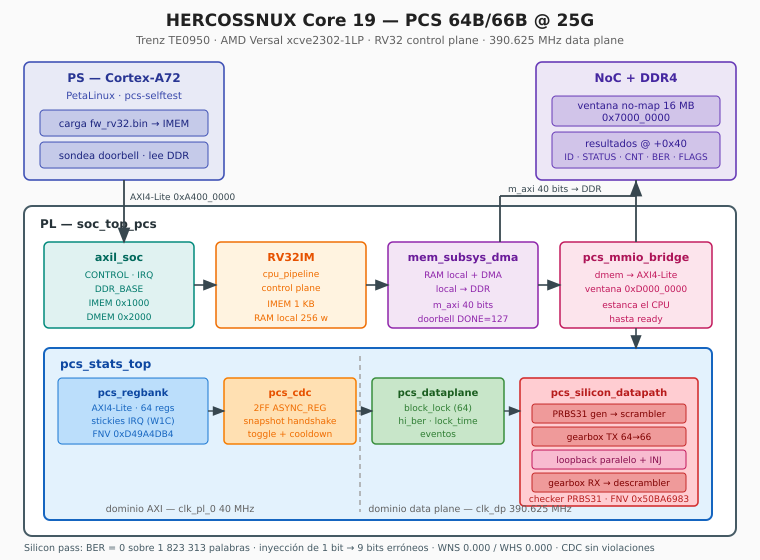

# HERCOSSNUX Core 19 — PCS 64B/66B @ 25G

A silicon-validated, tutorial-quality **64B/66B Physical Coding Sublayer** written
in VHDL-2008, integrated into a custom RV32IM soft-core SoC and validated on the
Trenz **TE0950** (AMD Versal `xcve2302-sfva784-1LP-e-S`).

The core implements the full 64B/66B transmit and receive datapath — self-
synchronous scrambler, 64→66 gearbox, block synchronisation with the IEEE 802.3
clause 49 lock threshold, de-gearbox and descrambler — driven by a PRBS31
generator and measured by a PRBS31 checker with automatic re-lock. A parallel
fabric loopback closes the link inside the PL, so the design self-tests at the
nominal 25G block rate with **zero external hardware and no serial transceiver**.

**Status: silicon-validated.** Every verification layer — Python oracles, five GHDL
simulation layers with bit-identical FNV-1a signatures, a full SoC integration run
executing the real compiled firmware on the real RV32 core, and the final on-chip
run — converges on the same deterministic results: **BER = 0** over a clean
window and **exactly 9 errored bits** from a single injected bit flip.

The data plane closes timing at **390.625 MHz** (WNS 0.000 ns, WHS 0.000 ns) on
the slowest speed grade of the device. That frequency is not arbitrary: it is the
66-bit block rate of a 25.78125 Gb/s lane, so the PCS runs at true 25G line rate.



---

## 1. Feature set (frozen scope)

- **64B/66B encoding** with the IEEE 802.3 self-synchronous scrambler
  (x^58 + x^39 + 1), transmit and receive.
- **64→66 gearbox** (TX) and **66→64 de-gearbox** (RX) with the 32/33-cycle
  framing period, including the dynamic insert/extract offset.
- **Block synchronisation** state machine with the clause 49 lock threshold of 64
  consecutive valid sync headers, plus `hi_ber` monitoring and lock-time capture.
- **PRBS31 generator and checker** (x^31 + x^28 + 1), word-parallel at 64 bits per
  clock, with automatic re-lock on a sliding error-rate window.
- **Single-bit error injection** to prove the checker detects corruption; the
  self-synchronous descrambler multiplies one injected bit into a deterministic
  9-bit error burst, which is the signature the whole verification chain checks.
- **Parallel fabric loopback**: TX word stream feeds the RX datapath directly, so
  the entire PCS is exercised without a GTYP transceiver (the AI Edge device
  variant has none available for this use).
- **RV32IM control plane**: the soft core configures the PCS, runs the bring-up
  sequence, snapshots the counters and DMAs the results to DDR — the PS only
  loads firmware and reads the answer.
- 64-register **AXI4-Lite** bank, memory-mapped into the soft core's data bus at
  `0xD000_0000` through a purpose-built MMIO bridge.

Explicitly **out of scope** (frozen before any RTL was written): 100G operation,
GTYP serial transceivers, Auto-Negotiation / Link Training, and FEC. The core is a
didactic PCS at 25G, not a complete PMD.

---

## 2. Repository layout

```
PCS_25G/
├── rtl/
│   ├── pcs_scrambler.vhd          self-synchronous scrambler / descrambler
│   ├── pcs_gearbox_tx.vhd         64 → 66 gearbox
│   ├── pcs_gearbox_rx.vhd         66 → 64 de-gearbox
│   ├── pcs_tx_datapath.vhd        scrambler + gearbox TX chain
│   ├── pcs_rx_datapath.vhd        de-gearbox + descrambler chain
│   ├── pcs_prbs31.vhd             PRBS31 generator + checker (re-lock)
│   ├── pcs_silicon_datapath.vhd   full chain + parallel loopback + injection
│   ├── pcs_regbank.vhd            AXI4-Lite register bank (64 registers)
│   ├── pcs_dataplane.vhd          block-lock FSM, hi_ber, counters, events
│   ├── pcs_cdc.vhd                clock-domain crossing (state, events, snapshot)
│   ├── pcs_stats_top.vhd          core top level (bank + CDC + FSM + datapath)
│   ├── pcs_mmio_bridge.vhd        RV32 dmem → AXI4-Lite bridge
│   ├── soc_top_pcs.vhd            SoC: RV32 + memory subsystem + PCS
│   ├── soc_top_pcs_wrap.v         Verilog wrapper for Vivado Module Reference
│   └── tb_*.vhd                   testbenches for layers 1 to 4
├── verif/
│   ├── tb_soc_pcs.vhd             layer 5 in simulation (real firmware, real SoC)
│   └── tb_soc_pcs_diag.vhd        instrumented variant used for bring-up debug
├── oracle/
│   ├── pcs_prbs_oracle.py         PRBS31 reference model + FNV signature
│   ├── pcs_regbank_oracle.py      register bank reference model
│   ├── pcs_toplevel_oracle.py     end-to-end chain reference model
│   └── gen_tb_prbs.py             testbench generator from the oracle
├── fw/
│   ├── fw_rv32.c                  RV32 firmware (silicon + SIM_FAST variants)
│   ├── build_fw_rv32.sh           firmware build script
│   ├── fw_rv32.bin / .mem         flat binary + simulation memory image
│   └── fw_rv32_sim.bin / .mem     short-window variant for GHDL
├── petalinux/
│   ├── pcs_soc.xsa                exported hardware platform
│   ├── pcs_selftest_ps.c          PS-side verification program
│   └── pcs-selftest.bb            bitbake recipe
├── vivado/
│   ├── gen_pcs_bd_tcl.sh          BD transplant script (from Core 18)
│   ├── pcs_soc_bd.tcl             generated Block Design script
│   ├── pcs_25g_cdc.xdc            CDC timing constraints
│   ├── pcs_soc.pdi                device image
│   └── timing_*.txt / cdc_*.txt   timing and CDC reports
└── doc/
    └── architecture.svg
```

---

## 3. Verification methodology

The core follows the HERCOSSNUX layered method: **scope frozen before any RTL**,
a Python oracle written before integration, and five simulation layers where the
sole pass criterion is a bit-identical FNV-1a signature or an explicit set of
properties. Each layer is accompanied by 4–5 mutations that must all fail, which
is what proves the testbench actually catches the defect class.

| Layer | Scope | Pass criterion |
|-------|-------|----------------|
| 1 | `pcs_regbank` standalone | `FNV32 = 0xD49A4DB4` |
| 2A | `pcs_dataplane` FSM | `FNV32 = 0xFFE1A09F` |
| 2B | `pcs_cdc` crossing | `LAYER2B_PASS` (integrity + event properties) |
| 3 | scrambler / gearbox / PRBS31 / full chain | `0x37DB2E32`, `0xA557DAFC`, `0x50BA6983`, `LAYER3TOP_PASS` |
| 4 | `pcs_stats_top` via AXI and via MMIO bridge | `LAYER4TOP_PASS`, `LAYER4MMIO_PASS` |
| 5 (sim) | real firmware on real RV32 SoC | `LAYER5SIM_PASS` |
| 5 (silicon) | TE0950 board | `L5 SILICON PASS` |

Layer 5 in simulation deserves emphasis: it loads the *compiled* `fw_rv32.mem`
into the soft core's instruction memory through the AXI-Lite window, releases the
core, waits for the doorbell interrupt and verifies the nine result words the
firmware DMAs to a behavioural DDR model. It is the silicon run, rehearsed.

### Running the simulations

```bash
cd ~/vhdl_repo/IP_Cores/PCS_25G
python3 oracle/pcs_prbs_oracle.py          # FNV32_PRBS=0x50BA6983
python3 oracle/gen_tb_prbs.py > rtl/tb_pcs_prbs31.vhd

rm -rf /tmp/w && mkdir -p /tmp/w
ghdl -a --std=08 --workdir=/tmp/w rtl/pcs_scrambler.vhd rtl/pcs_gearbox_tx.vhd \
  rtl/pcs_gearbox_rx.vhd rtl/pcs_tx_datapath.vhd rtl/pcs_rx_datapath.vhd \
  rtl/pcs_prbs31.vhd rtl/pcs_silicon_datapath.vhd rtl/pcs_regbank.vhd \
  rtl/pcs_dataplane.vhd rtl/pcs_cdc.vhd rtl/pcs_stats_top.vhd \
  rtl/pcs_mmio_bridge.vhd rtl/tb_*.vhd

ghdl -r --std=08 --workdir=/tmp/w tb_pcs_regbank    --stop-time=5ms  | grep LAYER1
ghdl -r --std=08 --workdir=/tmp/w tb_pcs_cdc        --stop-time=5ms  | grep LAYER2B
ghdl -r --std=08 --workdir=/tmp/w tb_pcs_prbs31     --stop-time=5ms  | grep LAYER3PRBS
ghdl -r --std=08 --workdir=/tmp/w tb_pcs_silicon    --stop-time=10ms | grep LAYER3TOP
ghdl -r --std=08 --workdir=/tmp/w tb_pcs_stats_top  --stop-time=50ms | grep LAYER4TOP
ghdl -r --std=08 --workdir=/tmp/w tb_pcs_mmio       --stop-time=50ms | grep LAYER4MMIO
```

### SoC integration run

```bash
cd ~/vhdl_repo/IP_Cores/PCS_25G/fw
bash build_fw_rv32.sh            # produces fw_rv32.mem and fw_rv32_sim.mem
# analyse ~/rv32i/*.vhd (no tb_), the DSP core rtl, the PCS rtl and verif/
ghdl -r --std=08 --workdir=/tmp/wl5 tb_soc_pcs --stop-time=250us | grep LAYER5
```

The testbench opens `fw_rv32_sim.mem` from the current directory, so it must be
run from `fw/`.

---

## 4. Architecture

The PCS is a memory-mapped peripheral on the RV32 data bus, decoded at
`0xD000_0000` (`addr[31:28] = "1101"`). Because the register bank is AXI4-Lite —
so it can be reused standalone — a bridge translates the soft core's simple
`sel/we/addr/wdata/rdata/ready` interface into AXI4-Lite transactions, stalling
the CPU through `dmem_ready` for the duration.

Two clock domains meet inside `pcs_stats_top`:

- **AXI domain** (`clk_pl_0`, 40 MHz on the TE0950): register bank, CPU, bridge.
- **Data plane** (`clk_dp`, 390.625 MHz from a clocking wizard): the entire
  64B/66B chain.

Everything that crosses is explicit: two-flop synchronisers with `ASYNC_REG` for
levels, toggle synchronisers with a cooldown for events, and a request/done
handshake with shadow registers for the counter snapshot.

### Self-test dataflow

```
PRBS31 generator ─▶ scrambler ─▶ gearbox TX (64→66) ─┐
                                                     │  parallel loopback
                                                     │  (+ optional 1-bit XOR)
PRBS31 checker ◀── descrambler ◀── gearbox RX (66→64)┘
```

The checker counts errored bits only while locked. A single injected bit is
multiplied by the self-synchronous descrambler into exactly **9** errored bits —
the injected bit plus the two feedback taps as it shifts through the 58-bit
register. That number is predicted by the Python oracle and reproduced identically
by GHDL and by silicon, which is what makes it such a strong end-to-end check.

---

## 5. Register map (MMIO, base `0xD000_0000`)

| Offset | Name | Access | Description |
|--------|------|--------|-------------|
| `0x00` | `ID` | RO | `0x50435319` |
| `0x04` | `SCRATCH` | RW | scratch register |
| `0x08` | `CTRL` | RW | b0 `PCS_EN`, b1 `TX_EN`, b2 `RX_EN`, b3 `LOOPBACK`, b4 `SCR_BYPASS`, b5 `AUTO_RESYNC` |
| `0x0C` | `CMD` | W | b0 `SOFT_RESET`, b1 `RESYNC`, b2 `CNT_CLEAR`, b3 `PRBS_RESET` (self-clearing) |
| `0x10` | `STATUS` | RO | b0 `BLOCK_LOCK`, b1 `SCR_SYNC`, b2 `HI_BER`, b3 `PRBS_LOCK`, b4 `TX_ACTIVE`, b5 `RX_ACTIVE` |
| `0x14` | `IRQ_STATUS` | RW1C | b0 lock gained, b1 lock lost, b2 hi_ber, b3 rx error, b4 `EV_PRBS_ERR`, b5 DMA done |
| `0x18` | `IRQ_ENABLE` | RW | interrupt mask |
| `0x1C` | `PRBS_CTRL` | RW | b0 `GEN_EN`, b1 `CHK_EN`, b2 `INJ` (pulse, self-clearing) |
| `0x20` | `STATS_SNAP` | W | freeze counter shadows |
| `0x24` | `CNT_TX_BLK` | RO | transmitted words (snapshot) |
| `0x28` | `CNT_RX_BLK` | RO | received blocks (snapshot) |
| `0x2C` | `CNT_RX_ERR` | RO | receive errors (snapshot) |
| `0x30` | `CNT_BER` | RO | errored bits from the PRBS checker (snapshot) |
| `0x34` | `LOCK_TIME` | RO | cycles to achieve block lock |
| `0x38` | `DMA_ADDR` | RW | DMA glue register |
| `0x3C` | `DMA_DOORBELL` | RW | DMA glue register |

A healthy locked link reads `STATUS = 0x7D`.

### axil_soc (PS side, base `0xA400_0000`)

| Offset | Name | Description |
|--------|------|-------------|
| `0x0000` | `CONTROL` | b0 = 1 holds the soft core in reset |
| `0x0004` | `STATUS` | b0 = core running |
| `0x0008` | `DBG_PC` | program counter (debug) |
| `0x000C` | `IRQ` | b0 sticky doorbell; write 1 to clear |
| `0x0010` | `DDR_BASE_LO` | physical DDR base for the DMA |
| `0x0014` | `DDR_BASE_HI` | |
| `0x1000` | IMEM window | one instruction word per address |
| `0x2000` | DMEM window | local RAM read-back |

---

## 6. DDR layout

The device tree reserves 16 MB at `0x7000_0000` with `no-map`, so Linux never
touches it. The firmware DMAs nine result words to offset `0x40`:

| Offset | Content | Expected |
|--------|---------|----------|
| `+0x40` | `ID` | `0x50435319` |
| `+0x44` | `STATUS` | `0x0000007D` |
| `+0x48` | `CNT_TX_BLK` | > 0 |
| `+0x4C` | `CNT_RX_BLK` | > 0 |
| `+0x50` | `CNT_BER` (clean window) | `0` |
| `+0x54` | `CNT_BER` (after injection) | `9` |
| `+0x58` | `IRQ_STATUS` | bit 4 set |
| `+0x5C` | FNV-1a signature over the seven words above | — |
| `+0x60` | `FLAGS` | `0xF` |

The signature covers the traffic counters, so it legitimately differs between
simulation and silicon; the deterministic words must match exactly.

---

## 7. Building the RV32 firmware

```bash
cd ~/vhdl_repo/IP_Cores/PCS_25G/fw
bash build_fw_rv32.sh
```

The script builds two flat binaries from the same source: the silicon image and a
`SIM_FAST` variant whose measurement windows are shortened so GHDL runs in ~0.2 ms
of simulated time instead of 2.75 ms. The logic and the access sequence are
identical; only the delay constants change.

The linker script discards ELF notes, comments, build-id and debug sections —
without that, they land around `.text` and corrupt the flat binary. Code lives in
the 1 KB IMEM; the stack and result slots live in the separate local RAM.

---

## 8. Vivado flow

The Block Design was transplanted from Core 18 rather than rebuilt by hand:

```bash
cd ~/vhdl_repo/IP_Cores/PCS_25G/vivado
bash gen_pcs_bd_tcl.sh     # rewrites the captured BD script for this core
```

The script performs verified surgery on the captured Tcl: renames the module
reference and its instance, removes the second PL AXI master (this core has only
one), shrinks the NoC from 8 to 7 slave interfaces and clocks, and drops the
corresponding clock association and address assignments. It self-checks that no
trace of the source core remains.

Then, in the Vivado Tcl console, **one command at a time**:

```tcl
create_project pcs_soc .../vivado/pcs_soc -part xcve2302-sfva784-1LP-e-S
set_property BOARD_PART trenz.biz:te0950_23_1lse:part0:1.2 [current_project]
# add sources (rv32i, DSP core rtl, PCS rtl, wrapper), set VHDL 2008
source .../vivado/pcs_soc_bd.tcl
create_bd_cell -type ip -vlnv xilinx.com:ip:clk_wizard clk_wizard_0
set_property -dict [list CONFIG.CLKOUT_USED {true} \
  CONFIG.CLKOUT_REQUESTED_OUT_FREQUENCY {390.625} CONFIG.USE_LOCKED {true}] \
  [get_bd_cells clk_wizard_0]
# connect pl0_ref_clk → clk_in1, clk_out1 → clk_dp, locked → dp_locked
validate_bd_design
make_wrapper -files [get_files pcs_soc_bd.bd] -top
launch_runs impl_1 -jobs 8
write_device_image -force .../vivado/pcs_soc.pdi
```

Implementation settings that close timing on this design: strategy
`Performance_Explore`, `PLACE_DESIGN` directive `Explore`, and
`POST_ROUTE_PHYS_OPT_DESIGN` enabled with `AggressiveExplore`.

---

## 9. PetaLinux + BOOT.BIN

Clone only `project-spec/` and `.petalinux` from a reference project — never
`build/`, which is ~22 GB:

```bash
mkdir -p ~/plnx_te0950_pcs
cp -a ~/plnx_te0950_mipi/project-spec ~/plnx_te0950_pcs/
cp -a ~/plnx_te0950_mipi/.petalinux    ~/plnx_te0950_pcs/
# point HARDWARE_PATH in .petalinux/metadata at petalinux/pcs_soc.xsa
cd ~/plnx_te0950_pcs
petalinux-config --get-hw-description=.../PCS_25G/petalinux --silentconfig
petalinux-build
petalinux-package boot --u-boot --force
```

Enable the application in `project-spec/configs/rootfs_config`
(`CONFIG_pcs-selftest=y`) and verify it actually reached the image before going to
the board:

```bash
zcat images/linux/rootfs.cpio.gz | cpio -t | grep -E "pcs-selftest|fw_rv32"
```

Never hot-load the PDI: the PLM rejects it with `0x03024001`. Always repackage
`BOOT.BIN`.

---

## 10. Silicon bring-up

Copy `BOOT.BIN`, `image.ub` and `boot.scr` to the FAT partition of the SD card,
`sync`, unmount, boot the board and connect at 115200 8N1:

```
root@plnxte0950:~# pcs-selftest
firmware cargado: 224 palabras
doorbell  : recibido (15183 sondeos)

=== Core 19 - PCS 64B/66B @ 25G - silicon pass ===
ID          : 0x50435319  (esperado 0x50435319)
STATUS      : 0x0000007D  (esperado 0x0000007D)
CNT_TX_BLK  : 1823313
CNT_RX_BLK  : 1768058
CNT_BER     : 0  (ventana limpia, esperado 0)
CNT_BER inj : 9  (tras inyectar 1 bit, esperado 9)
IRQ_STATUS  : 0x00000011 (EV_PRBS_ERR esperado)
firma FNV   : 0x4583F6DD
FLAGS       : 0x0000000F  (esperado 0x0000000F)

L5 SILICON PASS - PCS 64B/66B operativo a 390.625 MHz
```

**Zero bit errors over 1 823 313 transmitted words** — 116 million bits through
the complete 64B/66B datapath at nominal 25G block rate — and the single injected
bit detected as exactly the predicted 9-bit burst.

---

## 11. PS/firmware notes

- The bring-up sequence **must** issue `CMD_SOFT_RESET` after configuring `CTRL`
  and `PRBS_CTRL`. Enables arrive through independent synchronisers, so without
  an atomic restart the RX gearbox can latch mid-way through its 32/33 framing
  period and the link never syncs.
- The AXI-Lite aperture and the `no-map` DDR window are device memory. Access
  them **word by word with `volatile`**; glibc bulk operations (`memcpy`,
  `memset`, `DC ZVA`, 128-bit `stp`) fault with SIGBUS there.
- The firmware never chains two MMIO reads back to back — see section 12.
- Results reach the PS by DMA plus doorbell, not through the DMEM window: the PS
  cannot read the soft core's local RAM while the core is running.

---

## 12. Problems we hit (and how we fixed them)

**A 154-logic-level critical path in the PRBS checker (WNS −56.8 ns).** The
checker counted errors with `ec := ec + 1` inside a 64-iteration unrolled loop,
which synthesis implements literally as 64 serial 32-bit increments. Fixed by
computing a per-bit error vector, reducing it with a **popcount tree**, and
accumulating the registered result — one addition per cycle instead of 64 in
series. Lesson: an unrolled accumulation is a serial chain, no matter how it reads
in source.

**Control signals inside wide combinational cones (WNS −1.6 ns).** `is_lock` fed
the 64-bit comparison, the popcount and the re-lock decision in a single cycle.
Moving the window accounting to a registered stage removed it from the cone, at
the cost of a bounded, documented divergence: the re-lock decision lands one word
later.

**High-fanout control into a dynamic insert (WNS −0.6 ns).** The synchronised
`loopback_en` reached the RX gearbox buffer through the loopback mux in one hop.
Registering `loop_word`/`loop_valid` split the path in two, costing one cycle of
loopback latency that no property cares about.

**Misaligned start-up from staggered enables.** Writing `PRBS_CTRL` and `CTRL` as
separate transactions starts the generator before the loopback, so the RX gearbox
can lock onto a corrupt phase. Solved by the mandatory `SOFT_RESET` in the
bring-up sequence, now encoded in the testbenches and the firmware.

**A phase race in the double snapshot.** The register bank latched its shadows on
the AXI write, ~10 ns before the CDC shadow was guaranteed stable — a margin of
~2 ns against non-commensurate clocks, so it won or lost depending on phase. Fixed
with a `snap_latch_ext` port (default `'0'`, so layer 1 is untouched) that
re-latches on `axi_snap_done`.

**CDC-10 critical: combinational logic before a synchroniser.** `aresetn AND
dp_locked` fed the first flop of the reset synchroniser. Fixed the canonical way:
synchronise each signal separately and combine afterwards in the destination
domain. The final `report_cdc` has no critical and no warning entries.

**Event toggles cancelling each other.** Consecutive events in the 390 MHz domain
produced two toggles the 40 MHz domain never sampled, so the edge vanished. Each
toggle is now gated by a cooldown that guarantees a stable level for longer than
two destination cycles. The CDC testbench property was corrected accordingly:
exact event counting is physically unachievable across such a frequency ratio, and
the events only feed sticky interrupt bits — the exact counters cross through the
snapshot handshake, which is exact.

**A silent forwarding hazard in `cpu_pipeline` (now fixed).** The soft core used to
lose the **second of two consecutive `lw` instructions** when the first stalled on
a slow region and the base register was produced by the immediately preceding
instruction: the write-back in flight was squashed to a bubble during the stall,
killing its forwarding path, so the second `lw` computed its address from a stale
(zero) base. The access landed outside the peripheral window and the destination
register took residual data — a plausible wrong value with no error indication. It
was isolated by sweeping the producer-to-load distance and tracing the full bus
address (not just the offset), which pinned the fault to forwarding-during-stall
rather than the memory handshake. **Fixed** in `cpu_pipeline.vhd` with a persistent
write-back history buffer as a third forwarding level; the firmware mitigation
(`PCS_RD()` barrier) was **removed** and the firmware returned to a direct `PREG()`
read (896 → 612 bytes). Verified in simulation (dedicated regression `tb_lw_hazard_reg`,
all CPU testbenches, Layer 5 with and without the mitigation) and on silicon
(`L5 SILICON PASS`, `IRQ_STATUS=0x11` read directly). Root-cause writeup in
`~/rv32i/BUG_cpu_pipeline_lw_hazard.md` (mirror in `doc/`). This affected every SoC
in the family; the shared core is now corrected.

---

## 13. Platform lessons (Versal / TE0950)

- Set `BOARD_PART` **before** sourcing a captured BD script, or the CIPS rejects
  `ps_pmc_fixed_io` with an out-of-range property error.
- Never use `~` in Vivado Tcl; use `$env(HOME)`. Run BD commands one at a time and
  read each response — silent failures hide inside pasted blocks.
- `place_design` on Versal does not accept `-seed`, and `ExtraTimingOpt` is not a
  valid directive; the available placement directives are `Default`, `Quick`,
  `RuntimeOptimized`, `Explore` and `AggressiveExplore`.
- Timing results on a design this tight vary with the placement directive. Three
  runs landed between −0.11 and −0.06 ns; returning to `Explore` with post-route
  physical optimisation closed at exactly 0.000. The bitstream that goes to
  silicon must come from a run with WNS ≥ 0.
- GHDL 4.1 cannot index or slice an external name inline
  (`<<signal ...>>(7 downto 0)` raises an internal error). Copy it to a local
  signal with a concurrent assignment first.
- GHDL multi-file analysis converges only with a fresh work directory and each
  file analysed at most once; re-analysing a package obsoletes entities compiled
  against the previous version.

---

## 14. Toolchain

| Tool | Version |
|------|---------|
| GHDL | 4.1.0 (`--std=08`, mcode backend) |
| Vivado | 2025.2.1 |
| PetaLinux | 2025.2 |
| RV32 cross-compiler | `riscv64-unknown-elf-gcc` 13.4.0 |
| PS cross-compiler | `aarch64` (Yocto SDK from PetaLinux) |
| Python | 3 (oracles, FNV signatures) |
| Board | Trenz TE0950, AMD Versal `xcve2302-sfva784-1LP-e-S` |

---

## 15. Reproducing from scratch

```bash
# 1. simulate
cd ~/vhdl_repo/IP_Cores/PCS_25G
python3 oracle/pcs_prbs_oracle.py
python3 oracle/gen_tb_prbs.py > rtl/tb_pcs_prbs31.vhd
# analyse and run layers 1-4 (see section 3)

# 2. build firmware
cd fw && bash build_fw_rv32.sh

# 3. layer 5 in simulation
ghdl -r --std=08 --workdir=/tmp/wl5 tb_soc_pcs --stop-time=250us | grep LAYER5

# 4. Vivado
cd ../vivado && bash gen_pcs_bd_tcl.sh
#    create the project, source the BD script, add the clocking wizard,
#    implement and write the device image (section 8)

# 5. PetaLinux
#    clone project-spec + .petalinux, import the XSA, build, package boot

# 6. silicon
#    copy BOOT.BIN + image.ub + boot.scr to the SD card, boot, run pcs-selftest
```

---

**License:** MIT. Part of the HERCOSSNUX open-source IP family.
