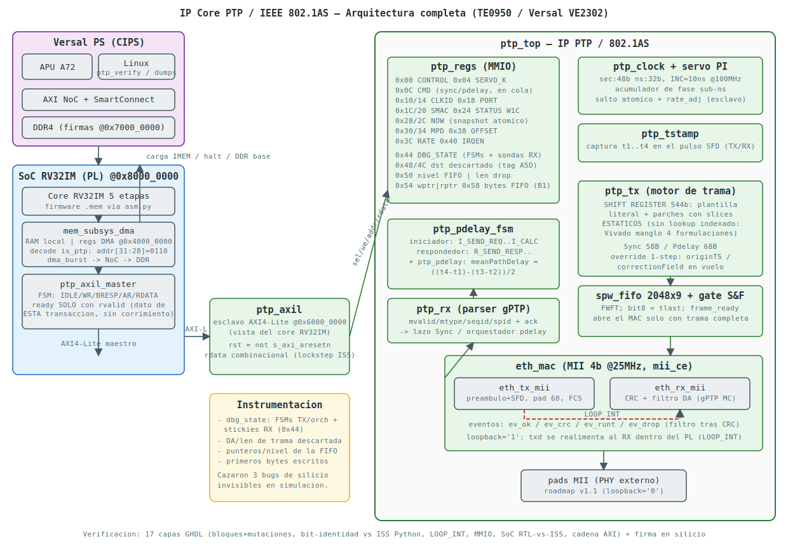

# PTP / IEEE 802.1AS IP Core — RV32I SoC v3 (TE0950 / AMD Versal)

A complete **generalized Precision Time Protocol** endpoint (gPTP,
IEEE 802.1AS-2020 profile of PTPv2) in **VHDL-2008** for the RV32IM SoC v3,
taken from first RTL line to working silicon on a **Trenz TE0950**
(AMD Versal `xcve2302-sfva784-1LP-e-S`): PTP clock with PI servo, hardware
SFD timestamping, peer-delay measurement, master/slave Sync loop and its own
MII Ethernet MAC — verified **bit-identical against a Python ISS oracle**
across a 17-check GHDL regression and validated on the board.

**Silicon status: PASS.**

```
sig[0] STATUS   = 0x00000001  OK
sig[1] MPD_LO   = 0x00000028  OK   (meanPathDelay = 40 ns, LOOP_INT)
sig[2] MPD_HI   = 0x00000000  OK
sig[3] OFFSET   = 0x00000000  OK   (slave servo converged)
sig[4] DOORBELL = 0x0000D0ED  OK
PTP SILICON PASS
```

All three flows (master Sync, peer-delay, slave Sync with servo) pass the
full self-test on the board, with **WNS = +1.171 ns** at 100 MHz.



---

## 1. What this core is for

802.1AS is the time plane of TSN (Time-Sensitive Networking): every node
shares a common clock with nanosecond-class accuracy so that traffic shaping
(802.1Qbv), scheduled I/O and time-stamped telemetry become possible. This
core gives an RV32 SoC a memory-mapped gPTP endpoint:

- An **80-bit PTP clock** (48 b seconds : 32 b nanoseconds) with a sub-ns
  phase accumulator, 10 ns nominal increment at 100 MHz, fine rate adjustment
  and a single atomic offset jump for initial correction.
- **Hardware timestamping at the SFD** (t1…t4) on both TX and RX, independent
  of software latency.
- **Peer-delay in hardware**: an initiator/responder orchestrator runs the
  Pdelay_Req/Resp exchange and computes
  `meanPathDelay = ((t4−t1)−(t3−t2))/2`.
- **Master/slave Sync loop**: as slave, a PI servo steers offset and drift
  against the master.
- Its **own MII 4-bit Ethernet MAC**: preamble/SFD, padding to 60 bytes,
  hardware FCS, gPTP multicast DA filter, and a 1-step **override** that
  injects `originTimestamp` / `correctionField` into the frame *in flight*.
  `LOOP_INT` feeds TX back into RX inside the PL for a fully self-contained
  silicon self-test — no PHY required.

Typical uses: the time base for an 802.1Qbv time-aware shaper, time-stamped
payload telemetry on satellite platforms, deterministic multi-node buses, or
a TSN lab testbench with no closed IP anywhere in the chain.

**v1 scope** (frozen at project start): PTP clock + servo, SFD timestamping,
Sync master/slave, peer-delay, MII MAC with `LOOP_INT`, MMIO + AXI4-Lite
control, embedded AXI-Lite master for the RV32 core. **Not** in v1: BMCA /
Announce, periodic hardware Sync, two-step follow-up, external PHY bring-up
(v1.1, pads already routed when `loopback=0`).

## 2. Requirements

Hardware:

- Trenz TE0950 carrier with the AMD Versal `xcve2302-sfva784-1LP-e-S`
  (board part `trenz.biz:te0950_23_1lse:part0:1.2`), SD card for boot.
- No external Ethernet hardware is needed: the silicon self-test runs
  entirely in internal loopback.

Software (versions used for the silicon PASS — Vivado and PetaLinux
**must** match major/minor):

| Tool | Version | Used for |
|---|---|---|
| GHDL | 4.1.0 (`--std=08`, mcode) | the full simulation regression |
| Python 3 | any recent | ISS oracle, bit-identity verifiers, `asm.py` (RV32 assembler) |
| Vivado | 2025.2.1 | synthesis / implementation (module-reference BD) |
| PetaLinux | 2025.2.1 | Linux image + Versal BOOT.BIN |
| gcc-aarch64-linux-gnu | any recent | cross-compiling the bring-up tools (`-static`) |

On Ubuntu 24.04: `sudo apt install ghdl gcc-aarch64-linux-gnu python3 zip`.
The flow assumes the RV32IM SoC v3 sources (`~/rv32i`: core,
`mem_subsys_dma.vhd`, `dp_ram`, `dma_burst`, `asm.py`).

## 3. Feature summary

- IEEE 802.1AS frame set: Sync (1-step), Pdelay_Req, Pdelay_Resp, all built
  bit-identical to the Python oracle.
- Frame construction by a **544-bit shift register** loaded at command time:
  hex-literal template + dynamic fields patched through **static** slices.
  No indexed template lookup exists in the TX path — this is deliberate, see
  problem #2.
- Store-and-forward TX: 2048×9 FWFT FIFO (bit 8 = tlast) and a gate that
  only opens the MAC once the frame is complete.
- RX frame classification with end-of-frame events `ev_ok / ev_crc /
  ev_runt / ev_drop` (DA filter evaluated **after** CRC — an intact frame
  with a wrong DA reads as `drop`, which is diagnostic gold).
- Command queueing: a `send_sync` issued while the previous frame is still
  draining is **deferred, never dropped**.
- Atomic 80-bit reads: reading `NOW_SEC` freezes `NOW_NS`; reading `MPD_LO`
  freezes `MPD_HI`.
- Silicon-grade debug: registers `0x44–0x58` expose FSM states, RX sticky
  events, the DA and length of the last filtered frame, live FIFO
  pointers/level and the first bytes written per frame — each probe carries
  a **presence tag** so the silicon itself reports which instrumentation it
  contains.

## 4. SoC memory map

The RV32 core's internal dmem bus decodes `addr[31:28]`:

| Region | Decode | Contents |
|---|---|---|
| `0x0000_0000` | `addr[31:30]="00"` | Local dual-port RAM, also the DMA's local side |
| `0x4000_0000` | `"0100"` | SoC `dma_burst` registers: 0x00 SRC, 0x04 DST, 0x08 LEN, 0x0C CTRL, 0x10 STATUS |
| `0x6000_0000` | `"0110"` | **PTP IP (this core)**, via `ptp_axil_master` → `ptp_axil` |

These are *internal* RV32 addresses. From the A72/PS side:

| Physical address | Contents |
|---|---|
| `0x8000_0000` (64 KB) | AXI4-Lite slave: core control (0x00 halt), DBG_PC (0x08), DDR_BASE (0x10/0x14), IMEM window at +0x1000 |
| `0x7000_0000` (16 MB) | Reserved no-map DDR: the `dma_burst` report buffer read by the bring-up over `/dev/mem` |

The PTP accesses ride an embedded AXI4-Lite master (`ptp_axil_master`) that
stalls the core (`ready=0`) until the transaction completes. **Contract:
`ready` is asserted only in the cycle where `rdata` already holds the data
of *this* transaction** (captured at `rvalid`) — see problem #1 for why this
sentence exists.

## 5. PTP register map (RV32 base `0x6000_0000`)

| Offset | Name | Access | Description |
|---|---|---|---|
| 0x00 | CONTROL | RW | b0 **role_slave**, b1 **loopback** (`LOOP_INT`), b2 **enable** |
| 0x04 | SERVO_K | RW | PI servo gains (packed kp/ki shifts) |
| 0x08 | LAT | RW | fixed latency compensation |
| 0x0C | CMD | W1P | Write-triggered: b0 **send_sync**, b1 **start_pdelay**. Commands issued while a frame is in flight are **queued**, never silently dropped |
| 0x10 / 0x14 | CLKID_HI/LO | RW | clockIdentity (64 b) |
| 0x18 | PORTNUM | RW | portNumber |
| 0x1C / 0x20 | SMAC_HI/LO | RW | source MAC for outgoing frames |
| 0x24 | STATUS | R / W1C | b0 rx_sync, b1 rx_resp, b2 mpd_valid, b3 offset_valid (writing 1 clears) |
| 0x28 | NOW_SEC | R | seconds; **reading it freezes NOW_NS** (atomic 80-bit read) |
| 0x2C | NOW_NS | R | nanoseconds of the snapshot |
| 0x30 | MPD_LO | R | meanPathDelay low; **reading it freezes MPD_HI** |
| 0x34 | MPD_HI | R | meanPathDelay high |
| 0x38 | OFFSET | R | last measured offset (slave) |
| 0x3C | RATE_ADJ | R | servo output |
| 0x40 | IRQEN | RW | interrupt mask mirroring STATUS |
| 0x44 | DBG_STATE | R | TX/orchestrator FSMs + RX stickies (ev_ok/crc/runt/drop, last mtype, message counter) |
| 0x48 / 0x4C | DBG_DST | R | DA of the last frame **dropped by the filter**; `0x4C[31:20] = 0xA5D` = probe present |
| 0x50 | DBG_FIFO | R | `[27:16]` live FIFO level, `[11:0]` dropped-frame length |
| 0x54 | DBG_PTR | R | `[26:16]` FIFO wptr, `[10:0]` rptr |
| 0x58 | DBG_BYTES | R | `[31:24] = 0xB1` tag; bytes 14/35/0 as written into the FIFO (TX path self-check; healthy pdelay reads `0xB1021101`) |

Bus contract (family pattern): `sel` is a 1-cycle qualified request, `we`
the collapsed write strobe, `rdata` **combinational** during the `sel`
cycle (required by the layer-4 RTL-vs-ISS lockstep). `rst` is synchronous
active-high; `ptp_axil` derives it as `not s_axi_aresetn`.

## 6. How to use it (software)

Master bring-up, peer-delay and slave loop from the RV32 (C-flavoured
pseudocode; `PTP = (volatile uint32_t*)0x60000000`):

```c
PTP[0x00/4] = 0x6;           // CONTROL = enable | loopback (master role)
PTP[0x04/4] = 0x00400010;    // SERVO_K
PTP[0x10/4] = 0x00112233;    // CLKID_HI
PTP[0x14/4] = 0x44556677;    // CLKID_LO
PTP[0x18/4] = 1;             // PORTNUM
PTP[0x24/4] = 0xF;           // clear stickies (W1C)

PTP[0x0C/4] = 0x1;                             // Sync
while (!(PTP[0x24/4] & 0x1)) ;                 // STATUS.rx_sync

PTP[0x0C/4] = 0x2;                             // peer-delay
while (!(PTP[0x24/4] & 0x4)) ;                 // STATUS.mpd_valid
uint32_t mpd = PTP[0x30/4];                    // freezes MPD_HI; expect 40 (ns) in LOOP_INT

PTP[0x00/4] = 0x7;                             // slave role
PTP[0x24/4] = 0xF; PTP[0x0C/4] = 0x1;          // Sync as slave
while (!(PTP[0x24/4] & 0x1)) ;
int32_t off = PTP[0x38/4];                     // expect 0 in LOOP_INT
```

Atomic time read: read `NOW_SEC` first (snapshots `NOW_NS`), then `NOW_NS`.
The layer-4 program `fw/ptp_bringup.s` is the reference driver: the three
flows above plus the DMA report to DDR with the `0xD0ED` doorbell.

## 7. Verification — the layers

One script, 17 checks, GHDL `--std=08`, every TX frame verified
**bit-identical** against an independent Python ISS oracle:

```bash
cd sim && ./run_regression.sh
# -> === TODAS LAS VERIFICACIONES PASAN ===
```

| Layer | Checks | What it proves |
|---|---|---|
| 1a | clock/PI servo, SFD timestamping, meanPathDelay, pdelay orchestrator, **TX Sync bit-identical**, **TX Pdelay bit-identical** | each block against its Python model, armed with RTL mutations; TX frames byte-for-byte vs the oracle |
| 1b | gPTP RX parser | classification, spid/seqid extraction, ack handshake |
| 1c | Sync loopback, Pdelay loopback (mpd = 40 ns), slave servo loop, Sync→Pdelay race | full `LOOP_INT` integration at `ptp_mac` level |
| 2 | register bank, IP top end-to-end | MMIO contract: reset values, W1C, snapshots, command pulses |
| 4 | SoC 3-flows vs ISS | the RV32 runs the bring-up program; RTL executes in lockstep with the ISS |
| AXI | AXI4-Lite wrapper, **core-side chain (A1–A8)** | `ptp_axil` protocol + the full `master → axil → top` chain with anti-skew assertions: immediate readback, `NOW_NS` a multiple of the increment *and* advancing, back-to-back reads of three registers, second Sync issued mid-drain, pdelay through the chain |

The A1–A8 assertions exist because of problem #1: they were written to
reproduce the exact silicon failure signatures in simulation, and they stay
as permanent regression armour.

## 8. Layer 5 — silicon flow

### 8.1 Vivado (2025.2.1)

```bash
cd vivado_ptp
cat > rebuild_full.tcl <<'EOF'
open_project ptp_soc.xpr
update_module_reference [get_ips]
reset_run synth_1 -prev_step
reset_run impl_1 -prev_step
launch_runs impl_1 -to_step write_device_image -jobs 8
wait_on_run impl_1
open_run impl_1
report_timing_summary -delay_type max -max_paths 3 -file timing_check.rpt
write_hw_platform -fixed -force ../ptp_soc.xsa
EOF
vivado -mode batch -notrace -source rebuild_full.tcl
grep -A6 "Design Timing Summary" timing_check.rpt | tail -2   # WNS must be > 0

# TIMESTAMP LOCK (lesson #4) — mandatory before trusting any board result:
# the module-ref synthesis log MUST be newer than your last RTL edit.
ls -la ../rtl/ptp_tx.vhd \
       ptp_soc.runs/bd_soc_usart_u_soc_ptp_0_synth_1/runme.log

# Audit the REAL file list the module-ref synthesis reads (lesson #3):
grep read_vhdl ptp_soc.runs/bd_soc_usart_u_soc_ptp_0_synth_1/*.tcl
```

### 8.2 PetaLinux (2025.2.1) and SD

```bash
source ~/Petalinux/settings.sh
cd ~/plnx_te0950_ptp
petalinux-config --get-hw-description=/path/to/PTP/ptp_soc.xsa --silentconfig
ls -la project-spec/hw-description/ptp_soc.pdi    # must carry TODAY's date
petalinux-build
petalinux-package --boot --force --plm --psmfw --u-boot --dtb images/linux/system.dtb
```

Versal requires packaging with `--plm --psmfw`; without them the PLM rejects
the PDI. The IP is driven from the RV32 firmware and inspected over
`/dev/mem`, so no kernel driver and no new DT node are needed.

```bash
udisksctl mount -b /dev/sda1
cp images/linux/BOOT.BIN /media/$USER/BOOT/
cp ~/rv32i/ptp_bringup.mem ~/rv32i/ptp_verify bringup/ptp_signature.txt /media/$USER/BOOT/
sync && umount /dev/sda1
```

### 8.3 Bring-up on the target

Firmware and tools (host side):

```bash
cd ~/rv32i
python3 asm.py ../PTP/fw/ptp_bringup.s ptp_bringup.mem
aarch64-linux-gnu-gcc -static -o ptp_verify ../PTP/bringup/ptp_verify.c
```

On the TE0950 (serial console; the SD auto-mounts at
`/run/media/BOOT-mmcblk1p1`):

```bash
cd /run/media/BOOT-mmcblk1p1
./ptp_verify ptp_bringup.mem ptp_signature.txt
# -> sig[0] STATUS=0x1  sig[1] MPD=0x28  sig[3] OFFSET=0
#    sig[4] DOORBELL=0xD0ED  ->  PTP SILICON PASS
```

It halts the core, loads the layer-4 program through the IMEM window,
releases it, waits for the doorbell in DDR and compares the five result
words against the ISS-derived signature — the same program, byte-identical,
that passed layer 4 in simulation.

Diagnostics (`ptp_dump_dbg`, `ptp_dump_pd` + their `.mem` firmwares) drive a
single flow with a bounded wait and dump the `0x44–0x58` probes with an
automatic verdict. Discipline: **power-cycle between runs and run the
diagnostic as the first operation of the boot** — the IP is not reset
between firmware loads, so the sticky probes accumulate history.

## 9. Problems faced during the project

An honest log. Every entry was invisible in simulation and was cornered on
the board by the `0x44–0x58` probes; two are genuine toolchain traps worth
memorising.

1. **One-transaction skew in the AXI-Lite master.** Every MMIO read returned
   the data of the *previous* read: `NOW_NS` returned `NOW_SEC` (betrayed
   because the value tracked board uptime and was not a multiple of the
   10 ns increment), CONTROL readback returned stale garbage — while every
   simulation passed. Cause: the lost original master asserted `dmem_ready`
   on **address acceptance** (`arready`) instead of **data arrival**
   (`rvalid`). Rewritten with a hard rule — `ready` only in the cycle where
   `rdata` holds *this* transaction's data — and armoured with the A1–A8
   anti-skew assertions. Moral: in an AXI master, ready-to-CPU is a
   data-side event, never an address-side one.
2. **Vivado 2025.2.1 mis-synthesised the indexed template lookup — four
   formulations in a row** (the interesting one). Pdelay frames left TX with
   a zeroed header (DA `00:…:00`, valid FCS, RX filter drop) while Sync
   worked and GHDL passed everything. The probes proved the zeros were
   already **inside the FIFO** and that dynamic patches (clockIdentity) from
   the *same* logic cone came out right. What Vivado broke, in order:
   (a) constants initialised from **nested** functions returning
   unconstrained arrays → whole template zeroed; (b) flattened single-level
   functions → same; (c) **literal** constants + a flat `case` inside the
   function → the index reached the decode with **bit 5 stuck high**
   (`ROM(i|32)`, measured on silicon: byte 14 returned byte 46);
   (d) a standalone combinational process with the same `case` → identical
   `i|32` signature. Definitive fix: **remove the index**. `ptp_tx` now
   loads the whole frame into a 544-bit shift register at command time
   (hex-literal template, static-slice patches) and `S_PUSH` just shifts
   8 bits per cycle. Bit-identity vs the oracle was re-proven after the
   rewrite. Moral: distrust any VHDL function that indexes a table with a
   signal under Vivado 2025.2.1 — however innocent, and even though GHDL
   (which implements the correct semantics) simulates it perfectly. Prefer
   shift registers or canonical synchronous ROMs, and verify the TX path
   **on silicon** with probes (`0x58` must read `0xB1021101` after a
   pdelay).
3. **Ghost source file.** After adding debug ports, synthesis failed with
   `formal port <dbg_wptr> is not declared in <spw_fifo>` — the repo file
   was correct. The `.xpr` referenced `~/spw_ip/spw_fifo.vhd`, a copy from a
   *different* project, functionally identical until the day it wasn't.
   Fixed by re-pointing the project (`remove_files` + `add_files` +
   `set_property file_type {VHDL 2008}`). Moral: a self-contained IP must
   not reference sources outside its tree; audit the real `read_vhdl` list
   of the module-ref synthesis run and `find ~ -name file.vhd` for
   duplicates.
4. **Stale bitstreams: the fix that "didn't work" was never synthesised.**
   Twice a board test ran on a bitstream built *before* the corrected RTL
   was copied in (once a wrong folder, once a minutes-level race between the
   `cp` and Vivado's file read). Hours were spent doubting a correct fix.
   Moral: the **timestamp lock** of §8.1 before every board test, plus
   **presence tags** in the debug registers (`0xA5D`, `0xB1`) so the silicon
   itself declares which instrumentation build it carries — killing the
   "reads zero or doesn't exist?" ambiguity forever.
5. **31 bits into a 32-bit vector.** The original `dbg_state` filler
   aggregate was miscounted by one; GHDL reports it as a bound-check failure
   at elaboration (and Vivado refuses to synthesise it — which is itself
   evidence about what a given bitstream can contain). Count your
   concatenations.
6. **Silently dropped commands.** A `CMD.send_sync` issued while the
   previous frame was still draining was lost (a 1-cycle pulse against a
   busy gate) and looked like a hang in back-to-back software tests. Now
   queued (`sync_pend`) and launched when the engine frees. In real 802.1AS
   (Sync every 125 ms) this never fires — bring-up software is exactly
   where it does.
7. **`rx_sync` fires before the frame finishes.** In loopback the parser
   raises the event as soon as the needed fields are parsed, ~100 cycles
   before the MAC finishes the wire and the FIFO drains. Reading
   `DBG_STATE` immediately after shows a purge transient
   (`tx_inflight=1`, sometimes `frame_ready=1`) that is **not** a stall.
   Diagnose stuck-vs-transient by re-reading after a delay, or by whether a
   subsequent command completes.
8. **The IP is not reset between firmware runs**, so sticky probes and the
   orchestrator's state survive across diagnostics and poison each other's
   readings. Experiment discipline: real power-cycle between runs, one
   variable at a time, diagnostic first in the boot.

Working practices distilled: run the regression before every synthesis
(17 checks in under a minute); keep the `0x44–0x58` instrumentation until
the IP is stable in its final system (its LUT cost is negligible and it
found every silicon bug in this log); keep **both** repos (this one and the
RV32 SoC) under git — the original AXI master was lost precisely to an
unversioned tree; when porting to another Vivado version, re-validate the TX
path with the probes before trusting anything.

## 10. Known limitations and roadmap

- **No external PHY in v1**: `loopback=1` for the silicon self-test;
  `loopback=0` already routes the MII pads but is unvalidated against real
  hardware (IO constraints and, if the PHY provides its own RX clock, a CDC
  stage — v1.1). Interoperability is therefore proven against the Python
  oracle and RTL loopback, not yet against foreign equipment.
- **No BMCA / Announce** — master/slave role is set by software (v2, layered
  on this core).
- **Sync is software-triggered**; a programmable periodic hardware Sync and
  two-step follow-up are roadmap items.
- `IRQEN` exists but the `irq` line is not yet wired to the PS GIC / a UIO
  driver.
- Longer term: port the time plane (clock + timestamping) under an
  MRMAC/GTY serdes MAC for 10/25G on VCK190, and build the 802.1Qbv
  time-aware shaper on top of `NOW` — the TSN goal this core exists for.

## 11. File map

| File | Role |
|---|---|
| `rtl/ptp_pkg.vhd` | global constants (SEC_W, NS_W, nominal increment) |
| `rtl/ptp_msg_pkg.vhd` | gPTP frame layouts, field offsets, reference templates |
| `rtl/eth_pkg.vhd` | Ethernet / CRC32 helpers |
| `rtl/ptp_clock.vhd` | PTP clock + PI servo (atomic jump, rate_adj) |
| `rtl/ptp_tstamp.vhd` | SFD timestamp capture (t1…t4) |
| `rtl/ptp_tx.vhd` | frame engine: **544-bit shift register**, static-slice patches, override arming |
| `rtl/ptp_rx.vhd` | gPTP parser (mvalid/mtype/seqid/spid + ack) |
| `rtl/ptp_pdelay.vhd`, `rtl/ptp_pdelay_fsm.vhd` | meanPathDelay arithmetic + initiator/responder orchestrator |
| `rtl/eth_tx_mii.vhd`, `rtl/eth_rx_mii.vhd`, `rtl/eth_mac.vhd` | MII serialiser/deserialiser, CRC, DA filter, LOOP_INT mux, `mii_ce` divider |
| `rtl/spw_fifo.vhd` | 9-bit FWFT frame FIFO (family pattern) + pointer debug taps |
| `rtl/ptp_mac.vhd` | TX/RX/orchestrator integration, S&F gate, command queue, silicon probes |
| `rtl/ptp_regs.vhd`, `rtl/ptp_top.vhd` | MMIO register bank and IP top |
| `rtl/ptp_axil.vhd`, `rtl/ptp_axil_master.vhd` | AXI4-Lite slave wrapper and the embedded core-side master |
| `sim/run_regression.sh`, `sim/tb_*.vhd`, `sim/iss_*.py`, `sim/verify_*.py` | the 17-check regression and the Python oracle |
| `fw/ptp_bringup.s`, `fw/ptp_diag_*.s` | layer-4 / bring-up and targeted-diagnostic RV32 programs |
| `bringup/ptp_verify.c`, `bringup/ptp_dump_*.c`, `bringup/ptp_signature.txt` | silicon bring-up over `/dev/mem` + probe decoders with automatic verdicts |
| `vivado_ptp/`, `vivado/` | Vivado project and rebuild TCL |
| `architecture.svg` | block diagram (embedded above) |

## 12. Results record

| Stage | Result |
|---|---|
| Regression | 17/17 PASS (GHDL 4.1.0, `--std=08`) |
| TX bit-identity | Sync and Pdelay frames byte-identical to the Python ISS oracle |
| LOOP_INT | mpd = 40 ns, offset = 0, Sync→Pdelay race clean |
| Core-side AXI chain | A1–A8 anti-skew assertions PASS |
| Timing | WNS = **+1.171 ns** (100 MHz, `xcve2302-1LP`) |
| Silicon | **`PTP SILICON PASS`** — 3 flows, LOOP_INT, TE0950; probes `0x58 = 0xB1021101` |

## License

MIT License

Copyright (c) 2026 Adrián Hernández

Permission is hereby granted, free of charge, to any person obtaining a copy
of this software and associated documentation files (the "Software"), to deal
in the Software without restriction, including without limitation the rights
to use, copy, modify, merge, publish, distribute, sublicense, and/or sell
copies of the Software, and to permit persons to whom the Software is
furnished to do so, subject to the following conditions:

The above copyright notice and this permission notice shall be included in
all copies or substantial portions of the Software.

THE SOFTWARE IS PROVIDED "AS IS", WITHOUT WARRANTY OF ANY KIND, EXPRESS OR
IMPLIED, INCLUDING BUT NOT LIMITED TO THE WARRANTIES OF MERCHANTABILITY,
FITNESS FOR A PARTICULAR PURPOSE AND NONINFRINGEMENT. IN NO EVENT SHALL THE
AUTHORS OR COPYRIGHT HOLDERS BE LIABLE FOR ANY CLAIM, DAMAGES OR OTHER
LIABILITY, WHETHER IN AN ACTION OF CONTRACT, TORT OR OTHERWISE, ARISING
FROM, OUT OF OR IN CONNECTION WITH THE SOFTWARE OR THE USE OR OTHER DEALINGS
IN THE SOFTWARE.
