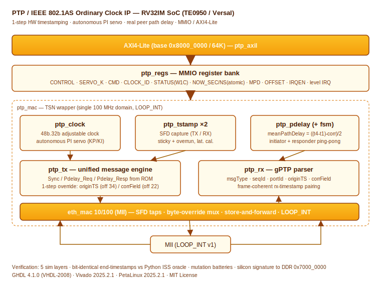

# PTP / IEEE 802.1AS Ordinary Clock IP Core

A synthesizable VHDL-2008 IP core implementing an IEEE 802.1AS (gPTP) Ordinary
Clock with hardware 1-step timestamping, an autonomous in-RTL PI servo, and a
real hardware peer path delay measurement. Designed for a custom RV32IM SoC on
the Trenz TE0950 board (AMD Versal `xcve2302-sfva784-1LP-e-S`) and verified
across five simulation layers against a Python instruction-set-simulator oracle.

Part of a silicon-validated IP family (USART → SPI → IIC → I3C → CAN →
SpaceWire → MIL-STD-1553B → Ethernet MAC 10/100 → **PTP/802.1AS**). MIT licensed.



## 1. Features

- **Ordinary Clock**, single logical port, slave+master switchable via a control
  register (no BMCA; role is register-forced).
- **1-step hardware timestamping at the SFD** (nibble `0xD`), identical TX/RX
  convention. `originTimestamp` and `correctionField` are patched in-fly by a
  byte-override mux inside the MAC so the FCS covers the patched bytes.
- **48b seconds + 32b nanoseconds** adjustable clock with a phase accumulator at
  100 MHz (~0.023 ppb resolution).
- **Autonomous PI servo in RTL**: single initial offset jump plus continuous
  rate adjustment; the integral accumulates at full resolution and is truncated
  only on read. KP/KI are MMIO-configurable; the shift factors are fixed by
  generics.
- **Real mean path delay** via a hardware Pdelay exchange (not zero), computed
  in RTL as `((t4 - t1) - correctionField) / 2` using signed total-nanosecond
  arithmetic.
- **MMIO / AXI4-Lite** register interface with atomic clock snapshot, W1C sticky
  status bits, and a level interrupt.

## 2. Repository layout

```
rtl/         canonical VHDL-2008 sources (IP + shared eth_pkg, spw_fifo)
sim/         Python ISS oracle, testbenches, regression script
fw/          RV32IM bring-up firmware (asm.py assembler)
vivado/      Tcl project-build script (2025.2.1)
petalinux/   embedded Linux build notes (2025.2.1)
docs/        architecture SVG
```

## 3. Block architecture

The datapath lives in a single 100 MHz clock domain (no CDC). `eth_mac`'s
`mii_ce` clock-enable divides to the 25 MHz nibble rate; every engine advances
only on that enable. `ptp_mac` is the TSN wrapper that instantiates the clock,
the two SFD timestampers, the TX message engine, the RX parser, the peer-delay
orchestrator, the mean-path-delay block, and the slave Sync loop, wrapping the
`eth_mac` with internal loopback (`LOOP_INT`). `ptp_regs` exposes everything via
MMIO; `ptp_top` joins the two; `ptp_axil` adapts to AXI4-Lite.

## 4. Register map

Word offsets from the base (byte offset = word × 4):

| Off  | Name      | Access | Contents |
|------|-----------|--------|----------|
| 0x00 | CONTROL   | rw     | [0] role_slave, [1] loopback, [2] enable |
| 0x04 | SERVO_K   | rw     | [31:16] KP, [15:0] KI |
| 0x08 | LAT       | rw     | [31:16] tx_lat, [15:0] rx_lat (SFD latency cal.) |
| 0x0C | CMD       | w      | [0] send_sync, [1] start_pdelay (auto-clear) |
| 0x10 | CLKID_HI  | rw     | clockIdentity[63:32] |
| 0x14 | CLKID_LO  | rw     | clockIdentity[31:0] |
| 0x18 | PORTNUM   | rw     | [15:0] portNumber |
| 0x1C | SMAC_HI   | rw     | source MAC[47:32] |
| 0x20 | SMAC_LO   | rw     | source MAC[31:0] |
| 0x24 | STATUS    | r/W1C  | [0] rx_sync, [1] rx_resp, [2] mpd_valid, [3] offset_valid |
| 0x28 | NOW_SEC   | r      | seconds (reading it freezes NOW_NS) |
| 0x2C | NOW_NS    | r      | nanoseconds (atomic snapshot) |
| 0x30 | MPD_LO    | r      | meanPathDelay[31:0] (reading it freezes MPD_HI) |
| 0x34 | MPD_HI    | r      | meanPathDelay[63:32] |
| 0x38 | OFFSET    | r      | last measured offset (signed ns) |
| 0x3C | RATE_ADJ  | r      | current servo rate adjustment |
| 0x40 | IRQEN     | rw     | interrupt mask (bit-aligned with STATUS) |

`irq = OR(STATUS and IRQEN)` — level-sensitive. The clock snapshot is atomic:
reading `NOW_SEC` latches `NOW_NS` so the seconds/nanoseconds pair never tears at
a second boundary. `MPD_LO`/`MPD_HI` follow the same rule.

## 5. 1-step timestamping and the override

The SFD timestamp of a frame is only available once transmission starts, so the
`originTimestamp` (offset 34) and the `correctionField` (offset 22) are patched
in-fly by a byte-override mux inside `eth_tx_mii`, feeding both the MII output and
the CRC so the FCS stays correct. The TX engine drives the override window
`{enable, offset, length, data}`; the value is loaded when the SFD timestamp of
the frame becomes available.

## 6. Peer path delay

The initiator sends `Pdelay_Req` and captures t1; the responder receives it
(t2), replies with `Pdelay_Resp` carrying the residence time `t3 - t2` in the
`correctionField`, and the initiator captures t4. The orchestrator drives both
roles (auto ping-pong in loopback). Residence is computed in the TX engine at
the moment t3 (the Resp SFD) is captured. Mean path delay uses signed
total-nanosecond arithmetic so the second boundary needs no special case.

## 7. Slave Sync loop

In slave mode, a received Sync yields
`offset = t_slave_rx - t_master_origin - meanPathDelay`, pulsed into the servo on
the rising edge of the event. Once the mean path delay is measured, it cancels
the loopback latency, so the residual offset settles to ~0 — i.e. synchronized.

## 8. Verification methodology

Five deterministic simulation layers, each with bit-identical end-timestamps as
the pass criterion:

- **1a** block-level vs Python ISS, with mutation batteries that must *fail*
  (anti-common-mode; e.g. the peer-delay sign mutation is explicitly covered).
- **1b** RX parser vs ISS.
- **1c** RTL-vs-RTL integration in `LOOP_INT` (Sync, full peer-delay, slave
  loop, and the Sync→Pdelay sequence), including a phase-0 anti-common-mode
  check and an independent cable watchdog.
- **2** MMIO register bank vs a bus BFM (atomic snapshot, W1C stickies with
  set-wins-over-clear, level IRQ).
- **4** full SoC vs the `iss_ptp.py` MMIO oracle over the register interface,
  bit-identical on STATUS / MPD / OFFSET across all three flows.

Run it all:

```
cd sim && ./run_regression.sh
```

Requires GHDL 4.1.0 (`--std=08`) and Python 3. Expect 15 `PASS` lines.

## 9. Notable bugs caught in verification

- MAC destination-filter byte order (the `dst` vector is assembled little-endian
  per byte): the filter constant must be `0x0E0000C28001`, not `0x0180C200000E`
  — otherwise every frame is dropped on silicon.
- A one-cycle parser race: `msg_valid` stayed high from the previous message
  while `msg_type`/`rx_ns` were already being overwritten by the in-progress
  frame, so the responder captured an inconsistent t2 and the residence went
  wrong. Fixed by clearing `msg_valid` at the first byte of every new frame.
- Signed `sec × 1e9` products must be wrapped in `resize` to avoid 64-bit
  overflow; VHDL integer is 32-bit, so `2**40`-class constants are built with
  `shift_left(to_signed(1,64), n)`.

## 10. Firmware bring-up

`fw/ptp_bringup.s` (RV32IM, `asm.py` assembler) configures the IP, runs the
Sync → Pdelay → slave sequence, and writes a result signature to the reserved
DDR window at `0x7000_0000` for bit-identical comparison against `iss_ptp.py`.
Assembler constraints: no `la`/`lbu`/`.byte`; addresses via `li` + arithmetic;
`jalr rd, N(rs1)`; `lui` packs bits 31:12.

## 11. Vivado build (2025.2.1)

See `vivado/ptp_soc.tcl`. Clone the `eth_soc` project with `save_project_as`,
clear incremental-checkpoint and remote `.dcp`/`.bd` residue, add the RTL as
VHDL-2008, instantiate `ptp_axil`, and wire the PL AXI master to the IP's
`s_axi` through the NoC by scripted Tcl (connection automation on Versal wrongly
routes to `S_AXI_LPD`, which has no DDR). Assign base `0x8000_0000` / 64K. In
`LOOP_INT` the IP exposes no new package pins. Run commands one at a time.

## 12. PetaLinux and silicon bring-up (2025.2.1)

See `petalinux/BUILD_NOTES.md`. Clone the project, remove `build/tmp` and
`build/cache`, keep the `0x7000_0000` reserved-memory node, and always repackage
a full `BOOT.BIN` (the Versal PLM rejects a hot-loaded PDI with
`Image Header Table Validation failed`). Flash a clean FAT32 SD card
(`fsck.vfat`) to avoid stale-artifact fallback.

## 13. Tools

GHDL 4.1.0 · Vivado 2025.2.1 · PetaLinux 2025.2.1 · Python 3 · `asm.py`
(RV32IM) · `aarch64-linux-gnu-gcc -O2 -static` · picocom 115200 8N1.

## 14. License

MIT. See `LICENSE`.
