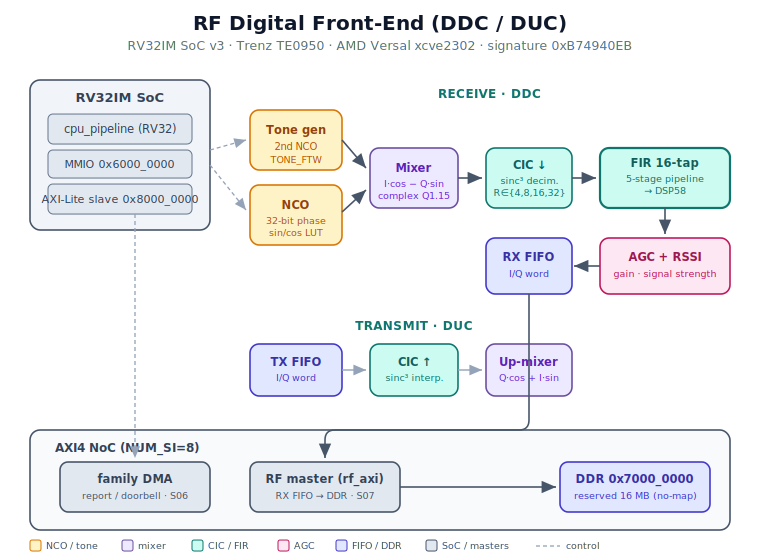

# RF Digital Front-End IP Core (DDC/DUC) — RV32IM SoC v3 (TE0950 / AMD Versal)

A soft **Digital Down-Converter / Up-Converter** for software-defined radio,
integrated into the RV32IM IP family and **validated on silicon** on the Trenz
TE0950 (AMD Versal `xcve2302-sfva784-1LP-e-S`). The complete receive and
transmit chains — NCO, complex mixer, CIC decimator/interpolator, a pipelined
16-tap FIR, and AGC — run in the programmable logic, orchestrated by the on-chip
RV32 core and drained to DDR by a dedicated AXI4 master. Every stage is verified
layer-by-layer against independent Python oracles with a **bit-exact signature**
(`0xB74940EB`) that holds identically from the Python model to the board.



---

## 1. What this core is for

A software-defined radio does its filtering and frequency translation in the
digital domain. Two operations dominate the sample-rate front-end:

- **Down-conversion (DDC, receive):** take a real/complex passband stream, mix
  it down to baseband with a numerically-controlled oscillator, then decimate
  through a CIC filter and clean up the passband with an FIR. An AGC keeps the
  output at a usable level and reports signal strength (RSSI).
- **Up-conversion (DUC, transmit):** the mirror image — interpolate a baseband
  stream through a CIC and mix it up to the carrier.

This IP implements both as a complex `I/Q` datapath in `Q1.15`. The RV32 core
programs the tuning word, the FIR coefficients and the gain, enables the receive
chain, and the hardware produces a stream of `I/Q` samples that a second AXI
master writes straight to DDR. It is the **signal plane** of the family — the
deterministic sample-rate cruncher that sits under a radio stack, the same way
the PTP core is the time plane and the SpaceWire / MIL-STD-1553 cores are the
network plane.

The board has no ADC/DAC wired to the fabric, so the baseband source is an
on-chip **programmable tone generator** (a second NCO). With its tuning word set
to zero it produces a DC baseband of amplitude 29491, which drives the whole
chain to a constant, observable steady state — the perfect stimulus for a
bit-exact silicon signature.

---

## 2. Requirements

**Simulation (no board needed):**

- **GHDL 4.1.0** or newer (`--std=08`) — the full regression runs here.
- **Python 3** — independent oracles (sin/cos LUT, mixer, CIC, FIR, AGC) and the
  RV32 assembler `asm.py`. No non-standard packages.
- A stock **Ubuntu 24.04** machine. No proprietary simulator, no license server.

**Silicon flow (to reproduce the board result):**

- **Vivado 2025.2.1** — synthesis, implementation, `write_hw_platform`.
- **PetaLinux 2025.2** — Linux image for the A72.
- **`aarch64-linux-gnu-gcc`** — cross-compiles the `/dev/mem` bring-up verifier.
- A **Trenz TE0950** board (Versal `xcve2302-sfva784-1LP-e-S`), a microSD, and a
  serial console (picocom, 115200 8N1).

The RV32IM core sources (`~/rv32i/`) and the canonical FWFT FIFO are **shared
from their origin**, never duplicated.

---

## 3. Feature summary

- **Complete DDC and DUC** in one core: receive path (NCO → mixer → CIC³
  decimate → FIR → AGC/RSSI) and transmit path (CIC interpolate → up-mixer).
- **Complex `I/Q` datapath in `Q1.15`** throughout. FIFO word packs
  `[31:16]=I`, `[15:0]=Q`.
- **32-bit phase NCO** with a dual sin/cos lookup (1024×16, cosine at a
  256-entry offset), giving a full-precision quadrature local oscillator.
- **CIC sinc³** decimator and interpolator with switchable rate `R ∈ {4,8,16,32}`
  and the matching bit-growth shift, BRAM-free (integrator/comb registers).
- **Pipelined 16-tap FIR** with software-loadable coefficients
  (`FIR_COEF_ADDR`/`FIR_COEF_DATA`). The multiply–add tree is registered into
  **five stages** so it closes timing at speed (see Problems faced) — the
  multipliers map to **DSP58**.
- **AGC** with software gain and an **RSSI** readback.
- **Programmable tone generator** (a second NCO, `TONE_FTW`) as an on-chip
  baseband source, so the chain is fully exercised without an ADC/DAC.
- **Two AXI4 masters to DDR through the NoC**: the SoC's burst-DMA (report /
  doorbell) and the RF's **own dedicated master** that drains the RX FIFO to a
  reserved DDR buffer.
- **Family MMIO control plane** (combinational `rdata` on the RV32 dmem bus,
  region `0x6000_0000`).
- Two interrupt lines: the core doorbell (`pl_ps_irq0`) and the RF FIFO-level
  interrupt (`pl_ps_irq1`).

---

## 4. SoC memory map

| Region | Base | Size | What |
|---|---|---|---|
| Local RAM / IMEM | `0x0000_0000` | — | RV32 instruction/data memory (via AXI-Lite slave for load) |
| Family burst-DMA | `0x4000_0000` | — | SoC DMA engine (report / doorbell) → NoC `S06_AXI` → DDR |
| **RF bank + datapath** | **`0x6000_0000`** | 64 B regs | RF MMIO control plane (this core) |
| Reserved DDR buffer | `0x7000_0000` | 16 MB | `no-map` pool, RF master writes samples here |
| AXI-Lite slave (PS side) | `0x8000_0000` | 64 KB | PS ↔ SoC control + IMEM load (`M_AXI_LPD`) |

Both PL masters (family DMA on `S06_AXI`, RF master on `S07_AXI`) map to the same
physical DDR (`C0_DDR_LOW0`); the NoC arbitrates.

---

## 5. RF register map (RV32 base `0x6000_0000`)

| Offset | Name | Access | Meaning |
|---|---|---|---|
| `0x00` | `CTRL` | RW | bit0 `rx_en`, bit1 `tx_en`, bit2 `loop_en`, bit3 `agc_en`, bit4 `nco_reset` (self-clearing) |
| `0x04` | `STATUS` | RO | bit0 `rx_empty`, 1 `rx_full`, 2 `tx_empty`, 3 `tx_full`, 4 `irq`, 5 `dma_rf_busy` |
| `0x08` | `NCO_FTW` | RW | receive NCO frequency tuning word (32-bit phase increment) |
| `0x0C` | `RSSI` | RO | AGC signal-strength readback |
| `0x10` | `AGC_CTRL` | RW | `[2:0]` manual gain shift |
| `0x14` | `FIR_COEF_ADDR` | RW | `[3:0]` FIR coefficient index |
| `0x18` | `FIR_COEF_DATA` | WO | write pulses `coef_we` for one cycle (loads RX FIR tap) |
| `0x1C` | `RX_FIFO_LEVEL` | RO | RX FIFO occupancy |
| `0x20` | `RX_FIFO_DATA` | RO | read pops one word (`[31:16]=I`, `[15:0]=Q`) |
| `0x24` | `TX_FIFO_DATA` | WO | write pushes one word |
| `0x28` | `IRQ_EN` | RW | interrupt enable |
| `0x2C` | `IRQ_STAT` | RO / W1C | write 1 clears the bit |
| `0x30` | `IRQ_THRESH` | RW | RX FIFO level that raises the interrupt |
| `0x34` | `DMA_ADDR` | RW | RF master destination base in DDR |
| `0x38` | `DMA_LEN` | RW | RF master transfer length |
| `0x3C` | `DMA_CTRL` | RW | RF master trigger / control |
| `0x40` | `TONE_FTW` | RW | tone-generator NCO tuning word (`0` → DC baseband) |
| `0x44` | `DBG_STATE` | RO | debug / state observability |

`rdata` is a **combinational** direct mux on the RV32 dmem bus — the family "read
contract" (a registered `rdata` passes the MMIO layer but fails with the real
core, every `lw` returning the previous read's data).

---

## 6. How to use it (software)

```asm
# base pointer to the RF bank
lui   x5, 0x60000            # x5 = 0x6000_0000

# 1) tone generator to DC baseband, receive NCO to the test tuning word
sw    x0,  0x40(x5)          # TONE_FTW = 0  -> DC baseband, amplitude 29491
li    x6, 0x0293A800
sw    x6,  0x08(x5)          # NCO_FTW

# 2) load a pass-through FIR (tap0 = 0x7FFF, rest 0)
sw    x0,  0x14(x5)          # FIR_COEF_ADDR = 0
li    x7, 0x7FFF
sw    x7,  0x18(x5)          # FIR_COEF_DATA -> tap 0

# 3) enable the receive chain, wait for 64 samples, fire the RF master,
#    then raise the doorbell for the PS.
```

The full board firmware (`fw_rf.s`) programs the chain, waits until the RX FIFO
holds 64 samples, triggers the RF master to drain them to DDR, synchronises on
`STATUS[5]` (`dma_rf_busy` 1→0), and raises the doorbell.

---

## 7. Verification — the layers

The methodology is the family's: **freeze the scope, then verify in layers, each
with a deterministic bit-identical end-signature as the pass criterion.** A
mutation battery proves the tests actually bite.

- **Datapath layer** — the isolated `I/Q` chain (tone → mixer → CIC → FIR → AGC)
  against the Python model. Signature `0xB74940EB` over 64 samples.
- **SoC layer (layer 4)** — the real `cpu_pipeline` RV32IM core runs the actual
  `fw_rf` firmware, programs the RF, the second AXI master captures 64 samples to
  a DDR BFM, and the checksum is compared against the golden. Same `0xB74940EB`.
- **Mutation battery** — 5 mechanisms (RF-master address increment, DMA-busy
  sync, RF domain decode, tone `I/Q` swap, FIR coefficient routing) each verified
  to kill the test.

The checksum is bit-identical across **six** domains: the Python model, the VHDL
datapath testbench, the VHDL SoC testbench, the C computation in the ARM
firmware, and the two silicon reads (PS-side checksum + serial console).

```bash
bash rf_paso7_rtl.sh
# -> RF PASO7 RTL: PASS DP_CHK=0xB74940EB SOC_CHK=0xB74940EB MUT=5/5
```

---

## 8. Layer 5 — silicon flow

### 8.1 Vivado (2025.2.1)

The block design is transplanted from the TSN project (which inherits the
audited CIPS + NoC + reset base) and the module reference is swapped to the RF
SoC. The one structural difference from a single-master IP is the **second AXI
master**: the NoC is grown to `NUM_SI=8`, `S07_AXI` is added for the RF master,
and both masters are mapped to `C0_DDR_LOW0`.

```tcl
# clone, clean inherited runs and remote references (nocattrs.dat)
# swap module ref TSN -> rf_soc_top_master_wrap
# grow the NoC to 8 SIs: S06 = family DMA, S07 = RF master
# wire both masters to DDR, slave to 0x8000_0000; audit with bd_review.tcl
# before spending synthesis
```

Commands are run **one at a time** in the TCL console (a pasted block hides a
silent failure). The second master's AXI interface is named `rf_axi`, not `rf`,
so Vivado does not fold the scalar `rf_irq_out` into the interface when it infers
buses by prefix.

### 8.2 PetaLinux (2025.2) and SD

Clone `project-spec/` + `.petalinux` only (never `cp -a` — it drags absolute
`build/tmp` paths), import the XSA, confirm the reserved-memory pool
(`0x7000_0000`, 16 MB, `no-map`, label `rf_dma_pool`), build, and package
`BOOT.BIN` **through PetaLinux** — never hot-load the PDI (the Versal PLM rejects
it with `0x03024001`). Copy `BOOT.BIN` + `image.ub` + `boot.scr` to the FAT
partition.

### 8.3 Bring-up on the target

The ARM verifier (`rf-bringup.c`) maps the SoC control region (`0x8000_0000`) and
the reserved DDR buffer (`0x7000_0000`) through `/dev/mem`, holds the RV32 core in
reset, loads `fw_rf` into the IMEM, sets the DDR base, releases the core, waits
for the doorbell, reads the 64 samples and computes the canonical checksum:

```
RF bring-up: DDC/DUC, DDR=0x70000000
  primeras muestras: 0003FFFF 059BFFFF 2EA5FFFF 57AFFFFF
  regimen (idx 60..63): 5D4EFFFF 5D4EFFFE 5D4DFFFE 5D4DFFFF
PASS: RF DDC/DUC validado en silicio.
  CHK=0xB74940EB (golden 0xB74940EB) N=64
```

The first four samples are **bit-identical** to the simulation golden; the steady
state settles to the expected `~0x5D4Dxxxx` constant.

---

## 9. Problems faced during the project

Honestly logged, because each one is a lesson that saves the next person a day.

**1. The FIR did not close timing (WNS = −7.137 ns).** The original FIR computed
16 products, the full adder tree and the saturation **combinationally in one
cycle** — 54 levels of logic, 17.7 ns of datapath delay against a 10 ns period.
This is a purely structural bug that functional simulation cannot see; the
methodology says layer 5 catches it, and it did. **Fix:** pipeline the FIR into
five registered stages (multipliers → pair-sums → 4-sums → 2-sums → final sum +
shift + saturation). The result is numerically identical (it only adds 5 cycles
of latency, transparent because the decimated RX FIR receives samples ≥8 cycles
apart), the critical path drops from 54 to ~8 levels, and the multipliers map to
**DSP58**. Signature unchanged.

**2. The OOC module cache re-implemented the old netlist.** The RF SoC is
synthesised out-of-context as `bd_soc_usart_u_soc_rf_0_synth_1`. A `reset_run
synth_1` on the top **does not** invalidate that sub-run, so after fixing the FIR
the implementation still used the stale netlist and reported the same −7.137 ns.
**Fix:** `reset_run` the module's OOC sub-run explicitly, re-launch it, then the
top. Confirmed by the DSP count jumping (the pipelined multipliers now infer
DSP58).

**3. The NoC collapsed `aclk7` into `aclk6`.** After validation the NoC compiler
moved `S07_AXI`'s clock association from `aclk7` to `aclk6`, leaving `aclk7`
empty. This is **benign**: both PL masters share `pl0_ref_clk`, so the NoC folds
them into one clock domain. Both masters still map to `C0_DDR_LOW0`; verified in
`bd_review.tcl`.

**4. `/dev/mem` SIGBUS chased to `memset`, not to `no-map`.** The first bring-up
died with a bus error. The reserved pool is `no-map`, which looked like the
cause — but `busybox devmem` proved `/dev/mem` reads **and writes** both the CSR
(`0x8000_0000`) and the reserved DDR (`0x7000_0000`) fine, at every mapping size
up to 16 MB. The real cause: `memset()` on a region `/dev/mem` maps as **Device**
memory (`nGnRE`) uses aarch64 optimised routines (`DC ZVA`, unaligned accesses)
that fault on Device memory. **Fix:** clear the buffer with a loop of aligned
32-bit `volatile` writes, never `memset`/`memcpy`. UIO turned out unnecessary —
`/dev/mem` with small mappings and aligned accesses is the clean bring-up path.

**Toolchain lessons reused from the family:** run Vivado BD commands one at a
time; after `save_project_as`, reset inherited runs and clear the incremental
checkpoint (it is a property of the **run**, not a `synth_design` argument on
Versal 2025.2); sweep `get_files -all *` for remote references after cloning;
never use Connection Automation for PL masters (it routes them to `S_AXI_LPD`
with zero DDR); `~` is not expanded in TCL — use `$env(HOME)`; `open_project`
fails if the project is already open (skip it, run the commands directly).

---

## 10. Known limitations and roadmap

- **Timing closes at 100 MHz with a thin margin (WNS +0.146 ns).** The next
  critical path is the **complex mixer** (`rf_loopmix`, 24 logic levels): the
  `I·cos − Q·sin` products are still combinational. To reach the 240 MHz target
  the mixer and the CIC are the next stages to pipeline, the same way the FIR was.
- **No physical RF pins.** The board has no ADC/DAC on the fabric, so the
  baseband is the on-chip tone generator. A physical front-end (JESD204 / RFDC)
  is future work.
- **Single tone / DC validation.** The silicon signature uses `TONE_FTW=0` (DC
  baseband) for maximum observability; a swept-tone regression is future work.
- **Fixed CIC rate per build.** `R` is switchable in RTL but not yet exposed as a
  runtime register.

---

## 11. File map

```
IP_Cores/RF/
├── README.md               this file
├── architecture.svg        block diagram
├── INTEGRATION.md          full silicon bring-up sequence
├── rtl/                    datapath + integration + BD wrapper
│   ├── rf_sincos_pkg.vhd   sin/cos LUT (1024×16, embedded constant)
│   ├── rf_nco.vhd          numerically-controlled oscillator
│   ├── rf_loopmix.vhd      complex mixer (down / up)
│   ├── rf_cic_dec.vhd      CIC sinc³ decimator
│   ├── rf_cic_int.vhd      CIC sinc³ interpolator
│   ├── rf_fir.vhd          pipelined 16-tap FIR (5 stages, DSP58)
│   ├── rf_agc.vhd          AGC + RSSI
│   ├── word_fifo.vhd       I/Q FIFO
│   ├── rf_regs.vhd         MMIO register bank
│   ├── rf_datapath.vhd     tone-driven datapath
│   ├── rf_dma_axi.vhd      second AXI4 master (RX FIFO → DDR)
│   ├── mem_subsys_rf.vhd   RF domain + second master on the dmem bus
│   ├── rf_soc_top_master.vhd      top with two masters + two IRQ
│   └── rf_soc_top_master_wrap.v   Verilog BD wrapper (AXI4 tie-offs)
├── vivado/                 rf_soc_steps.tcl, run_synth_rf.tcl, run_impl_rf.tcl
├── fw/                     rf-bringup.c (ARM), fw_rf.s (RV32)
├── sim/                    tb_datapath.vhd, tb_rf_soc.vhd
└── model/                  asm.py, lut_vals.txt
```

---

## 12. Results record

| Stage | Result |
|---|---|
| Regression | datapath + SoC PASS (GHDL 4.1.0, `--std=08`), 5/5 mutations kill |
| Datapath signature | chain == Python oracle (`0xB74940EB`, 64 samples) |
| Full SoC (layer 4) | real RV32IM runs firmware, DDR result == oracle (`0xB74940EB`) |
| Utilization | 7910 LUTs (5.3%), 5429 registers (1.8%), **59 DSP58** (12.7%), 1000 LUTs distributed RAM + 1 XRAM, 0 BRAM, on `xcve2302` |
| Timing | WNS = **+0.146 ns** at 100 MHz |
| Silicon | **`RF DDC/DUC validado en silicio`** — TE0950, signature `0xB74940EB` bit-identical to simulation |

---

## License

Released under the **MIT License** — free to use, copy, modify, merge, publish,
distribute, sublicense and sell, for any purpose. See the repository `LICENSE`
file for the full text.

The bit-exact signature holds from the Python model to silicon because the whole
datapath is fixed-point `Q1.15` with a frozen accumulation and saturation order:
the FIR pipeline changes *when* a sample is produced, never *what* value — which
is why pipelining for timing left the signature `0xB74940EB` untouched.
