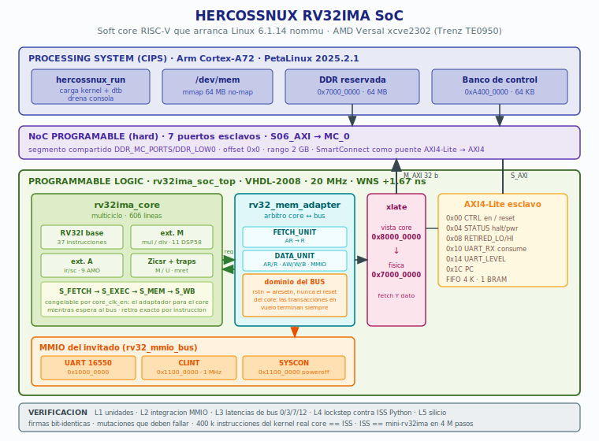

# RV32IMA — Linux-Capable RISC-V Soft Core

A synthesizable RV32IMA processor written in VHDL-2008 that boots mainline
Linux 6.1.14 (nommu) to an interactive shell on an AMD Versal device. The
core is verified instruction-by-instruction against a Python ISS across the
real kernel boot, and the whole chain — RTL, synthesis, silicon — is closed
with bit-identical signatures.



---

## 1. What this is

Most RISC-V soft cores stop at "runs a benchmark". This one runs an operating
system: it boots Linux, mounts a root filesystem, and drops you at a shell
prompt on real hardware.

```
[    0.000000] Linux version 6.1.14 (riscv32-buildroot-linux-uclibc-gcc 12.2.0)
[    0.000000] riscv: base ISA extensions aim
[    0.000000] clint: clint@11000000: timer running at 1000000 Hz
[   39.237575] Run /init as init process

Welcome to Buildroot
buildroot login: root
~ #
```

The core lives in the programmable logic of a Trenz TE0950 board
(xcve2302-sfva784-1LP-e-S). The Arm processing system acts as the loader and
console bridge: it writes the kernel image into a reserved DDR region, starts
the core through an AXI4-Lite control bank, and drains the guest's UART FIFO.
The core itself owns its memory and runs free.

---

## 2. Feature summary

| Item | Value |
|------|-------|
| ISA | RV32IMA, machine and user privilege levels |
| Microarchitecture | Multicycle, single-issue, no pipeline hazards by construction |
| Base integer | 37 instructions, full RV32I |
| M extension | `mul`, `mulh`, `mulhu`, `mulhsu`, `div`, `divu`, `rem`, `remu` |
| A extension | `lr.w`, `sc.w`, 9 AMO operations, 29-bit reservation |
| CSRs | Zicsr, flat `mstatus`, exact trap and `mret` semantics |
| Interrupts | CLINT with `mtime` / `mtimecmp`, strict `>` comparison |
| Guest MMIO | 16550-compatible UART, CLINT, SYSCON (poweroff / reboot) |
| Host interface | AXI4-Lite slave control bank, AXI4-Lite master to DDR |
| Clock | 20 MHz on Versal (limited by the combinational divider) |
| Throughput | ~5.2 M instructions/s measured in silicon |
| Resources | 8341 LUTs (5.6%), 2399 registers, 11 DSP58, 1 BRAM |
| Timing | WNS +1.67 ns, WHS +0.040 ns |
| License | MIT |

---

## 3. Repository layout

```
rv32ima_core.vhd        core: decode, ALU, M/A extensions, CSR interface
rv32_csr_trap.vhd       CSR file, trap entry and return
rv32_amo_unit.vhd       atomic read-modify-write sequencer
rv32_mem_adapter.vhd    core <-> AXI arbiter, address translation, MMIO split
rv32_uart.vhd           16550-compatible UART for the guest
rv32_clint.vhd          machine timer and software interrupt
rv32_syscon.vhd         poweroff / reboot register
rv32_mmio_bus.vhd       guest MMIO decoder
rv32ima_soc_top.vhd     synthesizable top: core + adapter + control bank
rv32ima_soc_wrap.vhd    VHDL-93 wrapper (Vivado rejects VHDL-2008 in a BD)

tb_*.vhd                testbenches, one per verification layer
iss_ref.py              Python instruction set simulator (the oracle)
asm.py                  minimal RV32 assembler
compare.py              lockstep comparator, core trace vs ISS
cmp_core_boot.py        same, windowed over a deep kernel boot
uart_ref.py             UART byte counter, used for bisection

hercossnux_bd_final.tcl  Vivado block design, dumped from the working project
hercossnux_run.c         PS-side loader and console bridge
system-user.dtsi         device tree: reserved DDR, control bank node
```

---

## 4. Memory map

The guest kernel sees a flat 64 MB space starting at `0x8000_0000`. The
adapter translates every access — instruction fetch **and** data — down to
the physical reservation at `0x7000_0000`.

| Guest address | Physical | Contents |
|---------------|----------|----------|
| `0x8000_0000` | `0x7000_0000` | kernel image, 64 MB reserved, `no-map` |
| `0x83F0_0000` | `0x73F0_0000` | boot stub, also `RESET_PC` |
| `0x83FF_F940` | `0x73FF_F940` | device tree blob |
| `0x1000_0000` | — | UART (MMIO, never reaches DDR) |
| `0x1100_0000` | — | CLINT and SYSCON |

From the host side, the control bank is a 64 KB AXI4-Lite slave at
`0xA400_0000`. Note that `0x8000_0000` is *not* available for PL slaves on
Versal — that window belongs to DDR in the global address map.

| Offset | Register | Meaning |
|--------|----------|---------|
| `0x00` | CTRL | bit 0 core enable, bit 1 soft reset |
| `0x04` | STATUS | bit 0 halted, bit 1 poweroff, bit 2 reboot, bit 3 FIFO high |
| `0x08` | RETIRED_LO | retired instruction count, low word |
| `0x0C` | RETIRED_HI | high word |
| `0x10` | UART_RX | bits 7:0 byte, bit 8 valid — **reading consumes** |
| `0x14` | UART_LEVEL | bytes waiting in the console FIFO |
| `0x18` | UART_TX | host to guest |
| `0x1C` | PC | current program counter |

---

## 5. Verification methodology

Every layer produces a **bit-identical signature** as its pass criterion, and
every layer ships with mutations that must fail. A mutation that survives
means the layer does not actually test what it claims to.

**Layer 1 — units.** CSR file, AMO sequencer, CLINT, UART in isolation.

**Layer 2 — integration.** Guest MMIO, privilege transitions, trap and `mret`
formulas, timer interrupts arriving at the exact retirement count.

**Layer 3 — bus behaviour.** The same programs replayed with 0, 3, 7 and 12
wait states on the AXI master, plus a strict-protocol model that reproduces
what a SmartConnect in low-area mode actually does: one outstanding
transaction, request captured on `arvalid`, no new request accepted until the
response is consumed.

**Layer 4 — lockstep against the ISS.** A Python instruction set simulator is
written *before* the RTL is integrated, so it cannot inherit the RTL's
assumptions. Both execute the same program; the comparator demands identical
PC and all 32 registers at every retirement. Five programs plus 400 000
instructions of the real Linux kernel.

**Layer 5 — silicon.** The board is the final oracle.

The chain closes by transitivity:

```
core RTL  ==  Python ISS      400 k steps of the real kernel
Python ISS ==  mini-rv32ima   4 M steps, 22 timer interrupts
                              coinciding exactly in count and PC
Python ISS  ->  full boot     46 M instructions to "Run /init"
```

### Signature table

| Testbench | Signature |
|-----------|-----------|
| `tb_soc_compat` | PASS @ 27416000000 fs |
| `tb_soc_priv` | PASS @ 15966000000 fs |
| `tb_soc_mmio` | PASS @ 16116000000 fs |
| `tb_soc_irq2` | PASS @ 1468066000000 fs |
| `tb_clint` | PASS @ 8557000000 fs |
| `tb_ima_adapter` (WS=3) | PASS @ 14136000000 fs |
| `tb_soc_top` | retiros=510 marcas=ABCDEFG |
| `tb_soc_rst` | PASS iters=6 |
| `tb_boot` | CORE == ISS, 399995 steps |

---

## 6. Three bugs worth documenting

Each of these survived a verification layer that should have caught it. What
they have in common is that the *testbench* was more forgiving than reality.

### 6.1 `MUL` producing a spurious sign bit

In VHDL, `resize()` on a `signed` value **preserves the sign**; it does not
truncate. The multiplier was written as:

```vhdl
alu_v := resize(a_v * b_v, 32);      -- wrong
```

With a negative 64-bit product this leaves bit 31 set. The kernel hits it
immediately: `0xCCCCCCCD` is the magic reciprocal of 10 that `printf` uses for
constant division, so the first decimal number formatted after the command
line sends the core into an endless `strlen`.

```
0x000000AF * 0xCCCCCCCD = 0x0000008C00000023
correct MUL result      -> 0x00000023
what the core produced  -> 0x80000023
```

The fix slices the vector explicitly:

```vhdl
mul_p := a_v * b_v;
alu_v := mul_p(31 downto 0);
```

`MULH`, `MULHU` and `MULHSU` were unaffected — they already went through an
explicit `std_logic_vector` conversion, which truncates.

**Why 400 000 instructions of lockstep missed it:** no test ever multiplied
two values whose 64-bit product was negative. The divergence appears at
retirement 2.26 M.

**How it was found:** bisection with the UART byte count as a cheap witness.
The ISS and the core agree at 916 bytes (2.26 M) and disagree before 2.32 M;
a windowed trace over those 20 000 retirements named the instruction.

### 6.2 Wrong NoC segment

The core was mapped to `C0_DDR_LOW0` — an individual channel of the memory
controller — instead of the shared `DDR_MC_PORTS/DDR_LOW0` segment. Vivado
warns about this on every validation:

> NOC Block does not have shared segments on DDR and HBM. Multiple paths to
> DDR with current configuration may split assignment.

The symptom in silicon: the PS reads `0x00000537` at a physical address where
the core, going through its own NoC port, reads `0xFFFFFFFF` with an `OKAY`
response. An `OKAY` carrying all-ones is the signature of a transaction that
resolves into a hole in the map.

### 6.3 AXI channel deadlock on core reset

The adapter took the **core's** reset, which includes the software reset bit
in the control bank. Resetting the AXI state machines mid-transaction either
withdraws `arvalid` — which AXI forbids — or abandons a pending response. The
interconnect is left holding an orphan, and refuses every subsequent request
until the board is power-cycled.

Compounding it, the sequencer issued fetches while the core was *stopped*: a
reset core sits in `S_FETCH`, and the free-running adapter read that state as
a request. The bus was therefore almost always mid-transaction when the reset
pulse arrived, which is why the failure looked intermittent.

Captured with an AXIS-ILA on the master interface — 4096 consecutive samples:

```
arvalid = 1    arready = 0    rvalid = 1    rready = 0
```

The fix puts the adapter in the **bus** clock domain (`rstn => aresetn`,
which is never pulsed during operation). The core's reset arrives on a
separate port and only invalidates the sequencer; in-flight transactions
always complete, and their result is discarded if the core was reset while
they were outstanding.

`tb_soc_rst` reproduces the failure: six hot resets at different phases
against a strict AXI model. The previous design deadlocks on iteration 2.

---

## 7. Versal-specific notes

Things that cost iterations and are not obvious from the documentation:

- **`0x8000_0000` is unavailable** for PL slaves — it belongs to DDR in the
  global address map. Use `0xA400_0000`.
- **`axi_protocol_converter` does not exist** on Versal. Use a 1x1
  SmartConnect to bridge AXI4-Lite to the AXI4 the NoC expects.
- **`system_ila` is not supported.** The debug core is `axis_ila`, and
  `C_MON_TYPE` takes `Interface_Monitor`, not `INTERFACE`.
- **`dcm_locked` must be tied high.** Left unconnected, `proc_sys_reset`
  never releases `peripheral_aresetn` and the core stays frozen at `RESET_PC`
  with zero retirements. Connection Automation would wire this, but it must be
  avoided on Versal because it routes PL masters to `S_AXI_LPD`, which has no
  DDR access at all.
- **A VHDL-93 wrapper is mandatory.** Vivado refuses VHDL-2008 as the
  reference file of an RTL module in a block design.
- **`~` is never expanded in Vivado Tcl.** Use `$env(HOME)`.
- **`reset_target all` invalidates the NoC solution.** After it, the compiler
  reports "will not be re-run" while the routing is stale. Dirty the NoC
  configuration to force a real recompile.
- **Always repackage `BOOT.BIN` through PetaLinux.** Hot-loading a PDI is
  rejected by the PLM with error `0x03024001`.
- **glibc `memset` and `memcpy` fault on `no-map` regions** — they use
  `DC ZVA` and 128-bit `stp`. Clear buffers with a `volatile` word-by-word
  loop from the PS side.

---

## 8. Building

**Simulation** (GHDL 4.1.0, `--std=08`):

```bash
ghdl -a --std=08 rv32_csr_trap.vhd rv32_amo_unit.vhd rv32ima_core.vhd \
                 rv32_mem_adapter.vhd rv32_uart.vhd rv32_syscon.vhd \
                 rv32_clint.vhd rv32_mmio_bus.vhd rv32ima_soc_top.vhd
ghdl -e --std=08 tb_soc_top
ghdl -r --std=08 tb_soc_top -gAXI_LAT=4
```

Analyze everything in a single command with a clean work directory: a failed
analysis leaves the previous entity in `work-obj08.cf`.

**Hardware** (Vivado 2025.2.1):

```tcl
source hercossnux_bd_final.tcl
launch_runs impl_1 -to_step write_device_image -jobs 8
wait_on_run impl_1
write_hw_platform -fixed -include_bit -force hercossnux.xsa
```

**Software** (PetaLinux 2025.2.1):

```bash
petalinux-config --get-hw-description=hercossnux.xsa --silentconfig
cp system-user.dtsi project-spec/meta-user/recipes-bsp/device-tree/files/
petalinux-build
petalinux-package --boot --plm --psmfw --u-boot --dtb --force
```

Copy `BOOT.BIN` and `image.ub` to the FAT partition of the SD card.

---

## 9. Running

On the board, as root:

```bash
./hercossnux_run kernel.img hercossnux.dtb
```

The loader clears the reservation, writes the kernel and device tree, installs
a boot stub at `RESET_PC`, releases the core, and then polls the console FIFO.
Without console traffic it prints a heartbeat every five seconds:

```
[retiros=11300376 pc=0x8016d658]
```

Do not run `devmem` against `0xA400_0010` while the loader is active — every
read consumes a byte and corrupts the console.

### Verifying the bitstream before debugging anything

`run_multest.sh` loads a short program that exercises all five multiply
variants, including the kernel's exact failing case, and reports through the
console FIFO. Five seconds on the board tell you whether the hardware you
just loaded contains the RTL you think it does.

```
0x141 0x142 0x143 0x144 0x145   ->  ABCDE, correct
0x158                            ->  X, this bitstream is stale
```

Run it after every re-implementation, before investing time anywhere else.

---

## 10. Known limitations

- **20 MHz.** The M extension's divider is combinational: 125 logic levels,
  48.7 ns. Pipelining it into an iterative unit should reach 100 MHz or more.
  It is deliberately deferred because it touches the core that is currently in
  exact lockstep with the ISS.
- **No MMU.** Linux runs in nommu mode. Sv32 is not implemented.
- **No FPU.** Soft-float only.
- **Single hart.**
- **Console through the PS.** The guest UART is a FIFO drained over AXI, not a
  physical serial port.

---

## 11. Acknowledgements

The reference kernel image and `mini-rv32ima`, used as a second independent
oracle for cross-validation, come from Charles Lohr's project.

## 12. License

MIT.
