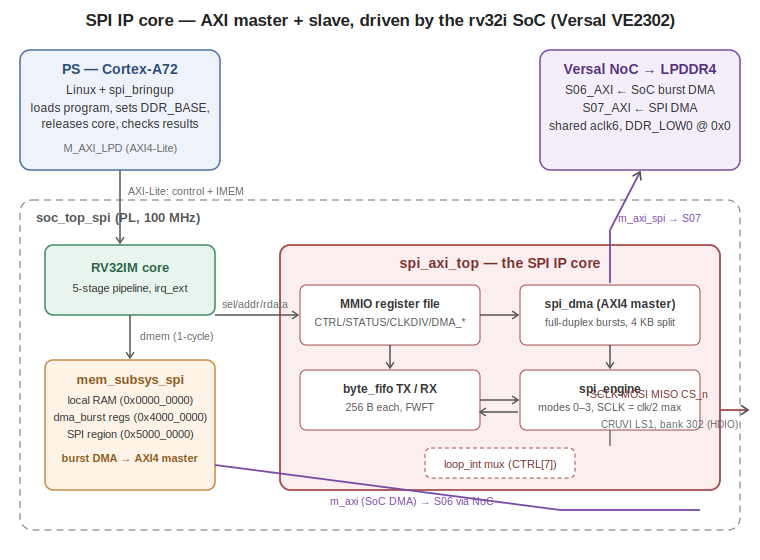

# SPI — A DMA-capable SPI master IP core, driven by a soft RISC-V, on a Versal

A complete **SPI master controller** written in plain VHDL-2008 and taken from an
empty file to **validated silicon at 50 Mbit/s** on an AMD Versal VE2302 (Trenz
TE0950). It is both an **AXI slave** (a memory-mapped register file programmed by
the [rv32i soft core](../RV32i)) and an **AXI4 master** (a full-duplex burst DMA
engine that reads and writes LPDDR4 through the Versal NoC autonomously).

**License: MIT** — use it, fork it, build products on it.

<p align="center">
  
</p>

---

## Table of contents

1. [What it is](#what-it-is)
2. [Feature summary](#features)
3. [Register map](#register-map)
4. [How to reuse this IP in your own project](#reuse)
5. [The story / how it was built](#the-story)
6. [Difficulties we hit (read this, it will save you days)](#difficulties)
7. [Hardware results](#hardware-results)
8. [Repository layout](#repository-layout)
9. [Prerequisites](#prerequisites)
10. [Part A — Simulation](#part-a--simulation)
11. [Part B — Vivado hardware build](#part-b--vivado-hardware-build)
12. [Part C — PetaLinux](#part-c--petalinux)
13. [Part D — Running on hardware](#part-d--running-on-hardware)
14. [Extending the IP](#extending)
15. [License](#license)

---

## What it is <a name="what-it-is"></a>

`spi_axi_top` is a self-contained SPI master peripheral designed to hang off a
CPU bus **and** move its own data. It has two faces:

- **Slave side** — a simple 1-cycle MMIO register file (CTRL, STATUS, CLKDIV,
  FIFO ports, DMA command registers). In this repo it is decoded at
  `0x5000_0000` by the rv32i memory subsystem, so firmware running on the soft
  core owns the peripheral. The interface is deliberately generic (sel / req /
  addr / wdata / wstrb / rdata) so it drops behind any bus bridge in minutes.
- **Master side** — `spi_dma`, an AXI4 burst master cloned from the rv32i
  `dma_burst` pattern: INCR bursts up to 16 beats, **transfers split at 4 KB
  boundaries** (an AXI4 legal requirement), and byte-granular lengths via
  per-beat `wstrb` masking on the final beat.

Between the two sits the datapath: two 256-byte **FWFT byte FIFOs** and
`spi_engine`, a byte-oriented shift engine supporting **all four SPI modes**
(CPOL/CPHA), MSB or LSB first, a programmable clock divider
(`SCLK = clk / (2·CLKDIV)`, so 50 MHz max from a 100 MHz fabric clock), and
**zero dead cycles between chained bytes** — 8 bits per 8 SCLK periods,
sustained, which is the physical ceiling of single-lane SPI.

A transfer is *full-duplex by construction*: every byte shifted out produces a
byte shifted in. The DMA runs both halves of a `LEN`-byte command
simultaneously — fetching TX data from DDR (or injecting a programmable dummy
byte for read-phase clocking) while draining RX back to DDR (or discarding it
for write-only phases) — with **drain-priority scheduling** so the RX FIFO can
never overflow because of the DMA itself.

Everything was validated in the same discipline as the rv32i core: **each
module in isolation first**, with assert-based testbenches, then integrated,
then silicon. Five validation layers exist and all of them pass:

| Layer | Testbench / method | What it proves |
|---|---|---|
| 1 | `tb_spi_engine` | Edge semantics of all 4 modes against an independent behavioral slave (a symmetric sampling bug would pass loopback but not this) |
| 2 | `tb_spi_mmio` | Registers, FIFOs, PIO, CS forcing, overflow stickies |
| 3 | `tb_spi_axi` | Full IP vs. an AXI DDR model: bursts, partial tails, dummies, discard, IRQ, and the internal-loopback self-test with the pads deliberately broken |
| 4 | `tb_spi_soc` | The rv32i core drives the IP with real firmware; three AXI masters coexist |
| 5 | `sw/spi_bringup.c` | Silicon: A72/Linux loads the firmware, RV32 runs the transfer, results checked in LPDDR4 — **PASS at 12.5 / 25 / 50 MHz SCLK** |

---

## Feature summary <a name="features"></a>

- SPI modes 0–3 (CPOL/CPHA), MSB-first or LSB-first
- SCLK up to **fabric_clk / 2** (50 MHz at 100 MHz), programmable divider
- Back-to-back byte chaining with zero gap → **50 Mbit/s sustained**
- `sample_late` option: samples MISO one clk later (+10 ns of round-trip
  margin) for long cables / slow slaves at high SCLK
- `cs_force`: holds CS_n low across slow PIO sequences or multi-phase
  protocols (command → dummy → data, as flash devices require)
- **`loop_int` (CTRL[7])**: internal MISO←MOSI self-test mux before the pads —
  lets you validate a new board bring-up with *no cables at all*
- PIO mode (TXDATA/RXDATA + FIFO level registers) for debug and small
  transfers; DMA mode for throughput
- DMA: full-duplex, byte-granular LEN, dummy injection (`tx_en=0`), RX discard
  (`rx_en=0`), 4 KB-safe bursts, done-IRQ with sticky status
- Overflow handling by **drop + sticky flag**, never by bus back-pressure
  (keeps the CPU's 1-cycle memory subsystem timing intact)

---

## Register map <a name="register-map"></a>

Offsets within the decoded region (here `0x5000_0000`). All accesses are
32-bit, 1 cycle.

| Offset | Name | Access | Bits |
|---|---|---|---|
| 0x00 | CTRL | RW | [0] en · [1] cpol · [2] cpha · [3] lsb_first · [4] sample_late · [5] cs_force · [6] irq_en · [7] **loop_int** |
| 0x04 | STATUS | R / W-clear | [0] busy · [1] tx_empty · [2] tx_full · [3] rx_empty · [4] rx_full · [5] rx_ovf* · [6] tx_ovf* · [7] dma_busy (sticky) · [8] dma_done* — any write clears the sticky (*) bits |
| 0x08 | CLKDIV | RW | SCLK half-period in clk cycles (1 → 50 MHz) |
| 0x0C | TXDATA | W | push byte [7:0] into TX FIFO |
| 0x10 | RXDATA | R | RX FIFO head; **the read pops** (FWFT) |
| 0x14 | TXLVL | R | bytes in TX FIFO |
| 0x18 | RXLVL | R | bytes in RX FIFO |
| 0x1C | DMA_TXA | RW | DDR read offset (4-byte aligned, relative to `ddr_base`) |
| 0x20 | DMA_RXA | RW | DDR write offset (4-byte aligned) |
| 0x24 | DMA_LEN | RW | transfer length in **bytes** [23:0] |
| 0x28 | DMA_CTRL | RW | [0] start (pulse) · [1] tx_en · [2] rx_en · [15:8] dummy byte |

Software recipes:

```c
// PIO transfer, N bytes:
CTRL = 0x01;                       // en (add 0x20 = cs_force for slow phases)
for (...) TXDATA = byte;
while ((STATUS & 0x3) != 0x2);     // busy=0 && tx_empty=1
while (!(STATUS & 0x8)) b = RXDATA;

// DMA transfer, full duplex:
DMA_TXA = src; DMA_RXA = dst; DMA_LEN = n;
DMA_CTRL = 0x7;                            // start | tx_en | rx_en
while ((STATUS & 0x180) != 0x100);         // dma_busy=0 && dma_done=1
STATUS = 0;                                // clear stickies (drops IRQ)

// Flash-style read: command phase then read phase, CS held:
CTRL = 0x21;                               // en | cs_force
/* PIO: push cmd+addr bytes, wait, drain */
DMA_CTRL = (0xFF<<8) | 0x5;                // start | rx_en, dummy=0xFF
/* wait done; payload lands at DMA_RXA */
CTRL = 0x01;                               // release CS
```

---

## How to reuse this IP in your own project <a name="reuse"></a>

The IP was written to be lifted out. Three integration levels, smallest first:

**1. Just the engine** (`spi_engine.vhd`, zero dependencies). A byte-stream SPI
master: `tx_valid/tx_ready` in, `rx_valid` out, four pads. Feed it from
anything that speaks a valid/ready stream. Keep `tx_valid` high at a byte
boundary and it chains with no gap.

**2. Engine + registers + FIFOs** (`spi_engine`, `byte_fifo`, `spi_axi_top` —
or `spi_mmio` if you don't need DMA). The slave interface is five signals; the
contract is: one access per cycle when `req='1'` (reads with `wstrb="0000"`,
writes otherwise), combinational `rdata` in the same cycle. Bridging it to
AXI4-Lite, Avalon, Wishbone or a MicroBlaze LMB is a ~50-line adapter. **One
caveat: RXDATA reads have a side effect (FIFO pop), so your bridge must not
issue speculative or repeated reads** — see the `dmem_req` discussion in the
source headers.

**3. The full stack including DMA** (`spi_axi_top`). The AXI4 master port is
plain AXI4 (no IDs/QoS — the Verilog wrapper ties those constants for NoC
consumption; copy that pattern for your interconnect). `ddr_base` is a runtime
input, so the same bitstream works wherever your OS reserves the buffer.
Generics: `FIFO_LOG2` (FIFO depth), `DIV_W` (divider width), `ADDR_W`.

If you are **not** using the rv32i SoC: instantiate `spi_axi_top` directly,
wire the slave port to your bus bridge, the master to your interconnect, and
you are done — `mem_subsys_spi.vhd` and `soc_top_spi.vhd` are only the glue
for *this* SoC. If you **are** using it, everything is already integrated:
region `0x5000_0000`, IRQ into the core's `irq_ext`, second NoC master.

Porting to other FPGA families: the RTL is vendor-free (behavioral RAM inferring
LUTRAM/BRAM, no primitives). Only the Vivado/NoC/board steps below are
Versal-specific.

---

## The story / how it was built <a name="the-story"></a>

The same incremental discipline as the rv32i core — nothing touched hardware
until it had a green testbench:

1. **`spi_engine`** — the shift engine, validated against a *behavioral SPI
   slave* implementing the standard's edge semantics independently, because a
   pure loopback test cannot catch symmetric sampling errors.
2. **`spi_mmio`** — registers + FIFOs + PIO, with CPU-style bus transactions,
   including deliberately overflowing both FIFOs.
3. **`spi_dma` + `spi_axi_top`** — the burst master against an AXI DDR model:
   64-byte transfers through 16-byte FIFOs (forcing refill scheduling),
   13-byte transfers (partial-beat `wstrb`), dummy injection, RX discard.
4. **`tb_spi_soc`** — the rv32i pipeline running `spi_test.s` (assembled with
   the repo's own `asm.py`), driving the SPI over MMIO, with the SoC's own
   `dma_burst` reporting results. Three AXI masters in one simulation.
5. **Silicon** — Vivado block design with CIPS + NoC, two PL masters on
   dedicated NoC slave ports, PetaLinux image, and `spi_bringup` on the A72
   running the ladder 12.5 → 25 → 50 MHz. Triple PASS.

---

## Difficulties we hit (read this, it will save you days) <a name="difficulties"></a>

These are the real problems from this bring-up, in the order they bit us.

**1. Vivado's Connection Automation routed our AXI master *into the PS*.**
After CIPS block automation, "Run Connection Automation" helpfully connected
`u_soc/m_axi → SmartConnect → S_AXI_LPD` — i.e. our DMA was pointed at the
PS's internal peripherals (150 address segments of CoreSight/ADMA/IPI and **not
one byte of DDR**), a simulation-only clock generator (`noc_clk_gen`) was
driving the whole design, and a phantom external `reset_rtl` port appeared.
The design *validated* fine — it was topologically legal and functionally
useless. **Lesson: never trust Connection Automation with PL masters on
Versal; audit the address map.** `vivado/bd_review.tcl` dumps every cell, net,
NoC parameter and address segment to a text file — the acceptance criterion is
that each PL master's map contains exactly one segment (`*DDR_LOW0`, 2 GB at
0x0) and zero `psv_*` entries.

**2. The module-reference packager and `ASSOCIATED_BUSIF`.** With multiple AXI
interfaces on one RTL module, the packager associates only the first one to
the clock. The documented fix is HDL attributes on the clock port:

```verilog
(* X_INTERFACE_INFO = "xilinx.com:signal:clock:1.0 aclk CLK" *)
(* X_INTERFACE_PARAMETER = "ASSOCIATED_BUSIF m_axi:m_axi_spi:s_axi, ASSOCIATED_RESET aresetn" *)
input wire aclk,
```

Beware: the packager **log still prints only the first interface**, which sent
us chasing a non-bug. The truth is the BD pin property
(`get_property CONFIG.ASSOCIATED_BUSIF [get_bd_pins u_soc/aclk]`) — if it
lists all three, you are fine (it is read-only precisely *because* it comes
from the HDL).

**3. Two PL masters, one clock domain, one NoC.** Both masters run on the
SoC's `aclk`, so they share **one** NoC clock input (`NUM_CLKS 7`, both SIs
associated to `aclk6`). Extra NoC clocks are only for genuinely different
domains — copying that pattern blindly from a multi-domain design would be
wrong here.

**4. The CRUVI LS connector is board-to-board, not a pin header.** Our plan of
"jumper MOSI→MISO for loopback" died on contact with the physical board: the
LS connector is a fine-pitch mezzanine socket you cannot clip wires to. The
fix became a feature: **CTRL[7] `loop_int`**, an internal MISO←MOSI mux before
the pads, letting the entire chain be silicon-validated with zero cables. The
external path (pads + connector) closes later with Trenz's passive **CR00025**
CRUVI-LS→Pmod adapter and a jumper on the Pmod side (`spi-bringup 1 ext`).

**5. A register-reuse bug in the firmware patching.** The bring-up app patches
the RV32 program's immediates at load time (CLKDIV, CTRL). The original
assembly reused `x5` for both — patching CLKDIV=4 silently turned CTRL into 4
(engine disabled, guaranteed timeout). If you patch immediates in embedded
firmware from a host, **give every patched value its own instruction**.

**6. Reserve your DMA buffer from Linux.** With 8 GB of DDR the kernel owns
everything; a `reserved-memory` node (`no-map`, 16 MB at `0x7000_0000`) in
`system-user.dtsi` keeps the kernel's hands off the pool that `ddr_base`
points to.

**7. Versal + 3.3 V = HDIO only.** XPIO banks top out at 1.5/1.8 V. On the
TE0950 the only 3.3 V-capable bank is **302 (HDIO)**, routed to the CRUVI LS
connectors — pins in `spi_pmod.xdc` (`D11/D10/C10/A10`) come from Trenz's own
reference XDC.

---

## Hardware results <a name="hardware-results"></a>

- **Device:** Versal AI Edge VE2302 (`xcve2302-sfva784-1lp-e-s`), Trenz TE0950
- **Fabric clock:** 100 MHz (`pl0_ref_clk`)
- **Timing:** WNS **+2.18 ns**, WHS +0.003 ns, 0 failing endpoints of 13 133 —
  "All user specified timing constraints are met"
- **Silicon validation** (internal loopback, RV32-driven, buffers in LPDDR4):

```
spi-bringup 4  →  PASS @ SCLK = 12.5 MHz
spi-bringup 2  →  PASS @ SCLK = 25.0 MHz
spi-bringup 1  →  PASS @ SCLK = 50.0 MHz   (= 50 Mbit/s sustained)
```

Each PASS covers: PIO echo (RXLVL + 2 bytes), a 32-byte full-duplex DMA echo
through the NoC to LPDDR4, and the result report delivered by the SoC's own
burst DMA. Per-byte time at div=1 is 160 ns — exactly 8 SCLK periods, i.e.
zero dead cycles between bytes.

---

## Repository layout <a name="repository-layout"></a>

```
SPI/
├── README.md, docs/architecture.svg
├── spi_engine.vhd          # shift engine (standalone, no deps)
├── byte_fifo.vhd           # FWFT byte FIFO
├── spi_mmio.vhd            # regs+FIFOs+engine (PIO-only variant, step 2)
├── spi_dma.vhd             # full-duplex AXI4 burst master
├── spi_axi_top.vhd         # the complete IP (regs+FIFOs+engine+DMA+IRQ)
├── mem_subsys_spi.vhd      # rv32i memory subsystem + 0x5000_0000 decode
├── soc_top_spi.vhd         # synthesis top: SoC v3 + SPI, two AXI masters
├── soc_top_spi_wrap.v      # Verilog wrapper for the BD (module reference)
├── tb_spi_engine.vhd       # TB layer 1 (behavioral-slave edge check)
├── tb_spi_mmio.vhd         # TB layer 2 (registers/FIFOs/PIO)
├── tb_spi_axi.vhd          # TB layer 3 (DMA vs DDR model + loop_int T0)
├── tb_spi_soc.vhd          # TB layer 4 (rv32i firmware drives the IP)
├── spi_test.s / .mem       # RV32 firmware (assembled with ../RV32i/asm.py)
├── spi_ddr.mem, ddr_cpu.mem# DDR-model init images for the TBs
├── spi_pmod.xdc            # CRUVI LS1 pins, bank 302 HDIO, LVCMOS33
├── run_xsim.sh             # all sim targets (shared sources from ../RV32i)
├── vivado/vivado_soc_spi.tcl  # project creation script
├── vivado/bd_review.tcl       # BD audit tool (see Difficulties #1)
└── sw/spi_bringup.c        # A72/Linux bring-up app (int/ext loopback modes)
```

---

## Prerequisites <a name="prerequisites"></a>

- **Hardware:** Trenz TE0950 (Versal VE2302), micro-USB (JTAG/UART), SD card.
  Optional for external loopback / real peripherals: Trenz **CR00025**
  CRUVI-LS→Pmod adapter.
- **Software:** Vivado + PetaLinux **2025.2.1** (same version for both!),
  Trenz TE0950 board files (v1.2), Python 3 for the assembler.
- This folder assumes `../RV32i` exists (shared CPU/DMA/DDR-model sources).

---

## Part A — Simulation <a name="part-a--simulation"></a>

```bash
source /opt/Xilinx/2025.2.1/Vivado/settings64.sh   # adjust to your install
cd SPI
./run_xsim.sh spi        # engine vs behavioral slave (12 checks)
./run_xsim.sh spi_mmio   # registers/FIFOs/PIO (T1..T4)
./run_xsim.sh spi_axi    # DMA vs DDR model (T0 loop_int + T1..T4)
./run_xsim.sh spi_soc    # rv32i firmware drives everything
# or: ./run_xsim.sh      # everything
```

Every target must end with `TEST PASSED`. To rebuild the firmware after
editing `spi_test.s`:

```bash
python3 ../RV32i/asm.py spi_test.s spi_test.mem
```

---

## Part B — Vivado hardware build <a name="part-b--vivado-hardware-build"></a>

```bash
cd SPI
# edit vivado/vivado_soc_spi.tcl first: BOARD_REPO / BOARD_PART for your setup
vivado -mode batch -source vivado/vivado_soc_spi.tcl
vivado vivado_proj_spi/rv32i_soc_spi.xpr &
```

GUI steps (Connection Automation is **not** your friend here — see
[Difficulties](#difficulties)):

1. Open `bd_soc_spi`. Add IP → **CIPS**, run **Block** Automation only
   (CIPS + NoC + DDR from the Trenz preset).
2. CIPS → *PS PL Interfaces*: enable `M_AXI_LPD` (32-bit) → SmartConnect →
   `u_soc/s_axi`.
3. Then, in the Tcl console (this replaces the error-prone manual NoC work):

```tcl
# two new NoC slave ports for the PL masters, one shared clock
set_property -dict [list CONFIG.NUM_SI {8} CONFIG.NUM_CLKS {7}] [get_bd_cells axi_noc_0]
connect_bd_intf_net [get_bd_intf_pins u_soc/m_axi]     [get_bd_intf_pins axi_noc_0/S06_AXI]
connect_bd_intf_net [get_bd_intf_pins u_soc/m_axi_spi] [get_bd_intf_pins axi_noc_0/S07_AXI]
set_property CONFIG.CONNECTIONS {MC_1 {read_bw {100} write_bw {100} read_avg_burst {4} write_avg_burst {4}}} [get_bd_intf_pins axi_noc_0/S06_AXI]
set_property CONFIG.CONNECTIONS {MC_0 {read_bw {100} write_bw {100} read_avg_burst {4} write_avg_burst {4}}} [get_bd_intf_pins axi_noc_0/S07_AXI]
connect_bd_net [get_bd_pins versal_cips_0/pl0_ref_clk] [get_bd_pins axi_noc_0/aclk6] \
               [get_bd_pins u_soc/aclk] [get_bd_pins axi_smc/aclk] \
               [get_bd_pins versal_cips_0/m_axi_lpd_aclk] \
               [get_bd_pins rst_versal_cips_0_100M/slowest_sync_clk]
set_property CONFIG.ASSOCIATED_BUSIF {S06_AXI:S07_AXI} [get_bd_pins axi_noc_0/aclk6]
connect_bd_net [get_bd_pins versal_cips_0/pl0_resetn] [get_bd_pins rst_versal_cips_0_100M/ext_reset_in]
connect_bd_net [get_bd_pins rst_versal_cips_0_100M/peripheral_aresetn] \
               [get_bd_pins u_soc/aresetn] [get_bd_pins axi_smc/aresetn]
connect_bd_net [get_bd_pins u_soc/irq_out]     [get_bd_pins versal_cips_0/pl_ps_irq0]
connect_bd_net [get_bd_pins u_soc/spi_irq_out] [get_bd_pins versal_cips_0/pl_ps_irq1]
assign_bd_address [get_bd_addr_segs axi_noc_0/S06_AXI/*DDR_LOW0*]
assign_bd_address [get_bd_addr_segs axi_noc_0/S07_AXI/*DDR_LOW0*]
source vivado/bd_review.tcl   ;# audit! see acceptance criteria in Difficulties #1
```

4. Note the AXI-Lite slave base in the Address Editor (here `0x8000_0000` —
   this is `SOC_BASE` in `sw/spi_bringup.c`).
5. Wrapper + run:

```tcl
make_wrapper -files [get_files bd_soc_spi.bd] -top
add_files -norecurse [get_property DIRECTORY [current_project]]/rv32i_soc_spi.gen/sources_1/bd/bd_soc_spi/hdl/bd_soc_spi_wrapper.v
set_property top bd_soc_spi_wrapper [current_fileset]
update_compile_order -fileset sources_1
launch_runs impl_1 -to_step write_device_image -jobs 8
wait_on_run impl_1
report_timing_summary -file timing_summary.rpt
write_hw_platform -fixed -include_bit -force ./rv32i_soc_spi.xsa
```

---

## Part C — PetaLinux <a name="part-c--petalinux"></a>

```bash
source <petalinux-install>/settings.sh
petalinux-create project --template versal --name plnx_te0950_spi
cd plnx_te0950_spi
petalinux-config --get-hw-description=/path/to/rv32i_soc_spi.xsa
# (keep rootfs = INITRD; save & exit)

# reserve the DMA pool so the kernel never touches it:
cat >> project-spec/meta-user/recipes-bsp/device-tree/files/system-user.dtsi << 'DTS'
/ {
    reserved-memory {
        #address-cells = <2>; #size-cells = <2>; ranges;
        rv32_pool: rv32_pool@70000000 {
            reg = <0x0 0x70000000 0x0 0x01000000>;  /* 16 MB */
            no-map;
        };
    };
};
DTS

# the bring-up app, into the rootfs:
petalinux-create apps --template c --name spi-bringup --enable
cp /path/to/SPI/sw/spi_bringup.c \
   project-spec/meta-user/recipes-apps/spi-bringup/files/spi-bringup.c

petalinux-build
petalinux-package boot --u-boot --force
cp images/linux/BOOT.BIN images/linux/boot.scr images/linux/image.ub /media/$USER/BOOT/
sync
```

---

## Part D — Running on hardware <a name="part-d--running-on-hardware"></a>

SD into the board, boot mode SD (`SW2[4:1] = X-OFF-ON-OFF`), serial 115200.

```bash
# internal loopback — no cables needed:
spi-bringup 4        # 12.5 MHz
spi-bringup 2        # 25 MHz
spi-bringup 1        # 50 MHz
# external loopback — CR00025 adapter, jumper D0<->D1 on the Pmod side:
spi-bringup 1 ext
```

Expected: `PASS: PIO {2, 0x5A, 0xC3} + eco DMA de 32 bytes OK`. On timeout the
app prints the RV32's `DBG_PC`, which localizes the stuck polling loop (SPI
config, SPI DMA, or report DMA).

---

## Extending the IP <a name="extending"></a>

- **Dual/Quad SPI:** the byte-FIFO + DMA architecture is lane-agnostic; only
  `spi_engine`'s shift stage changes (2/4 bits per SCLK edge instead of 1).
  4× throughput at the same SCLK.
- **Higher SCLK:** the engine caps at clk/2. A ×2 MMCM clock for the engine
  domain (with async FIFOs) doubles it — but MISO round-trip becomes the real
  limit; that is what `sample_late` exists for.
- **Interrupt-driven Linux driver:** `spi_irq_out` already reaches the CIPS
  (`pl_ps_irq1`); add a UIO node to the device tree and replace polling.
- **Multiple CS lines:** widen the CS register + pad vector; the engine's CS
  logic is a single point of change.

---

## License <a name="license"></a>

MIT. See the repository root. If this saved you time, a star is appreciated.
