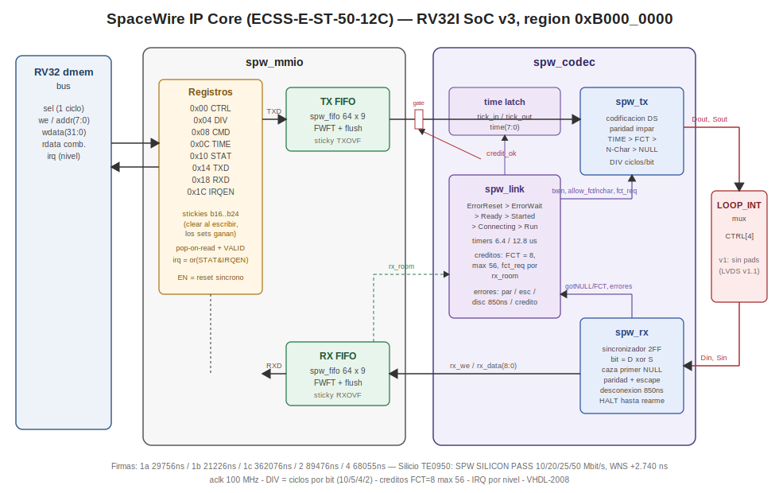

# SpaceWire IP Core — RV32I SoC v3 (TE0950 / AMD Versal)

A complete **SpaceWire link controller** (ECSS-E-ST-50-12C) in **VHDL-2008**
for the RV32IM SoC v3, taken from first RTL line to working silicon on a
**Trenz TE0950** (AMD Versal `xcve2302-sfva784-1LP-e-S`) with the project's
5-layer methodology of bit-identical simulation signatures.

**Silicon status: PASS.**

```
== SPW SILICON PASS (loop_int, escalonado) ==
```

All four rate steps (10 / 20 / 25 / 50 Mbit/s) pass the full self-test on
the board, with **WNS = +2.740 ns** at 100 MHz.



---

## 1. What this core is for

SpaceWire is the standard onboard data-handling network for spacecraft
(ESA/NASA/JAXA): a full-duplex, point-to-point serial link with Data-Strobe
encoding, credit-based flow control and hardware time distribution. This
core gives an RV32 SoC a memory-mapped SpaceWire endpoint:

- Send and receive **packets** as streams of N-Chars terminated by EOP/EEP,
  through simple FIFO registers (write bytes to TXD, pop bytes from RXD).
- Distribute or receive **Time-Codes** (the SpaceWire time broadcast
  mechanism) with a single register write / a sticky flag plus counter.
- Let hardware handle everything below the packet level: link bring-up and
  recovery (the full ECSS state machine), NULL keep-alive, parity, credit
  accounting and flow control, disconnect detection.

Typical uses: instrument/payload data links, chip-to-chip links between
FPGAs, lab ground-support equipment talking to SpaceWire hardware, or as
the link layer under a future RMAP/router (v2 roadmap).

**v1 scope** (frozen at project start): DS codec + full link FSM +
credit flow control + L/N characters with parity + Time-Codes; internal
self-test (`LOOP_INT`); MMIO region `0xB000_0000`; rate sweep in silicon.
**Not** in v1: RMAP, routing, physical LVDS pads (open question, v1.1).

## 2. Requirements

Hardware:

- Trenz TE0950 carrier with the AMD Versal `xcve2302-sfva784-1LP-e-S`
  (board part `trenz.biz:te0950_23_1lse:part0:1.2`), SD card for boot.
- No external SpaceWire hardware is needed: the silicon self-test runs
  entirely in internal loopback with the pads free.

Software (versions used for the silicon PASS — Vivado and PetaLinux
**must** match major/minor):

| Tool | Version | Used for |
|---|---|---|
| GHDL | 4.x (`--std=08`) | Layers 1a/1b/1c/2/4 simulation |
| Python 3 | any recent | `asm.py` (RV32 assembler) and helper scripts |
| Vivado | 2025.2.1 | Layer 5: BD transplant, synthesis, implementation, XSA |
| PetaLinux | 2025.2 | Linux image for the A72 (boot + `/dev/mem` bring-up) |
| `aarch64-linux-gnu-gcc` | from Vitis | Cross-compiling `spw_bringup.c` |

Project dependencies (paths as used in the scripts):

- The RV32i core sources at `~/vhdl_repo/IP_Cores/RV32i/` (`riscv_pkg`,
  `cpu_pipeline`, `dp_ram`, `dma_burst`, `axi_ddr_sim`, `axil_soc`,
  `asm.py`) — needed by layer 4 and by the Vivado project.
- A previous IP's Vivado project to clone (the CAN project was used:
  `~/can_ip/vivado_can/can_soc.xpr`), and `bd_review.tcl` from the USART
  core for the address-map audit.
- A previous PetaLinux project to clone (`~/plnx_te0950_can`).

## 3. Feature summary

- **DS codec**: TX emits exactly one transition (D or S) per bit; RX
  recovers each bit from `D xor S` edges behind a 2-FF synchronizer.
  Everything is synchronous to the 100 MHz fabric clock — no recovered
  clock, no extra clock domain, no CDC beyond the input synchronizer.
- **Characters**: N-Chars (8-bit data, LSB first) with EOP/EEP markers
  encoded in bit 8 of the 9-bit FIFO word; L-Chars FCT/EOP/EEP/ESC;
  NULL = ESC+FCT; Time-Code = ESC+data. **Odd parity chained across
  characters** exactly per ECSS (P covers the previous character's payload
  plus P itself and the current control flag).
- **Link FSM**: ErrorReset → ErrorWait → Ready → Started → Connecting →
  Run with the 6.4 µs / 12.8 µs timers, both enable paths (`START` and
  `AUTOSTART`+gotNULL), timeouts, and error resets for parity, escape,
  disconnect (850 ns without transitions, armed only after the first NULL)
  and credit violations, plus character-received-in-wrong-state errors.
- **Flow control**: one FCT grants 8 N-Chars, at most 56 outstanding; FCTs
  are only requested while the RX FIFO has room (`rx_room`), so
  backpressure propagates from the MMIO reader all the way to the far-end
  transmitter. EOP/EEP consume credit like any N-Char (per the standard).
- **Rates**: `DIV` = clock cycles per bit, minimum 2. At 100 MHz:
  DIV 10/5/4/2 → 10/20/25/50 Mbit/s. Each direction of a link may run at
  its own rate (validated in layer 1c with a 50/10 asymmetric link).
  50 Mbit/s is the reliable RX ceiling for a 100 MHz synchronous receiver.
- **FIFOs**: two 64-deep × 9-bit FWFT FIFOs (`spw_fifo`, byte_fifo-pattern
  interface: `LOG2_DEPTH` generic, `level` of LOG2_DEPTH+1 bits, async
  active-low reset) with flush commands and TXOVF/RXOVF stickies.
- **`LOOP_INT` self-test**: CTRL[4] loops Dout→Din and Sout→Sin inside the
  IP; a single codec negotiates the link with itself (its NULLs/FCTs come
  back to its own RX) and carries real traffic. This is the whole silicon
  self-test — no pads involved.

## 4. SoC memory map

The RV32 core's internal dmem bus decodes `addr[31:28]`:

| Region | Decode | Contents |
|---|---|---|
| `0x0000_0000` | `addr[31:30]="00"` | Local dual-port RAM (256 words), also the DMA's local side |
| `0x4000_0000` | `"0100"` | SoC `dma_burst` registers: 0x00 SRC, 0x04 DST, 0x08 LEN, 0x0C CTRL (b0 start, b1 dir), 0x10 STATUS (b0 sticky busy) |
| `0xB000_0000` | `"1011"` | **SpaceWire IP (this core)** |

These are *internal* RV32 addresses. From the A72/PS side:

| Physical address | Contents |
|---|---|
| `0x8000_0000` (64 KB) | AXI4-Lite slave (`axil_soc`): core control (0x00 halt), DBG_PC (0x08), DDR_BASE (0x10/0x14), IMEM window at +0x1000 |
| `0x7000_0000` (16 MB) | Reserved no-map DDR: the `dma_burst` report buffer read by the bring-up over `/dev/mem` |

## 5. SpaceWire register map (RV32 base `0xB000_0000`)

| Offset | Name | Access | Description |
|---|---|---|---|
| 0x00 | CTRL | RW | b0 **EN** (core + FIFOs in synchronous reset while 0), b1 **START**, b2 **AUTOSTART**, b3 **DISABLE**, b4 **LOOP_INT** |
| 0x04 | DIV | RW | b7:0 clock cycles per bit (min 2; resets to 0x0A = 10 Mbit/s). Own register so bring-up patches it with a single `addi` |
| 0x08 | CMD | W1P | Write-triggered: b0 TX_FLUSH, b1 RX_FLUSH |
| 0x0C | TIME | W / R | Write: b7:0 value → latched + tick (Time-Code sent in Run). Read: b7:0 last received time, b15:8 wrap-around tick counter |
| 0x10 | STAT | R / W-clear | Live: b2:0 link state, b3 RUN, b4 TX_SPACE, b5 RX_AVAIL, b6 TX_EMPTY, b7 RX_FULL, b14:8 rx_level. Sticky: b16 PAR, b17 ESC, b18 DISC, b19 CRED, b20 TICK, b21 LINKDOWN, b22 RUNOK, b23 TXOVF, b24 RXOVF. **Any write clears all stickies; same-cycle sets win over the clear** |
| 0x14 | TXD | W / R | Write: b8:0 N-Char into the TX FIFO (b8=1: b0=0 → EOP, b0=1 → EEP). Read: b6:0 tx_level, b8 tx_full |
| 0x18 | RXD | R | **Pop-on-read**: b8:0 character, b31 VALID. Reading with VALID=0 pops nothing, so polling RXD directly is safe |
| 0x1C | IRQEN | RW | Bitwise mask over the STAT view; `irq = or(STAT and IRQEN)`. Level-sensitive, no ack |

Link states: 0 ErrorReset, 1 ErrorWait, 2 Ready, 3 Started, 4 Connecting,
5 Run.

Bus contract (family pattern): `sel` is a 1-cycle qualified request, `we`
is the collapsed write strobe, `rdata` is **combinational** during the
`sel` cycle, and a read of RXD pops the FIFO on that same cycle (FWFT).
`rst` is synchronous active-high; internally the codec and FIFOs use
`arstn = not rst`.

## 6. How to use it (software)

Minimal bring-up and packet exchange from the RV32 (C-flavoured
pseudocode; `SPW` = `(volatile uint32_t*)0xB0000000`):

```c
SPW[1] = 10;            // DIV: 10 Mbit/s (start rate per ECSS)
SPW[0] = 0x13;          // CTRL = EN | START | LOOP_INT (drop LOOP_INT for a real link)
while (!(SPW[4] & 0x8)) ;          // poll STAT.RUN

SPW[5] = 0x42;          // TXD: data byte
SPW[5] = 0x100;         // TXD: EOP  (0x101 = EEP)

uint32_t w;
do { w = SPW[6]; } while (!(w >> 31));   // RXD: poll VALID (safe, no false pops)
uint16_t chr = w & 0x1FF;                // b8=1 -> EOP/EEP, else data byte

SPW[3] = 0x2A;          // TIME: send Time-Code 0x2A
// received Time-Codes: STAT b20 sticky, TIME read = last value + counter
```

To change the rate: `CTRL = 0` (full synchronous reset), write the new
`DIV`, re-enable. The ECSS-recommended policy (start every link at
10 Mbit/s, raise the rate once in Run) is left to software on purpose —
`DIV` applies directly.

Interrupt-driven RX instead of polling: `IRQEN = 1<<5` (RX_AVAIL) — the
level IRQ follows the FIFO's not-empty flag and reaches both the RV32
`irq_ext` and the PS (`pl_ps_irq1`).

The layer-4 program `spw_test.s` is the reference driver: bring-up, data,
EOP, Time-Code, a 16-byte burst verified by XOR, rate re-configuration and
the DMA report with the 1337 doorbell in `local[3]` travelling *inside*
the burst.

## 7. Verification — the 5 layers

Every layer ends at a **bit-identical simulation time** that acts as its
signature. GHDL `--std=08`; failure messages are plain ASCII.

| Layer | Bench / run | Signature | What it proves |
|---|---|---|---|
| 1a | `tb_spw_1a.vhd` / `run_1a.sh` | `29756ns` | TX vs an **independent event-driven receiver model** (zero shared code): absolute-time bit periods, never-simultaneous D/S transitions, first-NULL pattern sync, its own parity chain. NULLs, FCTs, data/EOP/EEP, Time-Codes with an explicit TIME > FCT > DATA priority test, N-Char gating, 50 Mbit/s restart, mid-character disable + 2 µs silence |
| 1b | `tb_spw_1b.vhd` / `run_1b.sh` | `21226ns` | RX vs a **procedural bit-bang transmitter** with corruptions: flipped parity, ESC+ESC, ESC+EOP, >850 ns disconnect (time-window checked), rxen drop mid-character; exact-order valid traffic at 100 ns and 20 ns bit periods; HALT-until-rearm after any error |
| 1c | `tb_spw_1c.vhd` / `run_1c.sh` | `362076ns` | **RTL vs RTL**: two codecs cross-wired full-duplex. Phase 0: with the partner off, Started must time out and never reach Connecting. Then dual bring-up (START + AUTOSTART), 130 concurrent characters both ways, Time-Codes, real credit starvation and resume, line-corruption injection with automatic recovery, partner power-off recovery, asymmetric 50/10 Mbit/s link. Independent wire watchers assert the first character after any long silence is a NULL |
| 2 | `tb_spw_2.vhd` / `run_2.sh` | `89476ns` | MMIO vs a **dmem-bus BFM** enforcing the RV32 contract. Reset values, RW registers, FIFO accounting/flushes, LOOP_INT bring-up, pop-on-read isolation, Time-Codes, level IRQs, DIV patching, and a 90-write TX avalanche (TXOVF sticky + end-to-end credit backpressure through the MMIO) |
| 4 | `tb_spw_soc.vhd` / `run_soc.sh` | `68055ns` | **Full SoC**: the RV32 runs `spw_test.s`, drives the IP over MMIO, reports 16 words to DDR via `dma_burst` with the doorbell inside the burst; the TB checks the 10 result words |

Every bench was armed against itself by **RTL mutation**: broken parity,
wrong bit period, simultaneous D/S, disabled parity check, premature
disconnect, ignored ESC+ESC, no FCTs, infinite credit, Connecting without
gotNULL, un-isolated pop-on-read, stickies without clear, dead IRQ — each
one is caught by its layer.

Running the simulations:

```bash
cd ~/spw_ip     # or the repo checkout
bash run_1a.sh  # -> simulation finished @29756ns
bash run_1b.sh  # -> @21226ns
bash run_1c.sh  # -> @362076ns  (simulates 362 us, takes ~1 min)
bash run_2.sh   # -> @89476ns
bash run_soc.sh # -> TEST PASSED, @68055ns (needs ~/vhdl_repo/IP_Cores/RV32i)
```

## 8. Layer 5 — silicon flow

### 8.1 Vivado transplant (2025.2.1)

The project is cloned from the previous IP and the module reference is
swapped. **All Tcl runs one command at a time in `vivado -mode tcl`,
reading every response** — a `connect_bd_net` once failed silently inside
a pasted block (USART lesson #4), and skipping steps produced misleading
`assign_bd_address` errors in this very project. Condensed sequence (the
fully commented version is `bd_spw_steps.tcl`):

```tcl
# clone + clean inherited runs
open_project $env(HOME)/can_ip/vivado_can/can_soc.xpr
save_project_as spw_soc $env(HOME)/spw_ip/vivado_spw -force
set_property source_mgmt_mode All [current_project]
reset_run synth_1 ; reset_run impl_1
set_property INCREMENTAL_CHECKPOINT "" [get_runs synth_1]
set_property INCREMENTAL_CHECKPOINT "" [get_runs impl_1]

# audit remote references (lesson #5) -- THIS PROJECT'S BD LIVED OUTSIDE
foreach f [get_files -all *] { if {[string match *can_ip* $f]} { puts "REMOTA: $f" } }

# the clone referenced a REMOTE BD in ~/can_ip/bd -> capture, deref, rebuild in-project
open_bd_design [get_files bd_soc_usart.bd]
write_bd_tcl -force $env(HOME)/spw_ip/bd_soc_usart_rebuild.tcl
close_bd_design [get_bd_designs bd_soc_usart]
remove_files [get_files bd_soc_usart.bd]
remove_files [get_files -quiet *bd_soc_usart_wrapper.v]
# write_bd_tcl captured run_remote_bd_flow=1: flip it so it rebuilds IN the project
exec sed -i {s/set run_remote_bd_flow 1/set run_remote_bd_flow 0/} $env(HOME)/spw_ip/bd_soc_usart_rebuild.tcl
source $env(HOME)/spw_ip/bd_soc_usart_rebuild.tcl
add_files -norecurse [make_wrapper -files [get_files bd_soc_usart.bd] -top]
set_property top bd_soc_usart_wrapper [current_fileset]

# surgery: CAN cell and sources out, SPW in
open_bd_design [get_files bd_soc_usart.bd]
delete_bd_objs [get_bd_cells u_soc_can]
remove_files [get_files -quiet {*byte_fifo.vhd *can_engine.vhd *can_mmio.vhd \
  *mem_subsys_can.vhd *soc_top_can.vhd *soc_top_can_wrap.v}]
remove_files -fileset constrs_1 [get_files -quiet *can_pins.xdc]
add_files -norecurse [list $env(HOME)/spw_ip/spw_fifo.vhd $env(HOME)/spw_ip/spw_tx.vhd \
  $env(HOME)/spw_ip/spw_rx.vhd $env(HOME)/spw_ip/spw_link.vhd $env(HOME)/spw_ip/spw_codec.vhd \
  $env(HOME)/spw_ip/spw_mmio.vhd $env(HOME)/spw_ip/mem_subsys_spw.vhd \
  $env(HOME)/spw_ip/soc_top_spw.vhd $env(HOME)/spw_ip/soc_top_spw_wrap.v]
set_property file_type {VHDL 2008} [get_files $env(HOME)/spw_ip/*.vhd]
update_compile_order -fileset sources_1
create_bd_cell -type module -reference soc_top_spw_wrap u_soc_spw

# reconnect BY SOURCE PIN (never Connection Automation for PL masters)
connect_bd_net [get_bd_pins versal_cips_0/pl0_ref_clk] [get_bd_pins u_soc_spw/aclk]
connect_bd_net [get_bd_pins rst_versal_cips_0_240M/peripheral_aresetn] [get_bd_pins u_soc_spw/aresetn]
connect_bd_intf_net [get_bd_intf_pins axi_smc/M00_AXI] [get_bd_intf_pins u_soc_spw/s_axi]
connect_bd_intf_net [get_bd_intf_pins u_soc_spw/m_axi] [get_bd_intf_pins axi_noc_0/S06_AXI]
get_property CONFIG.ASSOCIATED_BUSIF [get_bd_pins /axi_noc_0/aclk6]  ;# must be S06_AXI
get_property CONFIG.ASSOCIATED_BUSIF [get_bd_pins /axi_noc_0/aclk0]  ;# must NOT include it
connect_bd_net [get_bd_pins u_soc_spw/irq_out]     [get_bd_pins versal_cips_0/pl_ps_irq0]
connect_bd_net [get_bd_pins u_soc_spw/spw_irq_out] [get_bd_pins versal_cips_0/pl_ps_irq1]

# SPW v1 has no pads: the inherited external port goes away, nothing replaces it
delete_bd_objs [get_bd_ports can_bus]
delete_bd_objs [get_bd_nets Net1]          ;# orphan net left by port+cell deletion

# explicit address map + audit BEFORE spending synthesis
assign_bd_address -target_address_space /u_soc_spw/m_axi \
  [get_bd_addr_segs axi_noc_0/S06_AXI/C0_DDR_LOW0] -force
assign_bd_address -target_address_space /versal_cips_0/M_AXI_LPD \
  [get_bd_addr_segs u_soc_spw/s_axi/reg0] -offset 0x80000000 -range 64K -force
validate_bd_design
source $env(HOME)/vhdl_repo/IP_Cores/USART/bd_review.tcl
save_bd_design
```

Then synthesis and implementation (batch, blocking):

```bash
vivado -mode batch -source ~/spw_ip/run_synth_spw.tcl   # -> synth_design Complete!, 100%
vivado -mode batch -source ~/spw_ip/run_impl_spw.tcl    # -> WNS = 2.740, spw_soc.xsa written
```

`run_synth_spw.tcl` also removes any leftover `byte_fifo.vhd` (the SPW
uses its own `spw_fifo`) and re-audits `can_ip` references.

### 8.2 PetaLinux (2025.2) and SD

```bash
cp -a ~/plnx_te0950_can ~/plnx_te0950_spw
rm -rf ~/plnx_te0950_spw/build/tmp ~/plnx_te0950_spw/build/cache   # lesson 8: cp -a drags absolute paths

source ~/Petalinux/settings.sh
cd ~/plnx_te0950_spw
petalinux-config --get-hw-description=/home/adrian/spw_ip/spw_soc.xsa --silentconfig
petalinux-build
petalinux-package --boot --u-boot --force
```

The `reserved-memory` node for `0x7000_0000` is inherited from the cloned
device tree; the IP itself is driven from user space over `/dev/mem`, so
no kernel driver and no new DT node are needed.

SD (FAT partition wiped clean before copying — lesson 12):

```bash
sudo rm -rf /media/$USER/BOOT/*
sudo cp ~/plnx_te0950_spw/images/linux/{BOOT.BIN,boot.scr,image.ub} /media/$USER/BOOT/
sudo cp ~/spw_ip/spw_bringup /media/$USER/BOOT/
sync && sudo umount /dev/sda1 /dev/sda2
```

### 8.3 Bring-up on the target

```bash
cd ~/spw_ip && bash run_bringup.sh    # cross-compiles spw_bringup (aarch64, static)
```

On the TE0950 (serial console or SSH):

```bash
cd /run/media/BOOT-mmcblk1p1
sudo ./spw_bringup          # four steps: DIV 10/5/4/2 -> 10/20/25/50 Mbit/s
sudo ./spw_bringup 2        # or a single step
```

Per step it halts the core, sets DDR_BASE, loads the embedded layer-4
program through the IMEM window (patching `DIV` in `prog[2]`/`prog[73]`
and `CTRL` in `prog[4]`/`prog[75]` — I-type immediates in dedicated `addi`
slots), releases the core, waits for the doorbell (`DDR[3] = 1337`) and
checks the 10 result words. The embedded program is byte-identical to the
`spw_test.mem` that passed layer 4.

## 9. Problems faced during the project

An honest log — most bugs were in the testbenches, which is what the
methodology is designed to surface; two were real verification gaps.

1. **byte_fifo is 8 bits, SpaceWire N-Chars are 9** (data + EOP/EEP flag).
   Resolved with a local `spw_fifo.vhd` keeping the byte_fifo interface
   pattern. Side benefit: no duplicated `byte_fifo` to purge in Vivado
   (lesson 7 became a non-issue by construction).
2. **Layer 1b, phase F**: the "partial character" sent before dropping
   `rxen` had an invalid parity bit, so the DUT — correctly — flagged
   `err_par` before the test even got to the point. Testbench bug; the
   RTL was right.
3. **Layer 1c deadlock**: `wait until b_done = 1` when `b_done` was
   *already* 1 — `wait until` waits for an **event** before evaluating, so
   the stimulus slept forever. Replaced by a guarded
   `while b_done /= n loop wait on b_done; end loop`. Classic VHDL trap.
4. **Layer 1c flow control**: the test expected the steady-state credit to
   be exactly 56. It is not: FCTs are granted in units of 8 when `outst`
   crosses 48, so steady state is 56 − (traffic mod 8). After 30
   characters the link rests at 50 credits. The DUT was right; the test
   now discovers the stall point at runtime and asserts the invariants
   (0 < N ≤ 56, strict stall, ordered resume).
5. **RTL-vs-RTL common-mode blind spot** (the interesting one): a mutation
   making Started jump to Connecting **without gotNULL** passed layer 1c,
   because both ends were equally broken and interoperated happily. Fixed
   with phase 0 (partner powered off: Started must expire by timeout and
   never reach Connecting) plus two independent wire watchers asserting
   the first character after any long silence is a NULL. Moral: RTL vs
   RTL cannot catch protocol deviations both instances share.
6. **Staggered-start transient**: after phase 0, enabling B mid-cycle of A
   made B (legitimately) see A's NULLs and then A's Started timeout as a
   disconnect — a real protocol event tripping the "no spurious events"
   assert. Solved with a clean re-arm of A before the joint bring-up.
7. **Layer 2 avalanche ordering**: dropped characters under TX overflow
   are **not** the last ones — the TX drains during the write burst, slots
   open, later writes get in. The correct invariant is a strictly
   increasing subsequence, not a contiguous prefix.
8. **The cloned Vivado project referenced a remote BD** living in
   `~/can_ip/bd/` (outside the project): editing it in place would have
   corrupted the parent CAN project. Rescued with the full lesson-5
   procedure: `write_bd_tcl`, de-reference, flip the captured
   `run_remote_bd_flow` from 1 to 0 (the generated script faithfully tries
   to recreate the BD *remotely* and errors out because the path exists),
   rebuild in-project, `make_wrapper`, re-audit.
9. **Skipped Tcl steps**: jumping ahead to `assign_bd_address` before the
   cell swap had actually been executed produced
   `Master address space </u_soc_spw/m_axi> does not exist` — confusing
   until `get_bd_cells` showed `u_soc_can` still alive. The
   one-command-at-a-time discipline exists precisely for this.
10. **Orphan net after pad removal**: deleting the `can_bus` port and the
    CAN cell left `Net1` with no source (`save_bd_design` warned).
    Deleted, plus a sweep for other orphan nets.
11. **RX rate ceiling**: with a 100 MHz clock and a 2-FF synchronizer, the
    receiver reliably resolves transitions down to 2 clocks apart →
    50 Mbit/s max. Decided at scope-freeze time (option "symmetric 50"
    over a faster RX clock domain that would have added CDC to layer 5).

## 10. Known limitations and roadmap

- **No physical pads in v1**: the wrapper ties `din/sin` to 0 and leaves
  `dout/sout` unconnected; the silicon self-test is pure `LOOP_INT`. The
  CRUVI/HDIO LVDS pin choice (4 unidirectional signals — no IOBUF/tristate,
  unlike CAN) is the v1.1 open question, analogous to the CAN core's
  SN65HVD230. Interoperability with third-party SpaceWire equipment is
  therefore validated only against the independent models and RTL-vs-RTL,
  not yet against foreign hardware.
- **No RMAP, no routing** — v2 roadmap, layered on top of this link core.
- Links slower than ~2 Mbit/s would false-trigger the 850 ns disconnect
  timer (not a v1 use case; the standard start rate is 10 Mbit/s).
- The ECSS "start at 10 Mbit/s, then raise" rate policy is software's
  responsibility; `DIV` applies directly.

## 11. File map

| File | Role |
|---|---|
| `spw_tx.vhd` | TX engine: DS encoding, chained odd parity, TIME > FCT > N-Char > NULL priority |
| `spw_rx.vhd` | RX engine: 2-FF sync, bit recovery, first-NULL hunt, decode, error detection, HALT-until-rearm |
| `spw_link.vhd` | ECSS link FSM, timers, credit accounting, FCT request generation |
| `spw_codec.vhd` | Codec top: TX + RX + link + Time-Code latch + credit gating |
| `spw_fifo.vhd` | 9-bit FWFT FIFO (byte_fifo interface pattern + sync clear) |
| `spw_mmio.vhd` | The IP top: registers + FIFOs + codec + LOOP_INT mux |
| `mem_subsys_spw.vhd` | SoC memory subsystem (local RAM + DMA + SPW region decode) |
| `soc_top_spw.vhd`, `soc_top_spw_wrap.v` | SoC top and BD wrapper (no pads in v1) |
| `tb_spw_1a/1b/1c/2/soc.vhd`, `run_*.sh` | The five verification layers |
| `spw_test.s` | Layer-4 / bring-up RV32 program (patchable `addi` fields) |
| `spw_bringup.c`, `run_bringup.sh` | Silicon bring-up over `/dev/mem` (rate sweep) |
| `bd_spw_steps.tcl`, `run_synth_spw.tcl`, `run_impl_spw.tcl` | Vivado transplant / synth / impl |
| `architecture.svg` | Block diagram (embedded above) |

## 12. Results record

| Layer | Signature / result |
|---|---|
| 1a | `simulation finished @29756ns` |
| 1b | `simulation finished @21226ns` |
| 1c | `simulation finished @362076ns` |
| 2 | `simulation finished @89476ns` |
| 4 | `TEST PASSED`, `simulation finished @68055ns` |
| Timing | WNS = **+2.740 ns** (aclk 100 MHz) |
| Silicon | **`SPW SILICON PASS`** at 10 / 20 / 25 / 50 Mbit/s, LOOP_INT, TE0950 |

## License

MIT.
