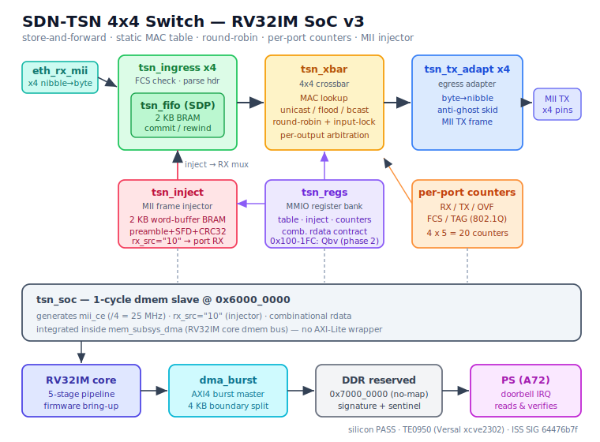

# SDN-TSN 4x4 Switch — TSN family IP core (v1)

A synthesizable, silicon-validated store-and-forward Ethernet switch (4 ports)
in VHDL-2008, for the custom RV32IM SoC v3. Store-and-forward with FCS check,
static MAC table, round-robin egress, flooding of unknown/broadcast, per-port
counters, and a built-in MII injector so the whole datapath can be validated on
silicon with no external PHY or traffic generator.

Validated on the Trenz **TE0950** (AMD Versal `xcve2302-sfva784-1LP-e-S`): the
on-chip counter vector is bit-identical to the Python ISS oracle, signature
`0x64476b7f`.



## Table of contents

1. What is this and why would you use it
2. Feature set
3. How it fits in the SoC
4. Register map
5. How to use it — software
6. Forwarding rules & the injector
7. Verification strategy
8. Build & run — simulation
9. Build & run — Vivado
10. Build & run — PetaLinux & SD card
11. Problems faced during the project
12. Known limitations and roadmap
13. File map
14. Results record

## 1. What is this and why would you use it

This core switches Ethernet frames between four MII ports. Each ingress port
checks the frame FCS, parses the header, and buffers the frame store-and-forward.
A 4x4 crossbar looks up the destination MAC in a static 16-entry table and
forwards the frame; unknown and broadcast destinations are flooded to the other
three ports. Per-port counters track RX, TX, overflow-drop, FCS-drop, and
802.1Q-tag events.

You would use it as the switching fabric in an RV32IM SoC that needs to move
Ethernet frames between several ports under software control, with a clean MMIO
interface and no dependency on an external switch chip. It is the base for a
time-aware (802.1Qbv) shaper — the register map already reserves the space.

The switch is presented to the core as a **1-cycle `dmem` slave at
`0x6000_0000`**, the same read/write contract as the simpler peripherals in the
family — not through an AXI-Lite wrapper. This keeps `rdata` purely
combinational and the integration light.

## 2. Feature set

- Four MII ports, 10/100-style nibble interface.
- Store-and-forward with full FCS (CRC-32) validation on ingress.
- Static MAC table, 16 entries, programmed via MMIO (no learning in v1).
- 4x4 crossbar, round-robin per-output arbitration, input-lock.
- Unknown/broadcast destinations flooded to the other three ports.
- Per-port counters: RX, TX, overflow-drop, FCS-drop, 802.1Q-tag.
- 802.1Q frames recognized and counted, forwarded transparently.
- Built-in MII injector for PHY-less, generator-less silicon bring-up.
- Register hole `0x100-0x1FC` reserved for 802.1Qbv gating (phase 2).
- All memories infer Block RAM; 5.9% LUT on the `xcve2302`.

## 3. How it fits in the SoC

The switch lives inside `mem_subsys_dma` as a direct 1-cycle `dmem` slave at
`0x6000_0000` — unlike the PTP core, which is an AXI-Lite slave; the switch is
simpler and sits straight on the core's data bus. The SoC wrapper (`tsn_soc`)
generates the `mii_ce` clock-enable (a /4 divider giving 25 MHz MII from the
100 MHz core clock) and hard-wires `rx_src="10"` so the injector drives the RX
path during bring-up.

SoC memory map (address bits 31:28):

| Base | Region |
|------|--------|
| `0x0000_0000` | local RAM (256 words) |
| `0x4000_0000` | DMA registers |
| `0x6000_0000` | **TSN switch** |
| `0x7000_0000` | DDR reserved buffer (16 MB, no-map) |
| `0x8000_0000` | AXI-Lite slave (PS side, IMEM window + control) |

## 4. Register map

Byte offsets from `0x6000_0000`. `W1` = write-1 action bit.

| Offset | Name | Access | Fields |
|--------|------|--------|--------|
| 0x000 | CONTROL | RW | b0 enable, b1 cnt_clear (W1) |
| 0x004 | STATUS | RO | status flags |
| 0x008 | TBL_MAC_LO | RW | MAC[31:0] |
| 0x00C | TBL_MAC_HI | RW | b31 valid, b17:16 port, b15:0 MAC[47:32] |
| 0x010 | TBL_IDX | RW | table index (write triggers entry commit) |
| 0x020 | INJ_CTRL | RW | b1:0 port, b2 go |
| 0x024 | INJ_LEN | RW | injected frame length (bytes) |
| 0x028 | INJ_WDATA | WO | push one 32-bit word to injector buffer |
| 0x02C | INJ_STATUS | RW | b0 busy, b1 clr (W1) |
| 0x040..0x04C | RX0..RX3 | RO | per-port received count |
| 0x050..0x05C | TX0..TX3 | RO | per-port transmitted count |
| 0x060..0x06C | OVF0..OVF3 | RO | per-port overflow-drop count |
| 0x070..0x07C | FCS0..FCS3 | RO | per-port FCS-drop count |
| 0x080..0x08C | TAG0..TAG3 | RO | per-port 802.1Q-tagged count |
| 0x0C0 | DBG_STATE | RO | debug state |
| 0x100..0x1FC | (reserved) | — | 802.1Qbv GCL, phase 2 |

## 5. How to use it — software

### Program a MAC table entry (C, via MMIO pointer)

```c
#define TSN 0x60000000u
#define reg(o) (*(volatile uint32_t*)(TSN + (o)))

// entry: MAC 02:00:00:00:00:01 -> port 0, index 0
reg(0x08) = 0x00000001;              // TBL_MAC_LO
reg(0x0C) = 0x80000200;              // valid | port 0 | MAC[47:32]=0x0200
reg(0x10) = 0;                       // TBL_IDX = 0 (commit)
```

### Inject a frame (bring-up)

```c
reg(0x2C) = 0x2;                     // clear injector buffer
reg(0x28) = word0; reg(0x28) = word1;// push payload words (byte0 in [7:0])
// ... push all words ...
reg(0x24) = 60;                      // INJ_LEN = 60 bytes
reg(0x20) = (port & 3) | 0x4;        // go | port
while (reg(0x2C) & 1) ;              // wait busy = 0
```

### Read the counters

```c
uint32_t rx0 = reg(0x40), tx0 = reg(0x50);
uint32_t ovf0 = reg(0x60), fcs0 = reg(0x70), tag0 = reg(0x80);
```

### Minimal RV32 assembly (asm.py subset)

The full bring-up firmware (`tsn_bringup.s`, 238 instructions) programs the
table, does 8 injections, reads the 20 counters into local RAM, DMAs them to the
DDR reserved buffer, and rings the doorbell (word 127). `asm.py` note: `li` = 2
words; `jalr rd, N(rs1)`; decimal offsets; no `la`/`lbu`/`.byte`.

## 6. Forwarding rules & the injector

On a committed, FCS-valid frame the crossbar resolves the destination:

- **Known unicast** (MAC in table): forwarded to the matched egress port.
- **Unknown unicast** (no match): flooded to the other three ports.
- **Broadcast** (`FF:FF:FF:FF:FF:FF`): flooded to the other three ports.
- **802.1Q-tagged**: counted (TAG), forwarded transparently (tag preserved).

FCS-failed frames are dropped at ingress (FIFO rewind) and counted (FCS).
Overflow drops are interleaved, not tail-dropped, so the retained subsequence is
strictly increasing (OVF).

The injector (`tsn_inject`) synthesizes valid MII frames internally so the whole
datapath can be exercised on silicon with no PHY: firmware loads a payload, sets
length and target port, and the injector emits preamble + SFD + payload + a
CRC-32 FCS computed on the fly into the RX side of the chosen port
(`rx_src="10"`).

## 7. Verification strategy

Five simulation layers, pass criterion = bit-identical end-of-simulation
timestamps against an independent model, plus mutations that must be detected:

| Layer | What it proves | Result |
|-------|----------------|--------|
| 1a | each block vs an independent event-driven model + mutations | PASS |
| 1c | full switch over an MII cable, Phase-0 anti-common-mode test | 58 deliveries, PASS |
| 2 | MMIO bank vs a dmem BFM (combinational rdata contract) | PASS |
| 4 | full SoC, RTL-vs-ISS via the injector | SIG `0x64476b7f`, PASS |
| 5 (sim) | full SoC running RV32 firmware + DMA doorbell to DDR | PASS |
| 5 (silicon) | TE0950 hardware | **PASS** |

A mutation is "detected" by the absence of the PASS string (using `--stop-time`
to bound hangs, since `--stop-time` exits 0). Mutations proven equivalent by
construction were closed by trace comparison, not assumed.

## 8. Build & run — simulation

```
ghdl -a --std=08 tsn_pkg.vhd ../ETH/rtl/eth_pkg.vhd ../ETH/rtl/eth_rx_mii.vhd \
  ../ETH/rtl/eth_tx_mii.vhd tsn_fifo.vhd tsn_ingress.vhd tsn_xbar.vhd \
  tsn_tx_adapt.vhd tsn_inject.vhd tsn_regs.vhd tsn_top.vhd <tb>.vhd
ghdl -e --std=08 <tb> ; ghdl -r --std=08 <tb> --stop-time=1ms
```

Mutation regression: `run_mut_*.sh` (each must fail, i.e. no PASS string).

## 9. Build & run — Vivado

```
# clone + clean (see vivado/tsn_soc_steps.tcl for the full sequence)
# ~ is NOT expanded in the Tcl console: use $env(HOME) or absolute paths.
# clear the incremental checkpoint (Versal) and sweep for remote artifacts:
#   set_property INCREMENTAL_CHECKPOINT "" [get_runs synth_1]
# swap the core cell u_soc_eth -> u_soc_tsn, rewire clock/reset/s_axi/m_axi/irq
# by source pin (delete orphan nets first), then address map:
#   m_axi -> axi_noc_0/S06_AXI/C0_DDR_LOW0   (the SI with a real DDR route)
#   s_axi <- versal_cips_0/M_AXI_LPD @ 0x80000000 [64K]
# an out-of-context synth_design changes the project top: restore it to
#   bd_soc_usart_wrapper before re-synthesizing the SoC.
# -> synth 0 errors, WNS = +1.837 ns, XSA written to tsn_soc.xsa
```

## 10. Build & run — PetaLinux & SD card

```
petalinux-create -t project --template versal -n plnx_te0950_tsn
cp -r ~/plnx_te0950_ptp/project-spec/meta-user project-spec/   # inherit dtsi
petalinux-config --get-hw-description=<path>/tsn_soc.xsa        # keep reserved-mem
petalinux-build
petalinux-package --boot --u-boot --force                      # repackage BOOT.BIN
```

The `reserved-memory` block (`rv32i_reserved` @ `0x7000_0000`, `no-map`, 16 MB)
is inherited and must survive the `--get-hw-description`. Versal rejects
hot-loaded PDIs, so `BOOT.BIN` must be repackaged (not just the PDI copied).
Copy `BOOT.BIN`, `image.ub`, `boot.scr`, and the cross-compiled `tsn-bringup`
to the SD FAT partition; boot; `./tsn-bringup`.

## 11. Problems faced during the project

**Injector BRAM inference (16800 FF -> 1 RAMB18).** The first synthesis put the
injector's 2 KB buffer entirely into flip-flops (16,384 FF). Root cause: the
buffer was a byte array written four bytes per cycle (one `INJ_WDATA` = four
simultaneous writes) with asynchronous reads — a pattern matching neither the
BRAM nor the LUTRAM mold, so Vivado used registers. Fix: a 512x32-bit **word**
array with a single synchronous write port and a single synchronous read port
(canonical simple-dual-port BRAM mold). The serializer reads the word holding
the current byte and selects the byte combinationally; the `mii_ce` spacing (one
byte every four cycles) hides the one-cycle BRAM read latency, and the output
MII trace is bit-identical (layer-1a PASS at the same end timestamp, 5/5
mutations). Result: 16,800 -> 127 FF + 1 RAMB18; total SoC FF 22,068 -> 5,202.

**FIFO pruning is not a defect.** In the same synthesis the four ingress FIFOs
showed 49 FF and zero BRAM each, which looked like a failed inference. It was
not: with `rx_src="10"` the injector feeds one port at a time, so the un-fed
FIFOs store nothing observable and Vivado prunes their RAM by constant
propagation. Out-of-context synthesis of `tsn_fifo` alone infers exactly 1
RAMB18 — the block is correct, and in real traffic all four FIFOs infer BRAM.
Lesson: distinguish a real inference failure (the injector) from
context-dependent pruning (the FIFOs) by synthesizing the block in isolation
before touching sealed RTL.

**Vivado block-design transplant.** The SoC was built by cloning the sibling
Ethernet project (audited CIPS + NoC + SmartConnect + reset + RV32IM core as a
module reference) and swapping the peripheral. Gotchas that only surface running
the flow command-by-command: `~` is not expanded in the Tcl console; an
out-of-context `synth_design` silently changes the project top; deleting a BD
cell leaves orphan nets with one dangling end that must be deleted before
reconnecting; and the m_axi master must be wired by scripted Tcl to the NoC
slave that actually has a DDR route (`S06_AXI`) — connection automation routes
it to a port with zero DDR access.

**Combinational dmem rdata.** The core `dmem` read data path must be purely
combinational. A registered `rdata` passes the layer-2 MMIO test but fails
layer-4, where every `lw` returns the previous read's data.

## 12. Known limitations and roadmap

- **No MAC learning** in v1: the table is static, programmed via MMIO.
- **Head-of-line blocking**: store-and-forward with per-output round-robin and
  input-lock, no egress FIFOs. Documented, not a bug.
- **802.1Q transparent**: tags are counted and preserved, not acted on.
- **Phase 2 — 802.1Qbv**: the register hole `0x100-0x1FC` is reserved for a
  time-aware gate-control list, gating each egress against a schedule derived
  from the family's PTP/802.1AS time base. No RTL yet.

## 13. File map

- **RTL**: `tsn_pkg`, `tsn_fifo`, `tsn_ingress`, `tsn_xbar`, `tsn_tx_adapt`,
  `tsn_inject`, `tsn_regs`, `tsn_top`, `tsn_soc`; SoC glue `mem_subsys_dma`,
  `soc_top_master`, `soc_top_master_wrap` (TSN-local copies).
- **Testbenches**: `tb_tsn_fifo`, `tb_tsn_ingress`, `tb_tsn_xbar`,
  `tb_tsn_tx_adapt`, `tb_tsn_inject`, `tb_tsn_regs`, `tb_mii_bridge`,
  `tb_tsn_top_l1c`, `tb_tsn_soc`.
- **Mutations**: `run_mut_*.sh`.
- **Firmware**: `tsn_bringup.s`, `tsn_bringup.mem`, `tsn-bringup.c`.
- **Models/oracle**: `iss_tsn.py`, `iss_tsn_oracle.txt`, `tsn_model.py`,
  `tsn_scn1.py`.
- **Vivado**: `vivado/tsn_soc_steps.tcl`.
- **Shared** (from `../ETH/rtl/`, not versioned here): `eth_pkg.vhd`,
  `eth_rx_mii.vhd`, `eth_tx_mii.vhd`.

## 14. Results record

- Synthesis: 8,882 LUTs (5.9%), 5,202 FF, 5 RAMB18, 3 DSP; 0 errors, 0 crit.
- Implementation: WNS +1.837 ns, WHS +0.017 ns (timing met).
- Silicon (TE0950):

```
PASS: switch TSN 4x4 validado en silicio.
  contadores = RX{2,2,2,2} TX{4,3,4,2} OVF{0,0,0,0} FCS{0,0,0,0} TAG{1,0,0,0}
  sentinela 0x0000D0ED OK (SIG del ISS: 64476b7f)
```

Counter vector bit-identical to the ISS oracle and layer-5 simulation.

## License

MIT. Part of the open-source RV32IM SoC IP family, intended for public
presentation and reuse.
