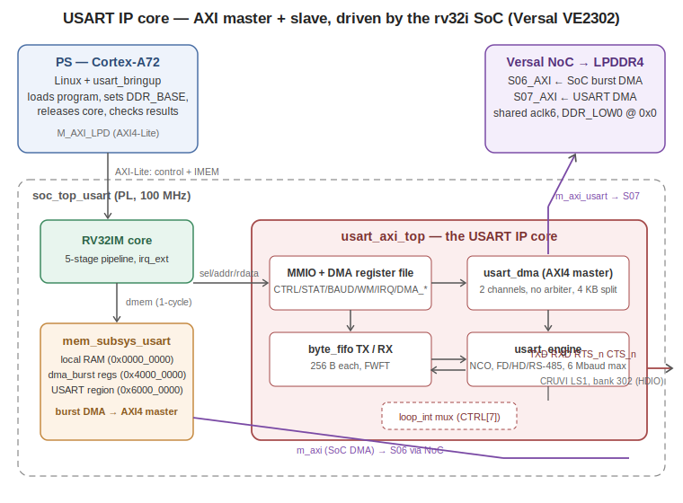

# MMUSART — Memory-Mapped USART IP Core with Dual-Channel AXI4 DMA

A complete, silicon-validated USART (Universal Synchronous/Asynchronous
Receiver-Transmitter) peripheral IP core written in VHDL-2008, designed for
the RV32I SoC v3 and validated on a Trenz TE0950 board (AMD Versal
xcve2302). It provides register-mapped PIO with FIFOs and level-based
interrupts, an autonomous dual-channel AXI4 DMA master for
high-throughput transfers directly to/from LPDDR4, and three selectable
line modes: full duplex, half duplex over a single shared wire, and
RS-485 with automatic driver-enable.

Verified from 115200 baud up to **6 Mbaud on real silicon** (96 ns/bit,
4% below the theoretical NCO ceiling of Fclk/16 = 6.25 Mbaud).

**License:** MIT

---

## Table of contents

1. [What is this core and what is it for](#1-what-is-this-core-and-what-is-it-for)
2. [Applications](#2-applications)
3. [Feature summary](#3-feature-summary)
4. [Hardware requirements](#4-hardware-requirements)
5. [Software requirements](#5-software-requirements)
6. [Architecture](#6-architecture)
7. [Address map and register reference](#7-address-map-and-register-reference)
8. [Programming tutorial](#8-programming-tutorial)
9. [Simulation guide (layers 1–4)](#9-simulation-guide-layers-14)
10. [Hardware build flow (Vivado)](#10-hardware-build-flow-vivado)
11. [Linux build flow (PetaLinux) and board bring-up](#11-linux-build-flow-petalinux-and-board-bring-up)
12. [Silicon results](#12-silicon-results)
13. [Problems encountered and how they were solved](#13-problems-encountered-and-how-they-were-solved)
14. [Repository layout and shared dependencies](#14-repository-layout-and-shared-dependencies)

---

## 1. What is this core and what is it for

A USART is the classic serial port: it converts parallel bytes into a
framed, self-clocked serial bit stream (start bit, data bits, optional
parity, stop bits) and back. It is the simplest and most universal way for
two digital systems to talk over one or two wires, with no shared clock.

This core implements a **memory-mapped USART**: from the point of view of
the CPU (the RV32I soft core in this SoC, or anything that can drive the
1-cycle dmem-style slave port) it is just a block of registers at
`0x6000_0000`. Software writes a byte to `TXDATA` and it appears on the
wire; bytes arriving on the wire accumulate in a FIFO that software reads
from `RXDATA`. On top of that basic PIO model the core adds:

- **FIFOs and interrupts**, so the CPU services the port in bursts instead
  of babysitting every byte.
- A **DMA master**, so large transfers move between LPDDR4 and the wire
  with zero CPU involvement: software programs an address and a length,
  and gets an interrupt when the transfer is done.
- **Line-mode flexibility** (full duplex / half duplex / RS-485), so the
  same silicon serves a debug console, a two-wire field bus, or an
  industrial RS-485 multidrop network.

The design goal was to repeat, for a USART, the exact methodology used for
the SPI master IP in this repository: specify → validate every module in
simulation isolation → integrate into the RV32I SoC → prove it on silicon
with a self-test that needs no external hardware.

## 2. Applications

- **Debug/console UART for the RV32I soft core** — the RV32 finally gets
  its own serial port, independent of the PS UARTs.
- **Host communication links**: PC ↔ FPGA via an FTDI 3.3 V cable at up to
  6 Mbaud with DMA doing the heavy lifting (≈600 KB/s sustained).
- **RS-485 industrial/field buses** (Modbus RTU and similar): the DE
  strobe is generated in hardware with frame-accurate timing, and the RX
  idle timeout provides the inter-frame gap detection those protocols
  need.
- **GPS/GNSS, LoRa, Bluetooth and cellular modems**, most of which speak
  UART with optional RTS/CTS flow control.
- **Sensor networks over a single shared wire** (half-duplex mode with
  built-in turnaround and echo suppression).
- **Packetized telemetry with unknown frame lengths**: the DMA RX
  idle-flush termination writes whatever arrived to DDR and reports the
  true byte count — no need to know the packet size in advance.

## 3. Feature summary

| Area | Details |
|------|---------|
| Baud generation | 33-bit NCO (phase accumulator), `K = baud·16·2^32/Fclk`. Error < 0.01% at any standard rate. 300 baud – 6.25 Mbaud at Fclk = 100 MHz |
| RX front end | 16× oversampling, 2FF synchronizer, false-start rejection at mid-start-bit, 3-sample majority vote (ticks 7/8/9) |
| Frame formats | 7/8 data bits, parity none/even/odd, 1/2 stop bits (STOP2 affects TX only; RX always validates one stop bit) |
| Error model | 16550-style: framing/parity errors push the byte and set sticky flags; break sets exactly one sticky, pushes nothing, RX re-arms when the line returns high |
| FIFOs | 2 × 256 B FWFT (`byte_fifo`, shared with the SPI IP). Overflow = drop-newest + sticky flag, never back-pressure |
| Interrupts | Level-based: RX watermark, TX watermark (refill request), RX idle timeout (16550 character-timeout style, self-clearing), error group, DMA TX/RX done |
| Flow control | CTS_n gates TX at character boundaries only; RTS_n with hysteresis (deassert at DEPTH−8, reassert below RX watermark) |
| Line modes | Full duplex · half duplex (shared line, tristate + pull-up, echo suppression, 1-bit turnaround) · RS-485 (RTS pad = active-high DE spanning the whole frame) |
| Self-test | `LOOP_INT` (CTRL[7], same bit position as the SPI IP): internal TX→RX loopback, zero external hardware |
| DMA | Two independent AXI4 channels on one master port, **no arbiter** (TX uses AR/R only, RX uses AW/W/B only). INCR bursts ≤16 beats, 4 KB chopping, byte-granular length via partial `wstrb`. RX terminates by count, idle-flush (with true `RX_COUNT`), or abort |
| Bus interfaces | 1-cycle dmem-style slave (sel/req/addr/wdata/wstrb/rdata) + AXI4 master (40-bit address, 32-bit data) |
| Silicon | TE0950 / xcve2302, 100 MHz, WNS +2.801 ns, quadruple PASS 115200/921600/3M/6M baud |

## 4. Hardware requirements

- **Trenz TE0950** carrier with the Versal AI Edge **xcve2302** (the flow
  is portable to other Versal devices; the NoC/CIPS steps are generic).
- **LPDDR4** managed by the NoC memory controller (the DMA masters target
  `DDR_LOW0`).
- 16 MB of DDR **outside kernel management** for the shared buffers
  (reserved via device tree at `0x7000_0000`, `no-map`).
- For the internal-loopback self-test: **nothing else**. The quadruple
  silicon PASS below used zero external hardware.
- For external pad tests: the CRUVI LS1 connector is board-to-board, so a
  **CR00025 adapter** is required to place jumpers. Pins (bank 302, HDIO,
  LVCMOS33 — deliberately inherited from the SPI IP so the same jumper
  validates both cores):

| Signal | CRUVI pin | Constraint notes |
|--------|-----------|------------------|
| TXD | D10 (was SPI MOSI) | `inout`; IOBUF lives in the wrapper; PULLUP mandatory (half duplex idles Hi-Z) |
| RXD | C10 (was SPI MISO) | PULLUP (a floating input reads idle '1', not noise) |
| RTS_n / DE | A10 (was SPI CS_n) | carries active-high DE in RS-485 mode |
| CTS_n | D11 (was SPI SCLK) | PULLDOWN (permissive when unconnected) |

  External loopback = jumper **D10 → C10**. External flow-control test =
  second jumper **A10 → D11**.
- For talking to a PC: any **3.3 V TTL USB-UART cable** (e.g. FTDI
  TTL-232R-3V3) on the same pins.

## 5. Software requirements

- **Vivado 2025.2.1** (VHDL-2008 support required; xsim is the simulator
  for all four testbench layers).
- **PetaLinux 2025.2.1** matching the Vivado version.
- **Trenz TE0950 board files** for Vivado (`board_files` repository path
  set in `vivado_soc_usart.tcl`).
- **Python 3** — for `asm.py` (the custom RV32I assembler from
  `IP_Cores/RV32i/`) and the DDR-pattern generator inside `run_soc.sh`.
- Shared RTL from this repository (see
  [section 14](#14-repository-layout-and-shared-dependencies)): the
  RV32I SoC v3 sources and `byte_fifo.vhd` from the SPI IP. The run
  scripts resolve them from `~/rv32i/` and `~/spi_ip/` with local-copy
  fallbacks.

## 6. Architecture



```
                          usart_axi_top
   ┌───────────────────────────────────────────────────────────┐
   │   addr < 0x30            │            addr >= 0x30        │
   │   ┌───────────────────┐  │   ┌──────────────────────────┐ │
   │   │    usart_mmio     │◄─┼───┤  DMA register file       │ │
   │   │ ┌───────────────┐ │  │   │  TXA·TXLEN·RXA·RXLEN·    │ │
   │   │ │ byte_fifo TX  │ │ hooks│  CTRL·STAT·RXCNT         │ │
   │   │ │ byte_fifo RX  │◄┼──┼──►└────────────┬─────────────┘ │
   │   │ └───────┬───────┘ │  │                │               │
   │   │ ┌───────▼───────┐ │  │   ┌────────────▼─────────────┐ │
   │   │ │ usart_engine  │ │  │   │        usart_dma         │ │
   │   │ │ NCO·TX·RX·2FF │ │  │   │  TX ch: AR/R only        │ │
   │   │ └──────┬────────┘ │  │   │  RX ch: AW/W/B only      │ │
   │   └────────┼──────────┘  │   │  (concurrent, no arbiter)│ │
   │            │ pads        │   └────────────┬─────────────┘ │
   └────────────┼─────────────┴────────────────┼───────────────┘
         TXD·RXD·RTS·CTS               m_axi → NoC → LPDDR4
     ▲ 1-cycle dmem-style slave (sel/req/addr/wdata/wstrb/rdata)
```

**`usart_engine.vhd`** — the wire-level machine. One shared NCO produces
`tick16` (16 ticks per bit); the TX FSM advances only on ticks so every
bit cell is exactly 16 ticks wide; the RX FSM arms on the falling edge at
clock resolution (phase error ≤ 1/16 bit) and votes samples 7/8/9 of every
cell. Half-duplex arbitration (defer to ongoing RX + 1-bit turnaround +
post-TX guard) and echo suppression live here.

**`usart_mmio.vhd`** — register file + both FIFOs + the engine. The pop of
`RXDATA` is a side effect of the read cycle — safe because `dmem_req` is
exactly one cycle wide in this SoC (verified property, inherited from the
SPI IP). v1.1 adds DMA hook ports **with defaults**, so the layer-2
testbench compiles and passes unchanged: the regression proves the hooks
are behavior-neutral.

**`usart_dma.vhd`** — the architectural departure from `spi_dma`. SPI is
lockstep full duplex, so its DMA is one FSM; UART TX and RX are
independent streams of independent lengths, so this DMA is **two engines**
that legally share one AXI master because the AXI read and write channels
are protocol-independent. Burst sizing, 4 KB chopping and partial-`wstrb`
tails are inherited verbatim from `dma_burst`. The RX channel adds the
piece that makes UART RX DMA usable: termination by idle-flush with a
private idle counter (armed only after the first byte; re-armed by pushes
and line activity but *not* by its own drain pops).

**`usart_axi_top.vhd`** — composition: gates the slave select at
`addr < 0x30` toward the validated MMIO block, implements the DMA
registers at 0x30+, merges IRQs. Writing DMA_CTRL = 0x03 launches both
channels in a single store.

**SoC integration** — `mem_subsys_usart.vhd` (region "0110" =
`0x6000_0000`, sel/addr/rdata pass-through), `soc_top_usart.vhd` (second
AXI master `m_axi_usart`, USART IRQ into both the RV32 `irq_ext` and
`pl_ps_irq1`), `soc_top_usart_wrap.v` (block-design wrapper with the
half-duplex IOBUF built in: the TXD pad is a single `inout` and one
bitstream serves all three line modes).

## 7. Address map and register reference

### System-level address map (as seen by each master)

| Master | Address | What lives there |
|--------|---------|------------------|
| A72 (Linux) | `0x8000_0000` (64 K) | SoC AXI-Lite slave: CONTROL/STATUS/DBG_PC/IRQ/DDR_BASE at 0x0000+, IMEM window at 0x1000 |
| A72 (Linux) | `0x7000_0000` (16 MB) | reserved DDR buffer (no-map), shared with the RV32 DMAs |
| RV32 core | `0x0000_0000` | local RAM (1 KB dp_ram), 1 cycle |
| RV32 core | `0x4000_0000` | SoC DMA registers (`dma_burst`): SRC/DST/LEN/CTRL/STATUS |
| RV32 core | `0x6000_0000` | **this IP** (offsets below) |
| USART DMA / SoC DMA | `ddr_base + offset` | LPDDR4 via NoC (S07 / S06), 4-byte-aligned offsets |

### USART registers (offset from `0x6000_0000`; 1-cycle access; whole-word writes)

| Offset | Register | Access | Bits |
|--------|----------|--------|------|
| 0x00 | CTRL | rw | [0] EN · [1] TX_EN · [2] RX_EN · [3] PAR_EN · [4] PAR_ODD · [5] STOP2 · [6] DATA7 · [7] **LOOP_INT** · [8] FLOW_EN · [9] HALF_DUP |
| 0x04 | STAT | r / any write clears stickies | [0] tx_busy · [1] tx_empty · [2] tx_full · [3] rx_empty · [4] rx_full · [5] rx_ovf\* · [6] tx_ovf\* · [7] frame_err\* · [8] par_err\* · [9] break\* · [10] rx_busy · [11] cts_n · [12] rts_n |
| 0x08 | BAUD | rw | NCO increment `K = baud·16·2^32 / 100e6`. Reset = 79 164 837 (115200) |
| 0x0C | TXDATA | w | push wdata[7:0] to the TX FIFO (full → dropped + tx_ovf) |
| 0x10 | RXDATA | r | RX FIFO head; **pop happens on the read** |
| 0x14 | TXLVL | r | TX FIFO fill level (bytes) |
| 0x18 | RXLVL | r | RX FIFO fill level (bytes) |
| 0x1C | IRQ_EN | rw | [0] rx_wm · [1] tx_wm · [2] rx_idle · [3] err |
| 0x20 | IRQ_STAT | r | raw level causes, same bit positions |
| 0x24 | WM | rw | [8:0] RX watermark · [24:16] TX watermark. Reset 128/64 |
| 0x28 | IDLE_TO | rw | idle timeout in **bit-times** (16 bits). Reset 40 ≈ 4 chars |
| 0x30 | DMA_TXA | rw | DDR **read** offset over ddr_base, 4-aligned |
| 0x34 | DMA_TXLEN | rw | [23:0] TX channel length in bytes |
| 0x38 | DMA_RXA | rw | DDR **write** offset over ddr_base, 4-aligned |
| 0x3C | DMA_RXLEN | rw | [23:0] RX channel maximum bytes |
| 0x40 | DMA_CTRL | w / r | write: [0] tx_start · [1] rx_start · [2] rx_abort · [4] irq_en_txdone · [5] irq_en_rxdone — **bits [5:4] update on every write**. read: [5:4] |
| 0x44 | DMA_STAT | r / any write clears stickies | [0] tx_busy(sticky) · [1] rx_busy(sticky) · [2] tx_done\* · [3] rx_done\* · [4] rx_flushed\* · [5] tx_rerr\* · [6] rx_berr\* |
| 0x48 | DMA_RXCNT | r | bytes actually written to DDR (valid at rx_done) |

Semantics worth memorizing:

- **Interrupts are level-based with no acknowledge registers.** `rx_wm`
  clears itself as you drain the FIFO below the watermark; `rx_idle`
  clears on any pop/push/line activity; the error group clears when you
  write STAT. `irq = OR(IRQ_EN & IRQ_STAT) | (dma enables & dma dones)`.
- **`tx_done` means the DMA finished moving bytes into the FIFO**, not
  that they left the wire. For line completion poll STAT.tx_empty and
  tx_busy.
- **Busy stickies** in DMA_STAT rise in the same cycle as the start write
  (combinational detection) so software never observes a false idle
  window between start and the engine actually leaving IDLE.
- **Do not mix PIO and DMA on the same FIFO at the same time** (the
  hardware ORs both paths; the contract is software's).

## 8. Programming tutorial

All examples are RV32I assembly for `asm.py` (the same conventions as
`usart_test.s`) plus the equivalent idea in C-like pseudocode. Base
registers used throughout:

```asm
        lui  x1, 0x60000        # x1 = USART base
        lui  x2, 0x40000        # x2 = SoC DMA base (for reporting)
```

### 8.1 Initialization

Compute K on the host (it needs 64-bit math):
`K = baud · 16 · 2^32 / 100e6 = baud · 2^36 / 1e8`, e.g. 2 Mbaud →
0x51EB851F. Load it with a lui+addi pair (watch the addi sign: if
`K[11] = 1`, add 1 to the upper 20 bits):

```asm
        lui  x5, 0x51EB8        # K[31:12]
        addi x5, x5, 1311       # K[11:0] = 0x51F (bit 11 = 0, no fixup)
        sw   x5, 8(x1)          # BAUD
        addi x5, x0, 20
        sw   x5, 40(x1)         # IDLE_TO = 20 bit-times
        addi x5, x0, 135        # 0x87 = EN|TX_EN|RX_EN|LOOP_INT
        sw   x5, 0(x1)          # CTRL  (use 0x07 for real pads)
```

For 8E1 instead of 8N1: CTRL = 0x8F (adds PAR_EN). For RS-485:
CTRL = 0x207 (EN|TX_EN|RX_EN|HALF_DUP), FLOW_EN clear — the RTS pad then
carries the DE strobe automatically.

### 8.2 Polled PIO (send two bytes, read the echo)

```asm
        addi x5, x0, 90         # 0x5A
        sw   x5, 12(x1)         # TXDATA
        addi x5, x0, 195        # 0xC3
        sw   x5, 12(x1)         # TXDATA
        addi x7, x0, 2
poll:   lw   x6, 24(x1)         # RXLVL
        bne  x6, x7, poll       # wait for both echoes
        lw   x9, 16(x1)         # RXDATA -> 0x5A   (pop on read!)
        lw   x9, 16(x1)         # RXDATA -> 0xC3
```

Rule: before pushing, check STAT.tx_full (or TXLVL < 256) if you might
outrun the wire — a push to a full FIFO is **dropped** and flagged, never
stalled. Before popping, check RXLVL > 0 — popping an empty FIFO returns
stale data.

### 8.3 Interrupt-driven RX (console pattern)

```asm
        # WM: rx watermark = 16, tx watermark = 8  -> 0x0008_0010
        lui  x5, 0x00008
        addi x5, x5, 16
        sw   x5, 36(x1)         # WM
        addi x5, x0, 5          # IRQ_EN = rx_wm | rx_idle
        sw   x5, 28(x1)
```

The handler (irq_ext on the RV32) reads IRQ_STAT once, then drains: while
`RXLVL != 0` pop RXDATA. That is the whole acknowledge — `rx_wm` falls
below the watermark and `rx_idle` re-arms on the first pop. The
**rx_idle** cause is the piece that makes variable-length lines work: the
last few bytes below the watermark still raise an interrupt IDLE_TO
bit-times after the line goes quiet, 16550 character-timeout style. Check
IRQ_STAT[3] (err) and, if set, read STAT for the specific sticky and
write STAT to clear.

### 8.4 DMA transmit (DDR → wire)

Buffer already in DDR at `ddr_base + 0x000` (the host wrote it; on the
RV32 side these are offsets, ddr_base is programmed once from Linux):

```asm
        sw   x0, 48(x1)         # DMA_TXA  = 0
        addi x5, x0, 512
        sw   x5, 52(x1)         # DMA_TXLEN = 512 bytes
        addi x5, x0, 17         # 0x11 = tx_start | irq_en_txdone
        sw   x5, 64(x1)         # DMA_CTRL
        # ... interrupt fires when the DMA finished FILLING the FIFO.
        # For "last bit left the pad", additionally poll:
wait:   lw   x6, 4(x1)          # STAT
        andi x6, x6, 3          # tx_busy | tx_empty
        addi x7, x0, 2          # want: empty=1, busy=0
        bne  x6, x7, wait
```

### 8.5 DMA receive with unknown length (packet pattern)

Arm for the maximum you can accept; let the idle-flush close the frame:

```asm
        addi x5, x0, 1024
        sw   x5, 56(x1)         # DMA_RXA  = 1024 (offset in DDR)
        lui  x5, 0x00001        # 4096
        sw   x5, 60(x1)         # DMA_RXLEN = 4096 max
        addi x5, x0, 34         # 0x22 = rx_start | irq_en_rxdone
        sw   x5, 64(x1)
        # ... on the rx_done interrupt:
        lw   x6, 68(x1)         # DMA_STAT: bit4 tells you WHY it closed
        lw   x7, 72(x1)         # DMA_RXCNT = true bytes received
        sw   x0, 68(x1)         # clear stickies (any write)
```

`rx_flushed = 1` → the remote went quiet (normal packet end);
`rx_flushed = 0` → the buffer filled (`RX_COUNT == RX_LEN`; more may be
coming — re-arm immediately). If nothing ever arrives, the channel waits
forever by design (the idle counter only arms after the first byte);
cancel with `DMA_CTRL = 0x04` (rx_abort) — count stays 0, any FIFO
residue remains available to PIO.

### 8.6 Full-duplex concurrent DMA (the loopback self-test does this)

Both channels launch from **one** store — TX reads a buffer while RX
captures whatever arrives, simultaneously, on one AXI port:

```asm
        sw   x0, 48(x1)         # TXA = 0
        addi x5, x0, 32
        sw   x5, 52(x1)         # TXLEN = 32
        addi x5, x0, 256
        sw   x5, 56(x1)         # RXA = 256
        addi x5, x0, 32
        sw   x5, 60(x1)         # RXLEN = 32
        addi x5, x0, 3
        sw   x5, 64(x1)         # tx_start | rx_start
        addi x7, x0, 15         # mask busys+dones
        addi x8, x0, 12         # expect dones=11, busys=00
pollb:  lw   x6, 68(x1)
        and  x6, x6, x7
        bne  x6, x8, pollb
```

### 8.7 Host side (A72/Linux) — loading and running the RV32

The full reference is `usart_bringup.c`; the sequence over `/dev/mem` at
`0x8000_0000`:

```c
wr(REG_CONTROL, 1);                       // hold the RV32 in reset
for (i = 0; i < N; i++) wr(0x1000 + 4*i, prog[i]);   // load IMEM
/* verify readback ... */
wr(REG_DDRB_LO, 0x70000000); wr(REG_DDRB_HI, 0);     // ddr_base
/* seed buffers in the reserved DDR window ... */
wr(REG_IRQ, 1);                           // clear doorbell sticky (w1c)
wr(REG_CONTROL, 0);                       // release the core
/* poll the doorbell word in DDR, then verify results */
```

Patchable immediates in `usart_test.s` (word index in IMEM):
`prog[2]/prog[3]` = the BAUD lui+addi pair, `prog[5]` = IDLE_TO,
`prog[7]` = CTRL (0x87 internal loop / 0x07 external pads).

## 9. Simulation guide (layers 1–4)

Each layer is self-checking (assert-based with descriptive failure
messages) and runs standalone with xsim:

```bash
source ~/Xilinx/2025.2.1/Vivado/settings64.sh
cd <this directory>
./run_engine.sh      # layer 1: engine vs an INDEPENDENT time-based model
./run_mmio.sh        # layer 2: registers/FIFOs/IRQs (FIFO_LOG2=4 for speed)
./run_axi.sh         # layer 3: dual-channel DMA vs axi_ddr_sim (2 pages)
./run_soc.sh         # layer 4: RV32 running usart_test.s, 2x axi_ddr_sim
```

Success criterion in every case: `ALL TESTS PASSED` / `TEST PASSED`.
Coverage highlights per layer:

- **L1 (T1–T12b)**: gap-free back-to-back TX, every format, ±2% baud
  mismatch tolerance, 100 ns glitch rejection, parity/framing/break
  injection, CTS gating mid-stream without frame corruption, FLOW_EN=0
  ignoring CTS, internal loopback, half-duplex echo suppression + deferral
  + turnaround. The behavioral model shares zero logic with the DUT (pure
  `wait for` timing, no NCO), so a systematic DUT bug cannot be mirrored.
- **L2 (M1–M9)**: reset values, PIO round-trip, both overflow policies
  with byte-by-byte survivor checks, watermark IRQs both directions, the
  full idle-timeout life cycle, error stickies via injected bad frames,
  RTS hysteresis, RS-485 DE.
- **L3 (A1–A6)**: RX-by-count, **concurrent TX+RX on one m_axi**, 4 KB
  boundary crossings in both directions (the DDR model asserts on any
  illegal burst — silence is the proof), idle-flush with partial `wstrb`
  and true RX_COUNT, zero spurious flush with count=0, clean abort,
  tx_done IRQ rise/clear.
- **L4**: the 3-phase firmware end-to-end with doorbell + data
  verification in both DDR models (172 µs of simulated time).

## 10. Hardware build flow (Vivado)

```bash
cd <this directory>
vivado -mode batch -source vivado_soc_usart.tcl   # project + BD skeleton
vivado vivado_proj_usart/rv32i_soc_usart.xpr &
```

Then in the GUI, in this exact order (every step here exists because
skipping it bit us — see section 13):

1. Open `bd_soc_usart` → Add IP → **CIPS** → **Run Block Automation**
   (Trenz board preset: CIPS + axi_noc + LPDDR4). **Do NOT run Connection
   Automation for the PL masters.**
2. CIPS configuration: **M_AXI_LPD** enabled (32-bit), **pl_ps_irq0/1**
   enabled, **Number of Fabric Resets = 1**, **PL CLK0 = 100 MHz** (the
   240 MHz default will not close timing through the muldiv DSP path),
   and **S_AXI_LPD disabled**.
3. Tcl console: paste the `proc fix_noc {}` block from
   `vivado_soc_usart.tcl` and run `fix_noc` (batch-session procs die with
   the session). It sets NoC `NUM_SI=8 / NUM_CLKS=7`, connects
   `m_axi → S06_AXI` and `m_axi_usart → S07_AXI`, puts both on a shared
   `aclk6` fed by `pl0_ref_clk`, and wires connectivity to MC_0.
   **Then check `aclk0`**: new SIs get parented to it by default — strip
   them back with
   `set_property CONFIG.ASSOCIATED_BUSIF {S00_AXI} [get_bd_pins axi_noc_0/aclk0]`.
4. M_AXI_LPD → SmartConnect → `u_soc/s_axi`. Address Editor: slave at
   **`0x8000_0000` / 64 K** (low M_AXI_LPD window — not 0xA000_0000), and
   assign DDR to the new masters explicitly:
   `assign_bd_address -target_address_space [get_bd_addr_spaces u_soc/m_axi] [get_bd_addr_segs axi_noc_0/S06_AXI/*DDR_LOW0*]`
   (and the same for `m_axi_usart` / S07).
5. Audit: `source bd_review.tcl` and read `bd_report.txt`. Green means:
   no `psv_*` segments under the PL masters, no phantom `reset_rtl` port,
   each SI associated with exactly one clock, three `/u_soc/` address
   lines (2× DDR_LOW0 + reg0), VALIDATE OK with no BD 41-2670 warnings.
6. `make_wrapper -files [get_files bd_soc_usart.bd] -top`, add the
   generated `bd_soc_usart_wrapper.v`, `set_property top
   bd_soc_usart_wrapper [current_fileset]` — the RTL wrapper was only the
   top so the BD could instantiate it; the **BD wrapper** is the real top.
7. **Generate Device Image** (Versal PDI). Reference timing: WNS
   **+2.801 ns** at 100 MHz.
8. `write_hw_platform -fixed -include_bit -force -file rv32i_soc_usart.xsa`

## 11. Linux build flow (PetaLinux) and board bring-up

```bash
source ~/Petalinux/settings.sh
petalinux-create -t project --template versal -n plnx_te0950_usart
cd plnx_te0950_usart
petalinux-config --get-hw-description <path>/rv32i_soc_usart.xsa   # defaults
```

Reserved buffer (16 MB, no-map) in
`project-spec/meta-user/recipes-bsp/device-tree/files/system-user.dtsi`:

```dts
/include/ "system-conf.dtsi"
/ {
    reserved-memory {
        #address-cells = <2>;
        #size-cells = <2>;
        ranges;
        rv32i_reserved: buffer@70000000 {
            no-map;
            reg = <0x0 0x70000000 0x0 0x1000000>;
        };
    };
};
```

App recipe + build + SD:

```bash
petalinux-create -t apps --name usart-bringup --enable
cp usart_bringup.c project-spec/meta-user/recipes-apps/usart-bringup/files/usart-bringup.c
petalinux-build
petalinux-package --boot --u-boot --force
cp images/linux/BOOT.BIN images/linux/boot.scr images/linux/image.ub /media/<user>/<SD>/
sync && umount /media/<user>/<SD>
```

On the board (root):

```bash
usart-bringup 115200            # internal loopback, zero hardware
usart-bringup 921600
usart-bringup 3000000
usart-bringup 6000000           # NCO near-ceiling bonus
usart-bringup 115200 ext        # external pads (jumper D10 -> C10)
```

Per-run PASS criterion:
`PASS: PIO {2, 0x5A, 0xC3} + eco DMA concurrente de 32 bytes OK`. On
TIMEOUT the tool prints DBG_PC/STATUS/IRQ — DBG_PC against the program
listing tells you exactly which poll loop the RV32 is stuck in.

## 12. Silicon results

Board TE0950 (xcve2302-sfva784-1LP), Vivado/PetaLinux 2025.2.1, PL at
100 MHz.

- **Timing**: WNS **+2.801 ns**, WHS +0.019 ns, 0 failing endpoints
  (13 808 setup/hold endpoints, 3 784 pulse-width).
- **Internal-loopback bring-up** (PIO {2, 0x5A, 0xC3} + 32-byte concurrent
  dual-channel DMA echo, all data verified byte-by-byte):

| Baud | K (NCO) | Bit time | Result |
|------|---------|----------|--------|
| 115 200 | 0x04B7F5A5 | 8.68 µs | **PASS** |
| 921 600 | 0x25BFAD2A | 1.085 µs | **PASS** |
| 3 000 000 | 0x7AE147AE | 333 ns | **PASS** |
| 6 000 000 | 0xF5C28F5C | 167 ns | **PASS** — 4% below the Fclk/16 ceiling |

- Pending, non-blocking (waiting on the CR00025 adapter): external pad
  loopback (`ext` mode) and external RTS→CTS flow-control exercise.

## 13. Problems encountered and how they were solved

Documented in build order — most of these will bite anyone repeating the
flow on Versal, and two of them repeat SPI-era lessons in new clothing.

1. **VHDL case-insensitivity name collision** (`usart_dma.vhd`). The RX
   state enum literal `X_COL` and the byte counter signal `x_col` are the
   *same identifier* in VHDL — xsim reported `'x_col' is already declared`
   plus cascading type errors. Fix: rename the signal (`x_colc`). The SPI
   never hit this because its names were disjoint (`W_COL` vs `col_cnt`).
2. **Delta-cycle race in a testbench assert** (layer-2 M9). `txd_t` and
   the RS-485 DE both derive from the same `tx_active`, but through
   combinational chains of different depth; a `wait until txd_t = '0'`
   woke mid-delta (Iteration: 3) before DE had propagated. Fix: settle
   100 ns before asserting. Hardware was correct; the testbench sampled
   too early.
3. **Connection Automation routed `m_axi` to `S_AXI_LPD`** — the exact SPI
   trap, reproduced. Symptom in `bd_report.txt`: ~150 `psv_*` address
   segments (ADMA, CoreSight, IPI...) under the PL master and **zero
   DDR**; on silicon this would have been DMA writes over PS peripheral
   registers (the SError panic, deluxe edition). Meanwhile `m_axi_usart`
   was left entirely unconnected. Fix: delete the phantom SmartConnect
   route and connect both masters by Tcl to dedicated NoC SIs. **Never run
   Connection Automation for PL masters; audit with `bd_review.tcl`
   before spending synthesis time.** Note: `validate_bd_design` said OK
   throughout — valid is not the same as correct.
4. **Phantom `reset_rtl` external port.** Root cause: the CIPS had no
   fabric reset enabled, so Block Automation invented an external reset
   pin (which does not exist on the board) to feed proc_sys_reset. A
   first repair attempt failed *silently* inside a large pasted Tcl block
   — `pl0_resetn` didn't exist yet, `connect_bd_net` errored, and
   `ext_reset_in` was left floating (a board that never leaves reset).
   Fix: enable Number of Fabric Resets = 1 in CIPS, connect `pl0_resetn`,
   and — the operational lesson — **run repair Tcl one command at a time,
   reading every response**.
5. **Double clock association on the new NoC SIs.** Adding SIs parents
   them to `aclk0` by default; setting `ASSOCIATED_BUSIF` on `aclk6`
   *added* without removing, leaving S06/S07 on two clocks — `aclk0` being
   a *different domain* (`fpd_cci_noc_axi0_clk`). Had the NoC compiler
   resolved toward `aclk0`, the NSUs would have been timed in the wrong
   domain: a silent unintended CDC. Fix: strip `aclk0` back to
   `S00_AXI` only.
6. **"Incomplete address path" (BD 41-2670).** New SIs come with no
   address segments; a generic `assign_bd_address` ran too early and
   mapped nothing. Fix: explicit per-master assigns targeting each SI's
   `DDR_LOW0`.
7. **Implementation ran with the wrong top**: 533 I/O ports vs 364
   available, "no CIPS in netlist", `aclk` entering through an IBUF. The
   RTL wrapper had been set as top (necessary for the BD's Module
   Reference) and the final "make the BD wrapper the top" step was
   skipped. Fix: `make_wrapper` on the BD + `set_property top
   bd_soc_usart_wrapper`.
8. **Timing failure at first closure: WNS −0.837 ns, 854 endpoints.**
   `clk_pl_0` was running at the CIPS default of **240 MHz** — the
   "PL CLK0 = 100 MHz" configuration step had never been applied. The
   evidence had been visible all along in the auto-named reset cell
   `rst_versal_cips_0_240M`, and the failing path was the RV32 muldiv
   DSP58 chain (15 logic levels, 5.4 ns), impossible at 4.16 ns and
   comfortable at 10 ns. Fix: set PL CLK0 = 100 MHz — which the entire
   stack (NCO constant, bring-up tool, baud math) assumes anyway. Result:
   WNS +2.801 ns.

Design-review catches worth recording (bugs killed before any simulation
ran): an undeclared `rx_perr` latch left as a placeholder in the engine's
parity path; a configuration-change-while-in-STOP hazard in the layer-2
testbench's `cfg_default`; and a mid-stop TX-busy race in the M2 status
check.

## 14. Repository layout and shared dependencies

```
IP_Cores/USART/
├── usart_engine.vhd            # L1: NCO + TX/RX FSMs, line modes
├── usart_mmio.vhd              # L2: registers + FIFOs + engine (v1.1 hooks)
├── usart_dma.vhd               # L3: dual-channel AXI4 master
├── usart_axi_top.vhd           # L3: composition + DMA regs + IRQ merge
├── mem_subsys_usart.vhd        # L4: SoC decode, region 0x6000_0000
├── soc_top_usart.vhd           # L4: SoC top, two AXI masters
├── soc_top_usart_wrap.v        # L5: BD wrapper, IOBUF built in
├── usart_pins.xdc              # CRUVI LS1 pads + pulls + false paths
├── vivado_soc_usart.tcl        # project + BD skeleton + fix_noc proc
├── bd_review.tcl               # BD audit (shared with the SPI flow)
├── tb_usart_engine.vhd         # T1..T12b
├── tb_usart_mmio.vhd           # M1..M9
├── tb_usart_axi.vhd            # A1..A6
├── tb_usart_soc.vhd            # RV32 + 2x axi_ddr_sim
├── usart_test.s                # 3-phase RV32 firmware (patchable imms)
├── usart_bringup.c             # A72 bring-up tool (PetaLinux app)
├── run_engine.sh  run_mmio.sh  run_axi.sh  run_soc.sh
└── README.md
```

**Shared sources — referenced, not duplicated** (the run scripts resolve
them with local-copy fallbacks):

| Source | Home | Used by |
|--------|------|---------|
| `byte_fifo.vhd` | `IP_Cores/SPI/` | layers 2–5 (both FIFOs) |
| `riscv_pkg, alu, regfile, muldiv, immgen, control, csr, dp_ram, cpu_pipeline, dma_burst, axil_soc, axi_ddr_sim, asm.py` | `IP_Cores/RV32i/` | layers 3–5 |
