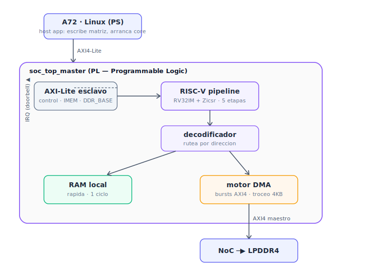

# rv32i — A RISC-V core from scratch, on a Versal, in VHDL

A **RV32IM + Zicsr** processor written from an empty file and taken all the way
from RTL to running on the silicon of an **AMD Versal VE2302** (Trenz TE0950),
driven by Linux on the Cortex-A72, doing real matrix work (GEMV) as an autonomous
accelerator with its own **AXI master port and burst DMA**.

**License: MIT** — use it, fork it, build products on it.

<p align="center">
  
</p>

---

## Table of contents

1. [What it is](#what-it-is)
2. [What the core can do (and why you might want it)](#what-the-core-can-do)
3. [Applications](#applications)
4. [The story / feature progression](#the-story)
5. [Architecture](#architecture)
6. [Hardware results](#hardware-results)
7. [Repository layout](#repository-layout)
8. [Prerequisites](#prerequisites)
9. [Part A — Simulation](#part-a--simulation)
10. [Part B — Vivado hardware build](#part-b--vivado-hardware-build)
11. [Part C — PetaLinux](#part-c--petalinux)
12. [Part D — Running on hardware](#part-d--running-on-hardware)
13. [How to adapt it to your own workload](#adapt-it)
14. [Troubleshooting](#troubleshooting)
15. [License](#license)

---

## What it is <a name="what-it-is"></a>

`rv32i` is a small but complete RISC-V processor **and** a full SoC around it,
built incrementally and validated at every step in simulation before touching
hardware. It runs on the Programmable Logic (PL) of a Versal adaptive SoC, is
controlled by Linux running on the hard Cortex-A72 cores, and fetches its own
data from LPDDR4 through the Versal NoC.

The core implements:

- **RV32IM** base integer ISA + the **M** extension (mul/div/rem) + **Zicsr**
  (CSRs, traps, external/timer/software interrupts, `mret`).
- Two microarchitectures, proven **bit-identical** to each other by differential
  testing over hundreds of random programs:
  - a **single-cycle** core (simple, easy to read and modify), and
  - a **5-stage pipeline** (IF/ID/EX/MEM/WB) with full forwarding, load-use
    stalls, branch resolution in EX, and precise traps/interrupts.
- A **variable-latency memory interface**: the pipeline freezes cleanly while a
  load/store to external memory is in flight (tens of cycles). This is the key
  that lets the core talk to real DDR through AXI without corrupting state.

The SoC wraps the core with:

- an **AXI4-Lite slave** for PS control (halt/run, status, debug PC, IRQ, and a
  runtime DMA-base register) plus program loading into instruction memory;
- an **AXI4 master** (through a register-controlled burst DMA engine) that reaches
  LPDDR4 via the NoC and **splits every transfer at 4 KB boundaries** as AXI4
  requires;
- a **real hardware interrupt** back to the PS (doorbell → PL-PS IRQ → UIO in
  Linux).

Everything here is plain, readable VHDL-2008 (plus two thin Verilog wrappers that
Vivado's block designer requires). No vendor IP inside the core.

---

## What the core can do (and why you might want it) <a name="what-the-core-can-do"></a>

This is a **soft processor you fully own and understand**. Unlike a black-box
vendor core, every line is yours to read, instrument, and change. Concretely you
get:

- **A real CPU you can run C or assembly on.** It executes standard RV32IM, so you
  can target it with the GNU RISC-V toolchain (`riscv32-unknown-elf-gcc`) or the
  tiny included assembler for bare-metal routines.
- **A programmable accelerator template.** The v3 SoC is a worked example of the
  pattern that matters in practice: a host (Linux on the A72) hands work to a PL
  engine, the engine pulls its own data from DDR with DMA bursts, computes, and
  raises an interrupt when done. Swap the compute kernel and you have *your*
  accelerator.
- **A teaching / research platform.** Because the single-cycle and pipeline cores
  are bit-identical, you can study microarchitecture (hazards, forwarding, stalls,
  precise exceptions) with a golden reference to check against. Great for courses,
  papers, and experiments.
- **A verification harness.** The repo includes an assembler, a differential
  tester, behavioral AXI models (a fake DDR slave with a 4 KB-crossing assertion),
  and testbenches for every layer — a ready-made way to validate changes before
  synthesis.
- **A Versal bring-up reference.** The block-design and PetaLinux steps here (PL
  master into the NoC, DDR reserved-memory shared with the PL, UIO interrupts,
  40-bit addressing) are the exact things people get stuck on. This repo documents
  them end to end.

### Capabilities at a glance

| Capability | Detail |
|---|---|
| ISA | RV32I + M (mul/div/rem) + Zicsr |
| Cores | single-cycle and 5-stage pipeline (interchangeable) |
| Traps/IRQ | precise; external/timer/software; CLINT-style |
| Bus (control) | AXI4-Lite slave, program + register access from a host |
| Bus (data) | AXI4 **master** with burst DMA to external memory |
| DMA | register-programmed, DDR↔local, 4 KB-safe bursts |
| Interrupt out | doorbell → PL-PS IRQ → Linux UIO |
| Verified | differential testing + per-layer testbenches |
| Silicon | Versal VE2302 @ 100 MHz, WNS ~3.2 ns |

---

## Applications <a name="applications"></a>

The v3 architecture (host + autonomous DMA-fed PL compute + interrupt) is a
general accelerator skeleton. Some directions people can take it:

- **Linear algebra / DSP offload** — GEMV is included; extend to GEMM, FIR/IIR
  filters, FFT butterflies, dot products, convolutions. The DMA-tiling pattern
  already handles data larger than on-chip memory.
- **Control systems on satellites/robots (the original motivation)** — attitude
  determination and control (ADCS) math, Kalman/UKF steps, MPC solves: dense
  matrix-vector kernels that map onto this exact structure.
- **Programmable smart-DMA / data mover** — the DMA engine plus a small program is
  a flexible, scriptable data mover between DDR regions and PL logic.
- **Custom ISA experiments** — add instructions (crypto, fixed-point, bit-manip)
  to a core you fully control, then measure the effect in silicon.
- **Edge preprocessing** — a low-footprint CPU next to sensors that filters,
  thresholds, or packetizes data before it reaches the host.
- **Education** — a complete, readable path from ALU to a Linux-driven SoC, ideal
  for computer-architecture and embedded-systems courses.
- **Secure/isolated helper core** — a separate, minimal CPU in the PL for tasks
  you want off the main application processor.

Because the core is MIT-licensed and vendor-IP-free inside, you can specialize it
freely: change datapath widths, add a cache, widen the DMA, or drop the pipeline
onto a different FPGA family (the core is portable; only the SoC's NoC/CIPS glue
is Versal-specific).

---

## The story / feature progression <a name="the-story"></a>

Each stage was built, simulated, and — from the SoC onward — run on real hardware
before moving on. This ordering is also a good learning path.

1. **Datapath units** — ALU, register file, mul/div, immediate generator,
   control, CSRs; each unit-tested.
2. **Single-cycle core** — first working CPU; a minimal assembler (`asm.py`) and
   directed tests.
3. **5-stage pipeline** — forwarding, hazards, precise exceptions; proven
   bit-identical to the single-cycle core by differential testing.
4. **SoC v1** — AXI4-Lite slave + dual-access RAM; ran on the TE0950 at 50 MHz.
5. **SoC v2** — pipeline + GEMV kernel + a **real hardware interrupt** to Linux via
   UIO; closed timing at 100 MHz.
6. **SoC v3** — the core becomes an **AXI master**: a burst DMA it controls brings
   matrix tiles from DDR, computes locally, writes results back. GEMV of arbitrary
   **M×N** matrices sized at runtime, living in LPDDR4 — far larger than local
   memory could hold. Verified in silicon up to 64×64.

---

## Architecture <a name="architecture"></a>

```
   A72 · Linux (PS)
        |  AXI4-Lite  (control + IMEM load + DDR_BASE register)
        v
 +------------------------ soc_top_master (PL) ------------------------+
 |  AXI-Lite slave --> RISC-V pipeline --> memory decoder              |
 |        ^ IRQ                              |               |         |
 |        | (doorbell)                  local RAM        burst DMA ----+--> AXI4 master
 |                                      (1 cycle)        (to DDR)      |       |
 +--------------------------------------------------------------------+       v
                                                                    NoC --> LPDDR4
```

**Data path decode.** Every load/store from the core is routed by address:
low addresses hit fast local BRAM (1 cycle); a register window drives the DMA
engine; the DMA is the one that touches DDR (as an AXI master) with bursts.

**Why the DMA.** A single `lw`/`sw` to DDR would pay full latency per word. The
DMA moves a whole tile (a matrix row) in one burst, amortizing latency — the
difference between spoon-feeding the accelerator and letting it fetch its own
food. The engine splits transfers at 4 KB boundaries because AXI4 forbids a burst
from crossing one.

**Control + interrupt.** The A72 writes the program into IMEM and sets registers
over AXI-Lite, then starts the core. When the core finishes it writes a doorbell
word; the SoC turns that into a level interrupt delivered to Linux through UIO, so
the host sleeps instead of polling.

---

## Hardware results <a name="hardware-results"></a>

TE0950 (Versal VE2302), 100 MHz. GEMV `y = A·x`, matrix fetched from LPDDR4 by the
core's DMA, result checked by the A72:

| Size  | Matrix elements | Core time |
|------:|----------------:|----------:|
|  8×8  |              64 |   ~63 µs  |
| 16×16 |             256 |   ~87 µs  |
| 32×32 |            1024 |  ~210 µs  |
| 64×64 |            4096 |  ~694 µs  |

Timing closed at 100 MHz with ~3.2 ns of setup slack. The time scales as a fixed
overhead (setup + per-row DMA latency) plus a term that grows with M·N — the
classic profile you characterize when deciding what to offload.

---

## Repository layout <a name="repository-layout"></a>

Flat layout — all source in one directory, driven by `run_xsim.sh`.

| Pattern | What |
|---|---|
| `riscv_pkg.vhd` | shared types/constants |
| `alu/regfile/muldiv/immgen/control/csr/clint .vhd` | datapath units |
| `cpu.vhd` | single-cycle core |
| `cpu_pipeline.vhd` | 5-stage pipeline core |
| `dp_ram.vhd` | dual-access RAM |
| `axil_soc.vhd` | AXI4-Lite slave (control + IMEM + DDR_BASE) |
| `dma_burst.vhd` | AXI4 burst DMA engine (4 KB-safe) |
| `mem_subsys_dma.vhd` | data-side decoder: local RAM + DMA regs + master |
| `soc_top_master.vhd` + `_wrap.v` | v3 top level + Verilog BD wrapper |
| `tb_*.vhd` | testbenches |
| `axi_ddr_sim.vhd` | behavioral AXI4 DDR (with 4 KB assertion) |
| `asm.py` | minimal RV32IM assembler |
| `*.s` / `*.mem` | programs and assembled hex |
| `run_xsim.sh` | Vivado xsim runner |
| `riscv-accel*.c` | Linux host apps |
| `docs/` | this tutorial's diagrams and notes |

---

## Prerequisites <a name="prerequisites"></a>

### Hardware
- **Trenz TE0950** module (AMD Versal VE2302, part `xcve2302-sfva784-1lp-e-s-es1`).
  Other Versal boards work with the matching board files and DDR config.
- A microSD card and a USB-serial connection to the board console.

### Software
- **AMD Vivado 2025.2.1** (or a close version; TCL API is stable across recent
  releases).
- **AMD PetaLinux 2025.2.1** (matching the Vivado version).
- **Trenz board files** for the TE0950, placed where Vivado can see them.
- The **GNU RISC-V toolchain** (`riscv32-unknown-elf-gcc`) is optional — only if
  you want to compile C for the core instead of using the included assembler.

### Host OS packages (Ubuntu 22.04/24.04)
PetaLinux/Yocto need a set of build packages. Install them before creating a
PetaLinux project:

```bash
sudo apt update
sudo apt install -y build-essential gcc g++ make git \
  tar unzip xz-utils zlib1g-dev libssl-dev flex bison \
  libncurses-dev libtinfo5 gawk diffstat chrpath socat \
  cpio python3 python3-pip python3-jinja2 xterm \
  autoconf libtool texinfo gettext screen rsync \
  libgcc-11-dev
# PetaLinux prefers /bin/bash (not dash) as /bin/sh:
sudo dpkg-reconfigure dash   # answer "No"
```

> **Disk space:** a Versal PetaLinux build's `build/tmp` grows to tens of GB.
> Keep ~60–80 GB free. If a build stops with "disk space monitor action is
> STOPTASKS", free space and re-run (see Troubleshooting).

### Environment
Source the toolchains in each new terminal:

```bash
source /opt/Xilinx/2025.2.1/Vivado/settings64.sh    # adjust to your install path
source ~/Petalinux/settings.sh                       # PetaLinux install
```

Create PetaLinux projects **outside** the PetaLinux install directory.

---

## Part A — Simulation <a name="part-a--simulation"></a>

No hardware needed. From the repo directory:

```bash
chmod +x run_xsim.sh

./run_xsim.sh pipeline     # pipeline core, differential vs single-cycle
./run_xsim.sh dma          # burst DMA engine (isolated)
./run_xsim.sh gemv_dma     # 3x3 GEMV via DMA
./run_xsim.sh gemv_big     # 32x32 GEMV, exercises 4 KB burst splitting
./run_xsim.sh soc_master   # full v3 SoC: PS loads program, DMA GEMV, IRQ
```

Each target compiles the needed sources with Vivado's `xvhdl`/`xelab`/`xsim` and
prints `... : OK` on success. To assemble a program:

```bash
python3 asm.py gemv_big.s gemv_big.mem
```

---

## Part B — Vivado hardware build <a name="part-b--vivado-hardware-build"></a>

This builds the v3 bitstream (core + AXI-Lite slave + AXI master to DDR + IRQ).
The steps below assume a Versal project with CIPS + NoC + DDR already created
(the standard Versal Linux base). If you're starting fresh, create the block
design with CIPS and NoC via the GUI automation first — in 2025.2.1 the CIPS+NoC
automation is GUI-only (TCL throws `mc_type` errors).

**1. Add the RTL sources** (Vivado TCL console):

```tcl
add_files -norecurse [list \
  /path/to/rv32i/soc_top_master.vhd \
  /path/to/rv32i/mem_subsys_dma.vhd \
  /path/to/rv32i/dma_burst.vhd \
  /path/to/rv32i/soc_top_master_wrap.v ]
# (cpu_pipeline.vhd, dp_ram.vhd, axil_soc.vhd, and the datapath units too)
set_property file_type {VHDL 2008} [get_files soc_top_master.vhd]
set_property file_type {VHDL 2008} [get_files mem_subsys_dma.vhd]
set_property file_type {VHDL 2008} [get_files dma_burst.vhd]
update_compile_order -fileset sources_1
```

**2. Instantiate the SoC** (the Verilog wrapper — Vivado rejects VHDL-2008 as a
Module Reference top):

```tcl
create_bd_cell -type module -reference soc_top_master_wrap u_soc
# Vivado infers two AXI interfaces: s_axi (slave) and m_axi (master)
```

**3. Connect the slave, clock, reset, and IRQ:**

```tcl
connect_bd_intf_net [get_bd_intf_pins u_soc_smc/M00_AXI] [get_bd_intf_pins u_soc/s_axi]
connect_bd_net [get_bd_pins versal_cips_0/pl0_ref_clk]                 [get_bd_pins u_soc/aclk]
connect_bd_net [get_bd_pins rst_versal_cips_0_240M/peripheral_aresetn] [get_bd_pins u_soc/aresetn]
connect_bd_net [get_bd_pins u_soc/irq_out] [get_bd_pins versal_cips_0/pl_ps_irq0]
```

**4. Connect the master to the NoC.** Add a slave interface to the NoC (that's the
port a PL *master* drives into), give it access to the DDR memory controller, and
assign it a clock:

```tcl
# increase NoC slave interfaces by one (e.g. from 6 -> 7, creating S06_AXI)
set_property CONFIG.NUM_SI {7} [get_bd_cells axi_noc_0]
# give S06_AXI access to the same memory controller the PS uses (check S00_AXI's CONNECTIONS)
set_property CONFIG.CONNECTIONS \
  {MC_3 {read_bw {100} write_bw {100} read_avg_burst {4} write_avg_burst {4}}} \
  [get_bd_intf_pins axi_noc_0/S06_AXI]
# associate a spare NoC clock (aclk7 here) with the new port
set_property CONFIG.ASSOCIATED_BUSIF {S06_AXI} [get_bd_pins axi_noc_0/aclk7]
# wire the core's master and the NoC clock
connect_bd_intf_net [get_bd_intf_pins u_soc/m_axi] [get_bd_intf_pins axi_noc_0/S06_AXI]
connect_bd_net [get_bd_pins versal_cips_0/pl0_ref_clk] [get_bd_pins axi_noc_0/aclk7]
```

**5. Assign addresses.** The master must see the DDR; the slave must be reachable
from the PS:

```tcl
# DDR into the master's address space (C*_DDR_LOW0 lands at 0x0, 2 GB)
assign_bd_address -target_address_space /u_soc/m_axi [get_bd_addr_segs axi_noc_0/S06_AXI/*DDR*] -force
# the control/IMEM slave at 0x201_0000_0000 (reachable by the A72)
assign_bd_address -target_address_space /versal_cips_0/FPD_CCI_NOC_0 [get_bd_addr_segs u_soc/s_axi/reg0]
```

**6. Validate, build, export:**

```tcl
validate_bd_design
save_bd_design
generate_target all [get_files bd_soc.bd]
reset_run synth_1
reset_run impl_1
launch_runs impl_1 -to_step write_device_image -jobs 8
wait_on_run impl_1
open_run impl_1
puts "WNS = [get_property SLACK [get_timing_paths -max_paths 1 -nworst 1 -setup]]"
write_hw_platform -fixed -include_bit -force -file /path/to/rv32i_soc_v3.xsa
```

A positive WNS means timing closed. You now have `rv32i_soc_v3.xsa`.

---

## Part C — PetaLinux <a name="part-c--petalinux"></a>

**1. Import the hardware:**

```bash
source ~/Petalinux/settings.sh
cd ~/rv32i_linux          # your PetaLinux project (create with petalinux-create -t project ...)
petalinux-config --get-hw-description=/path/to/rv32i_soc_v3.xsa
```

**2. Device tree** — edit
`project-spec/meta-user/recipes-bsp/device-tree/files/system-user.dtsi`:

```dts
/include/ "system-conf.dtsi"
/ {
    /* 1 MB shared buffer: A72 writes the matrix, the core's DMA reads it */
    reserved-memory {
        #address-cells = <2>;
        #size-cells = <2>;
        ranges;
        rv32i_dma_buf: buffer@7ff00000 {
            no-map;
            reg = <0x0 0x7FF00000 0x0 0x00100000>;
        };
    };

    /* core control + IMEM (AXI-Lite slave), exposed as UIO */
    rv32i_soc: rv32i_soc@20100000000 {
        compatible = "generic-uio,ui_pdrv";
        reg = <0x201 0x0 0x0 0x10000>;            /* 40-bit: <hi lo size_hi size_lo> */
        interrupt-parent = <&gic>;
        interrupts = <0 84 4>;                    /* SPI 84, level-high */
        status = "okay";
    };

    chosen {
        bootargs = "console=ttyAMA0 earlycon=pl011,mmio32,0xFF010000,115200n8 root=/dev/ram0 rw uio_pdrv_genirq.of_id=generic-uio,ui_pdrv";
    };
};
```

Two subtleties that cost real debugging time:
- The 40-bit `reg` splits as `<addr_hi addr_lo size_hi size_lo>`. `0x201_0000_0000`
  is `<0x201 0x0 0x0 0x10000>`, **not** `<0x20 0x10000000 ...>`.
- `uio_pdrv_genirq` only binds when told which compatible to adopt — hence
  `compatible = "generic-uio,ui_pdrv"` **and** the `uio_pdrv_genirq.of_id=...`
  boot arg.

**3. Kernel** — make the UIO driver built-in. Add
`project-spec/meta-user/recipes-kernel/linux/linux-xlnx/bsp.cfg`:

```
CONFIG_UIO=y
CONFIG_UIO_PDRV_GENIRQ=y
```

and reference it in `linux-xlnx_%.bbappend`:

```
FILESEXTRAPATHS:prepend := "${THISDIR}/${PN}:"
SRC_URI:append = " file://bsp.cfg"
KERNEL_FEATURES:append = " bsp.cfg"
```

**4. Host app** — create the app recipe and drop in the C source + the assembled
program header (`gemv_big.h`, generated from `gemv_big.mem`):

```bash
petalinux-create -t apps --template c --name riscv-accel-big --enable
cp riscv-accel-big.c gemv_big.h project-spec/meta-user/recipes-apps/riscv-accel-big/files/
```

Use an explicit Makefile (the default template's implicit rule can silently
produce no binary):

```make
APP = riscv-accel-big
CFLAGS += -O2 -Wall
all: $(APP)
$(APP): riscv-accel-big.c gemv_big.h
	$(CC) $(CFLAGS) -o $@ riscv-accel-big.c $(LDLIBS) $(LDFLAGS)
clean:
	rm -f $(APP) *.o
```

and a `.bb` whose `do_compile`/`do_install` bodies are on their own lines
(BitBake rejects `do_compile() { oe_runmake }` on one line).

**5. Build and package:**

```bash
petalinux-build
petalinux-package boot --u-boot --force
grep -i riscv images/linux/rootfs.manifest    # confirm the app is included
```

**6. SD card** (adjust the mount path to your reader):

```bash
cp images/linux/BOOT.BIN images/linux/image.ub images/linux/boot.scr /media/$USER/<SD>/
sync && umount /media/$USER/<SD>
```

---

## Part D — Running on hardware <a name="part-d--running-on-hardware"></a>

Insert the SD card, set the board to SD boot, open the serial console
(`ttyAMA0`, 115200). After Linux boots:

```bash
# the interrupt device should exist
ls -l /dev/uio*
cat /sys/class/uio/uio0/maps/map0/addr     # should read 0x0000020100000000

# run GEMV of size M x N (both 1..64 with the default tile limits)
riscv-accel-big 8 8
riscv-accel-big 32 32
riscv-accel-big 64 64
```

Expected: `modo: interrupcion (UIO)`, the `y` vector, the core time, and
`OK: GEMV general coincide`. The host writes the matrix to the reserved DDR
buffer, passes its physical base to the core via the `DDR_BASE` register, loads
the program, starts the core, and sleeps on the UIO interrupt until the core
signals done.

---

## How to adapt it to your own workload <a name="adapt-it"></a>

The v3 SoC is a template. To run *your* computation:

1. **Write a program for the core.** Put your kernel in assembly (`asm.py`) or C
   (RISC-V GCC). The DMA is driven by writing its registers
   (`SRC/DST/LEN/CTRL/STATUS` at `0x4000_0000`): set source (DDR), destination
   (local), length in words, and a start/direction bit; poll `STATUS` for done.
2. **Lay out your data in the shared DDR buffer.** The host app writes inputs to
   the reserved region and reads outputs back; the core addresses it relative to
   `DDR_BASE`.
3. **Keep tiles within local RAM.** Local RAM is 256 words by default — increase
   `DEPTH` (a generic) if you need bigger tiles, or tile along both dimensions.
4. **Signal completion** by writing the doorbell word; the host wakes on the UIO
   interrupt.
5. **Re-run sim first.** Add a testbench (copy `tb_gemv_big.vhd`) and validate
   with the behavioral DDR before synthesizing — it catches addressing and burst
   bugs cheaply.

For non-Versal targets, the core, DMA, and AXI-Lite slave are portable; replace
the NoC/CIPS glue with your platform's AXI interconnect and memory controller.

---

## Troubleshooting <a name="troubleshooting"></a>

Real issues hit during bring-up, and their fixes:

- **`PMC EAM ERR1: 0x2000` / Error ID 0xD, then a hang.** A DMA burst crossed a
  4 KB boundary (illegal in AXI4) and the NoC rejected it. Fixed by splitting
  every DMA transfer at 4 KB boundaries (`dma_burst.vhd` `D_CALC` state).
- **`SError Interrupt` kernel panic on first access.** The device-tree `reg` for a
  40-bit address was mis-split. Use `<addr_hi addr_lo size_hi size_lo>`.
- **`/dev/uio0` never appears.** `uio_pdrv_genirq` isn't bound. Make it built-in
  (`CONFIG_UIO_PDRV_GENIRQ=y`) **and** pass `uio_pdrv_genirq.of_id=generic-uio,ui_pdrv`
  with a matching `compatible`.
- **Results off by "one iteration".** A producer/consumer race: the host polled a
  DMA `busy` flag that wasn't asserted yet. Fixed with a sticky-busy that goes high
  on the start write and clears only when the DMA truly finishes.
- **`aarch64-...-objcopy: 'vmlinux': No such file`.** A cleaned `build/tmp/work`
  left the kernel image missing while sstate restored only metadata. Fix:
  `petalinux-build -c linux-xlnx -x cleansstate && petalinux-build`.
- **`disk space monitor action is STOPTASKS`.** Free space (old `build/tmp` dirs
  are regenerable from sstate) and re-run. Keep ~60–80 GB free.
- **Vivado `CRITICAL WARNING [BD 41-2909] SmartConnect has no assigned address`.**
  Re-assign the slave segment after recreating the SoC cell (step B5).

The behavioral DDR model (`axi_ddr_sim.vhd`) asserts on 4 KB-crossing bursts, so
`./run_xsim.sh gemv_big` will fail loudly if the splitting logic regresses — use
it as a guard.

---

## License <a name="license"></a>

MIT. See `LICENSE`. Built as a personal project to understand a processor and a
modern adaptive SoC end to end — a custom CPU in the PL, orchestrated by Linux on
hard cores, moving real data through a hardened NoC.
